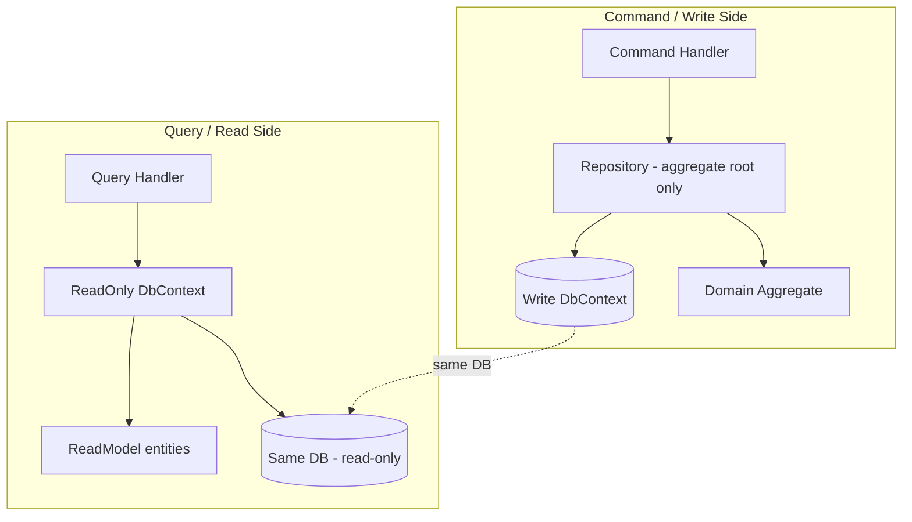

# DDD Improvements and ReadModels Plan

## Context

The DDD verification identified several corrections and the need for a proper CQRS read side. This plan addresses:

1. **DDD corrections**: Invariant protection, domain purity (no Application/persistence in domain), repository boundaries
2. **CQRS read side**: Separate ReadModels and ReadOnly DbContexts for all query operations

## Architecture




### Read vs Write Separation


| Concern     | Write Side                                   | Read Side                                          |
| ----------- | -------------------------------------------- | -------------------------------------------------- |
| DbContext   | `XxxDbContext` implements `IDbContext`       | `XxxReadDbContext` implements `IReadOnlyDbContext` |
| Entities    | Aggregates (Patient, TreatmentSession, etc.) | ReadModels (PatientReadModel, etc.)                |
| Used by     | Command handlers, repositories               | Query handlers                                     |
| SaveChanges | Yes                                          | Never (throws if called)                           |
| Tracking    | Default (for writes)                         | NoTracking (always)                                |


### IReadOnlyDbContext Contract

```csharp
// BuildingBlocks
public interface IReadOnlyDbContext
{
    // No SaveChanges - read-only. Implementations throw if SaveChanges is called.
}
```

Read DbContexts will **not** implement `IDbContext`. They use `DbContext` but override `SaveChanges` to throw. All queries use `AsNoTracking()`.

## Files to Create

### BuildingBlocks

- `BuildingBlocks/Abstractions/IReadOnlyDbContext.cs` (optional marker; read DbContexts don't extend IDbContext)

### Per-Service Infrastructure

**Patient**

- `Dialysis.Patient.Infrastructure/ReadModels/PatientReadModel.cs`
- `Dialysis.Patient.Infrastructure/Persistence/PatientReadDbContext.cs`

**Treatment**

- `Dialysis.Treatment.Infrastructure/ReadModels/TreatmentSessionReadModel.cs`
- `Dialysis.Treatment.Infrastructure/ReadModels/ObservationReadModel.cs`
- `Dialysis.Treatment.Infrastructure/Persistence/TreatmentReadDbContext.cs`

**Alarm**

- `Dialysis.Alarm.Infrastructure/ReadModels/AlarmReadModel.cs`
- `Dialysis.Alarm.Infrastructure/Persistence/AlarmReadDbContext.cs`

**Prescription**

- `Dialysis.Prescription.Infrastructure/ReadModels/PrescriptionReadModel.cs`
- `Dialysis.Prescription.Infrastructure/Persistence/PrescriptionReadDbContext.cs`

**Device**

- `Dialysis.Device.Infrastructure/ReadModels/DeviceReadModel.cs`
- `Dialysis.Device.Infrastructure/Persistence/DeviceReadDbContext.cs`

## Files to Modify

### DDD Fixes

- `Services/Dialysis.Treatment/.../Domain/TreatmentSession.cs` – Add invariant in AddObservation
- `Services/Dialysis.Alarm/.../Domain/Alarm.cs` – Use AlarmRaiseParams from Domain
- `Services/Dialysis.Alarm/.../Domain/AlarmRaiseParams.cs` – NEW (moved from AlarmInfo)
- `Services/Dialysis.Prescription/.../Domain/Prescription.cs` – Remove SettingsJson; use AddSetting validation
- `Services/Dialysis.Prescription.Infrastructure/.../PrescriptionDbContext.cs` – Value converter for Settings
- `BuildingBlocks/Abstractions/IRepository.cs` – Consider deprecating Expression-based GetAsync; add GetByIdAsync to base

### Query Handlers

- All `GetXxxQueryHandler` – Inject read DbContext/read repository instead of write repository
- `GetPatientsQueryHandler` – Use PatientReadDbContext (remove GetAsync(Expression) usage)
- `GetObservationsInTimeRangeQueryHandler` – Use TreatmentReadDbContext

### Repositories

- `IPatientRepository` – Remove SearchForFhirAsync, GetAllForTenantAsync, SearchByNameAsync (move to read)
- `ITreatmentSessionRepository` – Remove GetObservationsInTimeRangeAsync, GetAllForTenantAsync, SearchForFhirAsync
- Similar for Alarm, Prescription, Device

### Application Abstractions

- Add `IPatientReadRepository` or `IPatientReadDbContext` – interface in Application for read operations
- Same pattern for other services

## ReadModel Design

ReadModels use **primitives** (no value objects) for simplicity. They map to existing tables.

**PatientReadModel**: Id, TenantId, MedicalRecordNumber (string), FirstName, LastName, DateOfBirth, Gender (string), etc.

**TreatmentSessionReadModel**: Id, SessionId, TenantId, PatientMrn, DeviceId, Status, StartedAt, EndedAt (no Observations collection; join when needed)

**ObservationReadModel**: Id, TreatmentSessionId, Code, Value, Unit, SubId, ObservedAtUtc, EffectiveTime, etc.

## Repository Interface Strategy

**Option A**: Query handlers inject `XxxReadDbContext` directly. Application depends on Infrastructure for the DbContext registration, but the interface can be in Application:

```csharp
// Application/Abstractions/IPatientReadStore.cs
public interface IPatientReadStore
{
    Task<PatientReadModel?> GetByMrnAsync(string tenantId, string mrn, CancellationToken ct = default);
    Task<IReadOnlyList<PatientReadModel>> SearchAsync(string tenantId, string? identifier, string? familyName, string? givenName, DateOnly? birthdate, int limit, CancellationToken ct = default);
}
```

Implementation in Infrastructure uses PatientReadDbContext. This keeps the read abstraction in Application without exposing EF.

**Option B**: Query handlers inject `PatientReadDbContext` directly. Simpler but couples Application to Infrastructure. Not ideal.

**Recommended**: Option A – `IPatientReadStore` (or `IPatientQueryStore`) in Application with methods that return ReadModel/DTOs. Implementation in Infrastructure.

## Dependencies and Risks

- **Same database**: Read and write use the same PostgreSQL database. No eventual consistency delay.
- **Migrations**: Read DbContexts map to existing tables. No new migrations for read models (same schema). If we need different shapes, we use SQL views or keyless entity types.
- **IRepository.GetManyAsync**: Used in a few places. We will add explicit methods (GetByIdAsync) to repositories and migrate query handlers to read store. The base GetManyAsync can remain for internal use but should not be the primary API.

## Implementation Order

1. DDD fixes (invariant, AlarmInfo, Prescription) – low risk
2. Create IReadOnlyDbContext / read DbContext base pattern
3. Patient read model + refactor (simplest service)
4. Treatment read model + refactor (most complex - sessions + observations)
5. Alarm, Prescription, Device
6. Slim write repositories (remove query methods)
7. Update docs, verify tests

