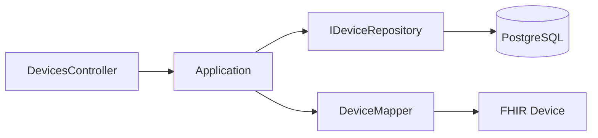

# Device Service Plan

## Context

The Device bounded context appears in `SYSTEM-ARCHITECTURE.md` but has no implementation. Dialysis machines are identified via MSH-3 (`MachineName^EUI64^EUI-64`) in HL7 messages. The Device service provides a registry and FHIR Device resources.

## Scope

- **In scope**: Device catalog, CRUD (minimal—register/upsert), FHIR Device API
- **Out of scope**: HL7 auto-registration from Treatment/Alarm (follow-up integration)

## Architecture

## Domain Model

| Field        | Type    | Description                                            |
| ------------ | ------- | ------------------------------------------------------ |
| Id           | Ulid    | Primary key                                            |
| TenantId     | string  | Multi-tenancy                                          |
| DeviceEui64  | string  | EUI-64 from MSH-3 (e.g. MACH^EUI64^EUI-64 → device id) |
| Manufacturer | string? | Optional                                               |
| Model        | string? | Optional                                               |
| Serial       | string? | Optional                                               |
| Udi          | string? | UDI                                                    |

DeviceEui64 is the logical key (MSH-3 sending application). We store a normalized device id derived from MSH-3.

## API Endpoints

| Method | Route                  | Policy      | Description            |
| ------ | ---------------------- | ----------- | ---------------------- |
| GET    | /api/devices           | DeviceRead  | List devices           |
| GET    | /api/devices/{id}      | DeviceRead  | Get by id              |
| GET    | /api/devices/{id}/fhir | DeviceRead  | FHIR Device resource   |
| POST   | /api/devices           | DeviceWrite | Register/upsert device |

## Files to Create

| Layer          | Files                                                                                                                    |
| -------------- | ------------------------------------------------------------------------------------------------------------------------ |
| Application    | Domain/Device.cs, Abstractions/IDeviceRepository.cs, Features/GetDevice/, Features/GetDevices/, Features/RegisterDevice/ |
| Infrastructure | Persistence/DeviceDbContext.cs, DeviceRepository.cs, Migrations                                                          |
| Api            | Program.cs, Controllers/DevicesController.cs, appsettings                                                                |
| Tests          | DeviceRepositoryTests, GetDeviceQueryHandlerTests                                                                        |

## References

- NEXT-STEPS-PLAN.md §5 (Step 3)
- Dialysis.Hl7ToFhir/DeviceMapper.cs
- Dialysis.Alarm structure (template)

