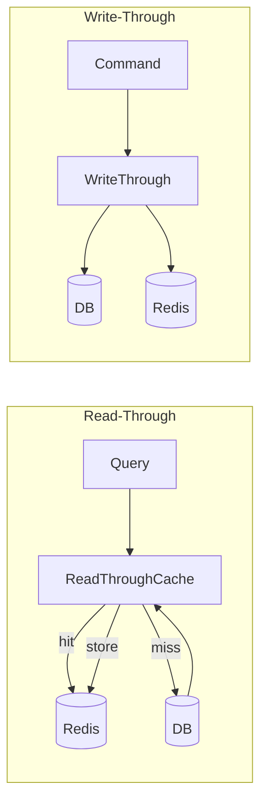

# Distributed Cache Strategies – Read-Through & Write-Through

## Context

- **Read-Through**: Cache provider (our abstraction) handles cache misses by loading from DB and populating cache. Simplifies app logic—callers just "get"; no explicit cache-aside.
- **Write-Through**: Data written to cache and DB simultaneously. Ensures consistency; increases write latency slightly.
- **Current state**: Only Prescription uses Redis; CachedPrescriptionReadStore uses manual cache-aside. No Write-Through.

## Architecture



## Approach

### 1. BuildingBlocks – Read-Through

```csharp
public interface IReadThroughCache
{
    Task<T?> GetOrLoadAsync<T>(string key, Func<CancellationToken, Task<T?>> loader,
        DistributedCacheEntryOptions? options = null, CancellationToken ct = default) where T : class;
}
```

- Implementation: `ReadThroughDistributedCache` wraps `IDistributedCache`
- On miss: invoke loader (DB call), store result, return
- Key format: `{tenantId}:{entity}:{id}` (tenant-scoped per C5)

### 2. BuildingBlocks – Write-Through

- No separate interface; integrate into write flow
- Pattern: After `SaveChangesAsync`, call `IDistributedCache.SetAsync` with the written entity (or invalidate with `RemoveAsync`)
- **Invalidation strategy**: On write, remove cache key(s) for affected entities. Simpler than Write-Through (store updated value) when DTOs differ from domain.
- **Alternative**: Write-Through = set cache with new value after DB write. Use when read DTO matches what we persist.

For Prescription: On `IngestRspK22Message` (add/merge), invalidate `prescription:{tenantId}:{mrn}` and optionally set new value.

### 3. Service Integration

| Service | Read-Through | Write-Through / Invalidation |
|---------|--------------|------------------------------|
| Prescription | GetLatestByMrnAsync, GetByPatientMrnAsync (single) | IngestRspK22: invalidate by MRN, OrderId |
| Patient | GetByMrnAsync, GetByIdAsync | RegisterPatient, UpdateDemographics: invalidate by MRN, Id |
| Treatment | GetBySessionIdAsync | AddObservation, Complete: invalidate by SessionId |
| Device | GetByIdAsync, GetByDeviceEui64Async | RegisterDevice, UpdateDetails: invalidate by DeviceId, EUI64 |
| Alarm | GetByIdAsync | RecordAlarm, Acknowledge, Clear: invalidate by AlarmId |

### 4. Redis Availability

- Redis optional: when `ConnectionStrings:Redis` is not set, use no-op cache (pass-through to DB)
- Prescription already has this; extend to all services

## Files to Create/Modify

| File | Action |
|------|--------|
| `BuildingBlocks/Caching/IReadThroughCache.cs` | Create |
| `BuildingBlocks/Caching/ReadThroughDistributedCache.cs` | Create |
| `BuildingBlocks/Caching/NullReadThroughCache.cs` | Create (no-op when Redis absent) |
| `BuildingBlocks/Caching/WriteThroughExtensions.cs` | Create (invalidate helpers) |
| `BuildingBlocks/BuildingBlocks.csproj` | Add Microsoft.Extensions.Caching.Abstractions if needed |
| `Services/Dialysis.Prescription/.../CachedPrescriptionReadStore.cs` | Refactor to use IReadThroughCache |
| `Services/Dialysis.Prescription/.../IngestRspK22MessageCommandHandler.cs` | Add cache invalidation |
| `Services/Dialysis.Patient/...` | Add CachedPatientReadStore, wire Redis |
| `Services/Dialysis.Treatment/...` | Add CachedTreatmentReadStore, wire Redis |
| `Services/Dialysis.Device/...` | Add CachedDeviceReadStore, wire Redis |
| `Services/Dialysis.Alarm/...` | Add CachedAlarmReadStore, wire Redis |
| `docker-compose.yml` | Add Redis dependency + ConnectionStrings to Patient, Treatment, Alarm, Device |
| `docs/CQRS-READ-WRITE-SPLIT.md` | Add cache strategy section |
| `docs/REDIS-CACHE.md` or similar | Document key format, TTL, invalidation |

## Dependencies and Risks

- **C5**: Cache keys must be tenant-scoped. Never mix tenant data.
- **Consistency**: Invalidation on write ensures read-after-write consistency. TTL provides eventual consistency for external updates.
- **Performance**: Write-Through adds latency to commands. Invalidation (remove) is cheaper than storing full DTO.
