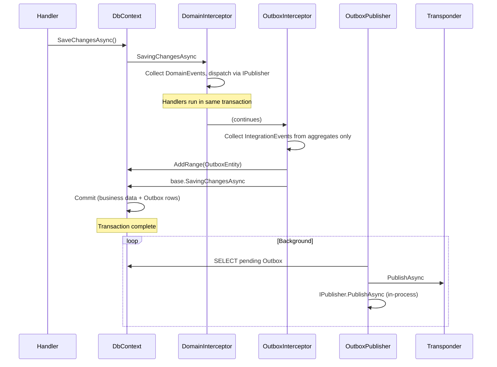

# Domain and Integration Events Consistency Plan

## Context

Current inconsistencies:
- **Domain events**: Dispatched in `SavingChangesAsync` ✓ (before DB write; handlers run in same transaction)
- **Integration events**: Two sources — (1) aggregate roots via `ApplyEvent`, (2) domain handlers via `IIntegrationEventBuffer`
- **IIntegrationEventBuffer** violates "integration events from aggregate roots only"
- **IntegrationEventDispatcherInterceptor** exists but is unused (Treatment/Alarm use Outbox only)

## Target Architecture

| Event Type | When Processed | Source | Dispatch |
|------------|----------------|--------|----------|
| **Domain events** | Before transaction completes (`SavingChangesAsync`) | Aggregate roots only | `DomainEventDispatcherInterceptor` → `IPublisher` |
| **Integration events** | After transaction completes | Aggregate roots only | Outbox (same tx write) → `IntegrationEventOutboxPublisher` → Transponder + in-process |

## Principles

1. **Domain events**: Processed before `SaveChanges` commits. Handlers run in same transactional boundary.
2. **Integration events**: Persisted to Outbox in same transaction as business data; published by background service after commit. Managed by Transponder for transport (ASB, SignalR).
3. **Integration events**: Raised only by aggregate roots via `ApplyEvent(IIntegrationEvent)`.

---

## Changes

### 1. ThresholdBreachDetectedIntegrationEvent → TreatmentSession

**Current**: `ThresholdBreachDetectedEventHandler` (domain handler) adds to `IIntegrationEventBuffer`.

**Target**: `TreatmentSession.AddObservation` already has `thresholdBreaches` in the loop. Add `ApplyEvent(ThresholdBreachDetectedIntegrationEvent)` per breach.

**Files**:
- `TreatmentSession.AddObservation`: Add `ApplyEvent(new ThresholdBreachDetectedIntegrationEvent(...))` in the breach loop (after `ApplyEvent(ThresholdBreachDetectedEvent)`).
- `ThresholdBreachDetectedEventHandler`: Remove `_buffer.Add(...)`; keep logging only (or remove handler if no other logic).
- `ThresholdBreachDetectedIntegrationEvent`: Move to `Dialysis.Treatment.Application.Events` if not already; ensure it has `TenantId` (from `TreatmentSession.TenantId`).

### 2. AlarmEscalationTriggeredEvent → EscalationIncident Aggregate

**Current**: `AlarmEscalationCheckHandler` (domain handler) adds to `IIntegrationEventBuffer` when escalation is triggered.

**Target**: Create `EscalationIncident` aggregate. When escalation is triggered, create and persist it; it raises `AlarmEscalationTriggeredEvent` via `ApplyEvent`.

**New aggregate**:
```csharp
// Dialysis.Alarm.Application.Domain.EscalationIncident.cs
public sealed class EscalationIncident : AggregateRoot
{
    public static EscalationIncident Record(string? deviceId, string? sessionId, int activeCount, string reason, string? tenantId)
    {
        var incident = new EscalationIncident { ... };
        incident.ApplyEvent(new AlarmEscalationTriggeredEvent(deviceId, sessionId, activeCount, reason, tenantId));
        return incident;
    }
}
```

**Handler change**: `AlarmEscalationCheckHandler` creates `EscalationIncident`, adds to `IEscalationIncidentRepository` (or `AlarmDbContext.Set<EscalationIncident>().Add`). Same unit of work as the Alarm being saved. Outbox interceptor collects from aggregate.

**Files**:
- Create `EscalationIncident.cs` (Alarm context)
- Create `IEscalationIncidentRepository` + implementation (or use DbContext directly)
- Add `EscalationIncident` to `AlarmDbContext`
- Migration for `EscalationIncidents` table
- `AlarmEscalationCheckHandler`: Replace `_buffer.Add` with create + add to repository
- Remove `IIntegrationEventBuffer` dependency from handler

### 3. Remove IIntegrationEventBuffer

**Files**:
- `BuildingBlocks/IntegrationEventBuffer.cs` — delete
- `BuildingBlocks/IntegrationEventBufferExtensions.cs` — delete
- `BuildingBlocks/Abstractions/IIntegrationEventBuffer.cs` — delete
- `IntegrationEventOutboxInterceptor`: Remove `_buffer` field and `Drain()`; collect only from `AggregateRoot.IntegrationEvents`
- Treatment API, Alarm API: Remove `AddIntegrationEventBuffer()` registration

### 4. IntegrationEventDispatcherInterceptor

**Current**: Exists in BuildingBlocks but is **not registered** in any API (Treatment/Alarm use Outbox only).

**Action**: Delete `IntegrationEventDispatcherInterceptor.cs` to avoid confusion. Outbox + Publisher handle all integration events.

### 5. Transponder Usage

**Current**: `IntegrationEventOutboxPublisher` publishes via `IPublishEndpoint.PublishAsync` (Transponder) and `IPublisher.PublishAsync` (in-process). Transponder's `UseOutbox()` provides transport-level reliability.

**No change**: Continue using Transponder for publishing. BuildingBlocks Outbox ensures atomicity with business data; Transponder handles delivery.

---

## Sequence Diagram (Target)



---

## Files Summary

| Action | File |
|--------|------|
| Modify | `TreatmentSession.AddObservation` — add `ApplyEvent(ThresholdBreachDetectedIntegrationEvent)` per breach |
| Modify | `ThresholdBreachDetectedEventHandler` — remove buffer usage |
| Create | `EscalationIncident` aggregate |
| Create | `IEscalationIncidentRepository` + impl |
| Modify | `AlarmDbContext` — add `EscalationIncident` |
| Create | Migration for `EscalationIncidents` |
| Modify | `AlarmEscalationCheckHandler` — create EscalationIncident, add to repo |
| Delete | `IIntegrationEventBuffer`, `IntegrationEventBuffer`, `IntegrationEventBufferExtensions` |
| Modify | `IntegrationEventOutboxInterceptor` — remove buffer |
| Delete | `IntegrationEventDispatcherInterceptor` |
| Modify | Treatment API, Alarm API — remove `AddIntegrationEventBuffer()` |
| Update | `docs/DOMAIN-EVENTS-AND-SERVICES.md` |
| Update | `docs/SYSTEM-ARCHITECTURE-LOW-LEVEL.md` |

---

## Dependencies

- `ThresholdBreachDetectedIntegrationEvent` must be in Treatment.Application (shared or referenced by Alarm for ASB consumer)
- `EscalationIncident` is Alarm context only; `AlarmEscalationTriggeredEvent` stays in Alarm.Application.Events
