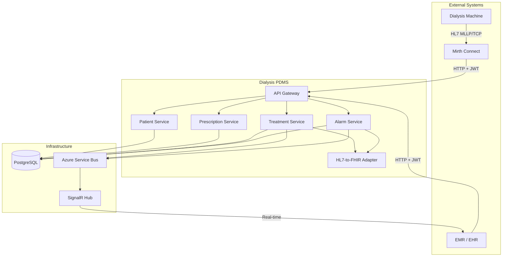
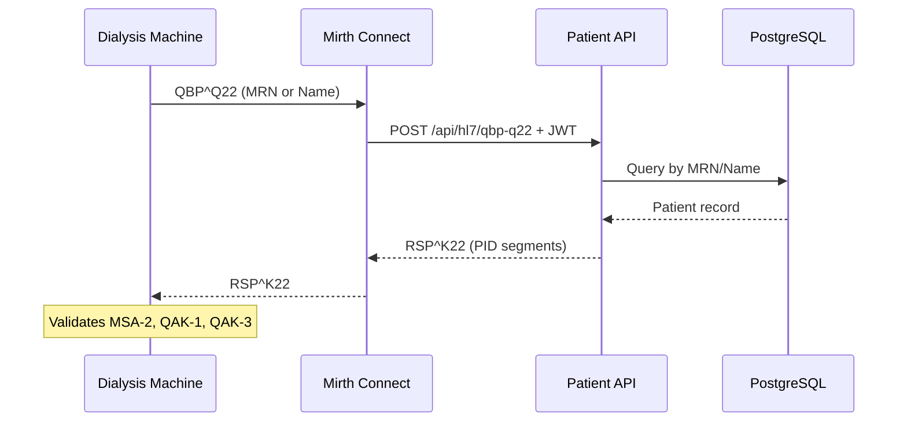
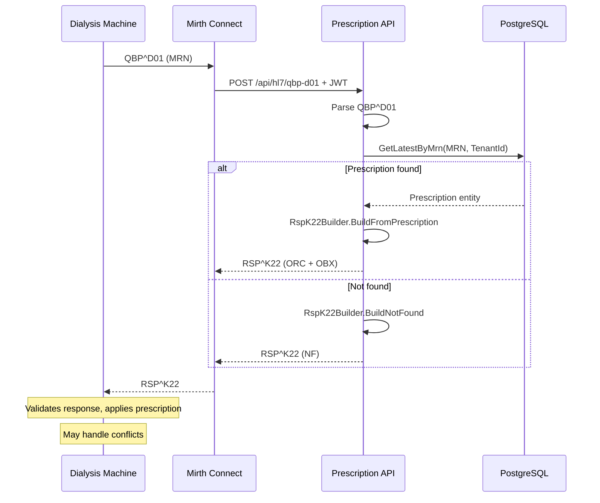
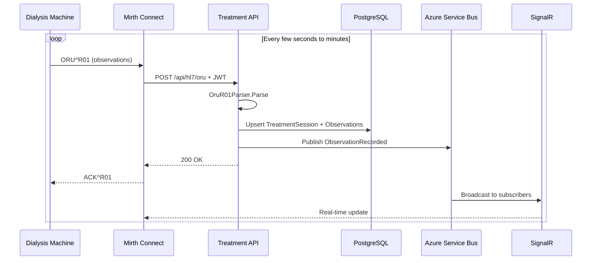
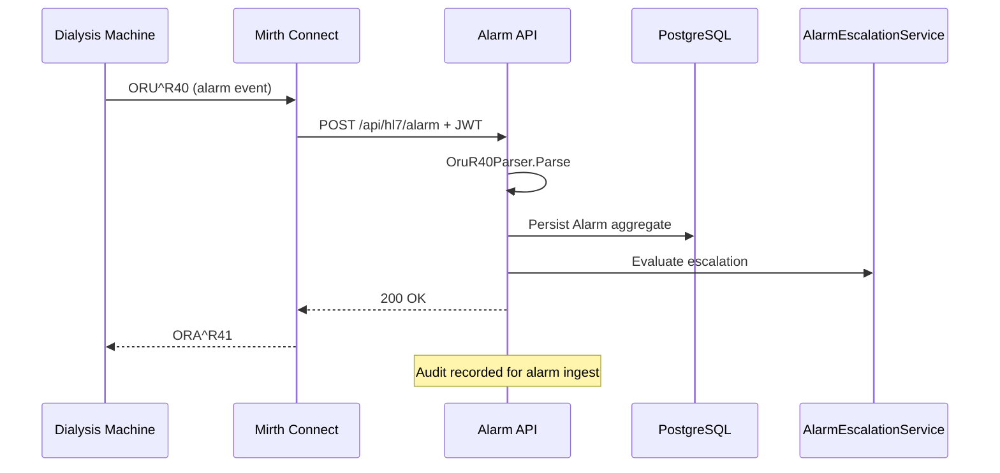
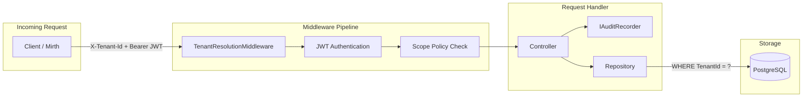
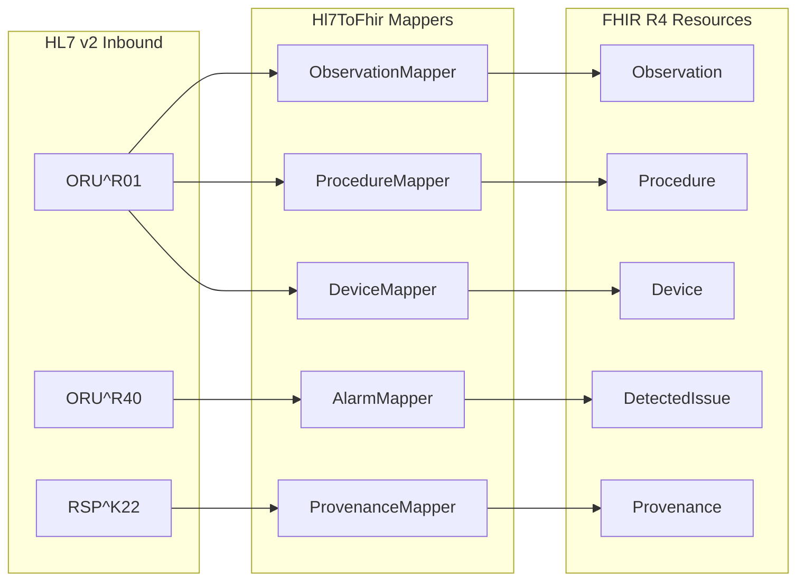

# HL7 Implementation Guide Alignment, Updated Plan, and Process Diagrams

## Alignment Assessment: HL7 Implementation Guide vs Current State

### Guide Phase 1: Patient Demographics Query (PDQ - ITI-21) -- PARTIAL

**Implemented:**

- Patient domain model (aggregate, MRN, name, DOB, gender) via REST
- `GET /api/patients/mrn/{mrn}`, `GET /api/patients/search`, `POST /api/patients`

**Gap -- No HL7 endpoint:**

- The guide specifies `QBP^Q22^QBP_Q21` / `RSP^K22^RSP_K21` for patient lookup
- Currently Patient service has REST-only; no HL7 parser/builder for QBP^Q22
- Missing: QbpQ22Parser, RspK22Builder (Patient), `POST /api/hl7/qbp-q22`

### Guide Phase 2: Prescription Transfer -- DONE

**Fully aligned:**

- `QBP^D01` parser (`QbpD01Parser`) -- extracts MRN, QueryTag, MSH-10
- `RSP^K22` parser (`RspK22Parser`) -- ingests prescription with all 5 profile types
- `RSP^K22` builder (`RspK22Builder`) -- serializes Prescription to HL7
- `RSP^K22` validator -- MSA-2, QAK-1, QPD matching
- `ProfileCalculator` -- CONSTANT, LINEAR, EXPONENTIAL, STEP, VENDOR
- `POST /api/hl7/qbp-d01` endpoint + `POST /api/hl7/rsp-k22` ingest
- EF migrations with TenantId

**Minor gaps:**

- OBX sub-ID dotted notation (IEEE 11073 containment hierarchy) not fully mapped
- Rx Use column (M/C/O from Table 2) not implemented
- Prescription conflict handling (discard/callback/partial) not implemented

### Guide Phase 3: Treatment Reporting (PCD-01 / DEC) -- DONE

**Implemented:**

- `ORU^R01` parser (`OruR01Parser`) -- handles IEEE 11073 hierarchy
- `POST /api/hl7/oru` endpoint
- `TreatmentSession` aggregate + `Observation` entity
- FHIR Observation mapper (`ObservationMapper.cs`)
- FHIR Procedure mapper (`ProcedureMapper.cs`)

**Gap:**

- No `ACK^R01` response builder (guide says EMR must return ACK)
- No HL7 Batch Protocol support (Appendix A -- FHS/BHS/.../BTS/FTS)

### Guide Phase 4: Alarm Reporting (PCD-04) -- DONE

**Implemented:**

- `ORU^R40` parser (`OruR40Parser`) -- 5 OBX group structure
- `POST /api/hl7/alarm` endpoint
- `Alarm` aggregate with event phase, alarm state, activity state
- FHIR DetectedIssue mapper (`AlarmMapper.cs`)

**Gap:**

- No `ORA^R41` response builder (guide says EMR must return ORA^R41)
- Alarm escalation service exists but no tests

### Guide Phase 5: HL7-to-FHIR Adapter -- PARTIAL

**Implemented:**

- `ObservationMapper` (PCD-01 -> FHIR Observation)
- `AlarmMapper` (PCD-04 -> FHIR DetectedIssue)
- `ProcedureMapper` (Session -> FHIR Procedure)
- `DeviceMapper` (Device identifiers -> FHIR Device)
- `ProvenanceMapper` (Provenance -> FHIR Provenance)
- `MdcToFhirCodeCatalog` (MDC -> LOINC mapping)

**Gap:**

- No FHIR Prescription mapper (Prescription -> ServiceRequest + DeviceRequest)
- No FHIR Patient mapper (Patient -> FHIR Patient)
- No FHIR AuditEvent resource (we log audit; no FHIR resource yet)
- Mappers exist but are not wired into the API pipelines

### Cross-cutting (C5 Compliance) -- DONE

- JWT authentication on all APIs
- Scope policies (Read/Write/Admin per service)
- Development bypass for local testing
- IAuditRecorder on all controllers
- X-Tenant-Id with TenantResolutionMiddleware
- Tenant-scoped Prescription persistence

---

## Alignment Matrix

| Guide Requirement              | Status      | Gap                           |
| ------------------------------ | ----------- | ----------------------------- |
| PDQ (QBP^Q22/RSP^K22)          | Partial     | No HL7 endpoint, REST only    |
| Prescription (QBP^D01/RSP^K22) | Done        | Minor: OBX sub-ID, Rx Use     |
| PCD-01 (ORU^R01)               | Done        | No ACK^R01 builder            |
| PCD-04 (ORU^R40)               | Done        | No ORA^R41 builder            |
| HL7 Batch Protocol             | Not started | FHS/BHS/BTS/FTS               |
| FHIR mapping                   | Partial     | No Patient, Prescription FHIR |
| C5 Auth/Audit/Tenant           | Done        | --                            |
| Tests                          | Partial     | Only Prescription has tests   |

---

## Process Diagrams

The following diagrams will be created in a new `docs/PROCESS-DIAGRAMS.md` file:

### Diagram 1: End-to-End Dialysis PDMS Communication

### Diagram 2: Patient Identification Flow (PDQ)

### Diagram 3: Prescription Download Flow

### Diagram 4: Treatment Observation Reporting (PCD-01)

### Diagram 5: Alarm Reporting (PCD-04)

### Diagram 6: C5 Security and Multi-Tenancy

### Diagram 7: HL7-to-FHIR Mapping Layer

---

## Updated Plan: Remaining Work

### Priority 1 -- Patient PDQ HL7 Endpoint

- Add `QbpQ22Parser`, `RspK22Builder` (Patient), `POST /api/hl7/qbp-q22`
- Align with IHE ITI-21 spec from the guide

### Priority 2 -- ACK/ORA Response Builders

- `AckR01Builder` for Treatment (PCD-01 acknowledgment)
- `OraR41Builder` for Alarm (PCD-04 acknowledgment)
- Currently Mirth builds these; adding them makes PDMS spec-complete

### Priority 3 -- Test Coverage

- Patient, Treatment, Alarm services have no parser/handler tests
- Add unit tests for OruR01Parser, OruR40Parser, command handlers

### Priority 4 -- FHIR Mapping Completion

- Patient FHIR mapper (Patient -> FHIR Patient)
- Prescription FHIR mapper (Prescription -> ServiceRequest)
- Wire mappers into API pipelines

### Priority 5 -- Minor Gaps

- OBX sub-ID dotted notation mapping
- HL7 Batch Protocol (FHS/BHS/BTS/FTS)
- Tenant persistence for Patient, Treatment, Alarm

---

## Files to Create/Modify

- `docs/PROCESS-DIAGRAMS.md` -- All diagrams above
- `docs/IMMEDIATE-HIGH-PRIORITY-PLAN.md` -- Update alignment matrix, mark PDQ gap
- `docs/Dialysis_Implementation_Plan.md` -- Update phase statuses

