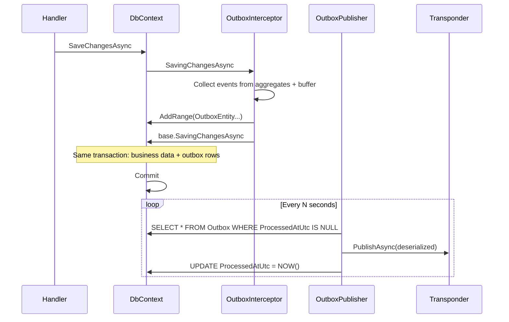

# Integration Event Outbox Pattern

## Problem

Current flow dispatches integration events in memory after commit. If the server restarts between commit and publish, events are lost.

## Solution

1. **Same-transaction write**: In `SavingChangesAsync` (before persist), collect integration events and INSERT into `IntegrationEventOutbox` table. Same `SaveChanges` persists business data + outbox rows atomically.

2. **Background publisher**: `IHostedService` periodically SELECTs pending rows (`ProcessedAtUtc IS NULL`), publishes to Transponder, UPDATEs `ProcessedAtUtc`. In-process `IIntegrationEventHandler` can run after successful publish.

3. **Deserialization**: Store `EventType` (assembly-qualified name) and `Payload` (JSON). Publisher deserializes with `JsonSerializer.Deserialize(payload, Type.GetType(eventType))`.

## Schema (per service DB)

| Column | Type |
|--------|------|
| Id | Ulid (PK) |
| EventType | varchar(500) |
| Payload | jsonb/text |
| CreatedAtUtc | timestamp |
| ProcessedAtUtc | timestamp (nullable) |
| Error | text (nullable, for failed retries) |

## Flow

