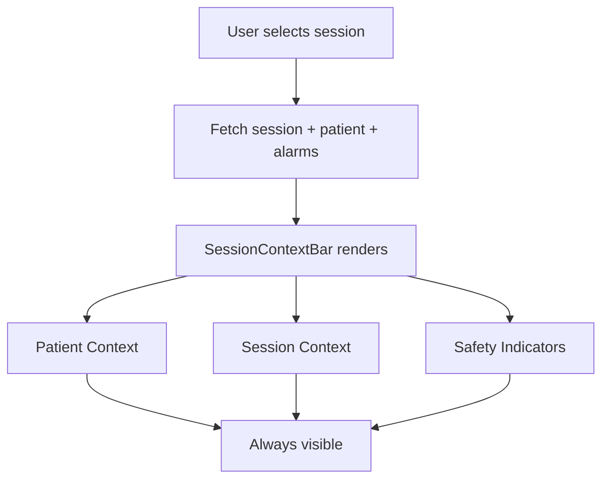

# PDMS Clinician Context Layer UI

---
name: pdms-clinician-context-layer
overview: Add an always-visible Context Layer to the React PDMS dashboard, driven by the current session state, showing patient, session, and safety context.
todos:
  - id: api-layer
    content: Add API functions for patient, treatment session, alarms
    status: completed
  - id: context-bar
    content: Build SessionContextBar component (Patient, Session, Safety)
    status: completed
  - id: integrate
    content: Integrate context bar into App layout
    status: completed
isProject: false
---

## Context

The PDMS UI should be **session-centric** and **state-driven**: show only what the clinician needs right now. Layer 1 (Always Visible) is the **Context Layer** — always on screen.

## Layer 1: Always Visible (Context Layer)

### 1. Patient Context
- Name, ID (MRN)
- DOB / age
- Allergies (highlighted) — *placeholder until backend*
- Access type (AVF / AVG / CVC) — *placeholder until backend*
- Isolation status — *placeholder until backend*

### 2. Session Context
- Current state badge (Running / Paused / Completed)
- Elapsed time
- Prescribed duration
- UF goal vs achieved
- Responsible nurse — *placeholder until backend*

### 3. Safety Indicators
- Active alerts (from alarms API)
- Last BP reading (from observations)
- High-risk flags — *placeholder until backend*

## Data Sources

| Data | API | Notes |
|------|-----|-------|
| Patient | `GET /api/patients/mrn/{mrn}` | MRN from session |
| Session | `GET /api/treatment-sessions/{sessionId}` | Status, times, observations |
| Alarms | `GET /api/alarms?sessionId={id}` | Active alerts |
| UF / BP | Session observations | MDC codes |

## Files to Create/Modify

- `clients/dialysis-dashboard/src/api.ts` — add `getPatientByMrn`, `getTreatmentSession`, `getAlarms`
- `clients/dialysis-dashboard/src/types.ts` — add Patient, TreatmentSession, Alarm types
- `clients/dialysis-dashboard/src/components/SessionContextBar.tsx` — new component
- `clients/dialysis-dashboard/src/App.tsx` — integrate context bar, session-centric layout

## Workflow

## Backend Gaps (Placeholders)

- Allergies, access type, isolation, nurse, high-risk flags: show "—" or "N/A" until backend supports.

---

## Layer 2: State-Dependent Content (Workflow Layer)

What you show depends on session state.

| State | When | Content |
|-------|------|--------|
| Pre-Assessment | No session selected | Pre-weight, BP, access checklist, prescription confirmation → Start Treatment |
| Running | status === Active | Live vitals, UF, time remaining, QB/QD/TMP, event log; Pause, Record Event, End Session |
| Completed | status === Completed | Post-weight, final vitals, UF variance, Sign Session |
| Signed/Locked | (future) | Read-only summary, audit trail |

### State Mapping

- **PreAssessment**: `sessionId == null` — prepare-for-session flow
- **Running**: `session.status === "Active"`
- **Completed**: `session.status === "Completed"`
- **Signed**: Local flag or future backend status

---

## Layer 3: Alerts & Exceptions (Risk Layer)

Always surface when session is selected:

| Alert Type | Source | Severity |
|------------|--------|----------|
| Hypotension risk | CDS `/api/cds/hypotension-risk` | critical |
| UF exceeded | CDS prescription-compliance | warning |
| Missed documentation | Derived (no post-weight when completed) | warning |
| Prescription mismatch | CDS `/api/cds/prescription-compliance` | warning |
| Device alarms | `/api/alarms?sessionId=` | critical/warning/info by priority |

### Behavior

- Prioritized: critical > warning > info
- Action links (Check BP, Review prescription, etc.)
- Critical requires acknowledgment (stored in localStorage)

---

## Layer 4: Timeline / Audit (Traceability Layer)

Essential for healthcare compliance.

| Content | Source |
|---------|--------|
| State transitions | Session started/completed from treatment session |
| Who did what | FHIR AuditEvent from `/api/treatment-sessions/audit-events`, `/api/alarms/audit-events` |
| When it happened | `recorded` timestamp |
| Key events (alarm) | Alarms by session |

### What NOT to Show (design guidance)

- Billing details during active treatment
- Historical prescriptions unless relevant
- Lab history unless clinically needed now
- Fields unrelated to current state

### Minimal UI Rule (Five Questions)

At any moment, the screen should answer:

1. Who is this? (Patient name)
2. What state is the session in? (Status badge)
3. Is the patient safe? (Alerts panel)
4. What can I do next? (Workflow panel)
5. What changed recently? (Timeline panel)
