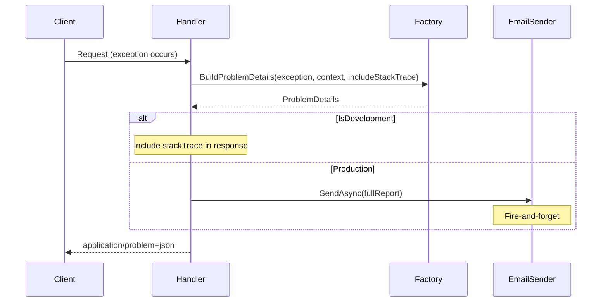

# Problem Details and Production Error Email

## Context

The user wants:

1. **Standardized response structure** – Use RFC 7807 Problem Details for all API errors.
2. **Stack trace in Development only** – Include exception stack trace in the Problem Details response when `IsDevelopment` is true.
3. **Production error reporting** – When not in Development, send the complete Problem Details (including request, response, and exception stack trace) via email to a development email account.

## Alignment

- **C5 Compliance**: Secrets (SMTP credentials, dev email) must be externalized to configuration/Key Vault; no hardcoded credentials.
- **Existing**: `CentralExceptionHandler` in `BuildingBlocks/ExceptionHandling/`; used by Patient, Prescription, Treatment, Alarm, Device, FHIR, CDS, Reports APIs.

## Design

### 1. Problem Details Structure (RFC 7807)

```json
{
  "type": "https://tools.ietf.org/html/rfc7231#section-6.6.1",
  "title": "An error occurred processing your request.",
  "status": 500,
  "detail": "Exception message",
  "instance": "/api/patients/123",
  "traceId": "00-abc123...",
  "errors": [ { "propertyName": "Name", "errorMessage": "Required" } ],
  "stackTrace": "   at ... (only when IsDevelopment)"
}
```

- `ValidationException` → 400 with `errors` array.
- `ArgumentException` → 400 with `detail`.
- Unhandled → 500 with `detail`; `stackTrace` only in Development.

### 2. Production Email Report

When `!IsDevelopment` and an unhandled exception occurs:

- Build a **full report** containing:
  - Problem Details (including stack trace)
  - Request: method, path, query string, headers (sanitized: redact `Authorization`, `Cookie`, `X-Api-Key`)
  - Response: status code, Problem Details body
- Send via `IExceptionReportEmailSender` to configured dev email.
- Fire-and-forget (do not block response); log if email fails.

### 3. Components

| Component | Responsibility |
|-----------|----------------|
| `ProblemDetailsFactory` | Build RFC 7807 `ProblemDetails` from exception + HttpContext |
| `CentralExceptionHandler` | Use factory; include stack trace only when `IsDevelopment`; call email sender when `!IsDevelopment` |
| `IExceptionReportEmailSender` | Send full report to dev email |
| `SmtpExceptionReportEmailSender` | SMTP implementation |
| `NullExceptionReportEmailSender` | No-op when email not configured |

### 4. Configuration

```json
{
  "ExceptionHandling": {
    "ProblemDetails": {
      "IncludeStackTraceInDevelopment": true
    },
    "Email": {
      "Enabled": true,
      "DevelopmentEmail": "dev-errors@example.com",
      "SmtpHost": "smtp.example.com",
      "SmtpPort": 587,
      "SmtpUser": "",
      "SmtpPassword": "",
      "FromAddress": "noreply@example.com",
      "FromDisplayName": "Dialysis PDMS Error Reporter"
    }
  }
}
```

- When `Email:Enabled` is false or `DevelopmentEmail` is empty, use `NullExceptionReportEmailSender`.
- SMTP credentials from config (or Key Vault references in production).

### 5. Workflow



## Files to Create or Modify

| File | Action |
|------|--------|
| `BuildingBlocks/ExceptionHandling/ProblemDetailsFactory.cs` | Create – build ProblemDetails from exception |
| `BuildingBlocks/ExceptionHandling/IExceptionReportEmailSender.cs` | Create – abstraction |
| `BuildingBlocks/ExceptionHandling/SmtpExceptionReportEmailSender.cs` | Create – SMTP impl |
| `BuildingBlocks/ExceptionHandling/NullExceptionReportEmailSender.cs` | Create – no-op |
| `BuildingBlocks/ExceptionHandling/ExceptionReport.cs` | Create – DTO for email payload |
| `BuildingBlocks/ExceptionHandling/CentralExceptionHandler.cs` | Modify – use ProblemDetails, env-aware, email |
| `BuildingBlocks/ExceptionHandling/CentralExceptionHandlerExtensions.cs` | Modify – register email sender, pass IWebHostEnvironment |
| `Directory.Packages.props` | Add MailKit (if not present) |
| `BuildingBlocks/BuildingBlocks.csproj` | Add MailKit reference |
| Each API `Program.cs` | Ensure `AddCentralExceptionHandler()` receives env (or use `app.ApplicationServices`) |

## Dependencies and Risks

- **MailKit**: Standard .NET email library; add to `Directory.Packages.props` and BuildingBlocks.
- **IWebHostEnvironment in handler**: `IExceptionHandler` is a singleton; we need `IWebHostEnvironment` which is registered. Inject via constructor.
- **Request/response capture**: For the email, we have access to `HttpContext` in the handler. We can read `Request` and build the response body before writing. Avoid logging/capturing large bodies (e.g. file uploads); truncate if needed.
- **Fire-and-forget**: Use `Task.Run` or `_ = emailSender.SendAsync(...)` and catch/log in the sender. Do not await in the handler so response is not delayed.
