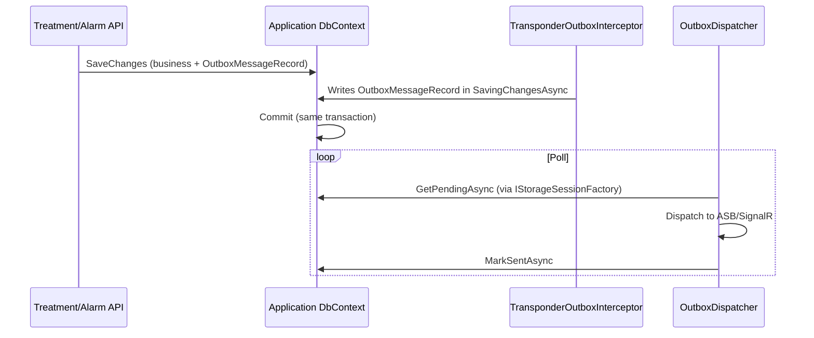

# Transponder Outbox in Application Database

## Context

Currently two outbox systems exist:
1. **BuildingBlocks** – `IntegrationEventOutboxEntity` in app DB (same tx as business data)
2. **Transponder** – `OutboxMessageRecord` in `transponder` DB

Flow: SaveChanges → BuildingBlocks outbox → IntegrationEventOutboxPublisher → `IPublishEndpoint.PublishAsync` → Transponder outbox → OutboxDispatcher.

## Goal

Use only Transponder's outbox, with rows in the **application database** so business data and outbox share the same transaction.

## Approach

1. Add Transponder's `OutboxMessageRecord`, `InboxStateRecord`, `ScheduledMessageRecord` to `TreatmentDbContext` and `AlarmDbContext`.
2. Replace `IntegrationEventOutboxInterceptor` with one that writes `OutboxMessageRecord` in Transponder format.
3. Register `IStorageSessionFactory` with the application DbContext instead of `PostgreSqlTransponderDbContext`.
4. Remove BuildingBlocks outbox: `IntegrationEventOutboxEntity`, `IntegrationEventOutboxPublisher`, `IntegrationEventOutbox` table.

## Flow After Change

## Files to Create or Modify

| Action | File |
|--------|------|
| Create | `Transponder.Persistence.EntityFramework/TransponderModelConfiguration.cs` – extension to apply Transponder entities to any DbContext |
| Modify | `TreatmentDbContext.cs` – add Transponder entities, apply configuration |
| Modify | `AlarmDbContext.cs` – add Transponder entities, apply configuration |
| Create | `BuildingBlocks/Interceptors/TransponderOutboxInterceptor.cs` – writes `OutboxMessageRecord` from aggregate integration events |
| Modify | `Treatment.Api/Program.cs` – switch to app DbContext for Transponder, remove BuildingBlocks outbox |
| Modify | `Alarm.Api/Program.cs` – switch to app DbContext for Transponder, remove BuildingBlocks outbox |
| Remove | `IntegrationEventOutboxEntity`, `IntegrationEventOutboxPublisher`, `IntegrationEventOutboxPublisherExtensions`, `IntegrationEventOutboxConfiguration` |
| Migrations | Add `OutboxMessages`, `InboxStates`, `ScheduledMessages` to Treatment and Alarm; remove `IntegrationEventOutbox` |

## Dependencies

- **Transponder.Persistence.EntityFramework** – `OutboxMessageRecord`, `InboxStateRecord`, `ScheduledMessageRecord`; `OutboxMessageRecord.FromMessage(IOutboxMessage)`
- **Transponder** – `OutboxMessageFactory` (internal) – need public API to create `OutboxMessage` from `IIntegrationEvent`, or replicate logic in interceptor
- **IMessageSerializer** – for serializing integration events
- **Source address** – bus address (e.g. `transponder://treatment`) for `OutboxMessageRecord`; inject via options

## Risks

- **Type resolution**: `OutboxMessageTypeResolver` uses `Type.GetType(messageType)` and assembly scan. Integration events use `FullName`; ensure assemblies are loaded.
- **Inbox/Scheduler**: Alarm API receive handler and persisted scheduler use `IStorageSessionFactory`. Switching to `AlarmDbContext` moves InboxStates and ScheduledMessages to `dialysis_alarm`. Treatment moves ScheduledMessages to `dialysis_treatment`. Transponder DB (`transponder`) will no longer be used for outbox/inbox/scheduler by these services.
- **Transponder DB**: May still be used elsewhere (e.g. shared scheduler). Verify no other consumers depend on transponder DB for these tables.
