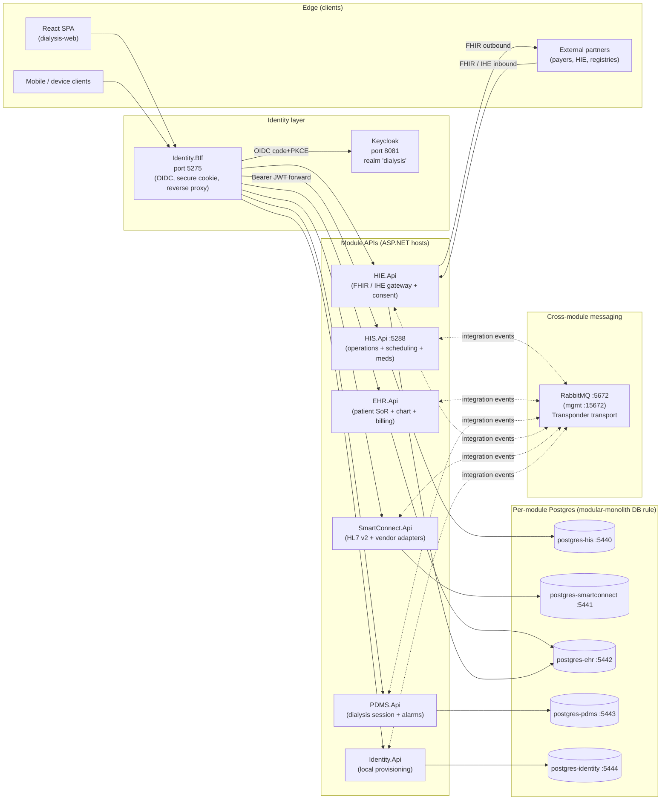
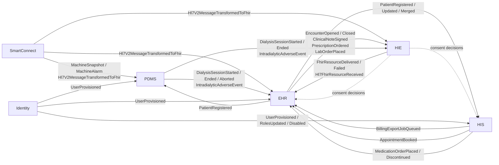
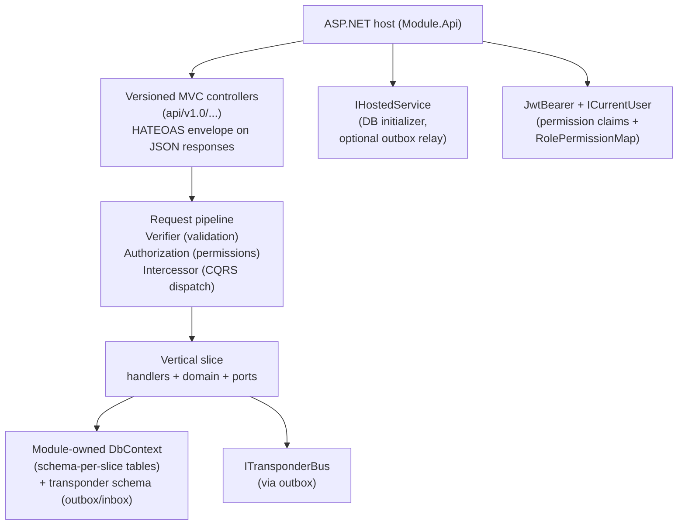

# Dialysis Platform

> A modular, modern software platform for dialysis clinics and renal-care networks. One coherent system that runs the front desk, the clinical chart, the dialysis machine room, and the cross-organization data flow that modern healthcare regulations expect.

This README is split in two. **Part 1** is a plain-language explanation for non-technical readers — business managers, clinic owners, investors. **Part 2** is the engineering low-level architecture of the MVP.

---

# Part 1 — What this is, in plain language

## 1.1 The problem we're solving

A dialysis clinic today juggles four kinds of software, and most of them don't talk to each other:

1. **Front office / hospital systems** — admissions, scheduling, billing, inventory.
2. **Clinical records (EHR)** — the patient's full medical history, prescriptions, lab results.
3. **Machine-room / treatment systems** — the dialysis machines themselves, alarms, intra-treatment vitals.
4. **External data exchange** — government registries, insurance payers, referring hospitals, lab partners.

Every clinic ends up with a patchwork: one vendor for the front desk, a second for the chart, a third bolted onto the machines, and a long backlog of "integration" projects to keep them in sync. The cost shows up everywhere — duplicate data entry, missed billing, slow audits, unhappy clinicians, and a brittle ability to participate in modern care networks (insurance, telehealth, regional health information exchanges, patient apps).

## 1.2 What we're building

**One platform, five connected modules, one shared language.**

| Module | Reader's mental model |
|---|---|
| **HIS** — Hospital Information System | The "operations" brain. Front desk, scheduling, medication ordering, inventory, billing-export, manager dashboards. |
| **EHR** — Electronic Health Record | The "patient story" brain. Demographics, encounters, lab orders, prescriptions, clinical notes, billing claims. The single source of truth for who the patient is. |
| **PDMS** — Patient Data Management System | The "machine room" brain. Watches each dialysis session in real time, records every vital sign and alarm, flags adverse events as they happen. |
| **HIE** — Health Information Exchange | The "outside world" brain. Speaks the standard healthcare data languages (FHIR, IHE, TEFCA) so the platform can share records with insurers, hospitals, government registries, and patient apps. |
| **SmartConnect** | The "translator" brain. Talks to legacy equipment and older hospital systems using their own protocols (HL7 v2, files, faxes-by-email) and converts everything to the platform's modern vocabulary. |

Plus an **Identity** module for sign-in, and a single **web application** that clinicians and managers actually use day-to-day.

## 1.3 What it looks like to a clinic

```text
A patient arrives for their Tuesday session
        │
        ▼
Front desk (HIS) checks them in, confirms the appointment
        │
        ▼
Clinician opens the patient's chart (EHR) — sees last week's labs,
current medications, allergies, the nephrologist's notes
        │
        ▼
Patient is connected to the dialysis machine (PDMS picks up the
machine's telemetry automatically — no separate clipboard)
        │
        ▼
Treatment runs for ~4 hours. PDMS records every vital sign and
flags an early blood-pressure dip — clinician acts before it
becomes an adverse event
        │
        ▼
Session ends. EHR auto-attaches the session report to the chart.
        │
        ▼
Behind the scenes:
  - HIS queues the billing export to the insurance clearinghouse
  - HIE sends the session summary to the referring hospital (FHIR)
  - The patient's mobile app gets the new lab results, gated by their consent
  - Any required regulatory feed (renal registry) is pushed automatically
```

The clinic staff never see five different applications. They see **one application**, and the right tab opens for the task at hand.

## 1.4 Why it matters (the commercial story)

- **Operational savings.** No more dual entry between systems. Inventory, scheduling, and billing live next to the clinical record — the same patient identity, the same shift roster, the same audit trail.
- **Regulatory readiness.** US Core / USCDI profiles, HIPAA audit trails, FHIR Bulk Data export, SMART-on-FHIR authorization, TEFCA-compatible identity assertions — all baked in. Clinics don't have to bolt these on under regulatory deadline pressure.
- **Future surface for revenue.** The same platform serves patient portals, payer integrations (provider-to-payer / payer-to-payer FHIR), AI / telehealth add-ons, BI dashboards, and regional HIE participation. Each is an addressable line of business that traditional dialysis IT cannot reach without a multi-year rebuild.
- **Replaceable parts.** The platform is built as five separate modules behind one façade. A clinic can adopt a single module first (e.g., just PDMS for treatment monitoring) and grow into the rest — no all-or-nothing migration.

## 1.5 The reference architecture we follow

This is not a from-scratch invention. The platform is aligned with two published references:

- **Tummers et al. (2021)** — *Designing a reference architecture for health information systems.* BMC Medical Informatics and Decision Making 21:210. ([DOI](https://doi.org/10.1186/s12911-021-01570-2))
- **Meredith, Hawry, Kotter (2023)** — Platform-API pattern for unified healthcare data (FOXS stack: FHIR, openEHR, IHE XDS, SNOMED CT / LOINC).

Anchoring to peer-reviewed references gives buyers and regulators a familiar map: the platform isn't doing anything exotic, it's doing the standard thing well.

## 1.6 MVP scope (what is real today)

| Capability | MVP today |
|---|---|
| Patient registration, ADT (admit/discharge/transfer) | Yes — HIS + EHR registration |
| Scheduling + waitlist | Yes — HIS scheduling slice |
| Medication ordering + safety check + administration | Yes — HIS medication slice + EHR clinical-notes layer |
| Dialysis session capture + adverse-event alerts | Yes — PDMS treatment-sessions slice |
| HL7 v2 inbound (legacy labs, machines) → modern events | Yes — SmartConnect channels |
| FHIR R4 outbound dispatch (referring hospital, payers) | Yes — HIE outbound mappers |
| Patient portal — appointment summary, consent | Yes — HIS PatientAccess slice |
| Billing-export queue handed to clearinghouse | Yes — HIS Operations slice → EHR Billing layer |
| Identity / single sign-on (OIDC, Keycloak) | Yes — Identity BFF + per-module JWT |
| Web app (operator-facing) | Yes — React SPA |
| Audit + observability + outbox-driven event delivery | Yes — pervasive across modules |

## 1.7 Roadmap beyond MVP

- **SMART-on-FHIR app launch** and **FHIR Bulk Data `$export`** — turn the platform into a published API for third-party apps and payer integrations.
- **TEFCA / QHIN onboarding** — the cross-cutting FHIR building block already produces the right shape of identity assertions; production trust-bundle distribution is the operational follow-up.
- **Subscriptions (real-time push)** — clinicians and patient apps subscribe to clinical events and receive WebSocket / SSE notifications.
- **IHE XDS** — share clinical documents with regional document repositories.
- **Multi-vendor EHR adapters** — Epic, Cerner, Meditech, Allscripts, OpenEMR connectors for clinics that already run one of those.
- **AI assists** — telehealth triage, treatment-plan suggestion, billing-code prediction. Each rides on the same FHIR + integration-event substrate, no separate data pipeline required.

---

# Part 2 — Low-level system architecture (MVP, engineering view)

## 2.1 Solution shape — modular monolith

The platform is a **modular monolith**: one repository, multiple deployable services, strict module boundaries enforced by build-time architecture tests. Each module is a separate ASP.NET host with its own database, and modules communicate only via **integration events** over a shared bus (Transponder — in-memory in dev, RabbitMQ in prod). No module directly references another module's domain code.



**Key rules** (enforced by [`tests/Dialysis.ArchitectureTests/ModuleBoundaryTests.cs`](tests/Dialysis.ArchitectureTests/ModuleBoundaryTests.cs)):

1. A project under module `X` may only reference its own siblings, the shared building blocks, and the `Dialysis.Y.Contracts` assembly of any other module. No direct references to another module's internals.
2. Cross-module communication is always via integration events declared in `<Module>.Contracts`.
3. Each module owns exactly one database — never shared.
4. Every aggregate root has no public setters — mutation only through behaviour methods (enforced by `AggregateRootEncapsulationTests`).
5. Every integration event declares `int SchemaVersion` (enforced by an event-versioning gate).

## 2.2 Cross-module event topology (MVP)



Events ride the **Transactional Outbox** pattern — every state change and its outbound event commit in **one** database transaction, and a background relay drains the outbox to the bus. This is the substrate that makes the platform crash-safe and replay-safe.

## 2.3 Anatomy of a single module (any of the five)



Every module ships with these projects (substitute `X` for the module name):

| Project | Role |
|---|---|
| `Dialysis.X.Api` | ASP.NET host. The only entry point that runs. |
| `Dialysis.X.Composition` | The single `AddX(...)` extension that wires the slices. |
| `Dialysis.X.Contracts` | Integration events, permission catalog, public DTOs — **the only assembly other modules may reference**. |
| `Dialysis.X.<Slice>` | One project per vertical slice (e.g. `Dialysis.HIS.PatientFlow`, `Dialysis.HIS.Medication`). |
| `Dialysis.X.Persistence` | The single `XDbContext`, repositories, audit. |
| `Dialysis.X.Tests` | xUnit + `WebApplicationFactory` integration tests. |

## 2.4 Cross-cutting building blocks (`src/backend/BuildingBlocks/`)

| Block | Purpose |
|---|---|
| **Intercessor** | In-process mediator for command / query dispatch. |
| **Verifier** | Request and command validation pipeline. |
| **Transponder** | Distributed messaging — `ITransponderBus`, transports (RabbitMQ, NATS, Azure Service Bus, SQS, gRPC, SignalR, SSE), EF Core outbox / inbox / saga persistence, and schedulers (Hangfire / Quartz / TickerQ). The transactional outbox lives on each module's own DbContext under the `transponder` schema — no duplicate outbox tables anywhere. |
| **DomainDrivenDesign** | DDD primitives — entities, value objects, aggregate root markers, persistence base classes. |
| **CQRS** | Command / query / handler / pipeline-behavior contracts. |
| **Shared.Module.Hosting** | Common host scaffolding — `AddModuleHost`, permission catalogue base, current-user accessor, correlation middleware. |
| **Shared.Module.Contracts** | Cross-module-shared contract primitives. |
| **Fhir.\*** (planned) | Cross-cutting FHIR R4 building block — read facade, SMART-on-FHIR, Bulk Data `$export`, profile validation, audit, TEFCA scaffolding, subscriptions, terminology, openEHR bridge, CDA bridge. See [`docs/`](docs/) and per-module ARCHITECTURE files. |

## 2.5 Repository layout

```text
Dialysis/
├── Dialysis.slnx                 # XML solution file
├── Directory.Build.props         # MSBuild defaults (all projects)
├── Directory.Packages.props      # Central package management
├── global.json                   # .NET 10 SDK pin
├── docker-compose.modules.yml    # Full containerized stack (deployment): infra + module hosts + gateway + web
│
├── src/
│   ├── aspire/                   # Aspire orchestration host (primary dev entrypoint)
│   │
│   ├── backend/
│   │   ├── HIS/                  # Hospital Information System
│   │   ├── EHR/                  # Electronic Health Record
│   │   ├── PDMS/                 # Patient Data Management System
│   │   ├── HIE/                  # Health Information Exchange
│   │   ├── SmartConnect/         # Integration hub (HL7 v2 + vendor adapters)
│   │   ├── Identity/             # OIDC BFF + provisioning
│   │   │
│   │   ├── BuildingBlocks/       # Shared cross-cutting blocks
│   │   ├── CQRS/                 # CQRS contracts
│   │   ├── DomainDrivenDesign/   # DDD primitives
│   │   └── Shared/               # Module hosting + module contracts
│   │
│   └── frontend/
│       └── dialysis-web/         # React SPA (TypeScript + Vite + TanStack Query)
│
├── tests/
│   └── Dialysis.ArchitectureTests/   # NetArchTest gates: module boundaries,
│                                     # aggregate encapsulation, event versioning
│
├── .github/workflows/            # Per-module CI + solution CI + frontend CI + CodeQL
├── keycloak/                     # Realm export (dialysis-realm.json)
└── docs/                         # Source-of-truth PDFs (Tummers RA, etc.)
```

## 2.6 Tech stack at a glance

| Concern | Choice |
|---|---|
| Runtime | .NET 10.0 (`global.json`, `rollForward: latestFeature`) |
| Solution / packaging | `Dialysis.slnx` + central package management (`Directory.Packages.props`) |
| Web API | ASP.NET Core MVC, `Asp.Versioning.Mvc` (URL-segment), `Microsoft.AspNetCore.OpenApi` |
| Persistence | Entity Framework Core + Postgres 17 (per-module); in-memory provider in dev / tests |
| Messaging | Transponder over RabbitMQ in prod, in-memory in dev; transactional outbox on each module's DbContext |
| Identity | OIDC via Keycloak (realm `dialysis`); BFF (YARP) + JWT bearer per module API |
| FHIR | `Hl7.Fhir.R4` (Firely SDK 5.x) |
| HL7 v2 | In-house parser (`Dialysis.SmartConnect.Core/DataTypes/Hl7V2Parser.cs`) |
| Frontend | React 18 + Vite + TypeScript + TanStack Query; ESLint flat config + Prettier + Husky pre-commit |
| Testing | xUnit + FluentAssertions + `WebApplicationFactory` + NetArchTest |
| Architecture invariants | `tests/Dialysis.ArchitectureTests` — module boundaries, aggregate-root encapsulation, integration-event versioning |
| CI | GitHub Actions — one workflow per module + solution-wide build + frontend + CodeQL multi-language |

## 2.7 Running locally (developer onboarding)

```bash
# 1. One command starts everything: per-module Postgres + RabbitMQ + Valkey + Keycloak
#    + every module API + Identity BFF + edge Gateway + the Vite SPA, with the Aspire
#    dashboard (logs / metrics / traces) opening automatically.
dotnet run --project src/aspire/Dialysis.AppHost

#    Browser entry point is the gateway: http://localhost:9090
#    (Aspire pins the BFF to :5275 and the gateway to :9090 so the Keycloak OIDC
#    redirect_uri stays valid; the SPA is proxied behind the gateway, not exposed directly.)

# 2. Run tests (no infra required — uses in-memory providers)
dotnet test Dialysis.slnx
```

> The full containerized / production-like stack (Release images behind the gateway,
> HSTS, Keycloak authority enforced) is `docker compose -f docker-compose.modules.yml up -d`.
> That is the deployment path; Aspire above is the dev inner loop.

Each module API exposes:

- `GET /openapi/v1.json` — OpenAPI document for version 1.0.
- `GET /health` and `GET /health/ready` — liveness / readiness.
- HATEOAS-shaped JSON responses on success: `{"data": …, "links": [{"rel", "href", "method"}]}`.

The **HIS** module additionally exposes RA discovery endpoints:

- `GET /api/v1.0/reference-architecture/catalog`
- `GET /api/v1.0/reference-architecture/capabilities`
- `GET /api/v1.0/help`

## 2.8 Where to read next (per-module deep-dives)

Each module has its own low-level architecture document:

- [src/backend/HIS/ARCHITECTURE.md](src/backend/HIS/ARCHITECTURE.md) — Hospital Information System
- [src/backend/EHR/ARCHITECTURE.md](src/backend/EHR/ARCHITECTURE.md) — Electronic Health Record
- [src/backend/PDMS/ARCHITECTURE.md](src/backend/PDMS/ARCHITECTURE.md) — Patient Data Management System
- [src/backend/HIE/ARCHITECTURE.md](src/backend/HIE/ARCHITECTURE.md) — Health Information Exchange
- [src/backend/SmartConnect/ARCHITECTURE.md](src/backend/SmartConnect/ARCHITECTURE.md) — SmartConnect integration hub
- [src/backend/Identity/ARCHITECTURE.md](src/backend/Identity/ARCHITECTURE.md) — Identity / OIDC

Long-form, per-module plans and standards:

- [src/backend/HIS/README.md](src/backend/HIS/README.md) and [his_ddd_modular_plan.md](src/backend/HIS/his_ddd_modular_plan.md) — RA mapping (Tummers 2021), 34-submodule traceability, phased checklist.
- [src/backend/EHR/ehr_subdomain_structure.md](src/backend/EHR/ehr_subdomain_structure.md) — Responsibility Layers explanation.
- [src/backend/PDMS/pdms_subdomain_structure.md](src/backend/PDMS/pdms_subdomain_structure.md) — System Metaphor explanation.
- [src/backend/SmartConnect/smartconnect_subdomain_structure.md](src/backend/SmartConnect/smartconnect_subdomain_structure.md) — Pluggable Component Framework explanation.
- [src/backend/Identity/identity_subdomain_structure.md](src/backend/Identity/identity_subdomain_structure.md) + [RUNBOOK.md](src/backend/Identity/RUNBOOK.md).
- [src/backend/BuildingBlocks/Transponder/README.md](src/backend/BuildingBlocks/Transponder/README.md) — messaging building block.

Standards followed:

- **DDD** — Eric Evans, *Domain-Driven Design* (2003); Jordanov & Petrov, *TEM Journal* 12(4) 2023.
- **Healthcare RA** — Tummers et al., *Designing a reference architecture for health information systems*, BMC MIDM 21:210 (2021). PDF at [docs/book/s12911-021-01570-2.pdf](docs/book/s12911-021-01570-2.pdf).
- **FOXS stack** — Meredith, Hawry & Kotter (2023) — platform-API pattern combining FHIR + openEHR + IHE XDS + SNOMED CT / LOINC.
- **FHIR R4** — HL7 International. Profiles: US Core / USCDI v3+ (CH Core planned).
- **SMART-on-FHIR**, **FHIR Bulk Data Access**, **TEFCA / QHIN**, **IHE XDS.b**, **Direct Project**.

---

*This is the canonical project README. For day-to-day engineering guidance, see [CLAUDE.md](CLAUDE.md). For module-specific behavior, follow the `ARCHITECTURE.md` links above.*
