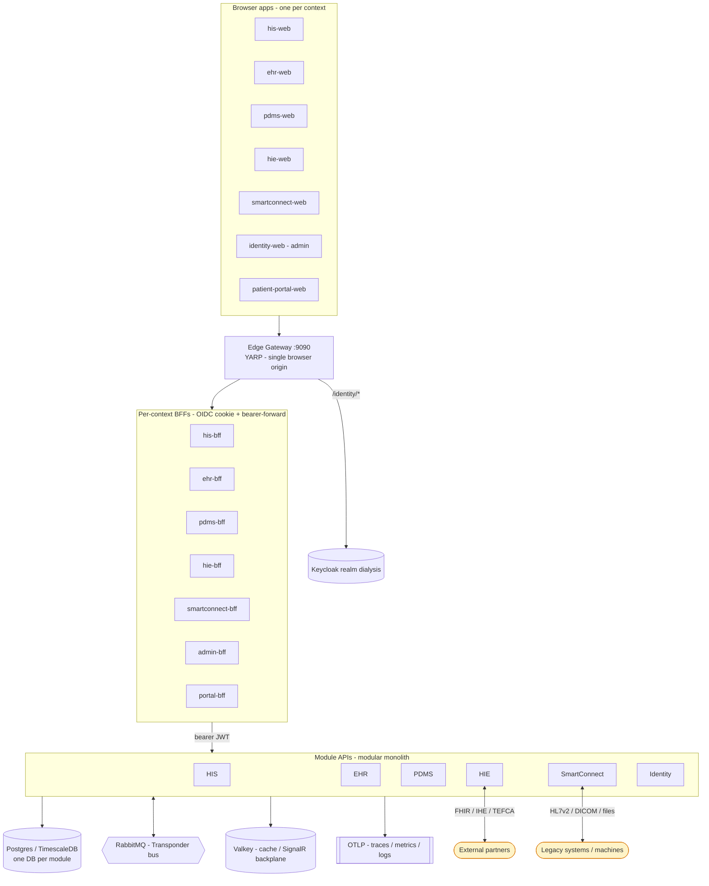
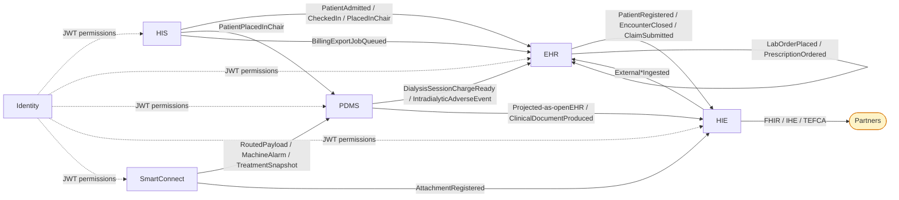
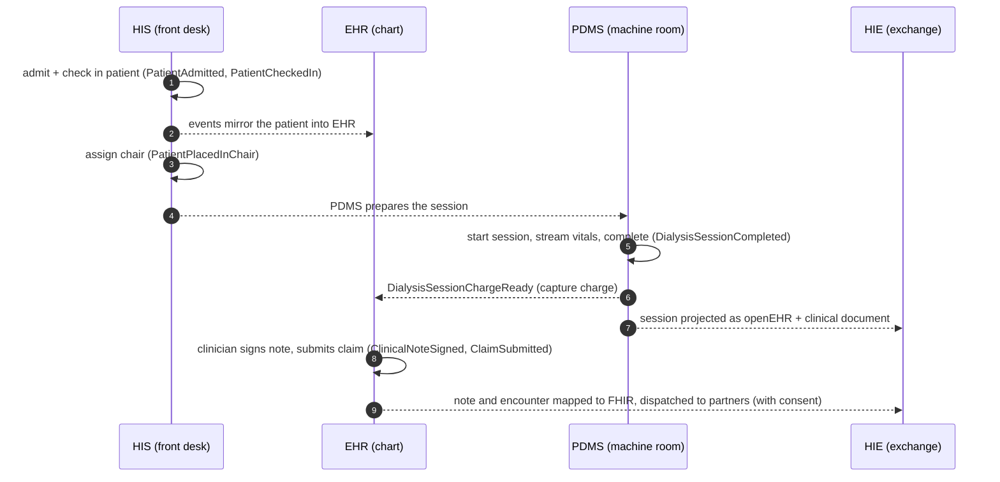

# Dialysis Platform

> One coherent software platform for dialysis clinics and renal-care networks — it runs the front desk, the clinical chart, the dialysis machine room, the patient portal, and the cross-organization data exchange that modern healthcare regulation expects, as a single system with one shared language.

This README has two parts. **Part 1** is a plain-language explanation. **Part 2** is the engineering architecture, and stitches together the per-module deep-dives:

- [HIS — Hospital Information System](src/backend/HIS/ARCHITECTURE.md)
- [EHR — Electronic Health Record](src/backend/EHR/ARCHITECTURE.md)
- [PDMS — Patient Data Management System](src/backend/PDMS/ARCHITECTURE.md)
- [HIE — Health Information Exchange](src/backend/HIE/ARCHITECTURE.md)
- [SmartConnect — Legacy-protocol integration engine](src/backend/SmartConnect/ARCHITECTURE.md)
- [Identity & Auth](src/backend/Identity/ARCHITECTURE.md)

Build/run conventions and deployment are in [CLAUDE.md](CLAUDE.md).

---

# Part 1 — In plain language

A dialysis clinic today juggles four kinds of software that rarely talk to each other: front-office/hospital systems, the clinical record, the machine-room systems, and external data exchange with payers, hospitals, registries and patient apps. The result is duplicate data entry, missed billing, slow audits, and a brittle ability to participate in modern care networks.

This platform is **one system, five connected modules, one shared language:**

| Module | Mental model |
|---|---|
| **HIS** | The *operations* brain — front desk, the patient queue, scheduling, staff & inventory, device registry, billing-export. |
| **EHR** | The *patient story* brain — demographics, encounters, orders, prescriptions, notes, billing claims, the patient portal. The source of truth for who the patient is. |
| **PDMS** | The *machine room* brain — watches each dialysis session live, records every vital sign and alarm, drives IV pumps, renders session documents. |
| **HIE** | The *outside world* brain — speaks FHIR / IHE / TEFCA to share records with insurers, hospitals, registries and patient apps. |
| **SmartConnect** | The *translator* — talks to legacy machines and older hospital systems (HL7 v2, files, DICOM) and converts everything to the modern vocabulary. |

Plus an **Identity** layer for sign-in and a **web app per context** (front desk, chart, chairside, exchange, feeds, admin, patient portal) that staff and patients actually use.

The modules never reach into each other's database. They cooperate by publishing **events** ("patient admitted", "session completed", "claim submitted") that the others react to — so each module can evolve, scale and fail independently.

---

# Part 2 — Engineering architecture

## 2.1 System context



It is a **modular monolith**: each bounded context has its own ASP.NET host and its own database, and modules communicate **only** via integration events over the **Transponder** bus (RabbitMQ in deployment, in-memory in dev/tests) — never via a direct domain reference. The boundary is enforced by `tests/Dialysis.ArchitectureTests` (a module may reference only its own siblings, the shared layers, and another module's `*.Contracts`).

## 2.2 Event storming, not event sourcing

The system is modelled with **event storming** (Brandolini): commands, aggregates, policies, domain events, integration events, read models. It does **not** use event sourcing — aggregates persist current state via EF Core, never as a replayable log.

- **Domain events** (`IDomainEventHandler<T>`) — in-process, dispatched within the same `SaveChanges` transaction; for *within-context* coordination.
- **Integration events** (`IIntegrationEvent`) — written to a Transponder **outbox** in the same transaction as the state change, then relayed asynchronously over RabbitMQ; for *cross-context* signals. Schema-versioned (`int SchemaVersion`).
- **Read models** — denormalized projections built from current state, never rebuilt from a log.

## 2.3 How the modules cooperate (event flow)



## 2.4 A patient journey, end to end



## 2.5 Cross-cutting building blocks

Under `src/backend/BuildingBlocks/`: **Intercessor** (in-process mediator), **Verifier** (validation pipeline), **Transponder** (the messaging + outbox/inbox/saga stack), the **Fhir** stack (~18 projects: Core mappers, US-Core validation, SMART, Subscriptions, BulkData, Audit, TEFCA, Terminology, …), **DataProtection** (the GDPR/BDSG surface incl. the Art. 15 export and Art. 17 erasure hooks), **DurableCommandBus** (opt-in write durability — see PDMS `RecordReading` and HIS `IngestDeviceReading`), **Direct**, **DistributedCache.Valkey**, and the shared **Module.{Hosting,Bff,Bff.Events,Gateway,Contracts}** host scaffolding.

## 2.6 Compliance surfaces (GDPR / BDSG)

Two distinct mechanisms, not to be conflated:

- **Storage limitation (Art. 5(1)(e))** — scheduled purge. HIE's Documents slice owns the retention pipeline (`DocumentRetentionPolicy` per kind, a 24-hour purger, tombstones); SmartConnect bounds its message ledger via a data pruner; PDMS bounds telemetry via the TimescaleDB retention policy.
- **Right to erasure (Art. 17)** — an approve-and-execute pipeline. A request is approved by the DPO via the Admin console; `DefaultDataSubjectRightsService` walks every registered `IPatientEraser` (HIS, EHR, PDMS, HIE) and records the per-module breakdown to the EF-backed `IErasureRequestStore` in HIE. SmartConnect ships no eraser by design (it owns no patient master record).

## 2.7 Identity & auth

A single browser origin (the **Gateway**, `:9090`) fronts one **BFF per context**, each running OIDC + a path-scoped cookie against **Keycloak** (realm `dialysis`). The BFF forwards a bearer JWT to the module API; modules validate it only when an Authority is configured (dev with no Authority grants all permissions for local work). Permission strings reach the SPA through the `dialysis_permission` claim and gate UI via `PermissionGate`. Full detail — multi-IdP federation, silent token refresh, the event-driven BFF push — in [Identity & Auth](src/backend/Identity/ARCHITECTURE.md).

## 2.8 Frontend

The UI is **seven independent per-context React apps** (one per bounded context), not a single shell:

| App | Context base | Dev port | Backing BFF | Real-time push |
|---|---|---|---|---|
| [his-web](src/frontend/his-web/README.md) | `/his` | 5331 | his-bff (5301) | yes |
| [ehr-web](src/frontend/ehr-web/README.md) | `/ehr` | 5332 | ehr-bff (5302) | yes |
| [pdms-web](src/frontend/pdms-web/README.md) | `/pdms` | 5333 | pdms-bff (5303) | yes |
| [hie-web](src/frontend/hie-web/README.md) | `/hie` | 5335 | hie-bff (5305) | no |
| [smartconnect-web](src/frontend/smartconnect-web/README.md) | `/smartconnect` | 5334 | smartconnect-bff (5304) | no |
| [identity-web](src/frontend/identity-web/README.md) (Admin) | `/admin` | 5336 | admin-bff (5306) | no |
| [patient-portal-web](src/frontend/patient-portal-web/README.md) | `/portal` | 5337 | portal-bff (5307) | yes |

**Shared conventions** (identical across all seven apps): React 18 + Vite 6 + TypeScript 5 + TanStack Query 5, **npm**. Scripts: `dev` (Vite, `predev` runs `npm install`), `build` (`tsc -b && vite build`), `lint` (`eslint . --max-warnings=0`), `typecheck`, `test:e2e` (Playwright). A repo-root Husky `pre-commit` hook runs `lint-staged` (eslint + prettier on staged files). Each app copies the module-shell building blocks into `src/shell/` (`PatientContextProvider`, `PermissionGate`, `lazyPage`), maps ProblemDetails to readable sentences via `humanizeError`, and wraps durable writes with the `useDurableCommand` (202 → poll → toast) pattern. `enforceGatewayOrigin()` keeps every app on the Gateway origin so the path-scoped BFF cookie survives.

> **Per-context routing:** in-app links stay unprefixed (the router basename adds `/<ctx>`); navigating to another context is a **full-page hop**, not a client-side route — otherwise the Gateway round-trip looks like a refresh.

## 2.9 Running it

Local dev is the **Aspire AppHost** — the single entrypoint that brings up per-module Postgres, RabbitMQ, Valkey and Keycloak, runs all module APIs + BFFs + the Gateway + the Vite apps, and opens the Aspire dashboard:

```bash
dotnet run --project src/aspire/Dialysis.AppHost
# then browse http://localhost:9090
```

Tests need no infra (in-memory EF + in-memory Transponder):

```bash
dotnet test Dialysis.slnx
```

Deployment artifacts (Docker Compose + Helm, three environments) are **generated from the AppHost**. See [CLAUDE.md](CLAUDE.md) for the full build/run/test/deploy reference and the port matrix.
