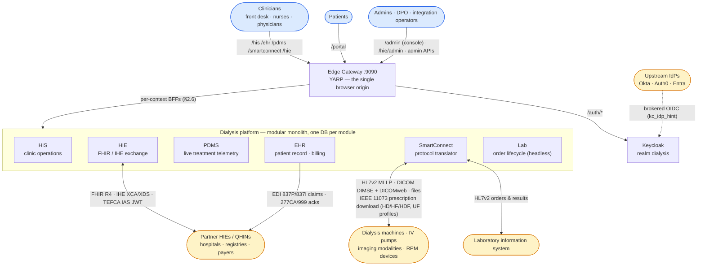
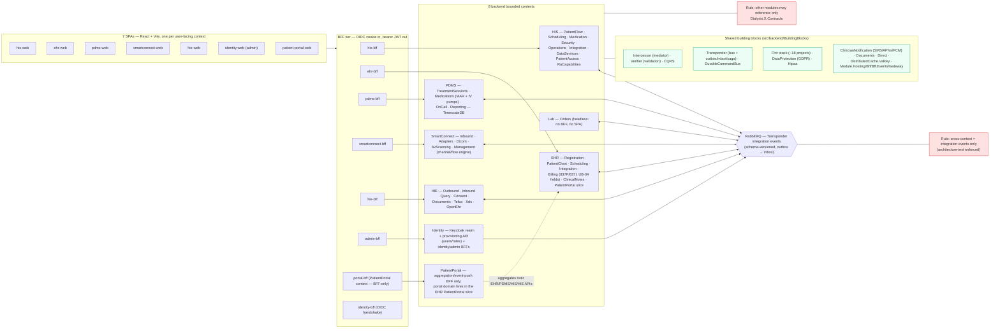
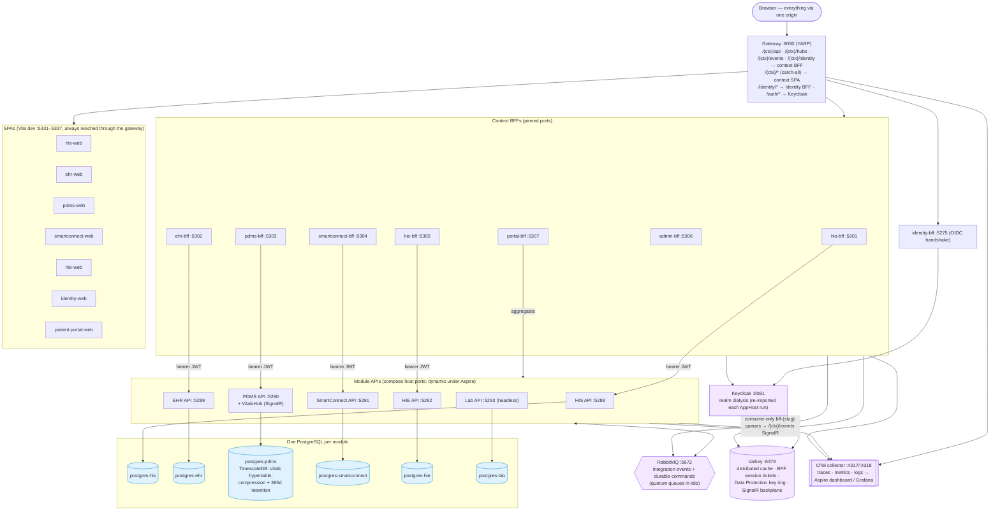
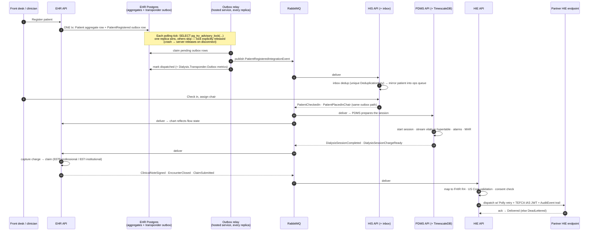
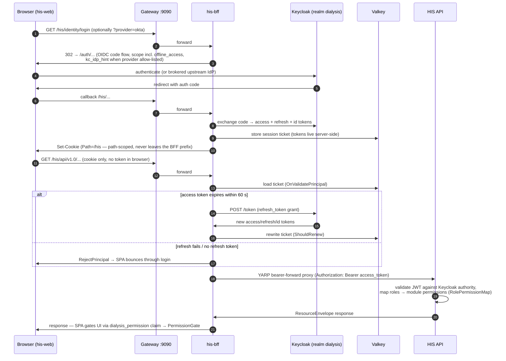
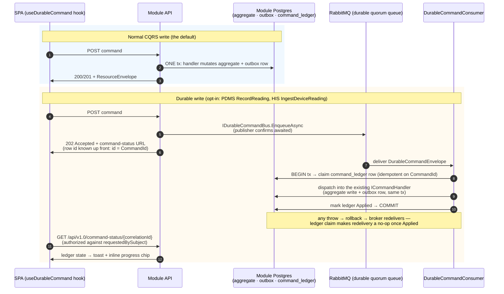
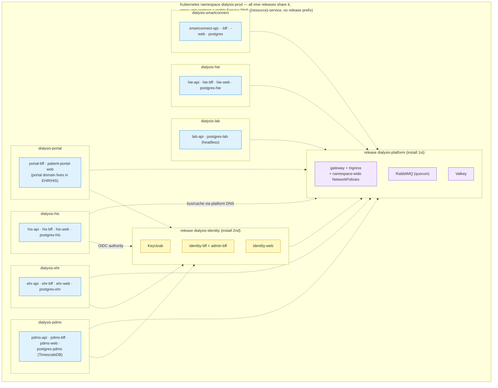
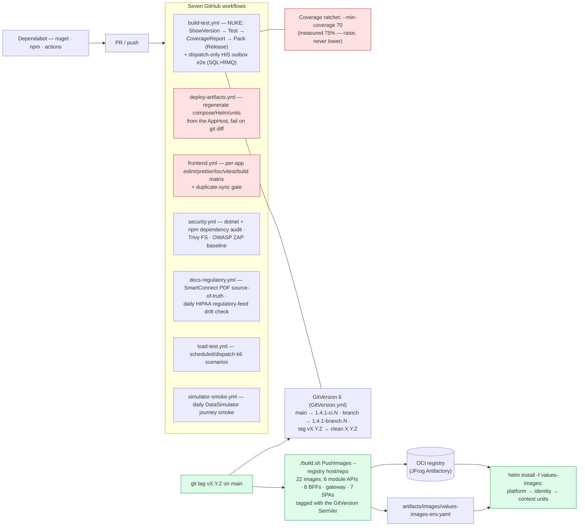

# Dialysis Platform

> One coherent software platform for dialysis clinics and renal-care networks — it runs the front desk, the clinical chart, the dialysis machine room, the lab-order loop, the patient portal, and the cross-organization data exchange that modern healthcare regulation expects, as a single system with one shared language.

This README has two parts. **Part 1** is a plain-language explanation. **Part 2** is the engineering architecture, and stitches together the per-module deep-dives:

- [HIS — Hospital Information System](src/backend/HIS/ARCHITECTURE.md)
- [EHR — Electronic Health Record](src/backend/EHR/ARCHITECTURE.md)
- [PDMS — Patient Data Management System](src/backend/PDMS/ARCHITECTURE.md)
- [HIE — Health Information Exchange](src/backend/HIE/ARCHITECTURE.md)
- [SmartConnect — Legacy-protocol integration engine](src/backend/SmartConnect/ARCHITECTURE.md)
- [Lab — Laboratory orders (headless)](src/backend/Lab/ARCHITECTURE.md)
- [Patient Portal — aggregation BFF](src/backend/PatientPortal/ARCHITECTURE.md)
- [Identity & Auth](src/backend/Identity/ARCHITECTURE.md)

Related references: build/run/test/deploy conventions in [CLAUDE.md](CLAUDE.md); the deployment-unit decision record in [docs/architecture/adr-0001-bounded-context-deployment-units.md](docs/architecture/adr-0001-bounded-context-deployment-units.md); image publishing in [docs/operations/container-registry.md](docs/operations/container-registry.md); device/coding interop in [docs/interoperability/](docs/interoperability/); vulnerability reporting in [SECURITY.md](SECURITY.md).

---

# Part 1 — In plain language

A dialysis clinic today juggles four kinds of software that rarely talk to each other: front-office/hospital systems, the clinical record, the machine-room systems, and external data exchange with payers, hospitals, registries and patient apps. The result is duplicate data entry, missed billing, slow audits, and a brittle ability to participate in modern care networks.

This platform is **one system, six connected modules, one shared language:**

| Module | Mental model |
|---|---|
| **HIS** | The *operations* brain — front desk, the patient queue, scheduling, staff & inventory, device registry, billing-export. |
| **EHR** | The *patient story* brain — demographics, encounters, orders, prescriptions, notes, billing claims (professional **and** institutional), the patient portal. The source of truth for who the patient is. |
| **PDMS** | The *machine room* brain — watches each dialysis session live, records every vital sign and alarm, drives IV pumps, runs on-call escalation, renders session documents. |
| **HIE** | The *outside world* brain — speaks FHIR / IHE / TEFCA to share records with insurers, hospitals, registries and patient apps; owns consent and document retention. |
| **SmartConnect** | The *translator* — talks to legacy machines and older hospital systems (HL7 v2, files, DICOM) and converts everything to the modern vocabulary, including the IEEE 11073 dialysis-machine prescription wire (HD / HF / HDF therapy with UF profiles). |
| **Lab** | The *lab loop* — places LOINC-coded lab orders, tracks them to resulted, headless (no UI of its own; its data surfaces in the EHR chart). |

Plus an **Identity** layer for sign-in and a **web app per context** (front desk, chart, chairside, exchange, feeds, admin, patient portal) that staff and patients actually use.

The modules never reach into each other's database. They cooperate by publishing **events** ("patient admitted", "session completed", "claim submitted") that the others react to — so each module can evolve, scale and fail independently.

---

# Part 2 — Engineering architecture

## 2.1 System context

Who touches the system, and through what door:



## 2.2 Bounded-context map

It is a **modular monolith**: eight backend bounded contexts, each with its own ASP.NET host(s) and its own database. Two rules hold everything together, and both are build-failures if broken (`tests/Dialysis.ArchitectureTests`):

1. **Contracts-only references** — a project under module X may reference its own siblings, the shared layers, and another module's `*.Contracts` assembly. Nothing else.
2. **Cross-context flow rides integration events** over the Transponder bus (RabbitMQ deployed, in-memory in dev/tests) — never a direct domain call. The one sanctioned synchronous exception is a cross-module *query* (e.g. HIE's consent check).



Module-internal layout follows a reference shape (HIS is canonical): `Contracts` (events + permission catalog — the only externally referenceable assembly), one project per vertical slice (each slice carries its own `Fhir/` mappers), `Persistence` (one `DbContext` per module, schema-per-slice, Transponder outbox/inbox/saga on the same context), `Composition` (single `AddX(...)`), `Api` (versioned MVC under `api/v1.0`, HATEOAS envelope, `/health/live|ready`), `Bff`, `Tests`. Intentional divergences (provider-split persistence in EHR/PDMS/SmartConnect/HIE, headless Lab, BFF-only PatientPortal, channel-model SmartConnect) are catalogued in [CLAUDE.md](CLAUDE.md).

## 2.3 Event storming, not event sourcing

The system is modelled with **event storming** (Brandolini): commands, aggregates, policies, domain events, integration events, read models. It does **not** use event sourcing — aggregates persist current state via EF Core, never as a replayable log.

- **Domain events** (`IDomainEventHandler<T>`) — in-process, dispatched within the same `SaveChanges` transaction; for *within-context* coordination.
- **Integration events** (`IIntegrationEvent`) — written to a Transponder **outbox** in the same transaction as the state change, then relayed asynchronously over RabbitMQ; for *cross-context* signals. Schema-versioned (`int SchemaVersion`, guarded by `IntegrationEventVersioningTests`).
- **Read models** — denormalized projections built from current state, never rebuilt from a log.

## 2.4 Runtime topology (full stack)

What actually runs, with the pinned ports (pinned because the Keycloak clients only accept these `redirect_uri`s):



Notes that matter for scale-out: module hosts are stateless; Valkey carries every bit of shared state (cache, BFF cookie tickets, Data Protection keys) **and** the SignalR backplane for the BFF event hubs and the PDMS vitals hub, so any tier can run multiple replicas. Background scheduling is PostgreSQL-backed Hangfire (distributed locks). The full port matrix lives in [CLAUDE.md](CLAUDE.md).

## 2.5 Cross-context event flow — one patient journey

One end-to-end journey (the same one `tools/Dialysis.DataSimulator` drives and the e2e suites assert against), with the delivery machinery shown once in detail. Every hop uses the same pattern: **outbox row in the writer's transaction → relay (advisory-lock gated) → RabbitMQ → consumer inbox dedup**.



The relay's advisory lock is what makes **replicas > 1 correct** (one replica relays per module database per tick; see [ADR-0001](docs/architecture/adr-0001-bounded-context-deployment-units.md)). Outbox health is observable: the `Dialysis.Transponder.Outbox` meter feeds the module-overview Grafana dashboard and alert rules under `deploy/k8s/observability/`.

## 2.6 Identity & auth

A single browser origin (the Gateway) fronts one BFF per context, each running OIDC + a **path-scoped cookie** against Keycloak (realm `dialysis`), so contexts never collide on the shared origin. Multi-IdP federation (Okta/Auth0/Entra) is Keycloak **brokering** — the BFFs never talk to an upstream IdP directly.



Module APIs register JWT Bearer only when an Authority is configured; in Development with no Authority, `ICurrentUser` grants all permissions for local work. Patient-portal endpoints additionally filter by patient claim. Full detail in [Identity & Auth](src/backend/Identity/ARCHITECTURE.md).

## 2.7 Write paths — normal CQRS vs the durable command bus

Most writes are synchronous CQRS. A few telemetry-shaped writes opt into the **durable command bus**, which moves the durability boundary from "the row is in Postgres" to "the command is in a durable, publisher-confirmed RabbitMQ queue". The queue is an in-flight buffer, never a permanent log — the no-event-sourcing rule holds.



Observability: the `Dialysis.DurableCommandBus` meter (enqueued/applied/failed counters, latency histograms) has its own Grafana dashboard + alert rules under `deploy/k8s/observability/`.

## 2.8 Cross-cutting building blocks

Under `src/backend/BuildingBlocks/`: **Intercessor** (in-process mediator), **Verifier** (validation pipeline), **Transponder** (messaging + EF outbox/inbox/saga, multiple transports, Hangfire/Quartz/TickerQ schedulers), the **Fhir** stack (~18 projects: core mappers, US-Core validation, SMART-on-FHIR, Subscriptions, BulkData, Audit, TEFCA, Terminology, De-identification, CDA bridge, openEHR), **DataProtection** (the GDPR/BDSG surface incl. the Art. 15 export and Art. 17 erasure hooks), **Hipaa** (PHI column encryption, `[PhiAccess]` audit pipeline emitting FHIR `AuditEvent`s, live safeguard registry), **ClinicianNotification** (multi-channel paging: Twilio SMS / APNs / FCM, used by PDMS on-call escalation), **DurableCommandBus** (§2.7), **Documents**, **Direct**, **DistributedCache.Valkey**, **PlatformGateway**, the gematik-TI **Tefca** block, and the shared **Module.{Hosting,Bff,Bff.Events,Gateway,Contracts}** host scaffolding.

## 2.9 Compliance surfaces (GDPR / BDSG / HIPAA)

Three distinct mechanisms, not to be conflated:

- **Storage limitation (Art. 5(1)(e))** — scheduled purge. HIE's Documents slice owns the retention pipeline (`DocumentRetentionPolicy` per document kind, a 24-hour purger, tombstones so audit replay sees deliberate purge); SmartConnect bounds its message ledger via retention pruning; PDMS bounds telemetry via the TimescaleDB retention policy.
- **Art. 15 access / Art. 17 erasure** — a request → DPO approval → execute pipeline behind the Admin console. **Five modules participate** with both an `IModuleDataExtractor` (Art. 15 export) and an `IPatientEraser` (Art. 17): HIS, EHR, PDMS, HIE (plus a dedicated HIE-Documents eraser), and Lab. `DefaultDataSubjectRightsService` walks every registered eraser and records the per-module breakdown to the EF-backed `IErasureRequestStore`. SmartConnect ships neither by design — it routes messages but owns no patient master record. Erasers use `ExecuteUpdate/DeleteAsync` so even thousands of telemetry rows clear in one round-trip per type.
- **HIPAA Security Rule** — `AddHipaaCompliance(moduleSlug)` wires PHI column encryption, the `[PhiAccess]` audit pipeline, and a live safeguard registry (`GET /admin/hipaa/safeguards`) in PDMS, EHR, HIS, HIE and SmartConnect.

## 2.10 Frontend

The UI is **seven independent per-context React apps** (one per bounded context), not a single shell:

| App | Context base | Dev port | Backing BFF | Real-time push |
|---|---|---|---|---|
| [his-web](src/frontend/his-web/README.md) | `/his` | 5331 | his-bff (5301) | yes |
| [ehr-web](src/frontend/ehr-web/README.md) | `/ehr` | 5332 | ehr-bff (5302) | yes |
| [pdms-web](src/frontend/pdms-web/README.md) | `/pdms` | 5333 | pdms-bff (5303) | yes |
| [smartconnect-web](src/frontend/smartconnect-web/README.md) | `/smartconnect` | 5334 | smartconnect-bff (5304) | no |
| [hie-web](src/frontend/hie-web/README.md) | `/hie` | 5335 | hie-bff (5305) | no |
| [identity-web](src/frontend/identity-web/README.md) (Admin) | `/admin` | 5336 | admin-bff (5306) | no |
| [patient-portal-web](src/frontend/patient-portal-web/README.md) | `/portal` | 5337 | portal-bff (5307) | yes |

**Toolchain** (identical across all seven apps): React 18 + Vite 8 + TypeScript 6 + Tailwind 4 + TanStack Query 5 + React Router 7, SignalR client, ECharts/D3 charts, react-pdf 10 / pdfjs viewers, XYFlow diagrams; **npm**, no monorepo workspace. Lint is strict: flat ESLint 10 config with TS + React + Hooks + Refresh + **jsx-a11y** (accessibility) at `--max-warnings=0`, Prettier, Husky `pre-commit` + `lint-staged`. Tests: Vitest 4 unit tests + a Playwright `e2e/` suite per app.

Cross-cutting code is **duplicated byte-for-byte**, not shared via a package — the auth shell, `useDurableCommand` client (202 → poll → toast), toast/theme shells, `lazyPage` (route-level code-splitting), `ErrorBoundary`, eslint/tsconfig — and `tools/frontend/check-duplicate-sync.sh` fails CI on any drift between copies. Other conventions: `humanizeError` maps ProblemDetails to readable sentences (clinical users never see raw status codes); mutations follow the optimistic-update + rollback + invalidate-on-settle pattern; `enforceGatewayOrigin()` keeps every app on the Gateway origin so the path-scoped BFF cookie survives; in-app links stay unprefixed (router basename adds `/{ctx}`) and cross-context navigation is a full-page hop.

## 2.11 Deployment — full stack and bounded-context units

All deployment artifacts are **generated from the Aspire AppHost** (the single source of truth; a CI drift gate regenerates and fails on diff). Two Kubernetes shapes exist:

- `deploy/compose/<env>/` + `deploy/charts/dialysis-<env>/` — the classic **full-stack** shape, three environments (dev/staging/prod).
- `deploy/charts/units/prod/` — **nine independently deployable Helm releases**, one per bounded context, for a microservices-style ops model while the codebase stays a monorepo ([ADR-0001](docs/architecture/adr-0001-bounded-context-deployment-units.md), [units README](deploy/charts/units/README.md)). Units are generated for prod only by design.



Cross-unit dependencies are **configuration, not model references**: inside a unit chart, RabbitMQ/Valkey/Keycloak appear as values defaulting to the platform/identity units' in-cluster DNS names, overridable at `helm install` time. The gateway stays the single browser origin — adding a unit means updating its ReverseProxy cluster values on the platform unit. Horizontal scaling is safe by construction: Valkey session/key-ring state, the SignalR backplane, Hangfire distributed locks, inbox dedup + ledger claims, quorum queues, and the advisory-locked outbox relay (§2.5). HA infra (CloudNativePG clusters with sync replication on the clinical tier, RabbitMQ operator, PgBouncer) lives under `deploy/k8s/operators/`.

## 2.12 CI/CD and releases



Static analysis is owned by the Aspire-hosted SonarQube (`tools/sonarqube/`); SonarAnalyzer + VS Threading analyzers run on every compile with warnings-as-errors. Code ownership and review routing are in [.github/CODEOWNERS](.github/CODEOWNERS); the disclosure policy is [SECURITY.md](SECURITY.md).

## 2.13 Running it

Local dev is the **Aspire AppHost** — the single entrypoint that brings up per-module Postgres, RabbitMQ, Valkey and Keycloak, runs all six module APIs + the eight BFFs + the Gateway + the seven Vite apps, and opens the Aspire dashboard:

```bash
dotnet run --project src/aspire/Dialysis.AppHost
# then browse http://localhost:9090
```

Tests run with `dotnet test Dialysis.slnx`. Persistence is **PostgreSQL everywhere** — integration and repository tests spin up PostgreSQL **Testcontainers**, so a running Docker daemon is required; the Transponder bus stays in-memory. A demo walkthrough lives in `e2e-demo/` (a Playwright film of one scripted patient journey against the live stack), and `tools/Dialysis.DataSimulator` keeps the seven SPAs populated with one coherent cross-module patient journey.

See [CLAUDE.md](CLAUDE.md) for the full build/run/test/deploy reference, the port matrix, and versioning/release mechanics.
