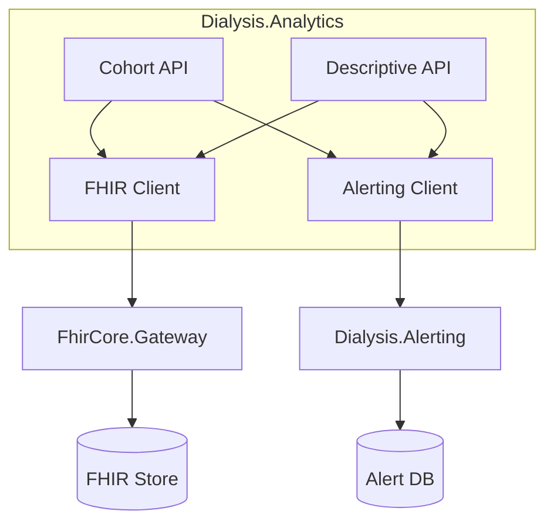

# Analytics & Decision Support

Design and roadmap for analytics capabilities in Dialysis PDMS: structured analysis planning, descriptive analytics, and cohort building.

---

## 1. Planning an Analysis: Question → Data → Method

A repeatable framework for clinical and operational analytics.

### 1.1 Framework

| Step | Description | Dialysis PDMS Mapping |
|------|-------------|------------------------|
| **Question** | Define the clinical or operational question | e.g. *"What % of sessions had systolic BP < 100 mmHg?"* |
| **Data** | Identify required data elements and sources | Patient, Encounter, Observation (LOINC), Alert |
| **Method** | Choose analytic approach | Descriptive (aggregation), cohort filter, trend analysis |

### 1.2 Data Sources

| Source | Content | Access |
|--------|---------|--------|
| **FHIR Store** | Patient, Encounter, Observation (vitals), Condition, Procedure | FHIR REST API (Gateway), `$search` |
| **Dialysis.Alerting** | Hypotension alerts per encounter | PostgreSQL, REST API |
| **Dialysis.AuditConsent** | Audit events (resource access, actions) | PostgreSQL, REST API |

### 1.3 Example Questions → Data → Method

| Question | Data | Method |
|----------|------|--------|
| Hypotension rate by facility/tenant | Observation (8480-6, 85354-9), Encounter | Cohort: encounters in date range; aggregate % with systolic \< 100 |
| Alert response time | Alert.CreatedAt, Alert.AcknowledgedAt | Descriptive: median, P95 time-to-ack |
| Vitals trends over session | Observation per Encounter, ordered by Effective | Descriptive: min/max/avg systolic per session |
| High-risk patient identification | Observation history, Alert count | Cohort: patients with ≥2 alerts in 30 days |
| Session volume by day | Encounter (class = ambulatory, dialysis) | Descriptive: count by date, tenant |

---

## 2. Descriptive Analytics

### 2.1 Scope

- **Aggregations**: counts, means, medians, percentiles, rates
- **Trends**: time-series (daily, weekly, monthly)
- **Distributions**: vitals by patient, encounter, tenant

### 2.2 Implementation Options

| Option | Pros | Cons |
|--------|------|------|
| **A. FHIR + ad-hoc queries** | No new service; use `$search`, `_elements`, `_summary` | FHIR search limits; no native aggregation |
| **B. Dialysis.Analytics service** | Dedicated API, prebuilt reports, caching | New microservice, schema, deployment |
| **C. Analytics DB (mart)** | Fast queries, BI tool integration | ETL, sync latency, schema management |

**Recommended path**: Start with **A** for MVP (FHIR Gateway + `$search`), add **B** when predefined reports and cohort APIs are needed.

**Phase 2 (implemented):** See [FHIR-QUERY-EXAMPLES.md](analytics/FHIR-QUERY-EXAMPLES.md) for documented `$search` examples.

### 2.3 Descriptive Metrics (Initial Set)

| Metric | Definition | Data |
|--------|------------|------|
| Hypotension rate | % encounters with systolic \< 100 mmHg at least once | Observation (8480-6, 85354-9) |
| Alert count | Alerts per tenant/encounter/period | Alerting DB |
| Session count | Encounters by tenant, date range | FHIR Encounter |
| Average systolic (session) | Mean of systolic Observations per Encounter | Observation + Encounter |
| Time to alert acknowledgement | `AcknowledgedAt - CreatedAt` | Alerting DB |

### 2.4 API Shape (`Dialysis.Analytics` – implemented)

```
GET /api/v1/analytics/descriptive/session-count?from=2025-01-01&to=2025-01-31
GET /api/v1/analytics/descriptive/hypotension-rate?from=2025-01-01&to=2025-01-31
GET /api/v1/analytics/descriptive/alert-stats?from=2025-01-01&to=2025-01-31
```

Legacy shape (unified, optional future):
```
GET /api/v1/analytics/descriptive
  ?metric=hypotension_rate|session_count|alert_count
  &tenantId=...
  &from=2025-01-01
  &to=2025-01-31
  &groupBy=day|week|month
```

---

## 3. Cohort Building

### 3.1 Cohort Definition

A **cohort** is a set of patients (or encounters) that meet inclusion/exclusion criteria.

**Examples:**
- Patients with ≥3 dialysis sessions in the last 30 days
- Encounters where systolic BP dropped below 100 mmHg
- Patients with ≥2 hypotension alerts in the last 90 days

### 3.2 FHIR Alignment

FHIR R4 defines the [Group](https://www.hl7.org/fhir/group.html) resource for cohorts:
- `Group.type = person`
- `Group.member` (references to Patient)
- `Group.characteristic` for criteria (code, value)

Alternative: **criteria-based cohort** = query parameters, no persisted Group.

### 3.3 Implementation Options

| Option | Description |
|--------|-------------|
| **FHIR Group resource** | Create/update Group via Gateway; persist in FHIR store |
| **Cohort API (criteria)** | `GET /api/v1/cohorts?criteria=...` → resolve dynamically from FHIR + Alerting |
| **Saved cohorts** | Store cohort definitions; materialize on schedule or on-demand |

### 3.4 Cohort Criteria (Proposed)

| Criterion | Type | Example |
|----------|------|---------|
| Encounter count | `Encounter` in period | `count >= 3` in last 30 days |
| Observation value | LOINC + comparator | systolic \< 100, SpO2 \< 90 |
| Alert count | Alerts per patient | `count >= 2` in last 90 days |
| Patient demographics | Age, gender | Age ≥ 65 |
| Date range | Observation/Encounter effective | 2025-01-01 to 2025-01-31 |

### 3.5 API Shape (Future `Dialysis.Analytics`)

```
POST /api/v1/cohorts/define
{
  "name": "High-risk hypotension patients",
  "criteria": {
    "alertCount": { "min": 2, "withinDays": 90 },
    "observationCodes": ["8480-6"],
    "valueFilter": { "code": "8480-6", "comparator": "<", "value": 100 }
  },
  "tenantId": "default"
}

GET /api/v1/cohorts/{id}/members
GET /api/v1/cohorts/{id}/export  (CSV, FHIR Group Bundle)
```

---

## 4. Architecture Integration

### 4.1 Current State

```
FHIR Store (Patient, Encounter, Observation)
     ↑
Gateway ← DeviceIngestion, HIS, Identity
     |
Alerting (PostgreSQL) ← HypotensionRiskRaised
AuditConsent (PostgreSQL)
```

### 4.2 Proposed Addition: Dialysis.Analytics



### 4.3 Data Flow

1. **Descriptive**: Analytics service calls Gateway `$search` (Patient, Encounter, Observation) and Alerting API; aggregates in-memory or with lightweight cache.
2. **Cohort**: Resolve criteria → FHIR search + Alert queries → return Patient IDs or FHIR Group.
3. **Multi-tenant**: All queries scoped by `X-Tenant-Id`; Analytics enforces tenant isolation.

---

## 5. Implementation Roadmap

| Phase | Deliverable | Effort |
|-------|-------------|--------|
| **1. Framework & Docs** | Question→Data→Method template, analyst runbook | ✅ This doc |
| **2. Descriptive (FHIR-only)** | Documented `$search` examples for common metrics | Small |
| **3. Analytics service (MVP)** | `Dialysis.Analytics` Web API: hypotension rate, session count, alert stats | Medium |
| **4. Cohort API** | Criteria-based cohort resolution; optional FHIR Group export | ✅ Implemented |
| **5. Saved cohorts** | Persist cohort definitions; scheduled refresh | ✅ In-memory store; PostgreSQL adapter optional |

---

## 6. C5 / Compliance Notes

- **Data access**: Analytics reads from FHIR and Alerting; no new persistent clinical store in Phase 2–3.
- **Audit**: Analytics API calls should emit AuditEvent (who queried what, when).
- **Tenant isolation**: Enforce `X-Tenant-Id`; no cross-tenant aggregation without explicit design.
- **Retention**: Cohort exports are operational outputs; retention policy applies per customer.

---

## References

- [FHIR Group Resource](https://www.hl7.org/fhir/group.html)
- [FHIR Search](https://www.hl7.org/fhir/search.html)
- [LOINC for vitals](https://loinc.org/) – 8480-6 (Systolic BP), 8867-4 (Heart rate), 59408-5 (SpO2)
- [SYSTEM-ARCHITECTURE.md](SYSTEM-ARCHITECTURE.md)
