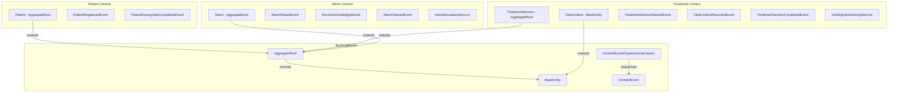

# Domain Events and Services

This document lists all domain events, domain services, aggregates, and entities across the Dialysis PDMS bounded contexts.

## Architecture Overview



## Domain Event Dispatch Flow

Domain events are dispatched via the `DomainEventDispatcherInterceptor` (`BuildingBlocks/Interceptors/DomainEventDispatcherInterceptor.cs`), an EF Core `SaveChangesInterceptor`:

1. Aggregate roots raise events via `ApplyEvent(new XxxEvent(...))` during domain operations
2. In `SavingChangesAsync` (before the database write), the interceptor collects all pending domain events from tracked `AggregateRoot` entities
3. Events are cleared from aggregate roots and dispatched immediately via `IPublisher.PublishAsync` (Intercessor)
4. Handlers execute within the same transactional boundary — they can modify tracked entities, enqueue integration events, or add further domain events before the transaction commits
5. `SaveChanges` then persists all changes (including those made by event handlers) atomically

This "dispatch before save" pattern ensures that domain event handlers participate in the same unit of work as the original operation.

---

## Patient Bounded Context

### Aggregates

| Type | Base Class | Location |
|------|-----------|----------|
| `Patient` | `AggregateRoot` | `Services/Dialysis.Patient/Dialysis.Patient.Application/Domain/Patient.cs` |

### Domain Events

| Event | Raised When | Properties |
|-------|------------|------------|
| `PatientRegisteredEvent` | A new patient is registered via `Patient.Register()` | `PatientId`, `MedicalRecordNumber`, `FirstName`, `LastName` |
| `PatientDemographicsUpdatedEvent` | Patient demographics are updated via `Patient.UpdateDemographics()` | `PatientId`, `FirstName`, `LastName` |

### Domain Services

None. Patient context is simple demographic CRUD aligned with PDQ (Patient Demographics Query).

---

## Treatment Bounded Context

### Aggregates and Entities

| Type | Base Class | Location |
|------|-----------|----------|
| `TreatmentSession` | `AggregateRoot` | `Services/Dialysis.Treatment/Dialysis.Treatment.Application/Domain/TreatmentSession.cs` |
| `Observation` | `BaseEntity` | `Services/Dialysis.Treatment/Dialysis.Treatment.Application/Domain/Observation.cs` |

`TreatmentSession` owns a collection of `Observation` child entities (one-to-many relationship).

### Domain Events

| Event | Raised When | Properties |
|-------|------------|------------|
| `TreatmentSessionStartedEvent` | A new treatment session is started via `TreatmentSession.Start()` | `TreatmentSessionId`, `SessionId`, `PatientMrn`, `DeviceId` |
| `ObservationRecordedEvent` | A device observation is added via `TreatmentSession.AddObservation()` | `TreatmentSessionId`, `ObservationId`, `Code`, `Value`, `Unit` |
| `TreatmentSessionCompletedEvent` | A treatment session is completed via `TreatmentSession.Complete()` | `TreatmentSessionId`, `SessionId` |

### Domain Services

| Service | Purpose | Location |
|---------|---------|----------|
| `VitalSignsMonitoringService` | Evaluates observations against clinical thresholds (hypotension, tachycardia, bradycardia, high venous pressure) | `Services/Dialysis.Treatment/Dialysis.Treatment.Application/Domain/Services/VitalSignsMonitoringService.cs` |

**Clinical Thresholds:**

| Vital Sign | Code | Condition | Threshold |
|-----------|------|-----------|-----------|
| Systolic BP | `MDC_PRESS_BLD_SYS` | Hypotension | < 90 mmHg |
| Heart Rate | `MDC_PULS_RATE` | Tachycardia | > 100 bpm |
| Heart Rate | `MDC_PULS_RATE` | Bradycardia | < 60 bpm |
| Venous Pressure | `MDC_PRESS_BLD_VEN` | High Venous Pressure | > 200 mmHg |

---

## Alarm Bounded Context

### Aggregates

| Type | Base Class | Location |
|------|-----------|----------|
| `Alarm` | `AggregateRoot` | `Services/Dialysis.Alarm/Dialysis.Alarm.Application/Domain/Alarm.cs` |

### Domain Events

| Event | Raised When | Properties |
|-------|------------|------------|
| `AlarmRaisedEvent` | A new alarm is detected via `Alarm.Raise()` | `AlarmId`, `AlarmType`, `EventPhase`, `AlarmState`, `DeviceId`, `SessionId`, `OccurredAt` |
| `AlarmAcknowledgedEvent` | An alarm is acknowledged via `Alarm.Acknowledge()` | `AlarmId` |
| `AlarmClearedEvent` | An alarm condition is resolved via `Alarm.Clear()` | `AlarmId` |

### Domain Services

| Service | Purpose | Location |
|---------|---------|----------|
| `AlarmEscalationService` | Evaluates alarm frequency for escalation; triggers when 3+ active alarms occur within a 5-minute window | `Services/Dialysis.Alarm/Dialysis.Alarm.Application/Domain/Services/AlarmEscalationService.cs` |

---

## Shared Building Blocks

### Base Classes

| Class | Purpose | Location |
|-------|---------|----------|
| `BaseEntity` | Provides `Id` (Ulid), `CreatedAtUtc`, `UpdatedAtUtc`, soft delete | `BuildingBlocks/BaseEntity.cs` |
| `AggregateRoot` | Extends `BaseEntity` with domain/integration event lists and `ApplyEvent()` | `BuildingBlocks/AggregateRoot.cs` |
| `DomainEvent` | Base record for domain events with `EventId` and `OccurredOn` | `BuildingBlocks/DomainEvent.cs` |

### Interceptor

| Class | Purpose | Location |
|-------|---------|----------|
| `DomainEventDispatcherInterceptor` | EF Core `SaveChangesInterceptor` that collects and dispatches domain events before save (in `SavingChangesAsync`) | `BuildingBlocks/Interceptors/DomainEventDispatcherInterceptor.cs` |

### Registration

Each service registers the interceptor in its `Program.cs`:

```csharp
builder.Services.AddScoped<DomainEventDispatcherInterceptor>();
builder.Services.AddDbContext<XxxDbContext>((sp, o) =>
    o.UseNpgsql(connectionString)
     .AddInterceptors(sp.GetRequiredService<DomainEventDispatcherInterceptor>()));
```
