# Domain Events and Services

This document lists all domain events, domain services, aggregates, and entities across the Dialysis PDMS bounded contexts.

**Convention** (see `.cursor/rules/event-conventions.mdc`): Each event serves one purpose; each event has exactly one handler.

## Architecture Overview

```mermaid
flowchart TD
    subgraph buildingBlocks [BuildingBlocks]
        BE[BaseEntity]
        AR[AggregateRoot]
        DE[DomainEvent]
        INT[DomainEventDispatcherInterceptor]
    end
    subgraph patientCtx [Patient Context]
        P[Patient : AggregateRoot]
        PRE[PatientRegisteredEvent]
        PDUE[PatientDemographicsUpdatedEvent]
    end
    subgraph treatmentCtx [Treatment Context]
        TS[TreatmentSession : AggregateRoot]
        OBS[Observation : BaseEntity]
        TSSE[TreatmentSessionStartedEvent]
        ORE[ObservationRecordedSignalRBroadcastEvent]
        ORE2[ObservationRecordedFhirNotifyEvent]
        TBDE[ThresholdBreachDetectedEvent]
        TSCE[TreatmentSessionCompletedEvent]
        VSMS[VitalSignsMonitoringService]
    end
    subgraph prescriptionCtx [Prescription Context]
        PR[Prescription : AggregateRoot]
        PRE2[PrescriptionReceivedEvent]
        PC[ProfileCalculator]
    end
    subgraph alarmCtx [Alarm Context]
        AL[Alarm : AggregateRoot]
        ARE[AlarmRaisedEvent]
        AAE[AlarmAcknowledgedEvent]
        ACE[AlarmClearedEvent]
        AES[AlarmEscalationService]
    end
    AR -->|extends| BE
    P -->|extends| AR
    TS -->|extends| AR
    OBS -->|extends| BE
    PR -->|extends| AR
    AL -->|extends| AR
    INT -->|dispatches| DE
```



## Domain Event Dispatch Flow

Domain events are dispatched via the `DomainEventDispatcherInterceptor` (`BuildingBlocks/Interceptors/DomainEventDispatcherInterceptor.cs`), an EF Core `SaveChangesInterceptor`:

1. Aggregate roots raise events via `ApplyEvent(new XxxEvent(...))` during domain operations
2. In `SavingChangesAsync` (before the database write), the interceptor collects all pending domain events from tracked `AggregateRoot` entities
3. Events are cleared from aggregate roots and dispatched immediately via `IPublisher.PublishAsync` (Intercessor)
4. Handlers execute within the same transactional boundary — they can modify tracked entities, enqueue integration events, or add further domain events before the transaction commits
5. `SaveChanges` then persists all changes (including those made by event handlers) atomically

This "dispatch before save" pattern ensures that domain event handlers participate in the same unit of work as the original operation.

### Domain vs Integration Events (Eventual Consistency)

| Phase | When | Pattern |
|-------|------|---------|
| **Domain events** | Before SaveChanges (`SavingChangesAsync`) | Atomic — handlers run in same transaction; audit, FHIR notify, escalation |
| **Integration events** | After SaveChanges (`SavedChangesAsync`) | Eventual — handlers run after commit; Transponder, in-process `IIntegrationEventHandler` |

Integration events originate **only from aggregate roots** via `ApplyEvent(IIntegrationEvent)`.

They are persisted to the **OutboxMessages** table (Transponder format) in the same transaction as business data (`TransponderOutboxInterceptor` in `SavingChangesAsync`). In-process handlers are dispatched in `SavedChangesAsync`. Transponder's `OutboxDispatcher` reads pending rows and publishes to ASB/SignalR — survives server restarts.

### Domain Event Handlers (Selected)

| Event | Handler | Location |
|-------|---------|----------|
| `PrescriptionReceivedEvent` | `PrescriptionReceivedEventHandler` | `Services/Dialysis.Prescription/.../Features/PrescriptionReceived/` |
| `ThresholdBreachDetectedEvent` | `ThresholdBreachDetectedEventHandler` | `Services/Dialysis.Treatment/.../Features/ThresholdBreachDetected/` |
| `TreatmentSessionStartedEvent` | `TreatmentSessionStartedEventHandler` | Audit, logging |
| `TreatmentSessionStartedFhirNotifyEvent` | `FhirSubscriptionNotifyHandler` | FHIR subscription notify |
| `ObservationRecordedSignalRBroadcastEvent` | `ObservationRecordedTransponderHandler` | SignalR broadcast |
| `ObservationRecordedFhirNotifyEvent` | `FhirSubscriptionNotifyHandler` | FHIR subscription notify |
| `AlarmRaisedEvent` | `AlarmRaisedEventHandler` | Audit, logging |
| `AlarmEscalationCheckEvent` | `AlarmEscalationCheckHandler` | Escalation evaluation |
| `AlarmFhirNotifyEvent` | `FhirSubscriptionNotifyHandler` | FHIR subscription notify |
| `AlarmSignalRBroadcastEvent` | `AlarmRaisedTransponderHandler` | SignalR broadcast |

### Integration Event Handlers

| Event | Raised By | Dispatched By | In-Process Handler |
|-------|-----------|---------------|--------------------|
| `ObservationRecordedIntegrationEvent` | `TreatmentSession.AddObservation` | Outbox → Publisher | `ObservationRecordedIntegrationEventConsumer` |
| `ThresholdBreachDetectedIntegrationEvent` | `TreatmentSession.AddObservation` (per breach) | Outbox → Publisher | `ThresholdBreachDetectedIntegrationEventConsumer` |
| `AlarmRaisedIntegrationEvent` | `Alarm.Raise` | Outbox → Publisher | — |
| `AlarmEscalationTriggeredEvent` | `EscalationIncident.Record` (via `AlarmEscalationCheckHandler`) | Outbox → Publisher | `AlarmEscalationTriggeredEventConsumer` |

---

## Patient Bounded Context

### Aggregates

| Type | Base Class | Location |
|------|-----------|----------|
| `Patient` | `AggregateRoot` | `Services/Dialysis.Patient/Dialysis.Patient.Application/Domain/Patient.cs` |

### Domain Events

| Event | Raised When | Properties |
|-------|------------|------------|
| `PatientRegisteredEvent` | A new patient is registered via `Patient.Register()` | `PatientId`, `MedicalRecordNumber`, `FirstName`, `LastName` |
| `PatientDemographicsUpdatedEvent` | Patient demographics are updated via `Patient.UpdateDemographics()` | `PatientId`, `FirstName`, `LastName` |

### Domain Services

None. Patient context is simple demographic CRUD aligned with PDQ (Patient Demographics Query).

---

## Treatment Bounded Context

### Aggregates and Entities

| Type | Base Class | Location |
|------|-----------|----------|
| `TreatmentSession` | `AggregateRoot` | `Services/Dialysis.Treatment/Dialysis.Treatment.Application/Domain/TreatmentSession.cs` |
| `Observation` | `BaseEntity` | `Services/Dialysis.Treatment/Dialysis.Treatment.Application/Domain/Observation.cs` |

`TreatmentSession` owns a collection of `Observation` child entities (one-to-many relationship).

### Domain Events

| Event | Raised When | Properties |
|-------|------------|------------|
| `TreatmentSessionStartedEvent` | A new treatment session is started via `TreatmentSession.Start()` | `TreatmentSessionId`, `SessionId`, `PatientMrn`, `DeviceId` |
| `TreatmentSessionStartedFhirNotifyEvent` | `TreatmentSession.Start()` | `TreatmentSessionId`, `SessionId`, `PatientMrn`, `DeviceId` |
| `ObservationRecordedSignalRBroadcastEvent` | A device observation is added via `TreatmentSession.AddObservation()` | `TreatmentSessionId`, `SessionId`, `ObservationId`, `Code`, `Value`, `Unit`, `SubId`, `ChannelName` |
| `ObservationRecordedFhirNotifyEvent` | `TreatmentSession.AddObservation()` | `TreatmentSessionId`, `SessionId`, `ObservationId`, `Code`, `Value`, `Unit`, `SubId`, `ChannelName` |
| `ThresholdBreachDetectedEvent` | VitalSignsMonitoringService detects value outside clinical threshold during `AddObservation()` | `TreatmentSessionId`, `SessionId`, `ObservationId`, `Code`, `Breach` |
| `TreatmentSessionCompletedEvent` | A treatment session is completed via `TreatmentSession.Complete()` | `TreatmentSessionId`, `SessionId` |

### Domain Services

| Service | Purpose | Location |
|---------|---------|----------|
| `VitalSignsMonitoringService` | Evaluates observations against clinical thresholds (hypotension, tachycardia, bradycardia, high venous pressure). Invoked in `RecordObservationCommandHandler`; breaches raise `ThresholdBreachDetectedEvent`. | `Services/Dialysis.Treatment/Dialysis.Treatment.Application/Domain/Services/VitalSignsMonitoringService.cs` |

**Clinical Thresholds:**

| Vital Sign | Code | Condition | Threshold |
|-----------|------|-----------|-----------|
| Systolic BP | `MDC_PRESS_BLD_SYS` | Hypotension | < 90 mmHg |
| Heart Rate | `MDC_PULS_RATE` | Tachycardia | > 100 bpm |
| Heart Rate | `MDC_PULS_RATE` | Bradycardia | < 60 bpm |
| Venous Pressure | `MDC_PRESS_BLD_VEN` | High Venous Pressure | > 200 mmHg |

---

## Alarm Bounded Context

### Aggregates

| Type | Base Class | Location |
|------|-----------|----------|
| `Alarm` | `AggregateRoot` | `Services/Dialysis.Alarm/Dialysis.Alarm.Application/Domain/Alarm.cs` |
| `EscalationIncident` | `AggregateRoot` | `Services/Dialysis.Alarm/Dialysis.Alarm.Application/Domain/EscalationIncident.cs` |

### Domain Events

| Event | Raised When | Properties |
|-------|------------|------------|
| `AlarmRaisedEvent` | A new alarm is detected via `Alarm.Raise()` | `AlarmId`, `AlarmType`, `EventPhase`, `AlarmState`, `DeviceId`, `SessionId`, `OccurredAt` |
| `AlarmEscalationCheckEvent` | `Alarm.Raise()` | `AlarmId`, `DeviceId`, `SessionId`, `OccurredAt` |
| `AlarmFhirNotifyEvent` | `Alarm.Raise()` | `AlarmId` |
| `AlarmSignalRBroadcastEvent` | `Alarm.Raise()` | `AlarmId`, `AlarmType`, `EventPhase`, `AlarmState`, `DeviceId`, `SessionId`, `OccurredAt` |
| `AlarmAcknowledgedEvent` | An alarm is acknowledged via `Alarm.Acknowledge()` | `AlarmId` |
| `AlarmClearedEvent` | An alarm condition is resolved via `Alarm.Clear()` | `AlarmId` |

### Domain Services

| Service | Purpose | Location |
|---------|---------|----------|
| `AlarmEscalationService` | Evaluates alarm frequency for escalation; triggers when 3+ active alarms occur within a 5-minute window. Wired via `AlarmEscalationCheckHandler` on `AlarmEscalationCheckEvent`. | `Services/Dialysis.Alarm/Dialysis.Alarm.Application/Domain/Services/AlarmEscalationService.cs` |

---

## Prescription Bounded Context

### Aggregates

| Type | Base Class | Location |
|------|-----------|----------|
| `Prescription` | `AggregateRoot` | `Services/Dialysis.Prescription/Dialysis.Prescription.Application/Domain/Prescription.cs` |

### Domain Events

| Event | Raised When | Properties |
|-------|------------|------------|
| `PrescriptionReceivedEvent` | `Prescription.CompleteIngestion()` called after all settings added (RSP^K22 ingest) | `PrescriptionId`, `OrderId`, `PatientMrn`, `TenantId` |

### Domain Services

| Service | Purpose | Location |
|---------|---------|----------|
| `ProfileCalculator` | Evaluates UF profile at time t (LINEAR, EXPONENTIAL, STEP, etc.) | `Services/Dialysis.Prescription/Dialysis.Prescription.Application/Domain/Services/ProfileCalculator.cs` |

---

## Device Bounded Context

### Aggregates

| Type | Base Class | Location |
|------|-----------|----------|
| `Device` | `AggregateRoot` | `Services/Dialysis.Device/Dialysis.Device.Application/Domain/Device.cs` |

### Domain Events

| Event | Raised When | Properties |
|-------|------------|------------|
| `DeviceRegisteredEvent` | A new device is registered via `Device.Register()` | `DeviceId`, `DeviceEui64`, `Manufacturer`, `Model` |
| `DeviceDetailsUpdatedEvent` | Device details are updated via `Device.UpdateDetails()` | `DeviceId`, `DeviceEui64`, `Manufacturer`, `Model`, `Serial`, `Udi` |

---

## Read-Model Projections from Domain Events

### Current Pattern: Same-DB CQRS

Read models (PatientReadModel, DeviceReadModel, etc.) map to the same database tables as the write-side aggregates. Query handlers use `IReadOnlyDbContext` / read stores to query without tracking. **No async projection** — the read model is implicitly up to date because the command handler and read model share the same database transaction.

### Projection Pattern (Future / Optional)

Domain events can drive **async projections** when:

- A denormalized cache (e.g. Redis) needs to be updated
- An analytics store or data warehouse receives event streams
- A separate read database is eventually consistent

**Implementation:** Add a domain event handler that writes to the projection store. Example:

```csharp
internal sealed class DeviceRegisteredProjectionHandler : IDomainEventHandler<DeviceRegisteredEvent>
{
    private readonly IDeviceCache _cache;  // e.g. Redis, in-memory
    public async Task HandleAsync(DeviceRegisteredEvent e, CancellationToken ct) =>
        await _cache.UpsertDeviceAsync(e.DeviceId, e.DeviceEui64, ct);
}
```

**Events suitable for projections:** `PatientRegisteredEvent`, `DeviceRegisteredEvent`, `PrescriptionReceivedEvent`, `TreatmentSessionStartedEvent`, `AlarmRaisedEvent`, `ThresholdBreachDetectedEvent`. **Integration events:** Persisted to Outbox in the same transaction; `IntegrationEventOutboxPublisher` reads and publishes to Transponder and in-process `IIntegrationEventHandler` consumers. Survives server restarts.

---

## Shared Building Blocks

### Base Classes

| Class | Purpose | Location |
|-------|---------|----------|
| `BaseEntity` | Provides `Id` (Ulid), `CreatedAtUtc`, `UpdatedAtUtc`, soft delete | `BuildingBlocks/BaseEntity.cs` |
| `AggregateRoot` | Extends `BaseEntity` with domain/integration event lists and `ApplyEvent()` | `BuildingBlocks/AggregateRoot.cs` |
| `DomainEvent` | Base record for domain events with `EventId` and `OccurredOn` | `BuildingBlocks/DomainEvent.cs` |

### Interceptors and Outbox

| Class | Purpose | Location |
|-------|---------|----------|
| `DomainEventDispatcherInterceptor` | Collects and dispatches domain events before save (`SavingChangesAsync`) — atomic | `BuildingBlocks/Interceptors/DomainEventDispatcherInterceptor.cs` |
| `IntegrationEventDispatchInterceptor` | Persists integration events to Transponder outbox (shared transaction) in `SavingChangesAsync`; dispatches in-process in `SavedChangesAsync` | `BuildingBlocks/Interceptors/IntegrationEventDispatchInterceptor.cs` |
| `OutboxDispatcher` | Transponder background service reads pending OutboxMessages, publishes to ASB/SignalR | `Transponder/OutboxDispatcher.cs` |

### Registration

Services that raise integration events (Treatment, Alarm):

```csharp
builder.Services.AddScoped<DomainEventDispatcherInterceptor>();
builder.Services.AddScoped<IntegrationEventDispatchInterceptor>();
builder.Services.AddDbContext<XxxDbContext>((sp, o) =>
    o.UseNpgsql(connectionString)
     .AddInterceptors(
         sp.GetRequiredService<DomainEventDispatcherInterceptor>(),
         sp.GetRequiredService<IntegrationEventDispatchInterceptor>()));
```
