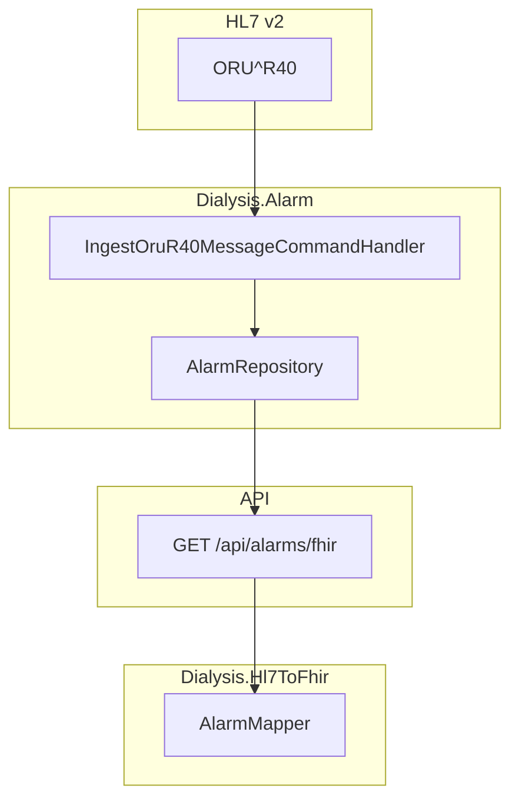
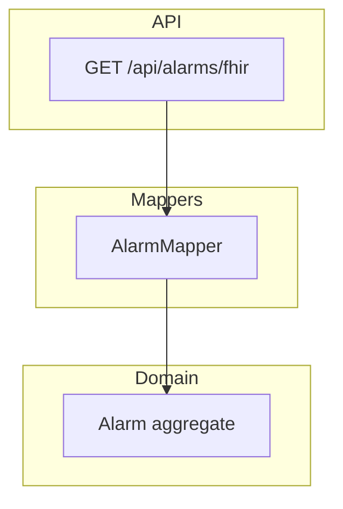

# Phase 4: DetectedIssue (Alarms) – Planning & Status

**Source**: [IMPLEMENTATION_PLAN.md](IMPLEMENTATION_PLAN.md) § 3.4  
**Service**: Dialysis.Alarm, Dialysis.Hl7ToFhir

---

## Workflow Overview

---

## Component Diagram

---

## Resource Structure: DetectedIssue

| Element | Requirement | Implementation |
|---------|-------------|-----------------|
| status | R | final |
| code | R | MDC alarm type; OBX-8 interpretation |
| severity | R | high, moderate, low |
| detail | R | Alarm description |
| identified | O | occurredAt |
| patient | O | Patient reference |

---

## OBX-8 Priority Mapping

| OBX-8 | Meaning | DetectedIssue.severity |
|-------|--------|-------------------------|
| PH | High priority | high |
| PM | Moderate | moderate |
| PL | Low | low |

---

## Implementation Status

| Task | Status | Location |
|------|--------|----------|
| Map ORU^R40 to DetectedIssue | Done | AlarmMapper.ToFhirDetectedIssue |
| Severity from OBX-8 | Done | AlarmMapper.MapPriorityToSeverity |
| Interpretation type (SP/ST/SA) | Done | AlarmMapper |
| Expose via FHIR | Done | GET /api/alarms/fhir |

---

## Key Files

| Component | Path |
|-----------|------|
| AlarmMapper | Services/Dialysis.Hl7ToFhir/AlarmMapper.cs |
