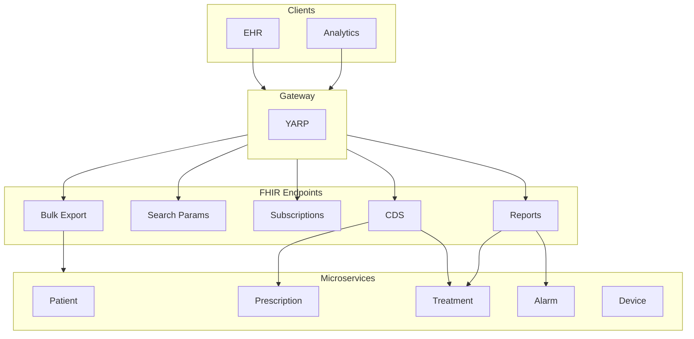

# Phase 6: FHIR API Capabilities – Planning & Status

**Source**: [IMPLEMENTATION_PLAN.md](IMPLEMENTATION_PLAN.md) § 3.6  
**Service**: Dialysis.Fhir, Dialysis.Reports, Dialysis.Cds

---

## Workflow Overview

---

## Capability Overview

| Capability | Endpoint | Status |
|------------|----------|--------|
| Bulk Export | GET /api/fhir/$export | Done |
| Search Parameters | _id, patient, subject, date, etc. | Done |
| Subscriptions | POST/GET/DELETE /api/fhir/Subscription | Done |
| CDS | GET /api/cds/prescription-compliance | Done |
| Reports | GET /api/reports/* | Done |

---

## Bulk Export

| Resource Type | Supported |
|---------------|-----------|
| Patient | Yes |
| Device | Yes |
| ServiceRequest | Yes |
| Procedure | Yes |
| Observation | Yes |
| DetectedIssue | Yes |
| AuditEvent | Yes |

---

## Search Parameters

| Resource | Parameters |
|----------|------------|
| Patient | identifier, name, birthdate |
| Observation | subject, code, date, patient |
| Procedure | subject, patient, date |
| DetectedIssue | patient, date |
| ServiceRequest | subject, patient |

---

## Subscriptions

| Feature | Status |
|---------|--------|
| REST-hook channel | Done |
| Criteria: resource type | Done |
| Notify on Procedure | Done (TreatmentSessionStarted) |
| Notify on Observation | Done (ObservationRecorded) |
| Notify on DetectedIssue | Done (AlarmRaised) |

---

## CDS

| Endpoint | Returns |
|----------|---------|
| GET /api/cds/prescription-compliance?sessionId=X | DetectedIssue if deviation |

---

## Reports

| Endpoint | Returns |
|----------|---------|
| GET /api/reports/sessions-summary | Count, avg duration |
| GET /api/reports/alarms-by-severity | Grouped by severity |
| GET /api/reports/prescription-compliance | Compliance percent |

---

## Implementation Status

| Task | Status | Location |
|------|--------|----------|
| Bulk Export | Done | Dialysis.Fhir.Api |
| Search params | Done | FHIR endpoints |
| Subscriptions CRUD | Done | Dialysis.Fhir.Api |
| Subscription dispatcher | Done | FhirSubscriptionNotifyHandler |
| CDS prescription compliance | Done | Dialysis.Cds.Api |
| Reports aggregation | Done | Dialysis.Reports.Api |
