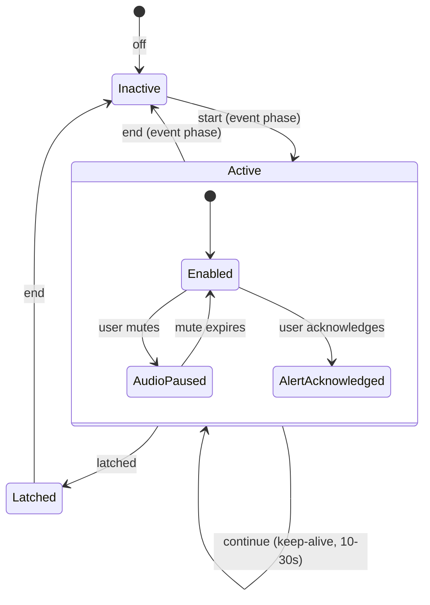

# Dialysis Machine HL7 Implementation Guide – Detailed Implementation Plan

**Source**: Dialysis Machine HL7 Implementation Guide Rev 4.0 (March 2023)
**Scope**: Acute and chronic hemodialysis; NOT peritoneal dialysis
**Standards**: HL7 v2.6, IHE PCD TF 9.0, IHE ITI TF 14.0, ISO/IEEE 11073 (10101, 10201)
**Coding**: MDC (IEEE 11073), UCUM (units), IHE PCD-01 / PCD-04 profiles

---

## 1. IEEE 11073 Containment Model (Device Hierarchy)

Every HL7 message follows the IEEE 11073 containment tree, expressed in OBX-4 dotted notation:

```
MDS (1)
├── Dialysis VMD (1.1)
│   ├── Machine Config Channel (1.1.1)        ── Mode, time, modality, therapy state
│   ├── Anticoagulant Pump Channel (1.1.2)     ── Heparin, bolus, infusion rates
│   ├── Blood Pump Channel (1.1.3)             ── Blood flow, arterial/venous pressure
│   ├── Dialysate Fluid Channel (1.1.4)        ── Conductivity, flow, concentrations
│   ├── Filter Channel (1.1.5)                 ── TMP, dialyzer name, UDI
│   ├── Convective Channel (1.1.6)             ── Replacement fluid (pre/post), HDF/HF
│   ├── Safety Systems Channel (1.1.7)         ── Air detectors, blood leak, self-test
│   ├── Therapy Outcomes Channel (1.1.8)       ── Kt/V, adequacy, completion method
│   └── UF Channel (1.1.9)                     ── Rate, target, actual removed, mode
├── NIBP VMD (1.2)
│   └── NIBP Channel (1.2.1)                   ── Systolic, diastolic, MAP, pulse rate
├── Pulse Oximeter VMD (1.3)
│   └── SpO2 Channel (1.3.1)                   ── SpO2, pulse rate, error
└── Blood Chemistry VMD (1.4)
    └── Blood Chemistry Channel (1.4.1)        ── Hematocrit, hemoglobin, RBV, SpO2
```

**Implementation requirement**: The domain model and parsers must understand this hierarchy. Channels are conditionally present based on therapy mode (e.g., Convective Channel only present for HDF/HF).

---

## 2. Transaction Overview

| Transaction | Message Type | Direction | Purpose |
|---|---|---|---|
| ITI-21 (PDQ) | QBP^Q22 / RSP^K22 | Machine → EMR → Machine | Patient demographics lookup |
| Prescription Query | QBP^D01 / RSP^K22 | Machine → EMR → Machine | Download treatment prescription |
| PCD-01 (DEC) | ORU^R01 | Machine → EMR | Report treatment observations |
| PCD-01 ACK | ACK^R01 | EMR → Machine | Acknowledge treatment data |
| PCD-04 (ACM) | ORU^R40 | Machine → EMR | Report alarms/alerts |
| PCD-04 ACK | ORA^R41 | EMR → Machine | Acknowledge alarm |
| Batch Protocol | FHS/BHS/MSH.../BTS/FTS | Machine → EMR | Capture entire treatment run sheet |

---

## 3. Phase-by-Phase Implementation

### Phase 1: Patient Identification (ITI-21 PDQ)

**Service**: `Dialysis.Patient`

#### 3.1.1 Message Structures

**Query** (QBP^Q22^QBP_Q21):
- MSH (R) – Sending Application = Machine Name + EUI-64
- QPD (R) – `IHE PDQ Query`, search criteria in QPD-3
- RCP (R) – Priority=I, Modality=R

**Response** (RSP^K22^RSP_K21):
- MSH, MSA (R), QAK (R), QPD (R), PID (0..N)

#### 3.1.2 Six Use Cases

| Case | Description | Verification |
|---|---|---|
| 1 | Wrist band scan | No further verification needed |
| 2 | Non-wrist band scan (ID card, barcode) | Caregiver visual verification |
| 3 | External device load (USB/card) | Same as Case 5 |
| 4 | MRN manually entered | PDQ query → display demographics for confirmation |
| 5 | Demographics manually entered | PDQ query → user selects from match list |
| 6 | No demographics available | Machine ID (model/serial) used as patient identifier |

#### 3.1.3 Query Parameter Formats

```
@PID.3^555444222111^^^^MR          ── Query by MRN
@PID.5.1^Smith~@PID.5.2^John      ── Query by name
@PID.3^010199-000H^^^^PN           ── Query by Person Number
```

#### 3.1.4 Response Verification Rules

- MSA-2 must match request MSH-10
- QAK-1 must match request QPD-2
- QAK-3 must match request QPD-1
- If continuation not supported, QAK-6 must be 0

#### 3.1.5 Implementation Tasks

- [x] Parse incoming RSP^K22 responses with 0..N PID segments
- [x] Implement all 6 use cases in the Patient service
- [x] Support PID-3 identifier types: MR, PN, SS, U (Machine Identifier = `model/serial`)
- [x] Validate response integrity (MSA-2, QAK-1, QAK-3 matching)
- [x] Handle `NF` (no data found) and `AE`/`AR` (error/reject) QAK-2 status codes

---

### Phase 2: Prescription Transfer

**Service**: `Dialysis.Prescription`

#### 3.2.1 Query Structure (QBP^D01^QBP_D01)

- QPD-1: `MDC_HDIALY_RX_QUERY^Hemodialysis Prescription Query^MDC`
- QPD-2: Unique query tag (timestamp format `YYYYMMDDHHMMSSZZZ`)
- QPD-3: `@PID.3^{MRN}^^^^MR`

#### 3.2.2 Response Structure (RSP^K22^RSP_K21)

- ORC segment with Order Control = `NW`, Placer Order Number, Response Flag = `N`
- ORC-12 (Ordering Provider) and ORC-14 (Callback Phone) for prescription confirmation
- OBX hierarchy follows IEEE 11073 containment model

#### 3.2.3 Prescription Setting Provenance (OBX-17)

| Code | Meaning | Tracking Rule |
|---|---|---|
| RSET | Remote setting (from EMR) | Downloaded from prescription |
| MSET | Manual setting (user changed) | Once changed, never reverts to RSET |
| ASET | Automatic setting (machine algorithm) | Once changed, never reverts to RSET |

#### 3.2.4 Profile Types (_TBL_17)

| Type | Description | Control Points | Time Array |
|---|---|---|---|
| VENDOR | Manufacturer-specific | N/A (identified by name) | N/A |
| CONSTANT | Single fixed value | 1 value | N/A |
| LINEAR | Start → End linearly | 2 values (start, end) | Optional |
| EXPONENTIAL | Start → End exponentially | 2 values (start, end) | Optional + half-time |
| STEP | Discrete steps | N values | Required if unequal spacing |

**Exponential formula**: `y = (A - B) * e^(-kt) + B`
- Half-time: `k = 0.693 / T_half`
- With time array: `k = 0.003 / T`
- Default: `k = 0.003 / T_treatment`

#### 3.2.5 Profile Facet Objects (Sub-ID level 5)

| ID | Object | Description |
|---|---|---|
| 1 | MDC_HDIALY_PROFILE_TYPE | VENDOR, CONSTANT, LINEAR, EXPONENTIAL, STEP |
| 2 | MDC_HDIALY_PROFILE_VALUE | Numeric array of control points |
| 3 | MDC_HDIALY_PROFILE_TIME | Optional time array for control points |
| 4 | MDC_HDIALY_PROFILE_EXP_HALF_TIME | Exponential half-time (optional) |
| 5 | MDC_HDIALY_PROFILE_NAME | Vendor profile name (format: `Manufacturer^Model^Name`) |

#### 3.2.6 Pumpable Profile Mapping

| Pump | Mode Parameter | Constant Speed Parameter |
|---|---|---|
| Blood | N/A (no profiled speed) | MDC_HDIALY_BLD_PUMP_BLOOD_FLOW_RATE_SETTING |
| Dialysate | MDC_HDIALY_DIALYSATE_FLOW_MODE | MDC_HDIALY_DIALYSATE_FLOW_RATE_SETTING |
| Post-Filter RF | MDC_HDIALY_RF_FLOW_MODE | MDC_HDIALY_RF_POST_FILTER_FLOW_RATE_SETTING |
| Pre-Filter RF | MDC_HDIALY_RF_FLOW_MODE | MDC_HDIALY_RF_PRE_FILTER_FLOW_RATE_SETTING |
| UF | MDC_HDIALY_UF_MODE | MDC_HDIALY_UF_RATE_SETTING |
| Anticoagulant | MDC_HDIALY_ANTICOAG_MODE | MDC_HDIALY_ANTICOAG_INFUS_RATE_SETTING |
| Sodium | MDC_HDIALY_DIALYSATE_CONC_NA_MODE | MDC_HDIALY_DIALYSATE_CONC_NA_SETTING |

#### 3.2.7 Implementation Tasks

- [x] Parse QBP^D01 prescription query
- [x] Build RSP^K22 prescription response with ORC + OBX hierarchy
- [x] Implement all 5 profile types with formula calculations (exponential, linear, step, constant, vendor)
- [x] Parse prescription OBX hierarchy into domain `Prescription` aggregate
- [x] Track setting provenance (RSET/MSET/ASET) throughout treatment lifecycle
- [x] Handle prescription conflict options (Reject, Replace, Ignore)
- [x] Validate response: MSA-2, QAK-1, QAK-3, QPD-3 matching
- [x] Map `Rx Use` column from Table 2 to determine which parameters are prescription-eligible

---

### Phase 3: Treatment Reporting (PCD-01 DEC)

**Service**: `Dialysis.Treatment`

#### 3.3.1 Message Structure (ORU^R01^ORU_R01)

```
MSH  (R)    Message Header – MSH-21 = IHE_PCD_001
PID  (R)    Patient Identification – PID-3 includes Machine ID (type U)
PV1  (R)    Patient Visit – PV1-2 = Unknown class
OBR  (R)    Observation Request – OBR-3 = Therapy_ID, OBR-7 = observation time
{OBX} (R)   Observation Results – IEEE 11073 hierarchy
```

#### 3.3.2 Key Fields

**MSH-3** (Sending Application): `MachineName^EUI64^EUI-64`
- EUI-64 derived from MAC: if MAC = `12-34-56-78-AB-CD` → EUI-64 = `123456FFFE78ABCD`

**MSH-21** (Message Profile): `IHE_PCD_001^IHEPCD^1.3.6.1.4.1.19376.1.6.1.1.1^ISO`

**OBR-3** (Filler Order Number): `{TherapyID}^{MachineName}^{EUI64}^EUI-64`
- TherapyID = `{EUI64}{YYYYMMDDHHMMSS}`

**PID-3**: Always ends with Machine Identifier (`model/serial^^^^U`). Optionally preceded by MRN or PN.

#### 3.3.3 Observation Types and Triggers

| Type | When Sent | Includes |
|---|---|---|
| Status | Initially, terminally, on status change | All mandatory + applicable conditional + supported optional |
| Parameter | Initially, on any parameter change | Changed parameters |
| Identifier | Every message | Device identity (model, serial, SW version, UDI) |
| Blood Pressure | On measurement completion | Systolic, diastolic, MAP, pulse, position |

#### 3.3.4 Event Reporting Methods

**Method 1 – True/False**: Every PCD-01 message includes event state as `T` or `F`. Time = OBX-14 or OBR-7 default.

**Method 2 – Start/Continue/End**: Event lifecycle reported with explicit timestamps in OBX-14.
- `start` – alarm/event begins
- `continue` – ongoing (in periodic messages)
- `end` – alarm/event resolved
- If start time unknown, first report is `continue`

#### 3.3.5 Mode-Dependent Channel Presence

| Mode | Machine | Anticoag | Blood | Fluid | Filter | Convective | Safety | Outcomes | UF |
|---|---|---|---|---|---|---|---|---|---|
| Idle/Service | Yes | No | No | No | No | No | No | No | No |
| HD | Yes | C1 | Yes | Yes | Yes | No | Yes | Yes | Yes |
| HDF | Yes | C1 | Yes | Yes | Yes | Yes | Yes | Yes | Yes |
| HF | Yes | C1 | Yes | No | Yes | Yes | Yes | Yes | Yes |
| IUF | Yes | C1 | Yes | No | Yes | No | Yes | Yes | Yes |

#### 3.3.6 Provenance Tracking (OBX-17)

| Code | Full | Description |
|---|---|---|
| AMEAS | `AMEAS^auto-measurement^MDC` | Automatic measurement by machine |
| MMEAS | `MMEAS^manual-measurement^MDC` | Manual measurement (user triggered) |
| ASET | `ASET^auto-setting^MDC` | Machine-determined setting |
| MSET | `MSET^manual-setting^MDC` | User-changed setting |
| RSET | `RSET^remote-setting^MDC` | EMR prescription setting |

OBX-17 is **required** for settings, **optional** for measurements.

#### 3.3.7 Complete Data Object Catalog (Table 2)

**Machine Config Channel** (1.1.1):

| REFID | Code | Name | Type | UOM | Use |
|---|---|---|---|---|---|
| 158592 | MDC_HDIALY_MACH_TIME | Device Time | DTM | – | M |
| 158593 | MDC_HDIALY_MACH_MODE_DESCRIPTION | Mode Description | ST | – | O |
| 158594 | MDC_HDIALY_MACH_MODE_OF_OPERATION | Mode of Operation | _TBL_01 | – | M |
| 184195 | MDC_TIME_PD_MAINTENANCE_TO_NEXT_SERVICE | PM Time Remaining | NM | hours | O |
| 184199 | MDC_MAINTENANCE_NEXT_SERVICE_DATE | PM Due Date | DTM | – | O |
| 158595 | MDC_HDIALY_MACH_MAINT_TX_REMAIN | PM Treatments Remaining | NM | – | O |
| 158596 | MDC_HDIALY_MACH_BLD_PUMP_ON | Blood Pump On | Bool | – | M |
| 158597 | MDC_HDIALY_MACH_TX_FLUID_BYPASS | Fluid Bypass | Bool | – | M |
| 158598 | MDC_HDIALY_MACH_TX_MODALITY | Treatment Modality | _TBL_02 | – | M |
| 158720 | MDC_HDIALY_MACH_THERAPY_TIME | Elapsed Treatment Time | NM | min | M |
| 158724 | MDC_HDIALY_MACH_TIME_REMAIN | Remaining Treatment Time | NM | min | C10 |
| 188508 | MDC_TEMP_ROOM | Room Temperature | NM | °C | O |

**Blood Pump Channel** (1.1.3):

| REFID | Code | Name | Type | UOM | Use |
|---|---|---|---|---|---|
| 16935956 | MDC_HDIALY_BLD_PUMP_BLOOD_FLOW_RATE_SETTING | Blood Flow Rate Setting | NM | mL/min | M |
| 158740 | MDC_HDIALY_BLD_PUMP_BLOOD_FLOW_RATE | Actual Blood Flow Rate | NM | mL/min | O |
| 158743 | MDC_HDIALY_BLD_PUMP_BLOOD_FLOW_RATE_MEAN | Average Blood Flow Rate | NM | mL/min | O |
| 158744 | MDC_HDIALY_BLD_PRESS_ART | Arterial Pressure | NM | mmHg | M |
| 158604 | MDC_HDIALY_BLD_PUMP_MODE | Blood Pump Mode | _TBL_05 | – | M |
| 198242 | MDC_EVT_HDIALY_BLD_PUMP_STOP | Blood Pump Stop | Bool | – | M |
| 158776 | MDC_HDIALY_BLD_PUMP_PRESS_VEN | Venous Pressure | NM | mmHg | M |
| 158780 | MDC_HDIALY_BLOOD_TEMP_VEN | Venous Temperature | NM | °C | O |
| 158772 | MDC_HDIALY_BLD_PUMP_BLOOD_PROCESSED_TOTAL | Total Blood Processed | NM | L | O |

**UF Channel** (1.1.9):

| REFID | Code | Name | Type | UOM | Use |
|---|---|---|---|---|---|
| 158619 | MDC_HDIALY_UF_MODE | UF Mode | _TBL_13 | – | M |
| 16936252 | MDC_HDIALY_UF_RATE_SETTING | UF Rate Setting | NM | mL/h | M |
| 159036 | MDC_HDIALY_UF_RATE | Actual UF Rate | NM | mL/h | M |
| 159028 | MDC_HDIALY_UF_TARGET_VOL_TO_REMOVE | Target Volume | NM | mL | C11 |
| 159032 | MDC_HDIALY_UF_ACTUAL_REMOVED_VOL | Total Removed | NM | mL | M |
| 198276 | MDC_EVT_HDIALY_UF_RATE_RANGE | UF Rate Out of Range | Bool | – | M |

(See PDF Table 2 for complete catalog of all channels)

#### 3.3.8 Value Tables

| Table | Values |
|---|---|
| _TBL_01 Mode of Operation | PRETX, TX, POSTTX, DIS, IDL, SVC |
| _TBL_02 Treatment Modality | HD, HDF, HF, SLED, IUF, HP |
| _TBL_03 Anticoagulation Mode | BOL, CON, BOLCON, PRO, BOLPRO, NONE |
| _TBL_04 Patient Position | SITTING, STANDING, SUPINE |
| _TBL_05 Blood Pump Mode | 2N, 1N1P, 1N2P |
| _TBL_06 Dialysate Flow Mode | CONST, AUTO, PRO, STBY, NONE |
| _TBL_07 RF Delivery Mode | CONST, PRO, NONE, BOLUS, AUTO |
| _TBL_08 RF Dilution Location | PREF, POSTF, PREF-POSTF, PREP-POSTF, MIDF |
| _TBL_09 Fluid Source | BAG, ONLINE |
| _TBL_10 Plasma Volume Marker | NONE, SYMP, INTER |
| _TBL_11 Plasma Volume Profile | FLAT, GRAD, STEEP |
| _TBL_12 Completion Method | CT, AT, UF, KTV, USER |
| _TBL_13 UF Mode | NONE, CONST-WT, PRO-WT, CONST-WOT, PRO-WOT |
| _TBL_14 Bicarb Delivery Mode | CONST, PRO, NA |
| _TBL_15 Sodium Delivery Mode | CONST, PRO |
| _TBL_16 Anticoag Delivery Location | PREP, PREF, POSTF, PAT |
| _TBL_17 Profile Type | CONST, LINEAR, EXPONENTIAL, STEP, VENDOR |

#### 3.3.9 EMR Response (ACK^R01^ACK)

- MSA-1: `AA` (accepted), `AE` (error), `AR` (rejected)
- On no response → retry → local alert
- On reject → local alert

#### 3.3.10 Implementation Tasks

- [x] Parse full ORU^R01 message with IEEE 11073 hierarchy (MDS → VMD → Channel → Metric)
- [x] Build domain model for all channels: Machine, Anticoag, Blood, Fluid, Filter, Convective, Safety, Outcomes, UF, NIBP, SpO2, Blood Chemistry
- [x] Parse all MDC observation codes from Table 2 (190+ data objects)
- [x] Implement conditional channel presence logic based on therapy mode
- [x] Parse OBX-4 dotted notation into hierarchical structure
- [x] Handle both True/False and Start/Continue/End event reporting
- [x] Track OBX-17 provenance (AMEAS/MMEAS/ASET/MSET/RSET)
- [x] Parse OBX-7 reference ranges (formats: `> lower`, `< upper`, `lower-upper`)
- [x] Parse OBX-6 UCUM units (ml/min, ml/h, mmHg, mS/cm, °C, %, mmol/L, etc.)
- [x] Parse EUI-64 from MSH-3 and Therapy_ID from OBR-3
- [x] Generate ACK^R01 response
- [x] Support HL7 Batch Protocol (FHS/BHS/MSH.../BTS/FTS) for run sheet capture
- [x] Persist treatment session with all observations as time series
- [x] Broadcast real-time observations via SignalR
- [x] Publish integration events via Transponder

#### 3.3.11 Treatment API & Integration (Implemented)

**Time-series API**

- `GET /api/treatment-sessions/{sessionId}/observations?start=&end=` – returns observations in UTC time range
- Query params: `start`, `end` (both optional; default last 4 hours)
- Response: `GetObservationsInTimeRangeResponse` with `TimeSeriesObservationDto[]` (Code, Value, Unit, SubId, ObservedAtUtc, ChannelName)
- Index: `(TreatmentSessionId, ObservedAtUtc)` for efficient range queries

**EUI-64 / Therapy_ID**

- Parsed from MSH-3 (Sending Application) and OBR-3 (Filler Order Number: `TherapyID^Machine^EUI64^EUI-64`)
- Stored on `TreatmentSession.DeviceEui64` and `TreatmentSession.TherapyId`
- Exposed in `GetTreatmentSessionResponse` and `GET /api/treatment-sessions/{sessionId}`

**Transponder integration events**

- `ObservationRecordedIntegrationEvent` published when observations are recorded
- Handler: `ObservationRecordedIntegrationEventHandler` → `IPublishEndpoint.PublishAsync`
- Enables downstream consumers (analytics, FHIR sync, etc.) without tight coupling
- **Transport note**: With SignalR-only, events reach connected clients. For durable pub/sub to external services, add RabbitMQ or Kafka transport.

---

### Phase 4: Alarm Reporting (PCD-04 ACM)

**Service**: `Dialysis.Alarm`

#### 3.4.1 Message Structure (ORU^R40^ORU_R40)

```
MSH  (R)    Message Header – MSH-21 = IHE_PCD_001 (PCD-04 profile)
PID  (R)    Patient Identification
[PV1] (O)   Alert Location
OBR  (R)    Alert Identification – OBR-4 = MDC_EVT_ALARM/MDC_EVT_HI/MDC_EVT_LO
{OBX} (R)   5 OBX segments in strict order:
             OBX-1: Alarm type identification
             OBX-2: Source/limits (value + reference range)
             OBX-3: Event phase (start/continue/end)
             OBX-4: Alarm state (off/inactive/active/latched)
             OBX-5: Activity state (enabled/audio-paused/audio-off/alarm-paused/alarm-off/alert-acknowledged)
```

#### 3.4.2 OBX Structure (5 mandatory segments per alarm)

**OBX #1 – Alarm Type**:
- OBX-3: `196670^MDC_EVT_LO^MDC` (below limit), `196648^MDC_EVT_HI^MDC` (above limit), or `196616^MDC_EVT_ALARM^MDC` (non-numeric)
- OBX-4: `1.0.0.0.1`
- OBX-5: Source identifier from Table 3 (e.g., `158776^MDC_HDIALY_BLD_PUMP_PRESS_VEN^MDC`)
- OBX-8: Interpretation codes – Alarm Priority (`PH`/`PM`/`PL`/`PI`/`PN`/`PU`) + Alarm Type (`SP`/`ST`/`SA`) + optional Abnormality (`L`/`H`)

**OBX #2 – Source/Limits**:
- For numeric: OBX-3 = monitored parameter, OBX-5 = current value, OBX-7 = limits (e.g., `20-400`)
- For non-numeric: OBX-3 = `68480^MDC_ATTR_ALERT_SOURCE^MDC`, OBX-5 = source channel
- OBX-4: source sub-ID with `.2` appended (e.g., `1.1.3.15.2`)

**OBX #3 – Event Phase**:
- OBX-3: `68481^MDC_ATTR_EVENT_PHASE^MDC`
- OBX-4: `1.0.0.0.3`
- OBX-5: `start` | `continue` | `end`

**OBX #4 – Alarm State**:
- OBX-3: `68482^MDC_ATTR_ALARM_STATE^MDC`
- OBX-4: `1.0.0.0.4`
- OBX-5: `off` | `inactive` | `active` | `latched`

**OBX #5 – Activity State**:
- OBX-3: `68483^MDC_ATTR_ALARM_INACTIVATION_STATE^MDC`
- OBX-4: `1.0.0.0.5`
- OBX-5: `enabled` | `audio-paused` | `audio-off` | `alarm-paused` | `alarm-off` | `alert-acknowledged`

#### 3.4.3 Alarm Lifecycle



#### 3.4.4 Mandatory Alarms (Table 3)

| Source | Event | Alert Type | Name |
|---|---|---|---|
| MDC_HDIALY_BLD_PRESS_ART | MDC_EVT_HI | tech high thr | Arterial Pressure High |
| MDC_HDIALY_BLD_PRESS_ART | MDC_EVT_LO | tech low thr | Arterial Pressure Low |
| MDC_HDIALY_BLOOD_PUMP_CHAN | MDC_EVT_HDIALY_BLD_PUMP_STOP | tech | Blood Pump Stop |
| MDC_HDIALY_BLD_PUMP_PRESS_VEN | MDC_EVT_HI | tech high thr | Venous Pressure High |
| MDC_HDIALY_BLD_PUMP_PRESS_VEN | MDC_EVT_LO | tech low thr | Venous Pressure Low |
| MDC_HDIALY_FLUID_CHAN | MDC_EVT_HDIALY_BLOOD_LEAK | tech | Blood Leak |
| MDC_HDIALY_FILTER_TRANSMEMBRANE_PRESS | MDC_EVT_HI | tech high | TMP High |
| MDC_HDIALY_FILTER_TRANSMEMBRANE_PRESS | MDC_EVT_LO | tech low | TMP Low |
| MDC_HDIALY_SAFETY_SYSTEMS_CHAN | MDC_EVT_HDIALY_SAFETY_ART_AIR_DETECT | tech | Arterial Air Detector |
| MDC_HDIALY_SAFETY_SYSTEMS_CHAN | MDC_EVT_HDIALY_SAFETY_VEN_AIR_DETECT | tech | Venous Air Detector |
| MDC_HDIALY_SAFETY_SYSTEMS_CHAN | MDC_EVT_HDIALY_SAFETY_SYSTEM_GENERAL | tech | General System |
| MDC_HDIALY_SAFETY_SYSTEMS_CHAN | MDC_EVT_SELFTEST_FAILURE | tech | Self-Test Failure |
| MDC_HDIALY_UF_CHAN | MDC_EVT_HDIALY_UF_RATE_RANGE | tech range | UF Rate Out of Range |

#### 3.4.5 EMR Response (ORA^R41^ORA_R41)

- MSA-1: AA/AE/AR
- Optional PRT segment for acknowledging user

#### 3.4.5a Alarm API & Integration (Implemented)

**SignalR real-time broadcast**

- `AlarmRecordedMessage` (Transponder `IMessage`) sent when alarms are raised
- `AlarmRaisedTransponderHandler` → `signalr://group/session:{sessionId}` or `signalr://group/device:{deviceId}`
- Hub at `/transponder/transport`, `RequireAuthorization("AlarmRead")`, JWT via `access_token` query

**Transponder integration events**

- `AlarmRaisedIntegrationEvent` published via `IPublishEndpoint.PublishAsync`
- `AlarmRaisedIntegrationEventHandler` → enables downstream consumers (FHIR DetectedIssue, analytics)

#### 3.4.6 Implementation Tasks

- [x] Parse ORU^R40 message with strict 5-OBX structure
- [x] Extract alarm type (MDC_EVT_LO / MDC_EVT_HI / MDC_EVT_ALARM)
- [x] Parse source/limits: numeric (value + reference range) and non-numeric (source channel)
- [x] Parse OBX-8 interpretation codes: priority (PH/PM/PL/PI/PN/PU) + type (SP/ST/SA) + abnormality (L/H)
- [x] Model alarm lifecycle: event phase (start/continue/end) + state (off/inactive/active/latched) + activity (enabled/...); RecordAlarmCommandHandler matches continue/end to existing alarms via GetActiveBySourceAsync
- [x] Implement keep-alive logic (10-30 second periodic messages while active)
- [x] Generate ORA^R41 acknowledgment
- [x] Map all mandatory and conditional alarms from Table 3
- [x] Broadcast alarms in real-time via SignalR
- [x] Publish alarm integration events via Transponder
- [x] Persist alarm history with full state transitions; AddSourceCodeToAlarms migration; IngestOruR40IntegrationTests (parse→record→repository)

#### 3.4.7 Phase 4 Planning & Documentation

- Planning doc: `PHASE4_ALARM_PLAN.md` – workflows, 5-OBX structure, alarm lifecycle, component diagram, Table 3 catalog

---

### Phase 5: HL7-to-FHIR Adapter

**Service**: `Dialysis.Hl7ToFhir`

#### 3.5.1 Resource Mapping

| HL7 v2 Concept | FHIR R4 Resource | Key Mappings |
|---|---|---|
| MSH-3 (Machine ID) | `Device` | UDI, manufacturer, model, serial, SW version |
| PID (Patient demographics) | `Patient` | MRN, name, DOB, gender |
| Prescription (ORC+OBX) | `ServiceRequest` + `DeviceRequest` | Modality, flow rates, UF target, profiles |
| Treatment observations | `Observation` | MDC code → FHIR code, UCUM units, effectiveDateTime |
| Device observations | `Observation` with `focus` → Device | Non-patient observations |
| Alarms | `DetectedIssue` (clinical) / `Observation` (device) | severity, code, detail, evidence |
| Treatment session | `Procedure` | status, performedPeriod, Device reference |
| OBX-17 provenance | `Provenance` | RSET/MSET/ASET |

#### 3.5.2 Code System Mapping

| Source | Target | Example |
|---|---|---|
| MDC (IEEE 11073) | `urn:iso:std:iso:11073:10101` | `158776` → Venous Pressure |
| UCUM (from OBX-6) | `http://unitsofmeasure.org` | `mm[Hg]`, `ml/min`, `mS/cm` |
| LOINC (where applicable) | `http://loinc.org` | Dialysis-related codes |
| SNOMED CT | `http://snomed.info/sct` | Hemodialysis procedure codes |

#### 3.5.3 Implementation Tasks

- [x] Map all MDC observation codes to FHIR Observation.code (MDC + optional LOINC)
- [x] Map UCUM units from OBX-6 to Observation.valueQuantity.unit
- [x] Map alarm priorities (PH/PM/PL) to DetectedIssue.severity (high/moderate/low)
- [x] Map alarm types (SP/ST/SA) to DetectedIssue.code
- [x] Map treatment session lifecycle to Procedure.status (preparation/in-progress/completed)
- [x] Map prescription to ServiceRequest with extensions for UF profiles
- [x] Map device identity to FHIR Device resource (UDI, manufacturer, model, serial)
- [x] Map OBX-17 provenance to FHIR Provenance resource
- [x] Generate FHIR AuditEvent for C5 compliance (message receipt, prescription download, alarm handling)

#### 3.5.4 Phase 5 Planning & Documentation

- Planning doc: `PHASE5_HL7_TO_FHIR_PLAN.md` – resource mapping, code systems, API endpoints

---

## 4. HL7 Segment Reference (Key Fields)

### MSH – Message Header
- MSH-3: Sending Application (`MachineName^EUI64^EUI-64`)
- MSH-7: Date/Time of Message
- MSH-9: Message Type (e.g., `ORU^R01^ORU_R01`)
- MSH-10: Message Control ID (up to 50 chars, supports GUIDs)
- MSH-11: Processing ID (`P`)
- MSH-12: Version ID (`2.6`)
- MSH-21: Message Profile Identifier

### OBR – Observation Request
- OBR-2: Placer Order Number (from prescription ORC-2, if downloaded)
- OBR-3: Filler Order Number (`TherapyID^MachineName^EUI64^EUI-64`)
- OBR-4: Universal Service Identifier (MDS type)
- OBR-7: Observation Date/Time (= MSH-7)
- OBR-25: Result Status (always `F`)

### OBX – Observation Result
- OBX-1: Set ID (sequence number)
- OBX-2: Value Type (ST, NM, DTM, CWE)
- OBX-3: Observation Identifier (`code^text^MDC`)
- OBX-4: Observation Sub-ID (dotted IEEE 11073 hierarchy)
- OBX-5: Observation Value
- OBX-6: Units (`code^text^UCUM`)
- OBX-7: Reference Range (`lower-upper`, `> lower`, `< upper`)
- OBX-8: Interpretation Codes (alarm priority~alarm type~abnormality)
- OBX-11: Observation Result Status (always `F`)
- OBX-14: Date/Time of Observation (for spot checks, events)
- OBX-17: Observation Method (AMEAS/MMEAS/ASET/MSET/RSET)

---

## 5. Private Terms (IEEE 11073 Partition 2)

Manufacturer-specific terms use partition 2, term codes `0xF000`–`0xFFFF`.
- Term value = `partition * 2^16 + term_code`
- REFID format: `MDC{MANUFACTURER}_{DESCRIPTION}` (e.g., `MDCACME_BLOOD_TEMP_SETTING`)
- Manufacturers must disclose meaning of private terms

---

## 6. HL7 Batch Protocol (Appendix A)

For capturing entire treatment as a "run sheet":

```
FHS  ── File Header (same MSH-3 as observations)
  BHS  ── Batch Header
    MSH...OBX  ── First PCD-01 message
    MSH...OBX  ── Second PCD-01 message
    ...
    [ACK messages optionally included]
  BTS  ── Batch Trailer (message count)
FTS  ── File Trailer (batch count)
```

---

## 7. Conditional Logic Reference

| Condition | Description |
|---|---|
| C1 | If Anticoagulation Mode is not NONE |
| C2 | If Anticoagulation Mode includes Bolus |
| C3 | If Anticoagulation Mode includes Continuous or Profile |
| C5 | If Blood Pump Mode is not double needle (2N) |
| C6 | If Mode is HD or HDF |
| C7 | If Mode is HF or HDF and Dilution is Post or Pre-Post |
| C8 | If Mode is HDF or HF |
| C9 | If Replacement Fluid Mode is Bolus |
| C10 | If Completion Method is not NONE |
| C11 | If UF removal includes a target volume |
| C12 | If Mode is HD/HDF and machine knows conductivity |
| C13 | If alarm limit is being set |
| C14 | If Completion Method is Clock Time |
| C15 | If Completion Method is Treatment Time |
| C16 | If Mode is HF or HDF and Dilution is Pre or Pre-Post |
| C17 | If Completion Method is Kt/V |
| C18 | If UF Target or Treatment Time is not present |
| C19 | If UF Mode is not constant |
| C20 | If Anticoagulant Mode is not constant |
| C22 | If Dialysate Mode is not constant |
| C23 | If Sodium Mode is not constant |
| C24 | If RF Delivery Mode is not constant |

---

## 8. Implementation Priority Matrix

| Priority | Phase | Service | Scope | Status |
|---|---|---|---|---|
| P0 | 3 | Treatment | PCD-01 ORU^R01 parser (full hierarchy) | **Implemented** – Full MDC catalog, IEEE 11073 hierarchy, value tables |
| P0 | 4 | Alarm | PCD-04 ORU^R40 parser (5-OBX structure) | **Implemented** – Strict 5-OBX, Table 3 catalog, alarm lifecycle |
| P1 | 5 | Hl7ToFhir | MDC → FHIR Observation mapping | **Implemented** – MDC catalog, LOINC, UCUM, DetectedIssue severity, Procedure status, Provenance |
| P1 | 2 | Prescription | QBP^D01/RSP^K22 + profile parsing | **Implemented** – QbpD01Parser, RspK22Builder, RspK22Parser, 5 profile types, RxUse catalog, conflict policies |
| P2 | 1 | Patient | PDQ (QBP^Q22/RSP^K22) + 6 use cases | Placeholder – needs response parsing |
| P2 | 3 | Treatment | Batch Protocol, time-series API, EUI-64/Therapy_ID, Transponder events | **Implemented** – Hl7BatchParser, GET observations?start=&end=, DeviceEui64/TherapyId, ObservationRecordedIntegrationEvent |
| P3 | 5 | Hl7ToFhir | FHIR AuditEvent, Provenance | **Implemented** |
| P3 | – | All | SignalR real-time broadcasting | **Implemented** – Transponder SignalR hub |

---

## 9. C5 Compliance Touchpoints

- **Message transport**: MLLP default; HTTPS/TLS for non-LAN; no hardcoded credentials
- **Audit**: Log every HL7 message receipt, prescription download, alarm handling
- **Multi-tenancy**: Tenant isolation for multi-site deployments
- **Encryption**: All external traffic over HTTPS; secrets in Key Vault
- **Access control**: JWT-based API authentication for all business endpoints
