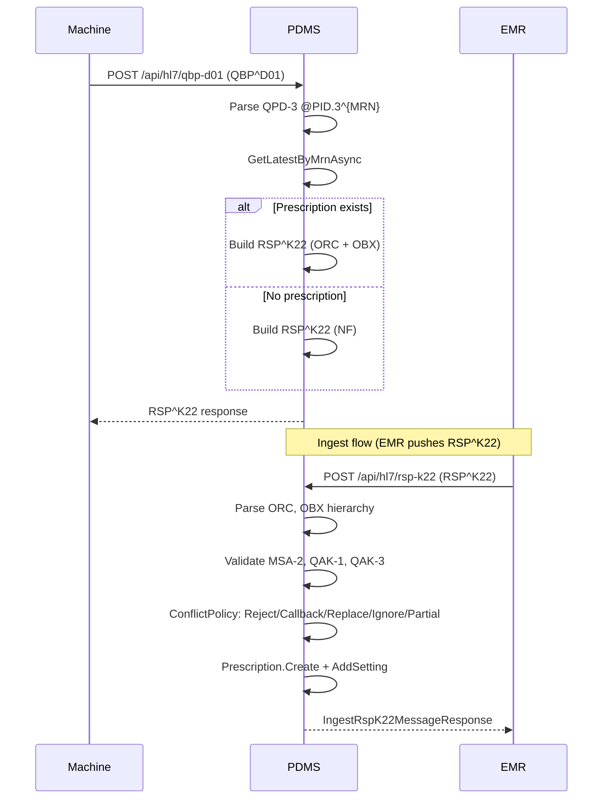
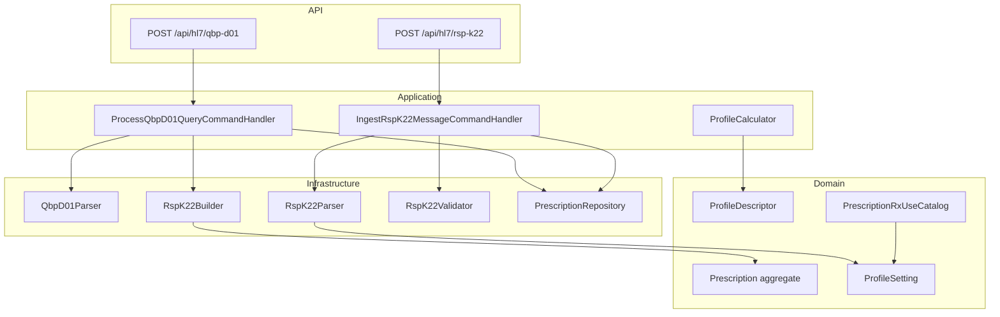

# Phase 2: Prescription Transfer – Planning & Status

**Source**: IMPLEMENTATION_PLAN.md § 3.2  
**Service**: Dialysis.Prescription

---

## Workflow Overview

---

## Component Diagram

---

## Implementation Status

| Task | Status | Location |
|------|--------|----------|
| Parse QBP^D01 | ✅ | QbpD01Parser, QbpD01ParseResult |
| Build RSP^K22 with ORC + OBX | ✅ | RspK22Builder |
| 5 profile types (formulas) | ✅ | ProfileCalculator (CONSTANT, LINEAR, EXPONENTIAL, STEP, VENDOR) |
| Parse OBX → Prescription | ✅ | RspK22Parser, IngestRspK22MessageCommandHandler |
| Track RSET/MSET/ASET | ✅ | OBX-17 in ProfileSetting.Provenance |
| Conflict options | ✅ | PrescriptionConflictPolicy (Reject, Callback, Replace, Ignore, Partial) – config via `PrescriptionIngestion:ConflictPolicy` |
| Validate MSA-2, QAK-1, QAK-3 | ✅ | RspK22Validator |
| Map Rx Use (Table 2) | ✅ | PrescriptionRxUseCatalog |
| OBX sub-ID (IEEE 11073) | ✅ | MdcToObxSubIdCatalog, RspK22Builder fallback |

---

## Profile Formulas (ProfileCalculator)

| Type | Formula |
|------|---------|
| CONSTANT | y = A |
| LINEAR | y = A + (B-A)·t/T |
| EXPONENTIAL | y = (A-B)·e^(-kt) + B; k = 0.693/T_half or 0.003/T |
| STEP | Value at current time step |
| VENDOR | Not computable; returns first value |

---

## Pumpable Profile Mapping (from IMPLEMENTATION_PLAN § 3.2.6)

| Pump | Mode Parameter | Constant/Setting Parameter |
|------|----------------|----------------------------|
| Blood | N/A | MDC_HDIALY_BLD_PUMP_BLOOD_FLOW_RATE_SETTING |
| Dialysate | MDC_HDIALY_DIALYSATE_FLOW_MODE | MDC_HDIALY_DIALYSATE_FLOW_RATE_SETTING |
| Post-Filter RF | MDC_HDIALY_RF_FLOW_MODE | MDC_HDIALY_RF_POST_FILTER_FLOW_RATE_SETTING |
| UF | MDC_HDIALY_UF_MODE | MDC_HDIALY_UF_RATE_SETTING |
| Anticoagulant | MDC_HDIALY_ANTICOAG_MODE | MDC_HDIALY_ANTICOAG_INFUS_RATE_SETTING |
| Sodium | MDC_HDIALY_DIALYSATE_CONC_NA_MODE | MDC_HDIALY_DIALYSATE_CONC_NA_SETTING |

---

## Gaps & Follow-ups (Resolved)

1. **QAK segment order**: Fixed. RspK22Builder now outputs QAK-1=QueryTag, QAK-2=Status, QAK-3=QueryName per HL7.
2. **Extend PrescriptionRxUseCatalog**: Added pump parameters (Dialysate, RF, Anticoagulant, Sodium) from §3.2.6.
3. **Partial Accept**: **Done** – Partial policy merges new settings (by MDC code) into existing prescription. Callback policy returns 409 with `callbackPhone` for prescriber contact.
