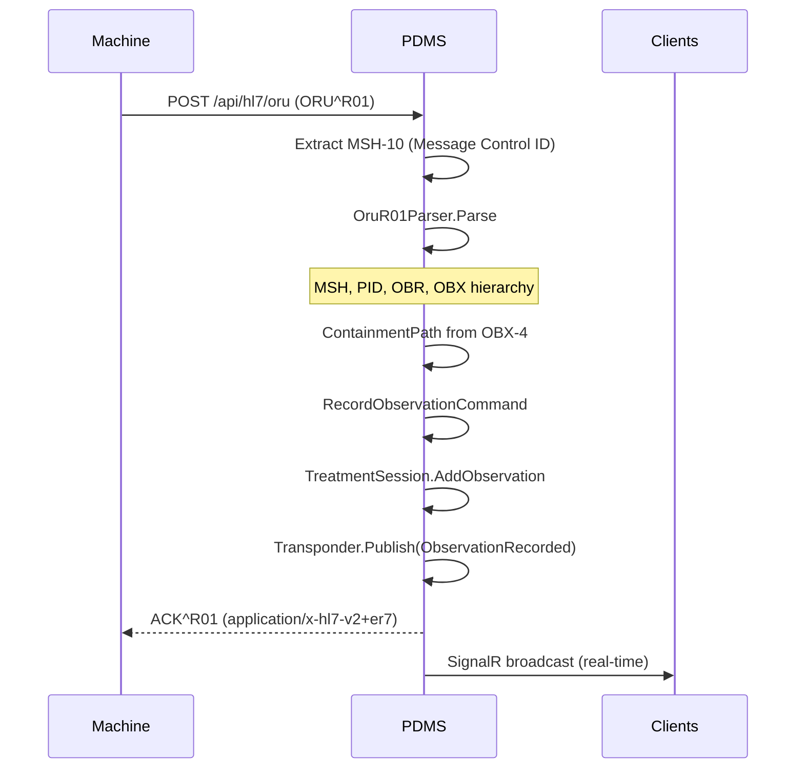
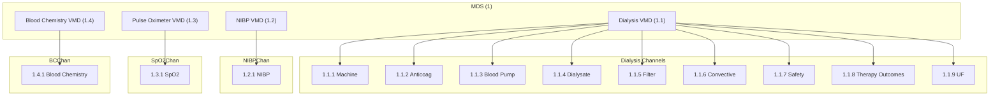
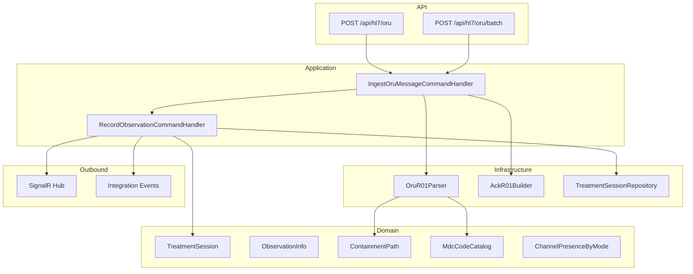
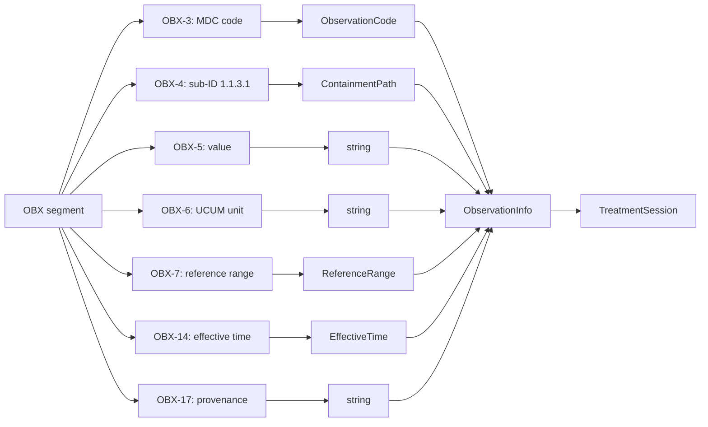

# Phase 3: Treatment Reporting (PCD-01 DEC) – Planning & Status

**Source**: IMPLEMENTATION_PLAN.md § 3.3  
**Service**: Dialysis.Treatment

---

## Workflow Overview

---

## IEEE 11073 Containment Hierarchy

---

## Component Diagram

---

## Conditional Channel Presence by Therapy Mode

| Mode | Machine | Anticoag | Blood | Fluid | Filter | Convective | Safety | Outcomes | UF |
|------|---------|----------|-------|-------|--------|------------|--------|----------|-----|
| Idle/Service | Yes | No | No | No | No | No | No | No | No |
| HD | Yes | C1 | Yes | Yes | Yes | No | Yes | Yes | Yes |
| HDF | Yes | C1 | Yes | Yes | Yes | Yes | Yes | Yes | Yes |
| HF | Yes | C1 | Yes | No | Yes | Yes | Yes | Yes | Yes |
| IUF | Yes | C1 | Yes | No | Yes | No | Yes | Yes | Yes |

*C1 = conditional (optional per facility)*

---

## Data Flow: ORU^R01 → Observation

---

## Implementation Status

| Task | Status | Notes |
|------|--------|-------|
| Parse full ORU^R01 with IEEE 11073 hierarchy | Done | OruR01Parser, ContainmentPath |
| Domain model for all channels | Done | ContainmentPath.GetChannelName, MdcCodeCatalog |
| Parse MDC codes from Table 2 | Partial | MDC_DIA_* present; MDC_HDIALY_* aliases added |
| Conditional channel presence | Done | ChannelPresenceByMode utility |
| Parse OBX-4 dotted notation | Done | ContainmentPath.TryParse |
| True/False and Start/Continue/End event reporting | Done | EventPhase (OBR-12), OBX-11 ResultStatus |
| Track OBX-17 provenance | Done | ObservationInfo.Provenance |
| Parse OBX-7 reference ranges | Done | ReferenceRangeParser |
| Parse OBX-6 UCUM units | Done | ExtractUcumUnit |
| Parse EUI-64 and Therapy_ID | Done | MSH-3, OBR-3 |
| Generate ACK^R01 | Done | AckR01Builder, returned on POST /api/hl7/oru |
| Batch Protocol | Done | IngestOruBatch |
| Persist + SignalR + Transponder | Done | RecordObservation, hub, integration events |

---

## Provenance Codes (OBX-17)

| Code | Meaning |
|------|---------|
| AMEAS | Automatic measurement |
| MMEAS | Manual measurement |
| ASET | Automatic setting |
| MSET | Manual setting |
| RSET | Remote (EMR) setting |

---

## Key Files

| Component | Path |
|-----------|------|
| Parser | `Dialysis.Treatment.Infrastructure/Hl7/OruR01Parser.cs` |
| ContainmentPath | `Dialysis.Treatment.Application/Domain/ValueObjects/ContainmentPath.cs` |
| MdcCodeCatalog | `Dialysis.Treatment.Application/Domain/Hl7/MdcCodeCatalog.cs` |
| AckR01Builder | `Dialysis.Treatment.Infrastructure/Hl7/AckR01Builder.cs` |
| Hl7Controller | `Dialysis.Treatment.Api/Controllers/Hl7Controller.cs` |
