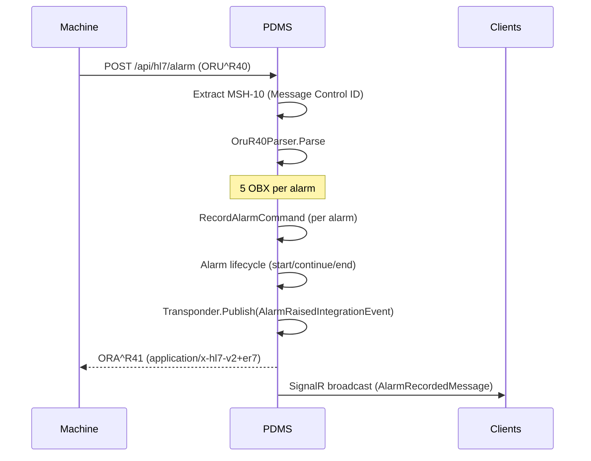
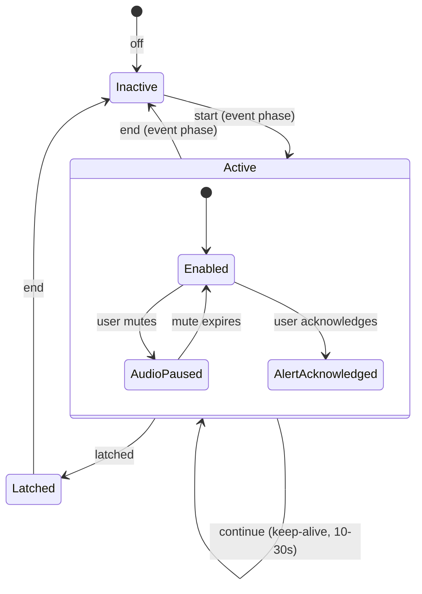
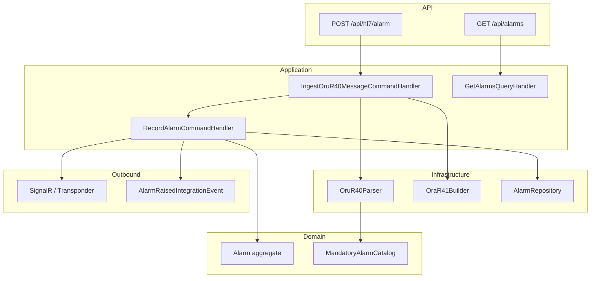

# Phase 4: Alarm Reporting (PCD-04 ACM) – Planning & Status

**Source**: IMPLEMENTATION_PLAN.md § 3.4  
**Service**: Dialysis.Alarm

---

## Workflow Overview

---

## ORU^R40 Message Structure (5 OBX per Alarm)

```mermaid
flowchart LR
    subgraph OBX1["OBX #1"]
        A1[Alarm Type]
        A2[Source Identifier]
        A3[OBX-8: Priority, Type]
    end

    subgraph OBX2["OBX #2"]
        B1[Source/Limits]
        B2[Value + Range]
    end

    subgraph OBX3["OBX #3"]
        C1[Event Phase]
        C2[start/continue/end]
    end

    subgraph OBX4["OBX #4"]
        D1[Alarm State]
        D2[off/inactive/active/latched]
    end

    subgraph OBX5["OBX #5"]
        E1[Activity State]
        E2[enabled/audio-paused/...]
    end

    OBX1 --> OBX2 --> OBX3 --> OBX4 --> OBX5
```

---

## Alarm Lifecycle

---

## Component Diagram

---

## Implementation Status

| Task | Status | Notes |
|------|--------|-------|
| Parse ORU^R40 with strict 5-OBX structure | Done | OruR40Parser, groups of 5 OBX |
| Extract alarm type (MDC_EVT_LO/HI/ALARM) | Done | OBX-1 field 3 (CE code) |
| Parse source/limits (numeric + non-numeric) | Done | OBX-2 fields 5, 6, 7 |
| Parse OBX-8 interpretation codes | Done | Priority, type, abnormality |
| Model alarm lifecycle | Done | EventPhase, AlarmState, ActivityState |
| Keep-alive (continue messages) | Done | RecordAlarmCommandHandler matches via GetActiveBySourceAsync |
| Generate ORA^R41 acknowledgment | Done | OraR41Builder, returned on POST |
| Map Table 3 mandatory alarms | Done | MandatoryAlarmCatalog (12 entries) |
| Broadcast via SignalR | Done | AlarmRaisedTransponderHandler |
| Publish integration events | Done | AlarmRaisedIntegrationEventHandler |
| Persist alarm history | Done | IAlarmRepository, state transitions |

---

## Table 3 Catalog (Mandatory Alarms)

| Source | Event | Display Name |
|--------|-------|--------------|
| MDC_HDIALY_BLD_PRESS_ART | MDC_EVT_HI | Arterial Pressure High |
| MDC_HDIALY_BLD_PRESS_ART | MDC_EVT_LO | Arterial Pressure Low |
| MDC_HDIALY_BLOOD_PUMP_CHAN | MDC_EVT_HDIALY_BLD_PUMP_STOP | Blood Pump Stop |
| MDC_HDIALY_BLD_PUMP_PRESS_VEN | MDC_EVT_HI | Venous Pressure High |
| MDC_HDIALY_BLD_PUMP_PRESS_VEN | MDC_EVT_LO | Venous Pressure Low |
| MDC_HDIALY_FLUID_CHAN | MDC_EVT_HDIALY_BLOOD_LEAK | Blood Leak |
| MDC_HDIALY_FILTER_TRANSMEMBRANE_PRESS | MDC_EVT_HI | TMP High |
| MDC_HDIALY_FILTER_TRANSMEMBRANE_PRESS | MDC_EVT_LO | TMP Low |
| MDC_HDIALY_SAFETY_SYSTEMS_CHAN | MDC_EVT_HDIALY_SAFETY_ART_AIR_DETECT | Arterial Air Detector |
| MDC_HDIALY_SAFETY_SYSTEMS_CHAN | MDC_EVT_HDIALY_SAFETY_VEN_AIR_DETECT | Venous Air Detector |
| MDC_HDIALY_SAFETY_SYSTEMS_CHAN | MDC_EVT_HDIALY_SAFETY_SYSTEM_GENERAL | General System |
| MDC_HDIALY_SAFETY_SYSTEMS_CHAN | MDC_EVT_SELFTEST_FAILURE | Self-Test Failure |
| MDC_HDIALY_UF_CHAN | MDC_EVT_HDIALY_UF_RATE_RANGE | UF Rate Out of Range |

---

## Key Files

| Component | Path |
|-----------|------|
| Parser | `Dialysis.Alarm.Infrastructure/Hl7/OruR40Parser.cs` |
| ORA^R41 Builder | `Dialysis.Alarm.Infrastructure/Hl7/OraR41Builder.cs` |
| Table 3 Catalog | `Dialysis.Alarm.Application/Domain/Hl7/MandatoryAlarmCatalog.cs` |
| Hl7Controller | `Dialysis.Alarm.Api/Controllers/Hl7Controller.cs` |
| RecordAlarmCommandHandler | `Dialysis.Alarm.Application/Features/RecordAlarm/RecordAlarmCommandHandler.cs` |

