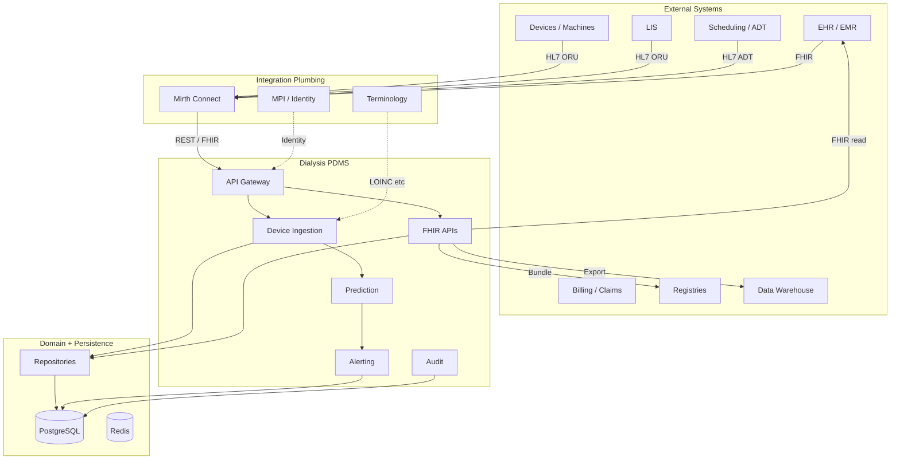

# Ecosystem Preparation Plan

A phased plan to build the Dialysis PDMS as part of the healthcare IT ecosystem. Two pillars: **(1)** solid internal domain model and workflows; **(2)** reliable interfaces to external systems.

---

## System Architecture Diagram



**Legend:**
- **Solid arrows** – Primary data flow
- **Dashed arrows** – Supporting / optional flow
- **External systems** – EHR, ADT, LIS, devices, billing, registries, warehouse
- **Integration plumbing** – Mirth, MPI, terminology
- **PDMS** – Gateway, ingestion, FHIR APIs, prediction, alerting, audit
- **Domain** – Repositories, PostgreSQL, Redis

### Phases Overlay

| Phase | Components in diagram |
|-------|------------------------|
| **Phase 0: Foundation** | REPO, PG, REDIS, domain model |
| **Phase 1: Inbound** | DEV, LIS, ADT → MIRTH → GW → DI |
| **Phase 2: Outbound** | FHIR_API → EHR, REG, DW |
| **Phase 3: Clinical** | PRED, ALERT, AUDIT |
| **Phase 4: Plumbing** | MIRTH config, MPI, TERM |

---

## Guiding Principles

1. **Domain first** – Get the dialysis domain model right before heavy integration.
2. **Interfaces over implementations** – Define clear contracts (API, HL7, FHIR) and adapt as vendors differ.
3. **Incremental integration** – Add one system type at a time; validate before the next.
4. **Standards where possible** – FHIR, HL7 v2, LOINC, SNOMED reduce custom mapping.

---

## Phase 0: Foundation (Internal Domain)

**Goal:** Implement core domain model and persistence for dialysis workflows.

| Step | Deliverable | Status |
|------|-------------|--------|
| 0.1 | Domain entities: Patient, Observation, Session (stub) | ✅ Patient, Observation |
| 0.2 | Value objects: PatientId, LoincCode, UnitOfMeasure, etc. | ✅ |
| 0.3 | Repositories: Patient, Observation (CRUD) | ✅ |
| 0.4 | Multi-tenancy (X-Tenant-Id, per-tenant isolation) | ✅ |
| 0.5 | Domain events (ObservationCreated) | ✅ |
| 0.6 | Session aggregate (start/stop, UF, access site) | ✅ |

**Dependencies:** None.  
**Exit criteria:** Domain model supports vitals and basic session concepts; events publish correctly.

---

## Phase 1: Inbound Interfaces (Data Receivers)

**Goal:** Receive data from devices, lab, and scheduling/ADT.

### 1.1 Device / Machine Connectivity

| Step | Deliverable | Status |
|------|-------------|--------|
| 1.1.1 | Vitals ingest API (JSON) | ✅ `POST /api/v1/vitals/ingest` |
| 1.1.2 | Raw HL7 ORU stream (Mirth → PDMS) | ✅ `POST /api/v1/hl7/stream` |
| 1.1.3 | Mirth destination config (HL7 → JSON → PDMS) | ✅ [docs/mirth/](mirth/README.md) |
| 1.1.4 | Machine-specific adapters (if vendor-specific formats) | 🔲 Future (vendor-specific) |

### 1.2 Lab (LIS)

| Step | Deliverable | Status |
|------|-------------|--------|
| 1.2.1 | HL7 ORU for lab results (OBX with LOINC) | ✅ Via HL7 stream |
| 1.2.2 | Lab result→Observation mapping (LOINC, value, unit) | ✅ In handler |
| 1.2.3 | Lab order status (ORU with OBR) | ✅ OBR parsed; lab_order_status table |

### 1.3 ADT / Scheduling (Patient Demographics, Encounters)

| Step | Deliverable | Status |
|------|-------------|--------|
| 1.3.1 | Patient create (REST, FHIR) | ✅ |
| 1.3.2 | HL7 ADT A04/A08 (register/update patient) | ✅ Via HL7 stream |
| 1.3.3 | Encounter/visit sync (if needed for sessions) | ✅ Session.EncounterId |

**Dependencies:** Phase 0.  
**Exit criteria:** Vitals and lab results flow from devices/lab into PDMS; patient create works.

---

## Phase 2: Outbound Interfaces (Data Producers)

**Goal:** Expose PDMS data for EHR, registries, and analytics.

### 2.1 FHIR APIs (EHR, Interoperability)

| Step | Deliverable | Status |
|------|-------------|--------|
| 2.1.1 | Patient read/create (FHIR R4) | ✅ |
| 2.1.2 | Observation read/search (FHIR R4) | ✅ |
| 2.1.3 | FHIR CapabilityStatement (metadata) | ✅ `GET /fhir/r4/metadata` |
| 2.1.4 | Procedure (dialysis session) resource | ✅ `GET /fhir/r4/Procedure` |
| 2.1.5 | Bundle export for bulk exchange | ✅ `GET /fhir/r4/Patient/{id}/everything` |

### 2.2 Registries / Quality Reporting

| Step | Deliverable | Status |
|------|-------------|--------|
| 2.2.1 | NHSN / quality bundle (de-identified) | ✅ `GET /api/v1/quality/bundle` |
| 2.2.2 | Vascular access registry fields | ✅ Vascular access API + entity |
| 2.2.3 | De-identification service integration | ✅ IDeidentificationService; NoOp default |

### 2.3 Analytics / Data Warehouse

| Step | Deliverable | Status |
|------|-------------|--------|
| 2.3.1 | Cohort queries, exports | ✅ `GET /api/v1/cohorts/query`, `/cohorts/export` |
| 2.3.2 | Event-driven export (e.g. Kafka, ETL) | ✅ Transponder + Azure Service Bus; IEventExportPublisher |

**Dependencies:** Phase 0, 1.  
**Exit criteria:** EHR can read Patient and Observation via FHIR; registries path scoped.

---

## Phase 3: Clinical Workflows (Domain Logic)

**Goal:** Add clinical value: prediction, alerts, session management.

| Step | Deliverable | Status |
|------|-------------|--------|
| 3.1 | Hypotension risk prediction (rule-based or ML) | ✅ |
| 3.2 | Alerting (create, acknowledge, notify) | ✅ create via events; `GET/POST /api/v1/alerts` |
| 3.3 | Session lifecycle (start, vitals, stop, UF) | ✅ `POST/PUT/GET /api/v1/sessions` |
| 3.4 | Audit / consent logging | ✅ `POST/GET /api/v1/audit` |

**Dependencies:** Phase 0, 1.  
**Exit criteria:** Alerts fire on risk; sessions tracked.

---

## Phase 4: Integration Plumbing

**Goal:** Production-ready integration with external systems.

### 4.1 Integration Engine (Mirth)

| Step | Deliverable | Status |
|------|-------------|--------|
| 4.1.1 | Mirth channels: HL7 → PDMS REST | ✅ [docs/mirth/](mirth/README.md) + error handling |
| 4.1.2 | PDMS → EHR FHIR (outbound) | ✅ `POST /api/v1/outbound/ehr/push/{patientId}` (Integration:EhrFhirBaseUrl) |
| 4.1.3 | Error handling, retries, DLQ | ✅ MSH-10 idempotency; `failed_hl7_messages` DLQ; `GET/POST /api/v1/hl7/failed`, retry |

### 4.2 Identity / MPI

| Step | Deliverable | Status |
|------|-------------|--------|
| 4.2.1 | Patient identifier resolution (MPI or local) | ✅ `IPatientIdentifierResolver`; `LocalPatientIdentifierResolver` |
| 4.2.2 | Cross-system ID mapping | ✅ `id_mappings` table; `POST/GET /api/v1/id-mappings` |

### 4.3 Terminology

| Step | Deliverable | Status |
|------|-------------|--------|
| 4.3.1 | LOINC mapping for vitals/lab | ✅ In code |
| 4.3.2 | Terminology service (external) | ✅ `ITerminologyService`; `NoOpTerminologyService` (extensible) |
| 4.3.3 | ICD-10, SNOMED for diagnoses | 🔲 When needed |

### 4.4 Billing / Claims (X12)

| Step | Deliverable | Status |
|------|-------------|--------|
| 4.4.1 | 837P/837I (claims) integration | 🔲 Out of initial scope |
| 4.4.2 | 270/271 (eligibility) | 🔲 Out of initial scope |

**Dependencies:** Phases 1–3.  
**Exit criteria:** Mirth reliably routes HL7 to PDMS; terminology and identity paths defined.

---

## Roadmap Summary

| Phase | Focus | Next Action |
|-------|-------|-------------|
| **0** | Domain model | Add Session aggregate |
| **1** | Inbound | Document Mirth config; optionally ADT |
| **2** | Outbound | CapabilityStatement; Procedure resource |
| **3** | Clinical | Prediction, Alerting, Session lifecycle |
| **4** | Plumbing | Mirth production config; MPI if needed |

---

## Prioritized Next Steps

Ordered by impact, dependency, and effort. Do in this sequence unless you have a specific constraint.

| # | Item | Phase | Why first |
|---|------|-------|-----------|
| **1** | Session aggregate | 0.6 | Foundation for Procedure resource and session lifecycle. Unlocks later work. |
| **2** | Hypotension prediction (rule-based) | 3.1 | `ObservationCreated` already fires; add consumer. Clinical differentiator. |
| **3** | Alerting (create, acknowledge) | 3.2 | Consumes `HypotensionRiskRaised`. High clinical value. Dialysis.Alerting exists. |
| **4** | Mirth config docs / example | 1.1.3 | Enables real HL7 testing. Low effort, high integration value. |
| **5** | FHIR CapabilityStatement | 2.1.3 | Standard metadata for FHIR servers. Quick win; EHR clients expect it. |
| **6** | HL7 ADT A04/A08 | 1.3.2 | Patient sync from scheduling. Completes inbound patient flow. |
| **7** | Session lifecycle API | 3.3 | Start/stop session, UF tracking. Depends on Session aggregate. |
| **8** | Audit / consent logging | 3.4 | Compliance. Can run in parallel or defer. |

### Dependency chain

```
Session aggregate → Procedure resource, Session lifecycle
ObservationCreated → Prediction → HypotensionRiskRaised → Alerting
```

### Quick wins (if you want fast progress)

1. **Mirth config docs** – Example channel: HL7 source → HTTP destination → `POST /api/v1/hl7/stream`
2. **FHIR CapabilityStatement** – Static `GET /fhir/r4/metadata` returning CapabilityStatement JSON

---

## Risk Mitigation

| Risk | Mitigation |
|------|------------|
| Vendor-specific HL7 | Use integration engine for transforms; PDMS receives normalized format |
| EHR FHIR differences | Profile-driven; validate against implementation guide |
| Patient identity mismatch | MPI or deterministic ID mapping; document in interface spec |
| Terminology drift | Centralize mappings; version LOINC/SNOMED usage |

---

## References

- [SYSTEM-ARCHITECTURE.md](SYSTEM-ARCHITECTURE.md) – **System architecture diagram + prioritized next steps**
- [GETTING-STARTED.md](GETTING-STARTED.md) – Onboarding path
- [LEARNING-PATH.md](LEARNING-PATH.md) – **Recommended learning path** (5 phases: HL7, dialysis workflows, FHIR, SMART, .NET) with codebase mappings
- [PLATFORM-ARCHITECTURE.md](PLATFORM-ARCHITECTURE.md) – **Concrete platform architecture** (channels, core services, tech stack, integration patterns, Transponder Sagas orchestration)
- [ENVIRONMENT-SPECIFIC-PROPOSAL.md](ENVIRONMENT-SPECIFIC-PROPOSAL.md) – **Environment-driven design** (Germany/EU vs US, minimum dataset, FHIR IG, .NET structure)
- [healthcare_systems_&_dialysis_architecture.md](../src/Dialysis/healthcare_systems_&_dialysis_architecture.md) – Theory and current architecture
- [PATIENT-MANAGEMENT.md](features/PATIENT-MANAGEMENT.md) – Patient APIs
- [FHIR-LAYER.md](features/FHIR-LAYER.md) – FHIR endpoints
