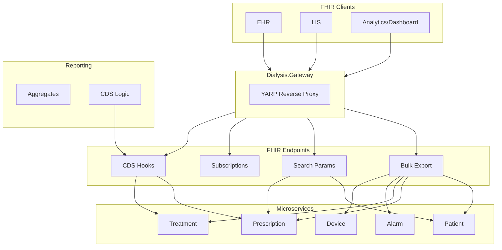
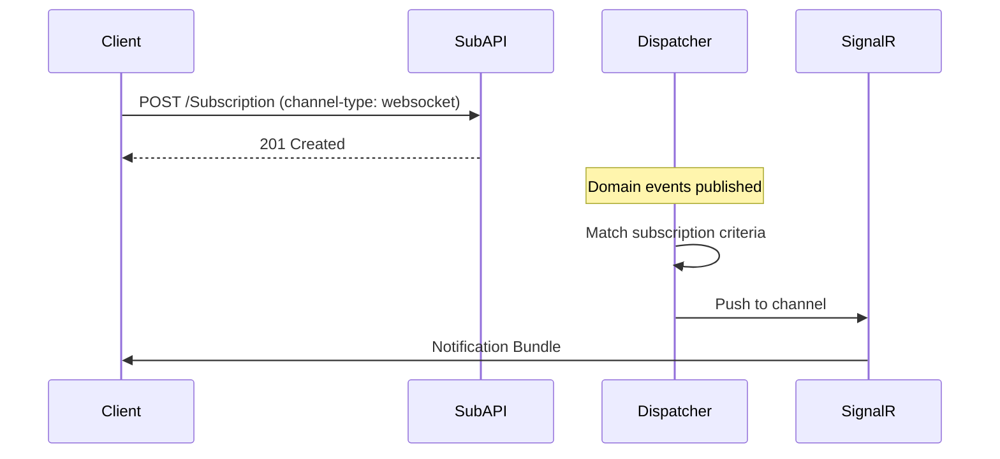
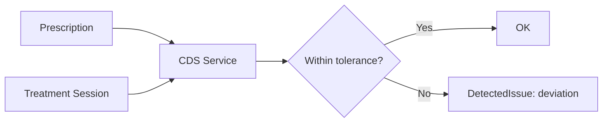
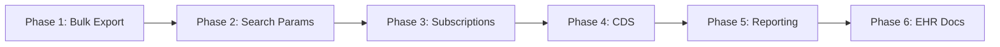

# FHIR Interoperability and Domain Features Plan

**Created**: 2025-02-18  
**Context**: Extend FHIR coverage, add subscriptions/bulk export, clinical decision support, reporting, and EHR/LIS integration.

---

## 1. Current FHIR State

| Resource | Endpoint | Service |
|----------|----------|---------|
| Patient | `GET /api/patients/mrn/{mrn}/fhir` | Patient |
| Device | `GET /api/devices/{id}/fhir` | Device |
| ServiceRequest (Prescription) | `GET /api/prescriptions/{mrn}/fhir` | Prescription |
| Bundle (Procedure + Observations) | `GET /api/treatment-sessions/{sessionId}/fhir` | Treatment |
| DetectedIssue (Alarms) | `GET /api/alarms/fhir` | Alarm |
| AuditEvent | `GET /api/audit-events` | Prescription (shared) |

**Implemented**: Bulk export (`/api/fhir/$export`), search params (Patient, Prescription, Treatment, Alarm, Device), Subscription CRUD (`/api/fhir/Subscription`), CDS (`/api/cds/prescription-compliance`), Reports (`/api/reports/sessions-summary`, `/api/reports/alarms-by-severity`).

---

## 2. Architecture Overview



---

## 3. Implementation Phases

### Phase 1: FHIR Bulk Export (Foundation)

**Goal**: `GET /$export` – FHIR R4 Bulk Data Access (flat NDJSON).

```mermaid
sequenceDiagram
    participant Client
    participant Gateway
    participant BulkExport
    participant Services

    Client->>Gateway: GET /api/fhir/$export?_type=Patient,Observation
    Gateway->>BulkExport: Forward + X-Tenant-Id
    BulkExport->>Services: Query each resource type
    Services-->>BulkExport: Stream NDJSON
    BulkExport-->>Client: 202 Accepted + Content-Location
    Note over Client,BulkExport: Async; poll status or stream
```

**Scope**:
- New endpoint: `GET /api/fhir/$export` (or `/api/fhir/export`)
- Supported `_type`: Patient, Device, ServiceRequest, Procedure, Observation, DetectedIssue, AuditEvent
- Tenant-scoped; JWT required
- Returns NDJSON stream or manifest (Bulk Data spec)

### Phase 2: FHIR Search Params

**Goal**: Add `_id`, `patient`, `subject`, `date` to relevant resources.

| Resource | Search Params |
|----------|---------------|
| Patient | `identifier`, `name`, `birthdate` |
| Observation | `subject`, `code`, `date`, `patient` |
| Procedure | `subject`, `patient`, `date` |
| DetectedIssue | `patient`, `date` |
| ServiceRequest | `subject`, `patient` |

**Scope**: Extend existing FHIR endpoints with query params; map to repository filters.

### Phase 3: FHIR Subscriptions

**Goal**: Real-time updates per FHIR Subscription (R4 Backport or R5).



**Scope**:
- Subscription resource CRUD
- Channel: rest-hook (callback URL) or websocket (SignalR)
- Criteria: resource type, patient, date filters
- On Observation/Alarm/Procedure record → evaluate subscriptions → notify

### Phase 4: Clinical Decision Support (CDS)

**Goal**: Validate prescription vs treatment; flag deviations.



**Rules**:
- Blood flow: treatment vs prescribed (e.g. ±10%)
- UF target: removed vs prescribed
- UF rate: session rate vs prescribed

**Scope**:
- `GET /api/cds/prescription-compliance?sessionId=X` – returns DetectedIssue if deviation
- Or CDS Hooks: `POST /cds-services/prescription-compliance` (prefetch prescription + session)

### Phase 5: Reporting and Analytics

**Goal**: Aggregate endpoints for dashboards.

| Endpoint | Returns |
|----------|---------|
| `GET /api/reports/sessions-summary` | Count, avg duration by date range |
| `GET /api/reports/alarms-by-severity` | Grouped by severity, date |
| `GET /api/reports/prescription-compliance` | % sessions within tolerance |

**Scope**: New reporting module or controllers in Treatment/Alarm/Prescription APIs.

### Phase 6: EHR/LIS Integration

**Goal**: Document integration patterns; extend Mirth channels.

- **EHR**: Patient sync (PDQ), Prescription ingest (RSP^K22), Document references (future)
- **LIS**: Lab results (future – Observation with LOINC), not in initial scope

**Scope**: Update `MIRTH-INTEGRATION-GUIDE.md` with EHR flows; no new code for LIS initially.

---

## 4. Suggested Execution Order



| Order | Phase | Rationale |
|-------|-------|-----------|
| 1 | Bulk Export | Foundational for analytics/EHR integration |
| 2 | Search Params | Enhances existing read endpoints |
| 3 | Subscriptions | Real-time interoperability |
| 4 | CDS | Domain value; uses existing data |
| 5 | Reporting | Dashboards; builds on bulk/search |
| 6 | EHR Docs | Documentation; minimal code |

---

## 5. References

- [FHIR R4 Bulk Data](https://hl7.org/fhir/uv/bulkdata/STU1/)
- [FHIR Subscriptions (R4 Backport)](https://build.fhir.org/subscriptions.html)
- [CDS Hooks](https://cds-hooks.org/)
- [SYSTEM-ARCHITECTURE](SYSTEM-ARCHITECTURE.md)
