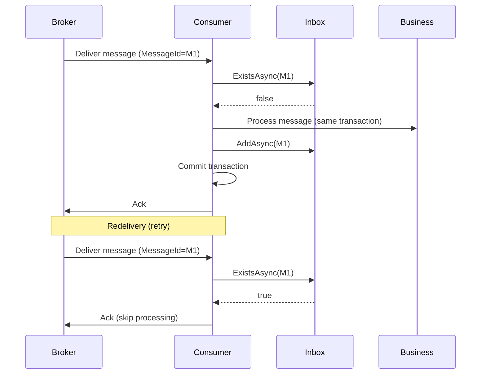

# Integration Event Inbox Pattern

## Purpose

Idempotent consumption of integration events received from message brokers (RabbitMQ, Azure Service Bus, Kafka). When a service receives an event, it checks the Inbox by `MessageId`; if already processed, it skips. This prevents duplicate processing on retries or redeliveries.

## Schema

| Column | Type | Description |
|--------|------|-------------|
| MessageId | string (PK) | Unique identifier from the broker (e.g. Azure SB MessageId) |
| ProcessedAtUtc | DateTimeOffset | When the message was processed |
| TenantId | string (optional) | For multi-tenant isolation |
| EventType | string (optional) | Event type for diagnostics |

## Flow



## Usage

### 1. Add Inbox to DbContext

```csharp
public DbSet<IntegrationEventInboxEntity> IntegrationEventInbox => Set<IntegrationEventInboxEntity>();

protected override void OnModelCreating(ModelBuilder modelBuilder)
{
    // ... other config ...
    modelBuilder.ApplyConfiguration(new IntegrationEventInboxConfiguration());
}
```

### 2. Add Migration

```bash
dotnet ef migrations AddIntegrationEventInbox -p Services/Dialysis.Xxx/Dialysis.Xxx.Infrastructure -s Services/Dialysis.Xxx/Dialysis.Xxx.Api
```

### 3. Register Store

```csharp
builder.Services.AddScoped<IIntegrationEventInboxStore>(sp =>
    new IntegrationEventInboxStore(sp.GetRequiredService<XxxDbContext>()));
```

### 4. Consumer Pattern

```csharp
// In message handler (e.g. Azure Service Bus processor)
public async Task HandleAsync(Message message, CancellationToken ct)
{
    string messageId = message.MessageId;
    if (await _inboxStore.ExistsAsync(messageId, ct))
    {
        // Already processed; ack and return
        return;
    }

    await using var transaction = await _context.Database.BeginTransactionAsync(ct);
    try
    {
        // Business logic
        await _sender.SendAsync(new ProcessEventCommand(...), ct);

        // Record in Inbox (same transaction)
        await _inboxStore.AddAsync(messageId, message.Label, tenantId, ct);
        await _context.SaveChangesAsync(ct);
        await transaction.CommitAsync(ct);
    }
    catch
    {
        await transaction.RollbackAsync(ct);
        throw; // Broader will redeliver
    }
}
```

## When to Use

- **Broker-based consumers**: When receiving events from RabbitMQ, Azure Service Bus, Kafka
- **Cross-service messaging**: When another service publishes events your service subscribes to

## When Not to Use

- **In-process handlers**: Events dispatched via `IIntegrationEventBuffer` within the same process are already transactional; no Inbox needed
- **HTTP callbacks**: Idempotency for HTTP is typically handled via idempotency keys in the API, not Inbox

## Related

- **Outbox**: `IntegrationEventOutboxEntity` for reliable publishing (this project sends)
- **Inbox**: `IntegrationEventInboxEntity` for idempotent consumption (this project receives)
