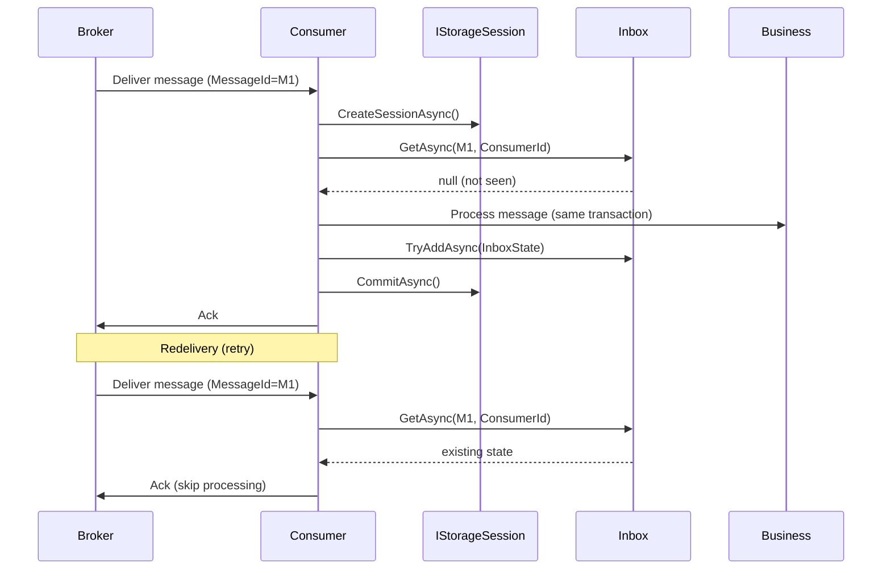

# Integration Event Inbox Pattern

## Purpose

Idempotent consumption of integration events received from message brokers (RabbitMQ, Azure Service Bus, Kafka). When a service receives an event, it checks the Inbox by `MessageId` and `ConsumerId`; if already processed, it skips. This prevents duplicate processing on retries or redeliveries.

## Transponder Inbox (Built-in)

The Dialysis PDMS uses **Transponder.Persistence.EntityFramework.PostgreSql**, which provides a built-in inbox:

| Table | Schema | Description |
|-------|--------|-------------|
| **InboxStates** | `transponder` DB | MessageId (PK) + ConsumerId (PK) for idempotent consumption |
| **OutboxMessages** | `transponder` DB | Durable outbox for Bus.Send/Publish |
| **ScheduledMessages** | `transponder` DB | Persisted scheduled messages |
| **SagaStates** | `transponder` DB | Saga state persistence |

### Enabling Transponder Persistence

Treatment and Alarm APIs use Transponder PostgreSQL persistence:

```csharp
// Register storage
builder.Services.AddSingleton<IPostgreSqlStorageOptions>(_ => new PostgreSqlStorageOptions());
builder.Services.AddDbContextFactory<PostgreSqlTransponderDbContext>((_, ob) =>
    ob.UseNpgsql(transponderConnectionString));
builder.Services.AddTransponderPostgreSqlPersistence();

// Enable Outbox and persisted scheduler
builder.Services.AddTransponder(new Uri("transponder://treatment"), opts =>
{
    _ = opts.TransportBuilder.UseSignalR(new Uri("signalr://treatment"));
    _ = opts.UseOutbox();
    _ = opts.UsePersistedMessageScheduler();
});
```

Connection string: `ConnectionStrings:TransponderDb` (e.g. `Host=postgres;Database=transponder;Username=postgres;Password=postgres`).

### Inbox Flow



### Using IStorageSession.Inbox

When consuming messages via Transponder (e.g. RabbitMQ, Azure Service Bus), use `IStorageSessionFactory` to get a session and check/record inbox state:

```csharp
// Inject IStorageSessionFactory
await using var session = await _sessionFactory.CreateSessionAsync(ct);

// Check idempotency
IInboxState? existing = await session.Inbox.GetAsync(messageId, consumerId, ct);
if (existing is not null)
{
    return; // Already processed
}

// Process and record in same transaction
await _handler.HandleAsync(message, ct);
_ = await session.Inbox.TryAddAsync(new InboxState(messageId, consumerId), ct);
await session.CommitAsync(ct);
```

## When to Use

- **Broker-based consumers**: When receiving events from RabbitMQ, Azure Service Bus, Kafka via Transponder
- **Cross-service messaging**: When another service publishes events your service subscribes to

## When Not to Use

- **In-process handlers**: Events dispatched via `IIntegrationEventBuffer` within the same process are already transactional; no Inbox needed
- **HTTP callbacks**: Idempotency for HTTP is typically handled via idempotency keys in the API

## Azure Service Bus

When `AzureServiceBus:ConnectionString` is configured, Treatment and Alarm publish to ASB topics. Receive endpoints (when added) can consume from ASB and must use the Inbox pattern for idempotent consumption. See [AZURE-SERVICE-BUS.md](AZURE-SERVICE-BUS.md).

## Related

- **BuildingBlocks Outbox**: `IntegrationEventOutboxEntity` for domain-event-in-same-transaction publishing
- **Transponder Outbox**: `OutboxMessages` for durable Bus.Send/Publish when `UseOutbox()` is enabled
- **Transponder Inbox**: `InboxStates` for idempotent consumption when broker-based consumers are used
