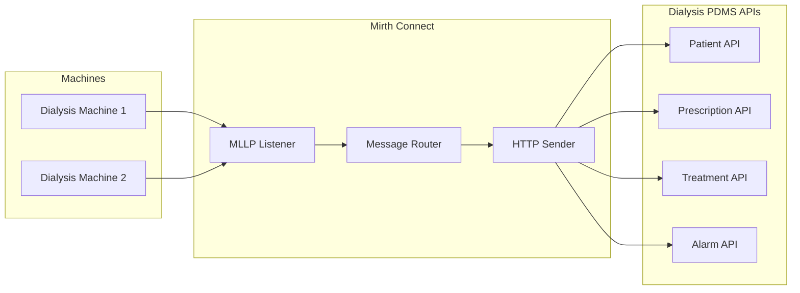

# Mirth Connect Integration Guide for Dialysis PDMS

This guide describes how to configure Mirth Connect channels to route HL7 messages from dialysis machines to the Dialysis PDMS APIs.

---

## 1. Architecture Overview



Mirth receives HL7 over MLLP from dialysis machines, determines the message type, and forwards each message to the appropriate PDMS API via HTTP.

---

## 2. Channel Routing Table

| Channel Name | HL7 Message Type | Mirth Source | PDMS Service | PDMS Endpoint | Method | Required Scope |
|--------------|-----------------|--------------|-------------|---------------|--------|----------------|
| Patient PDQ | QBP^Q22 | MLLP Listener | Patient | `{PatientBaseUrl}/api/hl7/qbp-q22` | POST | `Patient:Read` |
| Patient RSP Ingest | RSP^K22 (demographics) | MLLP Listener | Patient | `{PatientBaseUrl}/api/hl7/rsp-k22` | POST | `Patient:Write` |
| Prescription Query | QBP^D01 | MLLP Listener | Prescription | `{PrescriptionBaseUrl}/api/hl7/qbp-d01` | POST | `Prescription:Read` |
| Prescription RSP Ingest | RSP^K22 (prescription) | MLLP Listener | Prescription | `{PrescriptionBaseUrl}/api/hl7/rsp-k22` | POST | `Prescription:Write` |
| Treatment ORU | ORU^R01 | MLLP Listener | Treatment | `{TreatmentBaseUrl}/api/hl7/oru` | POST | `Treatment:Write` |
| Treatment Batch | FHS/BHS/ORU.../BTS/FTS | MLLP Listener | Treatment | `{TreatmentBaseUrl}/api/hl7/oru/batch` | POST | `Treatment:Write` |
| Alarm ORU-R40 | ORU^R40 | MLLP Listener | Alarm | `{AlarmBaseUrl}/api/hl7/alarm` | POST | `Alarm:Write` |

### Base URLs

When running each PDMS service separately (no gateway):

| Service | Typical Base URL (local) | Example |
|---------|---------------------------|---------|
| Patient | `https://localhost:5xxx` | `https://localhost:5001` |
| Prescription | `https://localhost:5xxx` | `https://localhost:5002` |
| Treatment | `https://localhost:5xxx` | `https://localhost:5003` |
| Alarm | `https://localhost:5xxx` | `https://localhost:5004` |

With the **Dialysis.Gateway** (YARP), use a single base URL; the gateway routes by path:

| Scenario | Base URL | Example |
|----------|----------|---------|
| Gateway (unified) | `http://localhost:5000` (dev) | All services via one host |

**Note**: For RSP^K22 to the Prescription API, use `/api/prescriptions/hl7/rsp-k22` (gateway rewrites to `/api/hl7/rsp-k22` on Prescription backend).

---

## 3. HTTP Request Format

All PDMS HL7 endpoints expect **JSON** request bodies, not raw HL7.

### Content-Type

```
Content-Type: application/json
```

### Request Body Structure

| Endpoint | Body Property | Type | Description |
|----------|---------------|------|-------------|
| `/api/hl7/qbp-q22` | `rawHl7Message` | string | Raw QBP^Q22 message |
| `/api/hl7/rsp-k22` | `rawHl7Message` | string | Raw RSP^K22 message |
| `/api/hl7/qbp-d01` | `rawHl7Message` | string | Raw QBP^D01 message |
| `/api/hl7/oru` | `rawHl7Message` | string | Raw ORU^R01 message |
| `/api/hl7/oru/batch` | `rawHl7Batch` | string | Raw batch (FHS/BHS/ORU.../BTS/FTS) |
| `/api/hl7/alarm` | `rawHl7Message` | string | Raw ORU^R40 message |

### Example Request (QBP^Q22)

```json
{
  "rawHl7Message": "MSH|^~\\&|MACH|FAC|EMR|FAC|20230215120000||QBP^Q22^QBP_Q22|MSG001|P|2.6\rQPD|Q22^Find Candidates^HL7|Q001|@PID.3|MRN123^^^^MR\rRCP|I||RD"
}
```

### Required Headers

| Header | Value | Required |
|--------|-------|----------|
| `Content-Type` | `application/json` | Yes |
| `Authorization` | `Bearer {access_token}` | Yes (unless DevelopmentBypass) |
| `X-Tenant-Id` | Tenant ID (e.g. `default`) | Yes for C5 multi-tenancy |

---

## 4. Mirth Channel Configuration

### 4.1 Source Connector: MLLP Listener

- **Connector Type**: LLP Listener (MLLP)
- **Port**: e.g. 6661 (ensure no conflict with other listeners)
- **Receive on**: Appropriate network interface

### 4.2 Destination Connector: HTTP Sender

- **Connector Type**: HTTP Sender
- **Content Type**: `application/json`
- **Request Method**: POST
- **URL**: Dynamic (set per message type – see routing table)
- **Headers**: Set in a preprocessor or transformer:
  - `Authorization: Bearer ${token}`
  - `X-Tenant-Id: default`

### 4.3 Message Routing (Filter/Transformer)

Use a **JavaScript** or **Message Builder** step to:

1. Parse MSH-9 to determine message type (QBP^Q22, QBP^D01, ORU^R01, ORU^R40, or batch).
2. Build the JSON body: `{"rawHl7Message": msg}` or `{"rawHl7Batch": msg}` for batch.
3. Obtain an OAuth2 token (see [JWT-AND-MIRTH-INTEGRATION.md](JWT-AND-MIRTH-INTEGRATION.md)).
4. Set the target URL based on message type.

### 4.4 Example Transformer Script (JavaScript)

```javascript
// Inbound message is the raw HL7 string (e.g. from LL Listener)
var hl7 = connectorMessage.getRawData();

// Determine message type from MSH-9
var msh9 = getSegment(hl7, 'MSH', 0, 9);  // e.g. "QBP^Q22^QBP_Q22"
var msgType = (msh9 || '').split('^')[0] + '^' + (msh9 || '').split('^')[1];

// Configure per-service base URLs in channel variables (or use gateway URL)
var patientBase = $('patientBaseUrl') || $('pdmsBaseUrl');
var prescriptionBase = $('prescriptionBaseUrl') || $('pdmsBaseUrl');
var treatmentBase = $('treatmentBaseUrl') || $('pdmsBaseUrl');
var alarmBase = $('alarmBaseUrl') || $('pdmsBaseUrl');

var url, body, scope;

if (msgType === 'QBP^Q22') {
    url = patientBase + '/api/hl7/qbp-q22';
    body = JSON.stringify({ rawHl7Message: hl7 });
    scope = 'Patient:Read';
} else if (msgType === 'RSP^K22') {
    // RSP^K22 exists in both Patient and Prescription APIs. Route by channel/context.
    // Use patientRspChannel or prescriptionRspChannel variable to pick base URL.
    var rspTarget = $('rspK22Target') || 'patient';  // 'patient' | 'prescription'
    url = (rspTarget === 'prescription' ? prescriptionBase : patientBase) + '/api/hl7/rsp-k22';
    body = JSON.stringify({ rawHl7Message: hl7 });
    scope = rspTarget === 'prescription' ? 'Prescription:Write' : 'Patient:Write';
} else if (msgType === 'QBP^D01') {
    url = prescriptionBase + '/api/hl7/qbp-d01';
    body = JSON.stringify({ rawHl7Message: hl7 });
    scope = 'Prescription:Read';
} else if (msgType === 'ORU^R01') {
    url = treatmentBase + '/api/hl7/oru';
    body = JSON.stringify({ rawHl7Message: hl7 });
    scope = 'Treatment:Write';
} else if (msgType === 'ORU^R40') {
    url = alarmBase + '/api/hl7/alarm';
    body = JSON.stringify({ rawHl7Message: hl7 });
    scope = 'Alarm:Write';
} else {
    // Batch: FHS starts the batch
    if (hl7.indexOf('FHS|') === 0) {
        url = treatmentBase + '/api/hl7/oru/batch';
        body = JSON.stringify({ rawHl7Batch: hl7 });
        scope = 'Treatment:Write';
    } else {
        throw new Error('Unknown message type: ' + msgType);
    }
}

// Store for HTTP Sender
channelMap.put('targetUrl', url);
channelMap.put('requestBody', body);
channelMap.put('requiredScope', scope);

// Obtain token (implementation depends on Mirth OAuth setup)
// Then: connectorMessage.setRawData(body);
```

---

### 4.5 Mirth in Docker Compose (Optional)

The PDMS `docker-compose.yml` includes an optional Mirth Connect service:

```bash
docker compose --profile mirth up -d
```

| Item | Value |
|------|-------|
| Mirth Admin UI | http://localhost:9080 |
| MLLP Listener | Port 6661 |
| Default credentials | admin / admin (change on first login) |
| PDMS Gateway (internal) | http://gateway:5000 |

When configuring HTTP Sender destinations in Mirth channels, use `http://gateway:5000` as the base URL so Mirth reaches the PDMS Gateway on the Docker network. Paths: `/api/hl7/qbp-q22`, `/api/hl7/oru`, etc.

---

## 5. OAuth2 Token Setup

See [JWT-AND-MIRTH-INTEGRATION.md](JWT-AND-MIRTH-INTEGRATION.md) for:

- Token endpoint URL (Azure AD client credentials)
- Required scopes per channel (§3.1, §4.6)
- How to add `Authorization: Bearer {token}` and `X-Tenant-Id` headers

---

## 6. Response Handling

| Endpoint | Response Format | Notes |
|----------|-----------------|-------|
| QBP^Q22, QBP^D01 | RSP^K22 (HL7) | `Content-Type: application/x-hl7-v2+er7` – raw HL7 in body |
| ORU^R01 | ACK^R01 (HL7) | `Content-Type: application/x-hl7-v2+er7` |
| ORU^R40 (alarm) | ORA^R41 (HL7) | `Content-Type: application/x-hl7-v2+er7` |
| ORU batch | JSON | `{"sessionIds": [...], "processedCount": N}` |
| RSP^K22 ingest | JSON | `{"ingestedCount": N}` or similar |

---

## 7. Channel Samples

Reusable scripts and configuration are available in `docs/mirth/channels/`:

| File | Description |
|------|-------------|
| `transformer-routing.js` | JavaScript transformer: parses MSH-9, builds JSON body, sets target URL |
| `channel-variables.json` | Suggested channel variables (PDMS base URLs, tenant) |
| `README.md` | Import steps and channel setup |

See [docs/mirth/channels/README.md](mirth/channels/README.md) for import and configuration details.

---

## 8. Prescription API Configuration

The Prescription API supports configurable conflict handling when ingesting RSP^K22:

| Config Key | Values | Default |
|------------|--------|---------|
| `PrescriptionIngestion:ConflictPolicy` | `Reject`, `Callback`, `Replace`, `Ignore`, `Partial` | `Reject` |

- **Reject**: Return 409 Conflict when OrderId exists.
- **Callback**: Return 409 with `callbackPhone` in body so caller can contact prescriber.
- **Replace**: Delete existing prescription and save new one.
- **Ignore**: Silently skip; return success.
- **Partial**: Merge: keep existing settings, add only settings whose MDC code is not already present.

---

## 9. EHR Integration Patterns

### Supported EHR Flows

| Flow | HL7 Messages | PDMS Endpoint | Description |
|------|---------------|---------------|-------------|
| **Patient Sync (PDQ)** | QBP^Q22, RSP^K22 | `/api/hl7/qbp-q22`, `/api/hl7/rsp-k22` | Query patients by MRN; ingest demographics from EHR |
| **Prescription Ingest** | QBP^D01 (query), RSP^K22 (ingest) | `/api/hl7/qbp-d01`, `/api/hl7/rsp-k22` | Query prescriptions; ingest dialysis prescriptions from EHR |
| **Document References** | *(future)* | – | CDA/CCD document references; not yet implemented |

### Data Residency and Jurisdiction

- PDMS stores patient, prescription, treatment, and alarm data in tenant-scoped PostgreSQL databases.
- All inbound HL7 must include `X-Tenant-Id` for multi-tenancy.
- See [C5 compliance](.cursor/rules/c5-compliance.mdc) for encryption, audit, and access control.

### LIS Integration (Future)

- Lab results (e.g. Observation with LOINC codes) are not in initial scope.
- Future LIS integration would use `Observation` resource ingestion via HL7 ORU or FHIR.

---

## 10. References

- [JWT-AND-MIRTH-INTEGRATION.md](JWT-AND-MIRTH-INTEGRATION.md) – JWT claims, scopes, token acquisition
- [NEXT-STEPS-PLAN.md](NEXT-STEPS-PLAN.md) – Step 4 deliverables
- [PROCESS-DIAGRAMS.md](PROCESS-DIAGRAMS.md) – HL7 flow diagrams
- [FHIR-AND-DOMAIN-FEATURES-PLAN.md](FHIR-AND-DOMAIN-FEATURES-PLAN.md) – FHIR interoperability roadmap
