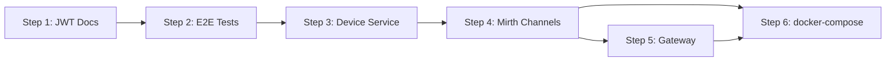

# Dialysis PDMS – Next Steps Plan

**Created**: 2025-02-18  
**Context**: Phases 1–5 of the HL7 Implementation Plan are complete. This document outlines follow-up work to evolve the PDMS toward production readiness and learning goals.

---

## 1. Current State (Completed)

| Phase | Service | Scope | Status |
|-------|---------|-------|--------|
| 1 | Patient | PDQ (QBP^Q22 / RSP^K22), 6 use cases | Implemented |
| 2 | Prescription | QBP^D01 / RSP^K22, profile parsing | Implemented |
| 3 | Treatment | ORU^R01, Batch Protocol, time-series API | Implemented |
| 4 | Alarm | ORU^R40, 5-OBX structure, Table 3, SignalR | Implemented |
| 5 | Hl7ToFhir | MDC→FHIR mappings, DetectedIssue, AuditEvent | Implemented |
| – | E2E Test | OruR01ToFhir integration test | Implemented |

---

## 2. Next Steps Overview

| # | Focus | Priority | Effort |
|---|-------|----------|--------|
| 1 | JWT / Mirth documentation | P0 (C5) | Small |
| 2 | Additional E2E integration tests | P1 | Medium |
| 3 | Device service | P2 | Medium–Large |
| 4 | Mirth channel configurations | P2 | Medium |
| 5 | API Gateway | P3 | Medium |
| 6 | Full solution run (docker-compose) | P3 | Medium |

---

## 3. Step 1: JWT and Mirth Documentation (P0) – **Done**

**Goal**: Complete C5 compliance documentation so Mirth and integration clients can obtain and use JWTs.

### 3.1 Scope

- Document JWT claims (aud, iss, sub, scopes, `X-Tenant-Id`)
- Document how Mirth/integration clients obtain tokens (client credentials, resource owner password, etc.)
- Update `docs/JWT-AND-MIRTH-INTEGRATION.md` or create `docs/JWT-CLAIMS-AND-INTEGRATION.md`

### 3.2 Deliverables

| Item | Status | Location |
|------|--------|----------|
| JWT claims reference | Done | §1, §1.1 (example payload), §1.2 (X-Tenant-Id) |
| Token acquisition flows | Done | §4.2 (cURL), §4.3–4.5 (Mirth) |
| Scope-to-endpoint mapping | Done | §3.1 |
| Development bypass notes | Done | §5.3 |

### 3.3 References

- `docs/IMMEDIATE-HIGH-PRIORITY-PLAN.md` – JWT checklist (item marked complete)
- `docs/JWT-AND-MIRTH-INTEGRATION.md` – main document

---

## 4. Step 2: Additional E2E Integration Tests (P1) – **Done**

**Goal**: Cover critical flows with end-to-end tests similar to `OruR01ToFhirIntegrationTests`.

### 4.1 Test Candidates

| Test | Flow | Service | Status |
|------|------|---------|--------|
| Patient PDQ E2E | Register patient → QBP^Q22 → RSP^K22 with PID | Dialysis.Patient | **Implemented** – `QbpQ22ToRspK22IntegrationTests` |
| Prescription E2E | QBP^D01 → RSP^K22 (existing `ProcessQbpD01IntegrationTests`) | Dialysis.Prescription | Existing |
| Alarm E2E | ORU^R40 → IngestOruR40 → RecordAlarm → FHIR DetectedIssue | Dialysis.Alarm | **Implemented** – `OruR40ToFhirIntegrationTests` |
| Batch Protocol E2E | FHS/BHS/ORU/ORU/BTS/FTS → IngestOruBatch → multiple sessions | Dialysis.Treatment | **Implemented** – `OruBatchToSessionsIntegrationTests` |

### 4.2 Implementation Notes

- Integration tests use **Testcontainers PostgreSQL** (`BuildingBlocks.Testcontainers`) for real database behavior; Docker required locally and in CI
- Follow `OruR01ToFhirIntegrationTests` pattern: Testcontainers DB, minimal mocks, full pipeline
- Use `#pragma warning disable IDE0058` for Shouldly assertions if needed
- Added `InternalsVisibleTo("Dialysis.Patient.Tests")` to Patient.Application for handler access

---

## 5. Step 3: Device Service (P2) – **Done**

**Goal**: Implement the Device bounded context shown in `SYSTEM-ARCHITECTURE.md` and support FHIR Device resources.

### 5.1 Scope

- New service: `Dialysis.Device` (API, Application, Infrastructure, Domain)
- Machine identity: EUI-64, model, serial, manufacturer, UDI
- Persistence: Device catalog/registry (PostgreSQL)
- FHIR `Device` resource via `DeviceMapper` (already in Dialysis.Hl7ToFhir)

### 5.2 Work Items

| Item | Description | Status |
|------|-------------|--------|
| Device aggregate | DeviceId, DeviceEui64, Manufacturer, Model, Serial, UDI | Done |
| Device repository | `IDeviceRepository`, EF Core + migrations | Done |
| API | `GET /api/devices`, `GET /api/devices/{id}`, `GET /api/devices/{id}/fhir`, `POST /api/devices` | Done |
| HL7 integration | Populate device from MSH-3 (Machine^EUI64^EUI-64) on first observation/alarm | **Done** – Treatment and Alarm auto-register via IDeviceRegistrationClient |
| Update architecture | Remove placeholder; mark Device Service as implemented | Done |

### 5.3 References

- `docs/SYSTEM-ARCHITECTURE.md` – DeviceSvc in diagram
- `Services/Dialysis.Hl7ToFhir/DeviceMapper.cs` – existing mapper
- `docs/Dialysis_Machine_FHIR_Implementation_Guide/README.md` – FHIR Device table

---

## 6. Step 4: Mirth Channel Configurations (P2) – **Done**

**Goal**: Provide sample Mirth channels or documentation so HL7 messages can be routed to PDMS APIs.

### 6.1 Channels to Document / Provide

| Channel | Inbound | Outbound | PDMS Endpoint |
|---------|---------|----------|---------------|
| Patient PDQ | QBP^Q22 (MLLP) | RSP^K22 (MLLP) | POST /api/hl7/qbp-q22 |
| Prescription | QBP^D01 (MLLP) | RSP^K22 (MLLP) | POST /api/hl7/qbp-d01 |
| Treatment | ORU^R01 (MLLP) | ACK^R01 (MLLP) | POST /api/hl7/oru/r01 |
| Treatment Batch | Batch (MLLP) | – | POST /api/hl7/oru/batch |
| Alarm | ORU^R40 (MLLP) | ORA^R41 (MLLP) | POST /api/hl7/oru/r40 |

### 6.2 Deliverables

| Item | Description | Status |
|------|-------------|--------|
| Mirth channel samples | Transformer script, channel variables, README in `docs/mirth/channels/` | **Done** – [MIRTH-INTEGRATION-GUIDE.md](MIRTH-INTEGRATION-GUIDE.md) §7 |
| Mirth integration guide | HTTP connector config, JWT in header, base URLs | **Done** – [MIRTH-INTEGRATION-GUIDE.md](MIRTH-INTEGRATION-GUIDE.md) |
| `docs/JWT-AND-MIRTH-INTEGRATION.md` update | Add channel routing table, JSON body format | **Done** – §8, §5.1 |

---

## 7. Step 5: API Gateway (P3) – **Done**

**Goal**: Optional unified entry point for routing, auth, and rate limiting.

### 7.1 Scope

- Evaluate YARP or Ocelot
- Single entry (e.g. `https://pdms.example.com`) with routes:
  - `/api/patients/*` → Patient API
  - `/api/prescriptions/*` → Prescription API
  - `/api/treatment-sessions/*` → Treatment API
  - `/api/alarms/*` → Alarm API
  - `/api/devices/*` → Device API (after Step 3)

### 7.2 Deliverables

| Item | Description | Status |
|------|-------------|--------|
| Gateway project | `Gateway/Dialysis.Gateway` (YARP) | **Done** |
| Route configuration | `appsettings.json` ReverseProxy section | **Done** |
| JWT forward | YARP forwards `Authorization` and `X-Tenant-Id` by default | **Done** |
| Health aggregation | `/health` checks all 5 backends | **Done** |

---

## 8. Step 6: Full Solution Run (docker-compose) (P3) – **Done**

**Goal**: Run the full PDMS stack locally for demos and integration testing.

### 8.1 Components

| Component | Image / Project |
|-----------|-----------------|
| PostgreSQL | `postgres:16-alpine` |
| Patient API | Dialysis.Patient.Api |
| Prescription API | Dialysis.Prescription.Api |
| Treatment API | Dialysis.Treatment.Api |
| Alarm API | Dialysis.Alarm.Api |
| Device API | Dialysis.Device.Api |
| FHIR API | Dialysis.Fhir.Api |
| CDS API | Dialysis.Cds.Api |
| Reports API | Dialysis.Reports.Api |
| Gateway | Dialysis.Gateway |
| Mirth (optional) | Mirth Connect image |

### 8.2 Deliverables

| Item | Description | Status |
|------|-------------|--------|
| `docker-compose.yml` | Services, networks, volumes | **Done** |
| `Dockerfile` (parameterized) | Build APIs + Gateway | **Done** |
| PostgreSQL init script | Create per-service databases | **Done** |
| Environment config | Connection strings, backend URLs | **Done** |
| `docs/GATEWAY.md` + `docs/SYSTEM-ARCHITECTURE.md` | docker-compose section | **Done** |

---

## 9. Suggested Execution Order

| Phase | Steps | Rationale |
|-------|-------|------------|
| 1 | Step 1 | Closes C5 documentation gap; enables integration clients |
| 2 | Step 2 | Improves confidence in refactors; documents flows |
| 3 | Step 3 | Fills architecture gap; supports FHIR Device |
| 4 | Step 4 | Enables real HL7 integration testing with Mirth |
| 5 | Steps 5, 6 | Improves deployment and demo experience |

---

## 10. Success Criteria

| Step | Done When |
|------|-----------|
| 1 | JWT claims and Mirth token acquisition documented |
| 2 | ≥2 new E2E tests added and passing |
| 3 | Device API deployed, FHIR Device endpoint working |
| 4 | Mirth integration guide updated with channel routing |
| 5 | Gateway routing all PDMS APIs (if adopted) |
| 6 | `docker-compose up` runs full stack successfully |

---

## 11. Future Enhancements (Optional)

All planned steps (1–6) and HL7 Implementation Guide Phases 1–5 are complete. Optional follow-ups:

| Focus | Effort | Notes |
|-------|--------|-------|
| Additional test coverage | Small | Edge cases, error paths |
| Performance/load testing | Medium | Benchmark API under load |
| Mirth container in docker-compose | Small | End-to-end HL7 with real Mirth |
| Production deployment docs | Medium | Azure App Service, AKS, Key Vault |

---

## 11. References

- [IMPLEMENTATION_PLAN](Dialysis_Machine_HL7_Implementation_Guide/IMPLEMENTATION_PLAN.md) – Phases 1–5
- [IMMEDIATE-HIGH-PRIORITY-PLAN](IMMEDIATE-HIGH-PRIORITY-PLAN.md) – C5/auth checklist
- [JWT-AND-MIRTH-INTEGRATION](JWT-AND-MIRTH-INTEGRATION.md) – JWT + Mirth
- [SYSTEM-ARCHITECTURE](SYSTEM-ARCHITECTURE.md) – Service diagram
- [PROCESS-DIAGRAMS](PROCESS-DIAGRAMS.md) – HL7 flows
