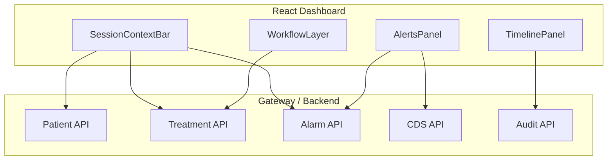

# PDMS Clinician UI – WIKI

Session-centric, state-driven React dashboard for dialysis clinicians. Built per the learn-by-doing workflow.

---

## 1. Overview

The PDMS Dashboard (`clients/dialysis-dashboard`) is a React SPA that provides:

- **Context Layer** – Patient, session, and safety info always visible
- **Workflow Layer** – State-dependent panels (Pre-Assessment, Running, Completed, Signed)
- **Alerts Panel** – CDS risks, alarms, missed documentation
- **Timeline** – Audit trail and state transitions

---

## 2. Architecture

---

## 3. Key APIs

| Purpose | Endpoint | Notes |
|---------|----------|-------|
| List sessions | `GET /api/treatment-sessions/fhir?dateFrom=&dateTo=&limit=` | Returns FHIR Bundle; extract Procedure IDs |
| Session details | `GET /api/treatment-sessions/{sessionId}` | JSON with status, observations, signedAt |
| Patient | `GET /api/patients/mrn/{mrn}` | Patient context for SessionContextBar |
| Alarms | `GET /api/alarms?sessionId=` | Active alarms for session |
| Pre-Assessment | `POST /api/treatment-sessions/{sessionId}/pre-assessment` | TreatmentWrite; body: preWeightKg, bpSystolic, bpDiastolic, accessTypeValue, prescriptionConfirmed, painSymptomNotes |
| End Session | `POST /api/treatment-sessions/{sessionId}/complete` | TreatmentWrite |
| Sign Session | `POST /api/treatment-sessions/{sessionId}/sign` | TreatmentWrite; optional body `{ "signedBy": "..." }` |
| CDS | `GET /api/cds/hypotension-risk?sessionId=` etc. | DetectedIssue bundle |
| Audit | `GET /api/treatment-sessions/audit-events` | FHIR AuditEvent bundle |

---

## 4. Session States

| State | Condition | Panel |
|-------|-----------|-------|
| Pre-Assessment | No session selected, or session Active but no pre-assessment recorded | PreAssessmentPanel |
| Running | `session.status === "Active"` and pre-assessment recorded | RunningPanel |
| Completed | `session.status === "Completed"` | CompletedPanel |
| Signed | `session.signedAt != null` | SignedPanel |

---

## 5. Flows

### 5.1 Start Treatment (Machine-Driven)

Sessions are created when the dialysis machine sends ORU^R01. See [START-TREATMENT-FLOW.md](START-TREATMENT-FLOW.md).

### 5.2 End Session

1. Clinician clicks "End Session" in RunningPanel
2. `completeTreatmentSession(sessionId)` → `POST /api/treatment-sessions/{id}/complete`
3. Backend sets `Status = Completed`, `EndedAt = now`
4. Query invalidation refreshes session; WorkflowLayer shows CompletedPanel

### 5.3 Sign Session

1. Clinician clicks "Sign Session" in CompletedPanel
2. `signTreatmentSession(sessionId)` → `POST /api/treatment-sessions/{id}/sign`
3. Backend sets `SignedAt`, `SignedBy`; persists to DB
4. Query invalidation refreshes session; WorkflowLayer shows SignedPanel

---

## 6. Key Files

| Component | Path |
|-----------|------|
| App layout | `clients/dialysis-dashboard/src/App.tsx` |
| Context bar | `clients/dialysis-dashboard/src/components/SessionContextBar.tsx` |
| Workflow | `clients/dialysis-dashboard/src/components/WorkflowLayer.tsx` |
| Panels | `clients/dialysis-dashboard/src/components/workflow/*.tsx` |
| API helpers | `clients/dialysis-dashboard/src/api.ts` |
| Alerts hook | `clients/dialysis-dashboard/src/hooks/useAlerts.ts` |
| Timeline hook | `clients/dialysis-dashboard/src/hooks/useTimeline.ts` |

---

## 7. Related Docs

- [START-TREATMENT-FLOW.md](START-TREATMENT-FLOW.md) – Session creation, Pre-Assessment
- [UI-INTEGRATION-GUIDE.md](UI-INTEGRATION-GUIDE.md) – API usage, SignalR
- [SYSTEM-ARCHITECTURE.md](SYSTEM-ARCHITECTURE.md) – Treatment Session Workflow section
