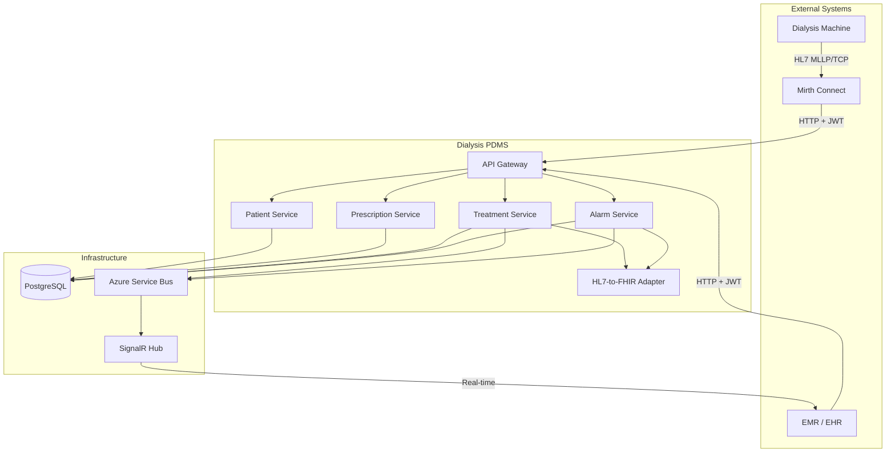
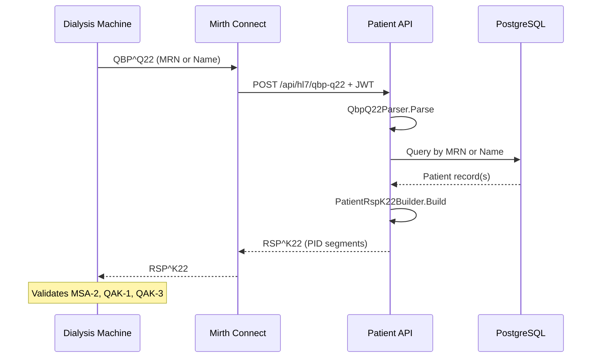
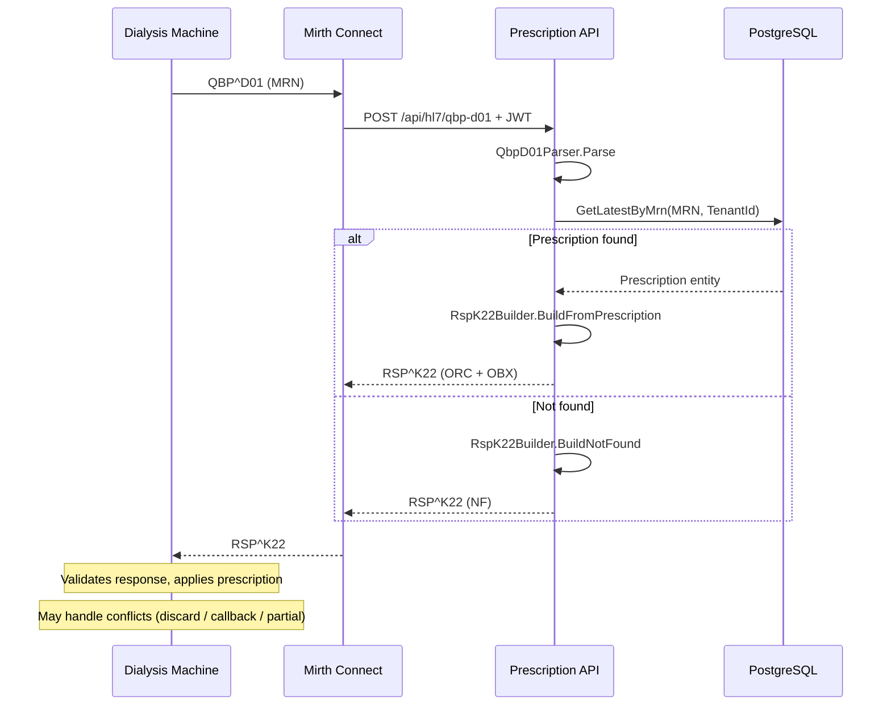
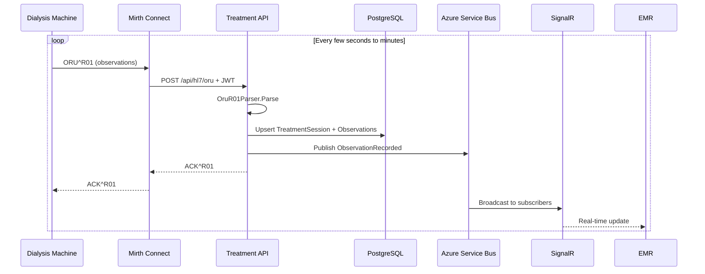
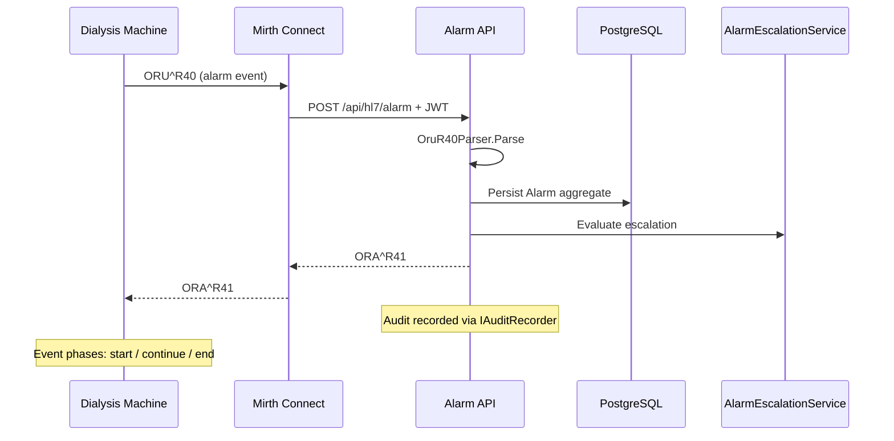
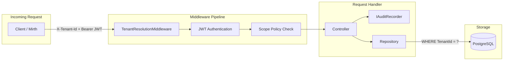
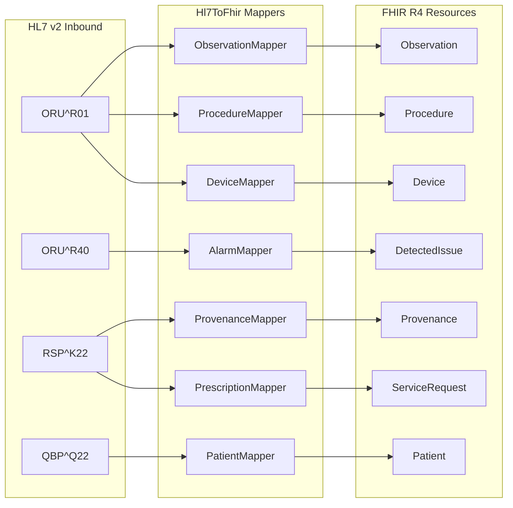

# Dialysis PDMS – Process Diagrams

This document provides process diagrams for the Dialysis PDMS aligned with the Dialysis Machine HL7 Implementation Guide (Rev 4.0). Use these for supervisor reporting and system understanding.

---

## 1. End-to-End Dialysis PDMS Communication

High-level view of all external systems, PDMS microservices, and infrastructure.

---

## 2. Patient Identification Flow (PDQ – IHE ITI-21)

HL7 transaction: `QBP^Q22^QBP_Q21` / `RSP^K22^RSP_K21`

---

## 3. Prescription Download Flow

HL7 transaction: `QBP^D01^QBP_D01` / `RSP^K22^RSP_K21`

---

## 4. Treatment Observation Reporting (PCD-01 / DEC)

HL7 transaction: `ORU^R01^ORU_R01` / `ACK^R01^ACK`

---

## 5. Alarm Reporting (PCD-04)

HL7 transaction: `ORU^R40^ORU_R40` / `ORA^R41^ORA_R41`

---

## 6. C5 Security and Multi-Tenancy

Every request passes through tenant resolution, JWT authentication, and scope-based authorization before reaching the controller. Audit is recorded for every security-relevant action.

---

## 7. HL7-to-FHIR Mapping Layer

Maps inbound HL7 v2 messages to FHIR R4 resources using the Firely SDK.

---

## 8. HL7 Implementation Guide Alignment Matrix

| Guide Requirement | HL7 Transaction | Status | Service |
|---|---|---|---|
| Patient Demographics Query (PDQ) | QBP^Q22 / RSP^K22 | Implemented | Patient |
| Prescription Transfer | QBP^D01 / RSP^K22 | Done | Prescription |
| Treatment Reporting (PCD-01) | ORU^R01 / ACK^R01 | Done | Treatment |
| Alarm Reporting (PCD-04) | ORU^R40 / ORA^R41 | Done | Alarm |
| HL7-to-FHIR Mapping | N/A | Partial | Hl7ToFhir |
| C5 Auth / Audit / Tenant | N/A | Done | All |
| HL7 Batch Protocol | FHS/BHS/BTS/FTS | Not started | Treatment |

---

## 9. Standards and Conventions

| Standard | Usage |
|---|---|
| HL7 v2.6 | Message encoding |
| IHE PCD TF 9.0 | PCD-01 (DEC), PCD-04 (ACM) |
| IHE ITI TF 14.0 | PDQ (ITI-21) |
| ISO/IEEE 11073-10101 | Nomenclature (MDC codes) |
| ISO/IEEE 11073-10201 | Domain Information Model (containment) |
| UCUM | Units of measure |
| FHIR R4 | Internal interop model |
| BSI C5:2020 | Cloud compliance (auth, audit, encryption, tenancy) |
