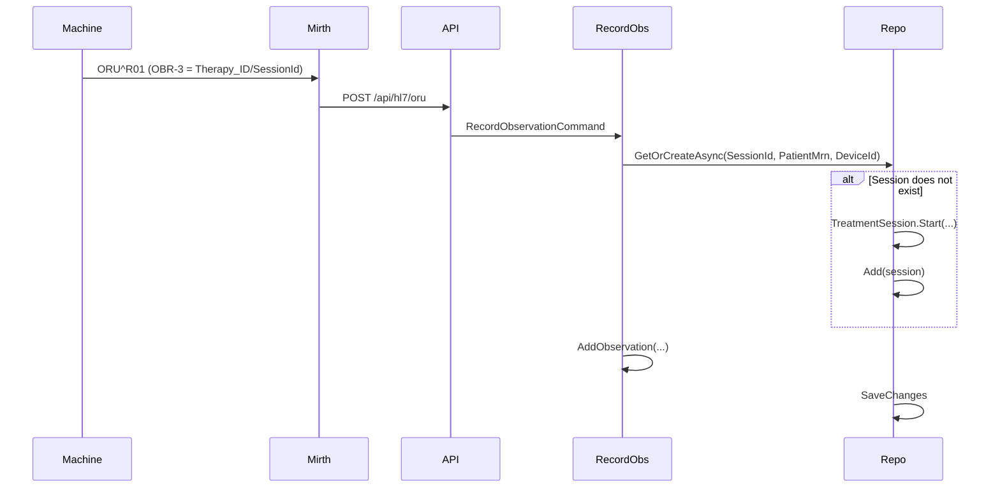
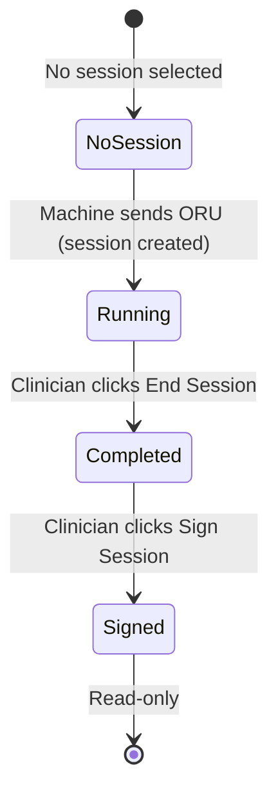

# Start Treatment Flow

This document describes how treatment sessions are created and started in the Dialysis PDMS, and how the UI Pre-Assessment and Start Treatment flows align with the backend.

---

## 1. Session Creation: Machine-Driven (HL7)

Treatment sessions are **created by the dialysis machine** when it sends the first HL7 ORU^R01 observation.

### Key Points

| Aspect | Detail |
|--------|--------|
| **SessionId source** | OBR-3 (Therapy_ID) from HL7 — e.g. `ID^Machine^EUI64` |
| **Creation trigger** | First ORU^R01 observation for that SessionId |
| **Status on creation** | `Active` (session is considered "running" immediately) |
| **Patient/Device** | Extracted from PID-3, MSH-3/OBR-3; may be null on first message |

See [PHASE3_TREATMENT_PLAN.md](Dialysis_Machine_HL7_Implementation_Guide/PHASE3_TREATMENT_PLAN.md) for ORU parsing details.

---

## 2. Pre-Assessment in the UI

The **Pre-Assessment** panel is shown when:

- No session is selected, or
- A selected session exists but is in a "pre" state (not applicable in current model — sessions are created as Active)

### Current Behavior

| State | When | UI |
|-------|------|-----|
| No session selected | User has not picked a session from the list | Pre-Assessment: pre-weight, BP, access checklist, prescription confirmation |
| Session selected, Active | Machine has sent ORU; session exists | Running panel |
| Session selected, Completed | Clinician ended session | Completed panel → Sign Session |
| Session selected, Signed | Clinician signed | Signed panel (read-only) |

### "Start Treatment" Button

The **Start Treatment** button in Pre-Assessment is currently **disabled** because:

1. **Sessions are created by the machine** — There is no backend API to create a session from the UI. The SessionId is assigned by the machine (OBR-3).
2. **Pre-Assessment without a session** — The clinician may do pre-weight, BP, etc. before the machine starts. In that case, no session exists yet. The clinician must **select a session** once it appears (after the machine sends ORU).

### Guidance for Clinicians

- **Select a session** from the list above. Sessions appear when the dialysis machine sends observations (ORU^R01).
- If no sessions are listed, ensure the machine is connected and sending data via Mirth.
- Pre-Assessment fields (pre-weight, BP, access, prescription) are placeholders until backend supports structured pre-assessment documentation.

---

## 3. Future: Clinician-Driven Start (Optional)

If a facility needs the clinician to "start" a session before the machine sends data:

| Option | Description |
|--------|-------------|
| **A. Wait for machine** | Current behavior. Clinician waits for session to appear after machine starts. |
| **B. Create session from UI** | Add `CreateTreatmentSessionCommand` with generated or user-entered SessionId. Risk: SessionId mismatch if machine uses a different ID. |
| **C. Scheduled sessions** | Add `Scheduled` status; session created from schedule, reconciled when machine sends ORU (SessionId match by MRN + device + time window). |

For the learning platform, **Option A** is sufficient. Options B/C would require additional domain modeling and HL7 reconciliation logic.

---

## 4. State Transitions Summary

---

## 5. Related Documentation

- [DATA-PRODUCERS-AND-FLOW.md](DATA-PRODUCERS-AND-FLOW.md) — ORU routing, Mirth, Gateway
- [Dialysis_Machine_HL7_Implementation_Guide/PHASE3_TREATMENT_PLAN.md](Dialysis_Machine_HL7_Implementation_Guide/PHASE3_TREATMENT_PLAN.md) — ORU^R01 parsing, observations
- [DOMAIN-EVENTS-AND-SERVICES.md](DOMAIN-EVENTS-AND-SERVICES.md) — TreatmentSessionStartedEvent, TreatmentSessionCompletedEvent
