# Dialysis PDMS – Low-Level System Architecture

This document provides **detailed, low-level** Mermaid diagrams for the Dialysis PDMS. It complements the high-level overview in `SYSTEM-ARCHITECTURE.md` and `PROCESS-DIAGRAMS.md`.

---

## 1. Activity / Flow Chart Diagrams

### 1.1 ORU Message Ingest – Decision Flow

End-to-end activity flow for an incoming ORU^R01 (PCD-01) message from Mirth Connect.

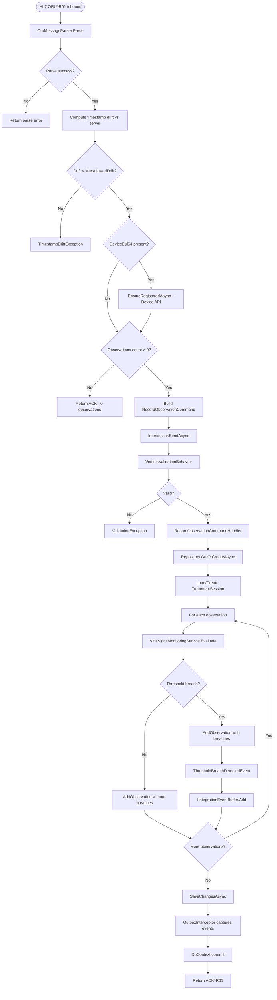

---

### 1.2 Threshold Breach – Internal Flow

Internal branching when an observation triggers a threshold breach (e.g. blood pressure below limit).

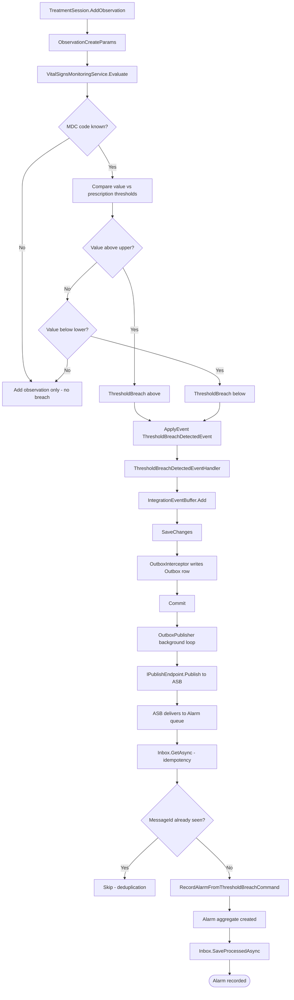

---

### 1.3 Incoming Request – Middleware Pipeline

Per-request flow from HTTP entry to handler (C5 compliance).

```mermaid
flowchart LR
    subgraph Inbound [Inbound]
        REQ[HTTP Request]
    end

    subgraph Mid [Middleware]
        T[TenantResolutionMiddleware]
        A[JWT Authentication]
        S[Scope Policy Check]
    end

    subgraph App [Application]
        Ctrl[Controller]
        Audit[IAuditRecorder]
        Med[Intercessor.Send]
        Val[Verifier]
        H[Handler]
    end

    subgraph Storage [Storage]
        DB[(PostgreSQL)]
    end

    REQ -->|X-Tenant-Id + Bearer| T
    T -->|ITenantContext| A
    A -->|ClaimsPrincipal| S
    S -->|401 if no scope| Ctrl
    Ctrl --> Audit
    Audit --> Med
    Med --> Val
    Val --> H
    H -->|Repository| DB
```

---

### 1.4 Prescription QBP^D01 – Decision Flow

Flow for dialysis machine requesting prescription by MRN.

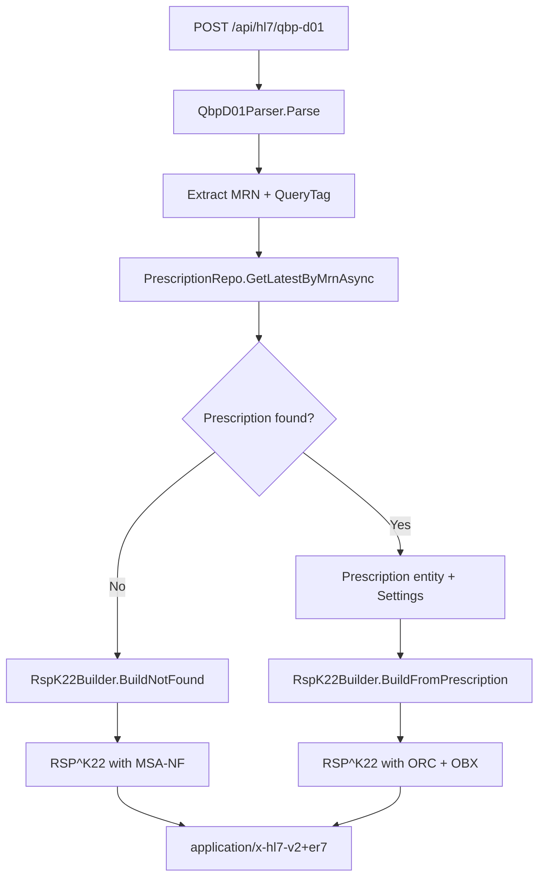

---

## 2. Sequence Diagrams

### 2.1 ORU Ingest → Treatment → Threshold Breach → Alarm (Full Path)

End-to-end sequence from HL7 ingest to alarm creation when a threshold is breached.

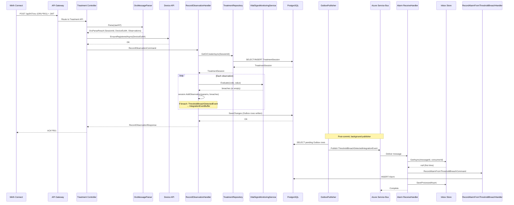

---

### 2.2 FHIR Subscription Notify – Sequence

When Treatment or Alarm raises a domain event, the FHIR subscription dispatcher is triggered.

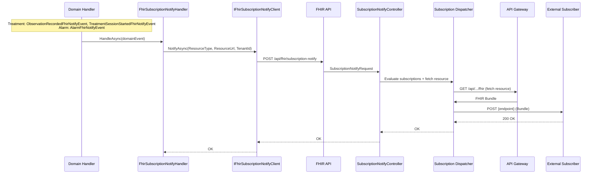

---

### 2.3 CQRS Command vs Query – Sequence

Separation of write (command) and read (query) paths.

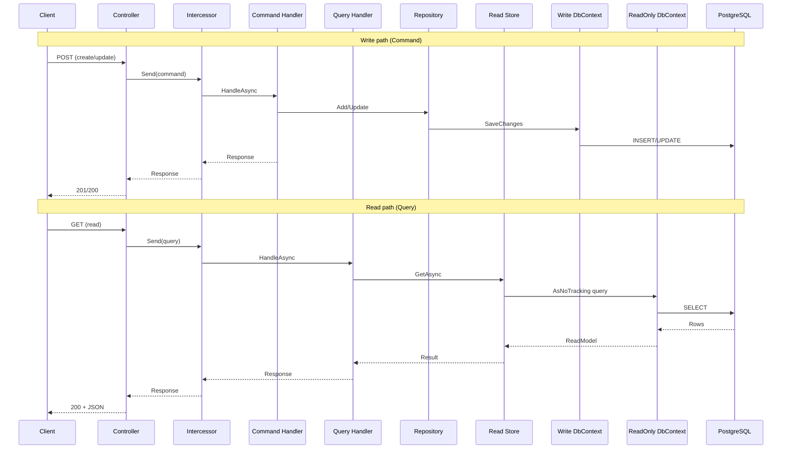

---

### 2.4 Prescription Cache-Aside (Redis)

Prescription read path with optional Redis cache.

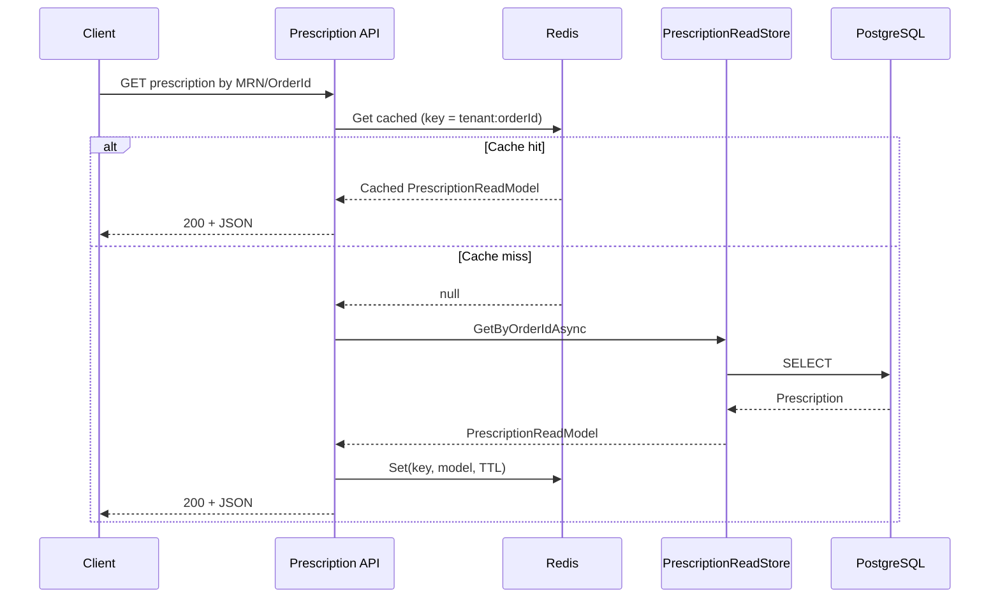

---

## 3. Workflow / Process Diagrams

### 3.1 End-to-End Treatment Observation Workflow

Process view from dialysis machine to EMR display.

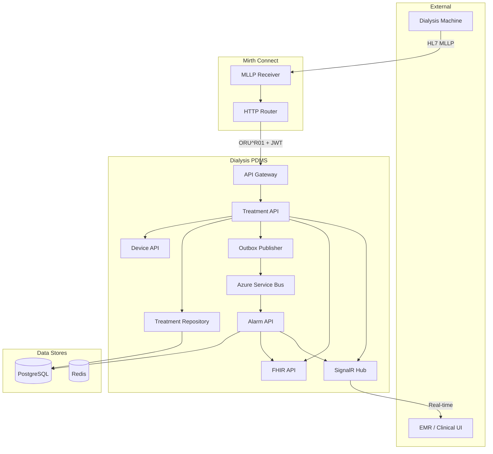

---

### 3.2 Threshold Breach Workflow – Step-by-Step

Process steps from observation value to DetectedIssue (FHIR).

```mermaid
flowchart LR
    subgraph Step1 [1. Ingest]
        A1[ORU^R01 received]
        A2[Parse OBX segments]
        A3[RecordObservation]
    end

    subgraph Step2 [2. Evaluate]
        B1[VitalSignsMonitoringService]
        B2[Compare vs prescription]
        B3[Threshold breach detected?]
    end

    subgraph Step3 [3. Domain]
        C1[TreatmentSession.AddObservation]
        C2[ThresholdBreachDetectedEvent]
        C3[IntegrationEventBuffer.Add]
    end

    subgraph Step4 [4. Persist]
        D1[SaveChanges]
        D2[Outbox row written]
        D3[Commit]
    end

    subgraph Step5 [5. Publish]
        E1[OutboxPublisher poll]
        E2[Publish to ASB]
        E3[Message delivered]
    end

    subgraph Step6 [6. Consume]
        F1[Alarm ReceiveHandler]
        F2[Inbox idempotency check]
        F3[RecordAlarmFromThresholdBreach]
    end

    subgraph Step7 [7. Output]
        G1[Alarm aggregate]
        G2[AlarmRaisedEvent]
        G3[FHIR DetectedIssue notify]
    end

    A1 --> A2 --> A3
    A3 --> B1 --> B2 --> B3
    B3 -->|Yes| C1 --> C2 --> C3
    C3 --> D1 --> D2 --> D3
    D3 --> E1 --> E2 --> E3
    E3 --> F1 --> F2 --> F3
    F3 --> G1 --> G2 --> G3
```

---

### 3.3 Patient Identification & Prescription Download Workflow

Combined PDQ (QBP^Q22) and prescription (QBP^D01) flows.

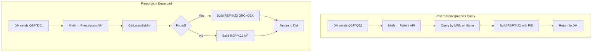

---

### 3.4 Multi-Tenant Request Lifecycle

Process from request entry to response with tenant isolation.

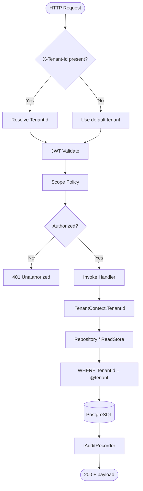

---

## 4. Diagram Index

| Diagram | Type | Purpose |
|---------|------|---------|
| 1.1 | Activity | ORU ingest decision flow – parse, drift check, device reg, observations |
| 1.2 | Activity | Threshold breach internal flow – evaluate → domain event → buffer → outbox → ASB → inbox |
| 1.3 | Activity | Request middleware pipeline – tenant, auth, scope, controller, audit |
| 1.4 | Activity | Prescription QBP^D01 – parse, lookup, build RSP |
| 2.1 | Sequence | ORU → Treatment → breach → Outbox → ASB → Alarm (Inbox) |
| 2.2 | Sequence | FHIR subscription notify – domain event → FHIR API → dispatcher → subscriber |
| 2.3 | Sequence | CQRS write vs read paths |
| 2.4 | Sequence | Prescription Redis cache-aside |
| 3.1 | Workflow | End-to-end treatment observation (machine → EMR) |
| 3.2 | Workflow | Threshold breach 7-step process |
| 3.3 | Workflow | PDQ + Prescription download flows |
| 3.4 | Workflow | Multi-tenant request lifecycle |

---

## 5. Related Documents

- **SYSTEM-ARCHITECTURE.md** – High-level architecture, CQRS, DDD, component overview
- **PROCESS-DIAGRAMS.md** – HL7 transaction flows (PDQ, PCD-01, PCD-04)
- **MIRTH-INTEGRATION-GUIDE.md** – Mirth channel routing and configuration
