# Dialysis PDMS System Architecture

## Overview

The Dialysis PDMS follows **Microservice Architecture**, **Domain Driven Design (DDD)**, **CQRS**, and **Vertical Slice Architecture**. All changes must update this document.

## Technology Stack

| Concern | Technology |
|---------|------------|
| Mediator | Intercessor |
| Validation | Verifier |
| Messaging | Transponder (SignalR, Azure Service Bus, RabbitMQ, Kafka) |
| Long-running transactions | Transponder Saga Orchestration |
| Real-time | SignalR (via Transponder) |
| Database | PostgreSQL |

---

## 1. Microservice Architecture

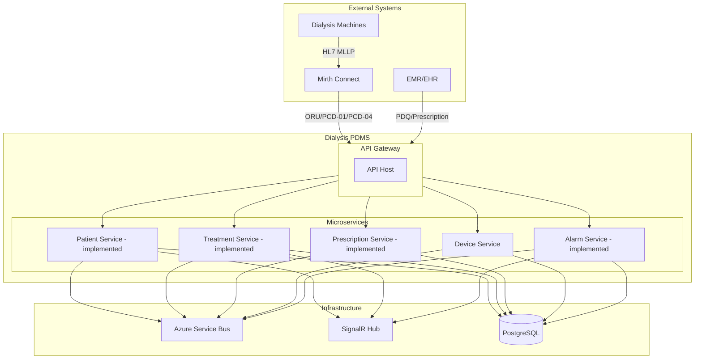

---

## 2. Domain Driven Design – Bounded Contexts

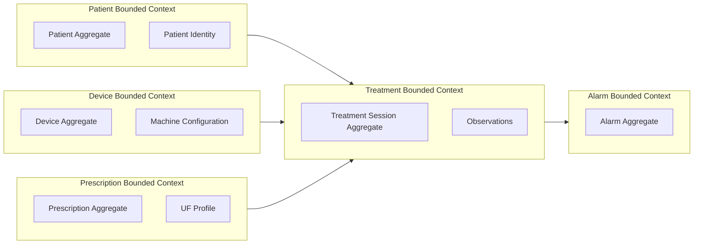

---

## 3. CQRS Pattern

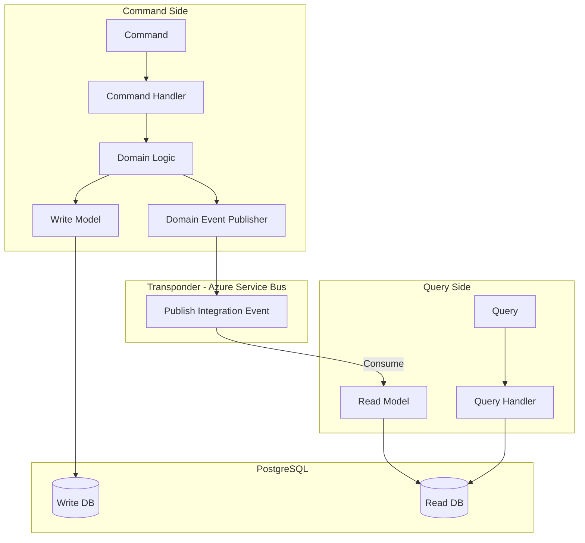

---

## 4. Vertical Slice Structure

Each feature is a vertical slice: request, handler, validator, response, and persistence.

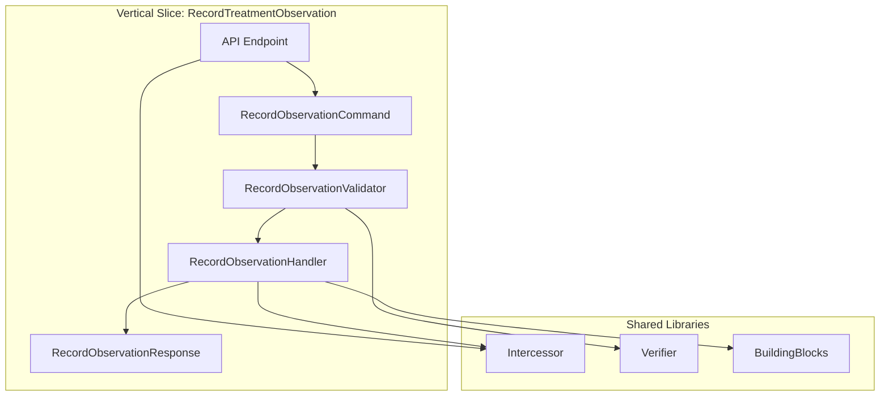

**Folder structure per vertical slice:**

```
Features/
└── Treatment/
    └── RecordObservation/
        ├── RecordObservationCommand.cs
        ├── RecordObservationCommandHandler.cs
        ├── RecordObservationValidator.cs
        └── RecordObservationResponse.cs
```

---

## 5. Saga Orchestration (Transponder)

Long-running, multi-step workflows use Transponder Saga Orchestration. The orchestrator owns saga state, executes steps in order, and runs compensations on failure.

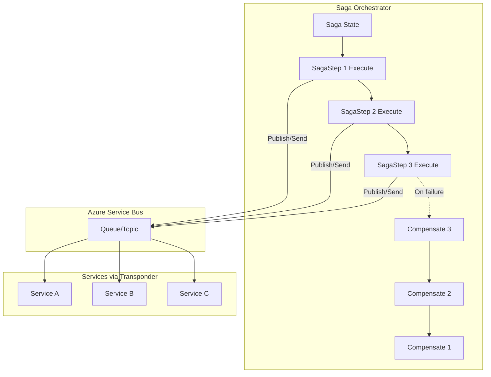

**Usage**: `UseSagaOrchestration(b => b.AddSaga<TSaga, TState>(...))`; implement `ISagaMessageHandler<TState, TMessage>` and `ISagaStepProvider<TState, TMessage>`.

---

## 6. Authentication & Authorization (C5)

All business endpoints require JWT. Scope policies enforce Read/Write/Admin per bounded context.

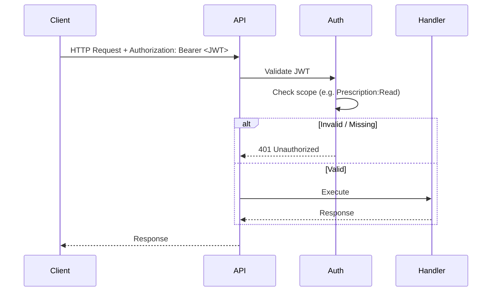

**Scope policies per service:**

| Service | Read | Write |
|---------|------|-------|
| Prescription | `Prescription:Read`, `Prescription:Admin` | `Prescription:Write`, `Prescription:Admin` |
| Patient | `Patient:Read`, `Patient:Admin` | `Patient:Write`, `Patient:Admin` |
| Treatment | `Treatment:Read`, `Treatment:Admin` | `Treatment:Write`, `Treatment:Admin` |
| Alarm | `Alarm:Read`, `Alarm:Admin` | `Alarm:Write`, `Alarm:Admin` |

**Development**: `Authentication:JwtBearer:DevelopmentBypass: true` in Development allows requests without a valid JWT for local testing.

**Multi-tenancy**: `X-Tenant-Id` header; default `default` when omitted. `TenantResolutionMiddleware` runs early; `ITenantContext` provides tenant for the request. All bounded contexts are tenant-scoped: Prescription, Patient, Treatment, and Alarm persistence filter by `TenantId`.

**Audit**: `IAuditRecorder` logs security-relevant actions. Use `AddFhirAuditRecorder()` (Prescription API) to store events for FHIR export: `GET /api/audit-events` returns a FHIR Bundle of `AuditEvent` resources. C5 compliant.

---

## 7. Prescription HL7 Flow (QBP^D01 / RSP^K22)

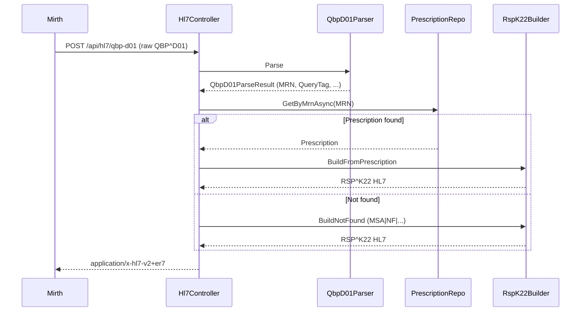

---

## 8. Request Pipeline (Intercessor + Verifier)

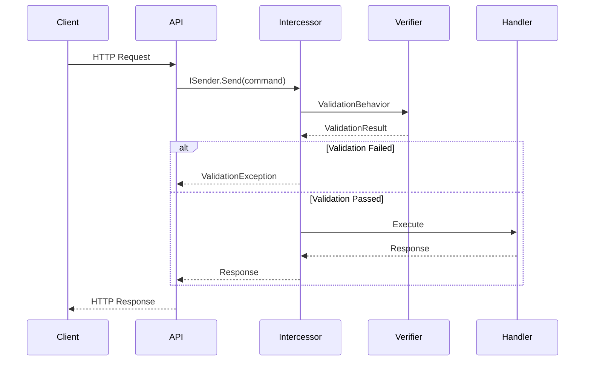

---

## 9. Messaging Flow (Transponder + Azure Service Bus)

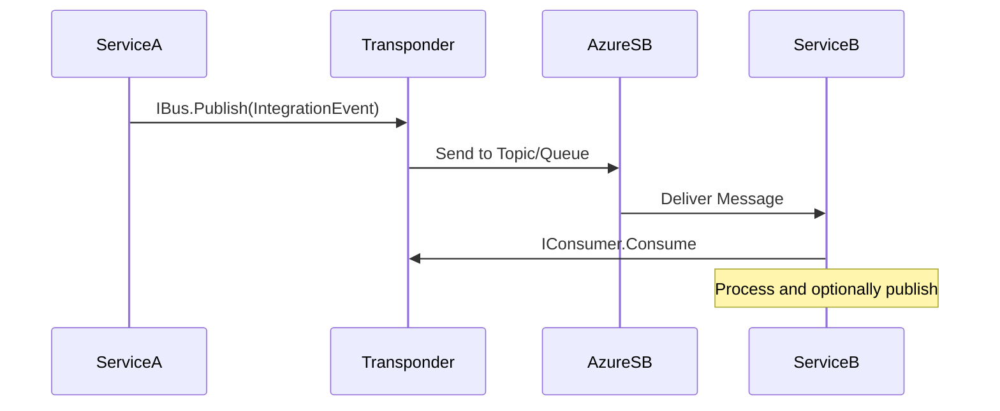

---

## 10. Real-time Flow (SignalR)

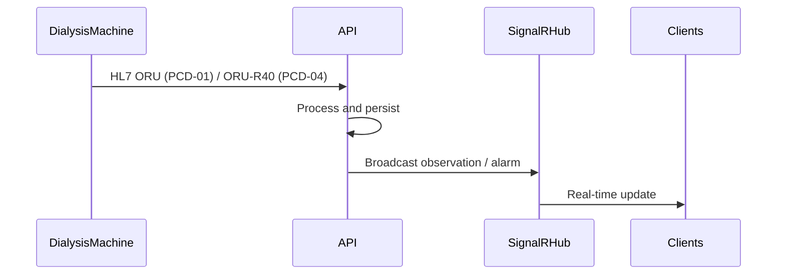

**Treatment**: Observations via `signalr://group/session:{sessionId}`. **Alarm**: Alarms via `signalr://group/session:{sessionId}` or `signalr://group/device:{deviceId}`.

---

## 11. Data Flow Summary

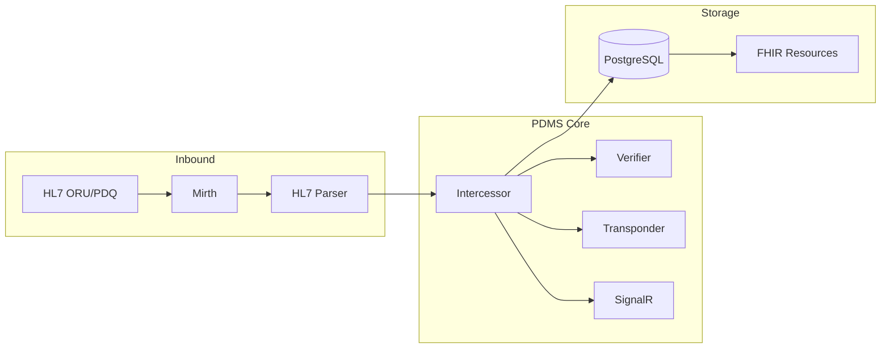

---

## 12. Treatment FHIR Endpoint

`GET /api/treatment-sessions/{sessionId}/fhir` returns a FHIR R4 Bundle containing a `Procedure` (hemodialysis session) and related `Observation` resources (device observations). Uses `ProcedureMapper` and `ObservationMapper` from Dialysis.Hl7ToFhir.

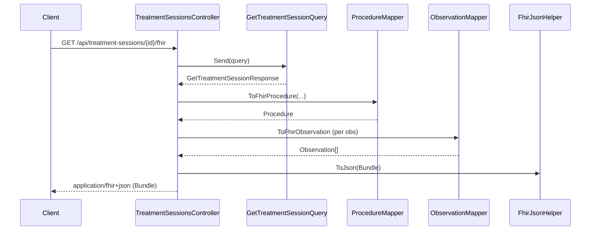

**Response:** `Bundle` (type `collection`) with `Procedure` + `Observation`s. Requires `TreatmentRead` scope. Audited via `IAuditRecorder`.

---

## 14. SignalR Real-Time Observations (Transponder)

The Treatment API uses **Transponder SignalR transport** for real-time device observation broadcast. When an ORU^R01 message is ingested, `ObservationRecordedEvent` is raised; `ObservationRecordedTransponderHandler` sends `ObservationRecordedMessage` via Transponder to `signalr://group/session:{sessionId}`.

**Flow:**
1. Client connects to Transponder hub at `/transponder/transport` with JWT (`access_token` query param).
2. Client calls `JoinGroup("session:THERAPY001")` to subscribe to a treatment session.
3. As HL7 ORU messages are ingested, observations are sent to the group via Transponder (method `Send`).
4. Client receives `SignalRTransportEnvelope` with serialized `ObservationRecordedMessage` in `Body`.

**Endpoint:** `GET /transponder/transport` (Transponder SignalR hub). Requires `TreatmentRead` or `AlarmRead` policy depending on service.

---

## 14a. Alarm API & SignalR (Transponder)

The Alarm API uses **Transponder SignalR transport** for real-time alarm broadcast. When an ORU^R40 message is ingested, `AlarmRaisedEvent` is raised; `AlarmRaisedTransponderHandler` sends `AlarmRecordedMessage` to `signalr://group/session:{sessionId}` (or `device:{deviceId}` when no session). `AlarmRaisedIntegrationEventHandler` publishes `AlarmRaisedIntegrationEvent` via `IPublishEndpoint` for downstream consumers.

**Alarm REST API:**
- `GET /api/alarms?deviceId=&sessionId=&from=&to=` – List alarms with optional filters (AlarmRead)
- `POST /api/hl7/alarm` – Ingest ORU^R40 (AlarmWrite), returns ORA^R41

**OBX-8 interpretation:** Priority (PH/PM/PL), type (SP/ST/SA), abnormality (L/H) are parsed and persisted.

---

## 15. Migrations (EF Core)

Prescription service uses EF Core migrations. Apply on startup in Development via `MigrateAsync()`. To add a new migration:

```bash
dotnet ef migrations add <Name> \
  --project Services/Dialysis.Prescription/Dialysis.Prescription.Infrastructure/Dialysis.Prescription.Infrastructure.csproj \
  --startup-project Services/Dialysis.Prescription/Dialysis.Prescription.Api/Dialysis.Prescription.Api.csproj \
  --output-dir Persistence/Migrations
```

---

## Document Maintenance

- **On every architecture change**: Update this document and commit.
- **On new microservice**: Add to diagrams and `ARCHITECTURE-CONSTRAINTS.md`.
- **On new vertical slice**: Document in feature WIKI.
