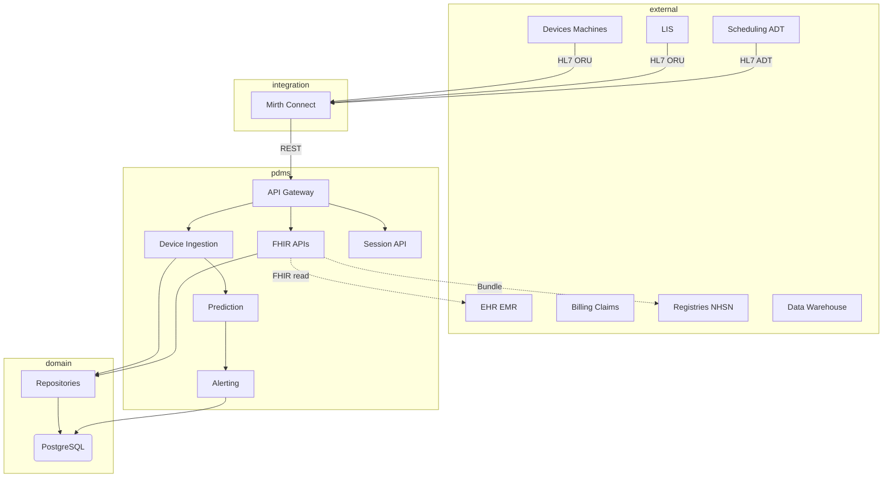
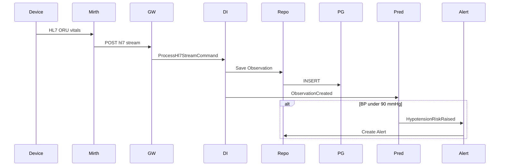
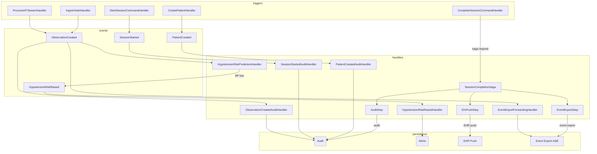
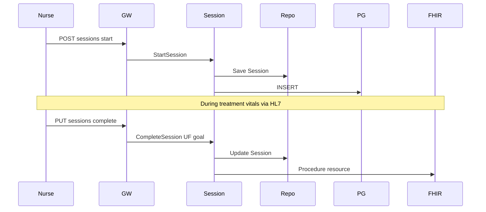

# Dialysis PDMS – System Architecture & Prioritized Roadmap

System architecture diagram and prioritized next steps for the Dialysis PDMS, aligned with the dialysis domain (pre-treatment, per-treatment workflow, quality reporting).

---

## 1. System Architecture Diagram

### 1.1 High-Level Ecosystem View



### 1.2 Dialysis Domain Workflow Overlay

Maps domain processes to PDMS components and implementation status:

```mermaid
graph TB
    subgraph pre_treatment
        REF[Referral Onboarding]
        MOD[Modality Decision]
        ACCESS[Vascular Access Tracking]
        PLANS[Dry Weight KtV Anemia Protocols]
    end

    subgraph per_treatment
        CHECK[1. Check-in Verification]
        PRE[2. Pre-assessment weight BP access]
        SETUP[3. Machine setup]
        RUN[4. Treatment run vitals alarms UF]
        MEDS[5. Med administration]
        POST[6. Post-assessment]
        DOC[7. Documentation charge]
        ORDERS[8. Orders follow-ups]
    end

    subgraph quality
        QIP[ESRD QIP CMS]
        INF[Infection Reporting]
        ADEQ[Adequacy KtV]
    end

    subgraph pdms_impl
        P1[Patient Observation]
        P2[Vitals ingest HL7 ORU]
        P3[Hypotension prediction Alerts]
        P4[Session lifecycle API]
        P5[HL7 ADT patient sync]
        P6[Procedure resource]
        P7[Labs meds access]
        P8[Audit quality bundles]
    end

    CHECK --> P1
    PRE --> P1
    RUN --> P1
    RUN --> P3
    PRE --> P2
    RUN --> P2
    PLANS --> P7
    ACCESS --> P7
    ORDERS --> P7
    DOC --> P8
    QIP --> P8
```



### 1.3 Data Flow – Inbound (Current)



### 1.4 Events Workflow

In-process event flow via Intercessor (IPublisher / INotificationHandler). Multiple handlers can react to the same event.



**Event summary:**

| Event / flow | Trigger | Handlers |
|--------------|---------|----------|
| `PatientCreated` | Patient create | Audit |
| `SessionStarted` | Session start | Audit |
| **Session complete** | Complete session API | `SessionCompletionSaga` (orchestration) → `EhrPushStep`, `AuditStep`, `EventExportStep`. Requires EventExport (ASB); throws explicit error if not configured. Compensation via Transponder inbox/outbox. |
| `ObservationCreated` | Vitals/HL7 ingest | Hypotension prediction, Event export, Audit |
| `HypotensionRiskRaised` | BP &lt; 90 (from ObservationCreated) | Create Alert |

**Note:** Session completion uses Transponder saga orchestration only. EventExport (Azure Service Bus) must be configured. Transponder inbox/outbox and saga persistence use PostgreSQL (same connection, `__TransponderMigrations` history table). Choreography fallback has been removed.

### 1.5 Data Flow – Session Lifecycle (Planned)



---

## 2. Implementation Status Summary

| Component | Status | Notes |
|-----------|--------|-------|
| Patient, Observation | ✅ | CRUD, FHIR read/create/search |
| Vitals ingest (JSON, HL7 ORU) | ✅ | `POST /api/v1/vitals/ingest`, `/hl7/stream` |
| Mirth config docs | ✅ | [docs/mirth/](mirth/README.md) |
| Hypotension prediction | ✅ | Rule-based, BP &lt; 90 → HypotensionRiskRaised |
| Alerting (create, acknowledge) | ✅ | Events + `GET/POST /api/v1/alerts` |
| FHIR CapabilityStatement | ✅ | `GET /fhir/r4/metadata` |
| Session aggregate (domain) | ✅ | Start, Complete, UF in domain + repo |
| Session lifecycle API | ✅ | `POST/PUT/GET /api/v1/sessions` |
| HL7 ADT A04/A08 | ✅ | Via `POST /api/v1/hl7/stream` |
| FHIR Procedure resource | ✅ | `GET /fhir/r4/Procedure` |
| Audit / consent logging | ✅ | `POST/GET /api/v1/audit` |
| Lab adequacy (URR, Kt/V, Hb) | ✅ | `GET /api/v1/adequacy?patientId=` |
| Vascular access tracking | ✅ | `POST/GET /api/v1/vascular-access` |
| FHIR Bundle export | ✅ | `GET /fhir/r4/Patient/{id}/everything` |
| Quality bundles (NHSN) | ✅ | `GET /api/v1/quality/bundle` |
| Cohort queries, export | ✅ | `GET /api/v1/cohorts/query`, `/cohorts/export` |
| Encounter sync (Session) | ✅ | Session.EncounterId, StartSessionRequest.EncounterId |
| MedicationAdministration | ✅ | `POST/GET /api/v1/meds`, `GET /fhir/r4/MedicationAdministration` |
| ServiceRequest (orders) | ✅ | `POST/GET /api/v1/orders` |
| Session completion saga | ✅ | Transponder orchestration (SessionCompletion:UseSaga); EHR push, audit, compensation |
| Web UI (nurse) | ✅ | `/` – patients, sessions |

---

## 3. Prioritized Next Steps

**Do in this order** unless you have a specific constraint (e.g. regulatory deadline).

| # | Item | Phase | Effort | Why first |
|---|------|-------|--------|-----------|
| **1** | **Session lifecycle API** | 3.3 | Medium | Session aggregate exists; completes per-treatment workflow (B.4, B.6, B.7). Start/stop/UF is core dialysis UX. |
| **2** | **HL7 ADT A04/A08** | 1.3.2 | Medium | Patient sync from scheduling/ADT. Completes inbound patient flow (A.1 check-in). |
| **3** | **FHIR Procedure resource** | 2.1.4 | Low | Expose dialysis session as `Procedure` for EHR/registries. Depends on Session. |
| **4** | **Audit / consent logging** | 3.4 | Medium | Compliance. Can run in parallel with 1–3. |
| **5** | **Lab result handling (URR, Kt/V, Hb)** | 1.2+ | Medium | Quality inputs (C); needed for adequacy. Extend Observation mapping. |
| **6** | **Vascular access tracking** | New | High | Pre-treatment (A.3); unlocks access complications. |
| **7** | **Quality bundles (NHSN)** | 2.2.1 | High | Regulatory; de-identified export. Defer until core data is solid. |

### Dependency Chain

```
Session aggregate (✅) → Session API (1) → Procedure resource (3)
                                   → Charge capture (future)
HL7 ORU (✅) → Labs (5)
ADT (2) → Patient verification at check-in
```

### Quick Wins (if time-constrained)

1. **Session lifecycle API** – `POST /sessions`, `PUT /sessions/{id}/complete` with UF. Session domain already exists.
2. **Procedure resource** – Map `Session` → FHIR `Procedure` once Session API is live.
3. **ADT A04 handler** – Parse ADT, create/update Patient by MRN. Complements existing Patient create.

### Recommended Next Steps (Post–Phase 4)

| # | Item | Status | Notes |
|---|------|--------|-------|
| 1 | **Session completion saga** | ✅ | Transponder orchestration; EHR push, audit, compensation |
| 2 | **Web UI** | ✅ | Nurse UI at `/` – patients, sessions |
| 3 | **Meds** | ✅ | MedicationAdministration – `POST/GET /api/v1/meds`, FHIR endpoint |
| 4 | **Care plans / orders** | ✅ | ServiceRequest – `POST/GET /api/v1/orders` |
| 5 | **Observability** | 🔲 | OpenTelemetry tracing/metrics |

---

## 4. Domain Data Categories → FHIR Mapping (Reference)

| Domain category | FHIR resources | PDMS status |
|-----------------|----------------|-------------|
| Treatments (session, UF, machine settings) | `Procedure`, `Encounter` | Session ✅; Procedure ✅ |
| Vitals (pre/post BP, weight, HR) | `Observation` | ✅ |
| Labs (URR, Kt/V, Hb, ferritin, PTH…) | `Observation`, `DiagnosticReport` | Via HL7 ✅; structured adequacy 🔲 |
| Meds (ESA, iron, heparin, binders) | `MedicationAdministration`, `MedicationRequest` | MedicationAdministration ✅; MedicationRequest 🔲 |
| Access (fistula, graft, catheter) | `Procedure`, `Device`, `Condition` | VascularAccess tracking ✅ |
| Adverse events (hypotension, cramps) | `Observation`, `Flag` | Alerts ✅; full event model 🔲 |
| Care plans / orders | `CarePlan`, `ServiceRequest` | ServiceRequest ✅; CarePlan 🔲 |

---

## 5. References

- [PLATFORM-ARCHITECTURE.md](PLATFORM-ARCHITECTURE.md) – **Concrete system architecture plan** (channels, core services, tech stack, Transponder Sagas orchestration)
- [ENVIRONMENT-SPECIFIC-PROPOSAL.md](ENVIRONMENT-SPECIFIC-PROPOSAL.md) – **Environment-driven design** (Germany/EU vs US, dataset, FHIR IG, .NET structure)
- [C5-COMPLIANCE.md](C5-COMPLIANCE.md) – **C5 security best practices** (access control, audit, encryption, multi-tenancy)
- [ECOSYSTEM-PLAN.md](ECOSYSTEM-PLAN.md) – Full phased plan
- [docs/mirth/](mirth/README.md) – Mirth integration
- [healthcare_systems_&_dialysis_architecture.md](../src/Dialysis/healthcare_systems_&_dialysis_architecture.md) – Theory and learning path
