# Dialysis PDMS System Architecture

## Overview

The Dialysis PDMS follows **Microservice Architecture**, **Domain Driven Design (DDD)**, **CQRS**, and **Vertical Slice Architecture**. All changes must update this document.

## Technology Stack

| Concern | Technology |
|---------|------------|
| Mediator | Intercessor |
| Validation | Verifier |
| Messaging | Transponder (SignalR, Azure Service Bus, RabbitMQ, Kafka) |
| Long-running transactions | Transponder Saga Orchestration |
| Real-time | SignalR (via Transponder) |
| Database | PostgreSQL |

---

## 1. Microservice Architecture

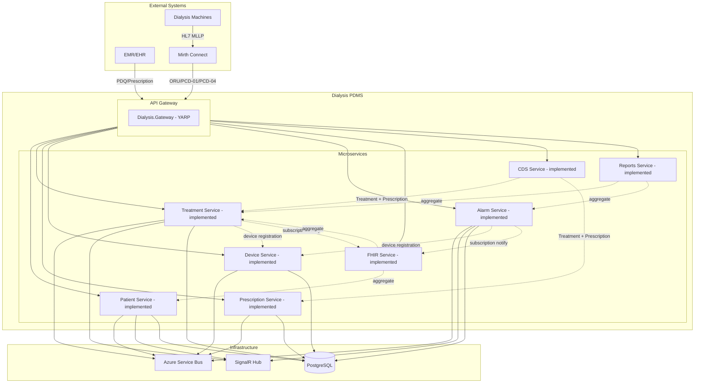

---

## 2. Domain Driven Design – Bounded Contexts

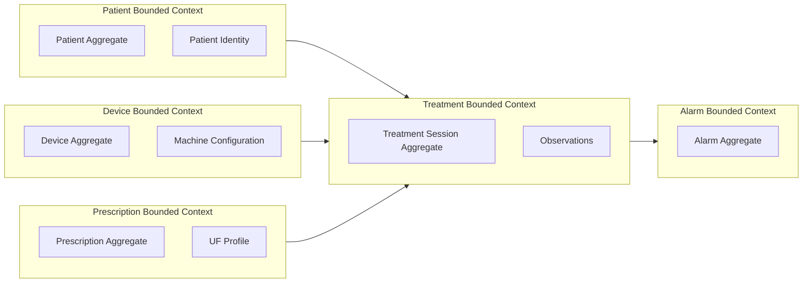

---

## 3. CQRS Pattern

Each bounded context uses **separate read and write persistence**:

- **Write side**: `XxxDbContext` (implements `IDbContext`), repositories for aggregate roots, command handlers
- **Read side**: `XxxReadDbContext` (implements `IReadOnlyDbContext`), read models, `IXxxReadStore`, query handlers

Read DbContexts use `SaveChanges` override that throws; all queries use `NoTracking`. Same database; no eventual consistency.

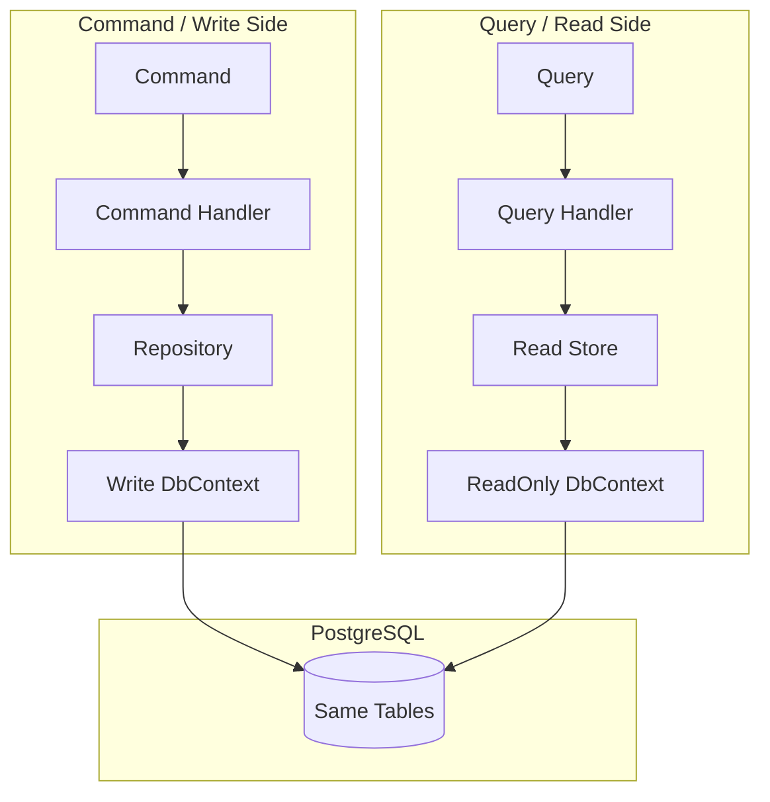

**Services with ReadModels (all implemented)**:
- **Patient**: `PatientReadDbContext`, `PatientReadModel`, `IPatientReadStore`, `PatientReadStore`
- **Treatment**: `TreatmentReadDbContext`, `TreatmentSessionReadModel`, `ObservationReadModel`, `ITreatmentReadStore`, `TreatmentReadStore`
- **Alarm**: `AlarmReadDbContext`, `AlarmReadModel`, `IAlarmReadStore`, `AlarmReadStore`
- **Prescription**: `PrescriptionReadDbContext`, `PrescriptionReadModel`, `IPrescriptionReadStore`, `PrescriptionReadStore`
- **Device**: `DeviceReadDbContext`, `DeviceReadModel`, `IDeviceReadStore`, `DeviceReadStore`

Query handlers use the read store; write repositories retain only methods needed by command handlers.

**ReadModel rule**: All query operations in ReadStores must use `AsNoTracking()` on each query (or set `ChangeTracker.QueryTrackingBehavior = NoTracking` on the Read DbContext).

### 3.1 CQRS Architecture Decisions

| Decision | Rationale |
|----------|-----------|
| Same database for read and write | No eventual consistency; simpler ops; ReadModels map to same tables as write entities |
| Read DbContexts implement `IReadOnlyDbContext` | Marker interface; `SaveChanges` throws to prevent accidental writes |
| Write repositories slimmed to command-only methods | `GetByIdAsync`, `GetAlarmsAsync`, etc. moved to ReadStores; repositories retain only what command handlers need (e.g. `GetActiveBySourceAsync`, `GetByDeviceEui64Async`, `GetLatestByMrnAsync` for ProcessQbpD01) |
| Tenant passed explicitly to ReadStores | Handlers inject `ITenantContext` and pass `_tenant.TenantId`; consistent with multi-tenancy rules |

### 3.2 Write Repository Methods (Command-Side Only)

| Service | Write repository methods retained | Purpose |
|---------|----------------------------------|---------|
| Patient | `GetByMrnAsync`, `GetByPersonNumberAsync`, `GetBySsnAsync`, `SearchByNameAsync`, `SearchByLastNameAsync` | ProcessQbpQ22, IngestRspK22 need full Patient for HL7 RSP^K22 |
| Treatment | `AddAsync`, `Update`, `Delete`, `GetBySessionIdAsync` | RecordObservation, IngestOruBatch load session for append |
| Alarm | `GetActiveBySourceAsync`, `AddAsync`, `Update`, `Delete` | RecordAlarm needs active alarm for continue/end lifecycle |
| Prescription | `GetByOrderIdAsync`, `GetLatestByMrnAsync`, `AddAsync`, `Update`, `Delete` | IngestRspK22 (order lookup), ProcessQbpD01 (RSP^K22 build from entity) |
| Device | `GetByDeviceEui64Async`, `AddAsync`, `Update`, `Delete` | RegisterDevice upsert by EUI-64 |

### 3.3 Read DbContext Migrations

Read DbContexts (`XxxReadDbContext`) map to the **same tables** as write DbContexts. They do **not** require separate EF Core migrations. Schema changes are driven by the write DbContext migrations only.

---

## 4. Vertical Slice Structure

Each feature is a vertical slice: request, handler, validator, response, and persistence.

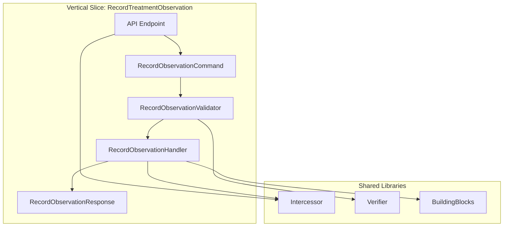

**Folder structure per vertical slice:**

```
Features/
└── Treatment/
    └── RecordObservation/
        ├── RecordObservationCommand.cs
        ├── RecordObservationCommandHandler.cs
        ├── RecordObservationValidator.cs
        └── RecordObservationResponse.cs
```

---

## 5. Saga Orchestration (Transponder)

Long-running, multi-step workflows use Transponder Saga Orchestration. The orchestrator owns saga state, executes steps in order, and runs compensations on failure.

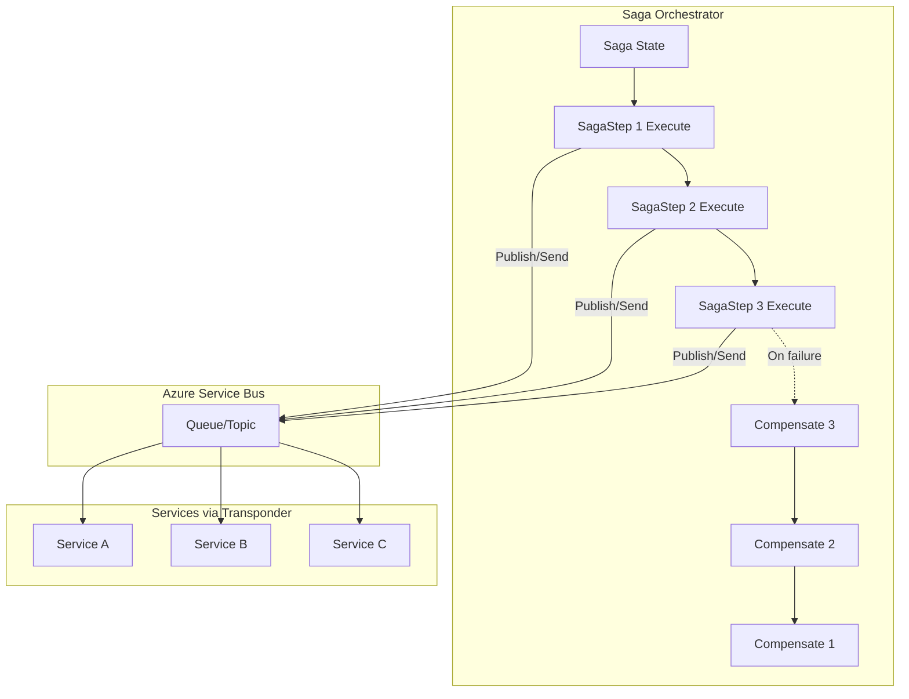

**Usage**: `UseSagaOrchestration(b => b.AddSaga<TSaga, TState>(...))`; implement `ISagaMessageHandler<TState, TMessage>` and `ISagaStepProvider<TState, TMessage>`.

---

## 6. Authentication & Authorization (C5)

All business endpoints require JWT. Scope policies enforce Read/Write/Admin per bounded context.

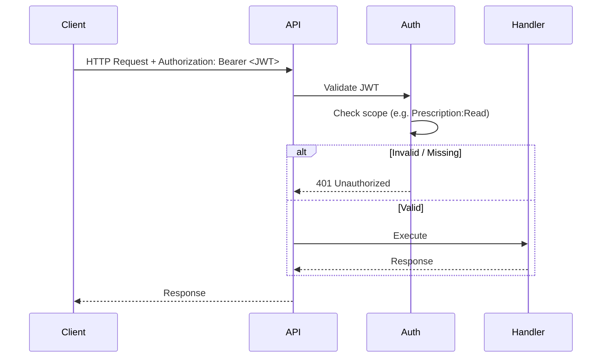

**Scope policies per service:**

| Service | Read | Write |
|---------|------|-------|
| Prescription | `Prescription:Read`, `Prescription:Admin` | `Prescription:Write`, `Prescription:Admin` |
| Patient | `Patient:Read`, `Patient:Admin` | `Patient:Write`, `Patient:Admin` |
| Treatment | `Treatment:Read`, `Treatment:Admin` | `Treatment:Write`, `Treatment:Admin` |
| Alarm | `Alarm:Read`, `Alarm:Admin` | `Alarm:Write`, `Alarm:Admin` |

**Development**: `Authentication:JwtBearer:DevelopmentBypass: true` in Development allows requests without a valid JWT for local testing.

**Multi-tenancy**: `X-Tenant-Id` header; default `default` when omitted. `TenantResolutionMiddleware` runs early; `ITenantContext` provides tenant for the request. All bounded contexts are tenant-scoped: Prescription, Patient, Treatment, and Alarm persistence filter by `TenantId`.

**Audit**: `IAuditRecorder` logs security-relevant actions. Use `AddFhirAuditRecorder()` (Prescription API) to store events for FHIR export: `GET /api/audit-events` returns a FHIR Bundle of `AuditEvent` resources. C5 compliant.

---

## 7. Prescription HL7 Flow (QBP^D01 / RSP^K22)

**Note:** ProcessQbpD01 uses the **write repository** (`GetLatestByMrnAsync`), not the ReadStore, because `RspK22Builder.BuildFromPrescription` requires the full `Prescription` entity (including `Settings`).

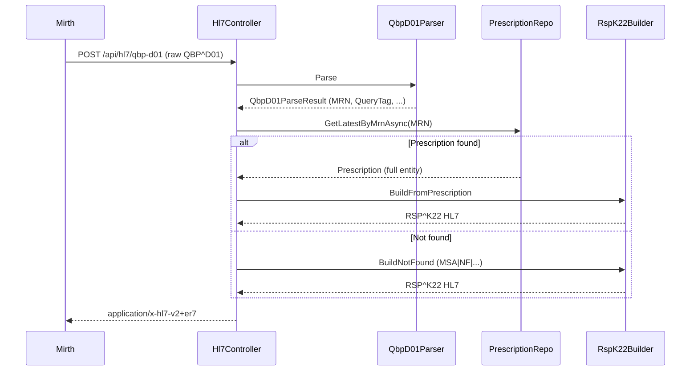

---

## 8. Request Pipeline (Intercessor + Verifier)

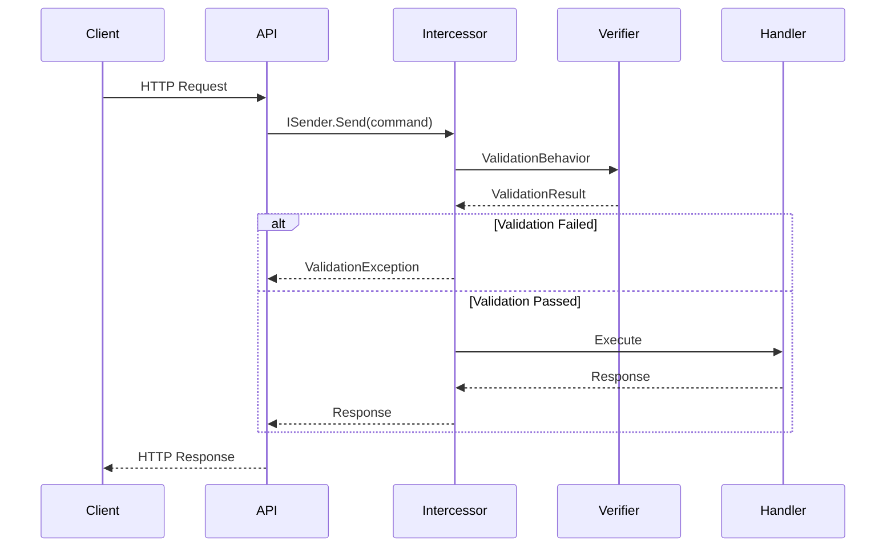

---

## 9. Messaging Flow (Transponder + Azure Service Bus)

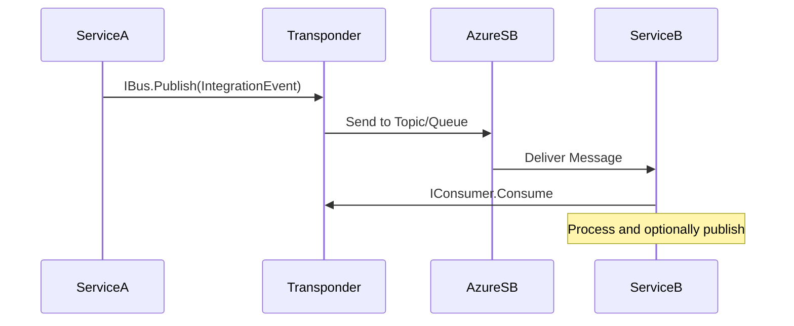

---

## 10. Real-time Flow (SignalR)

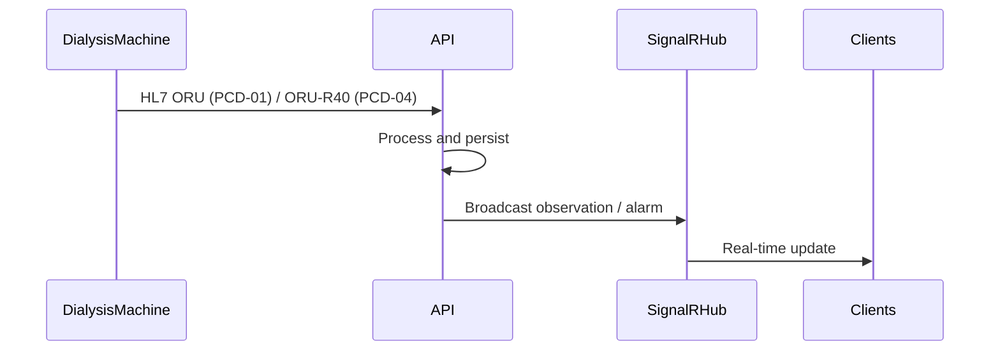

**Treatment**: Observations via `signalr://group/session:{sessionId}`. **Alarm**: Alarms via `signalr://group/session:{sessionId}` or `signalr://group/device:{deviceId}`.

---

## 11. Data Flow Summary

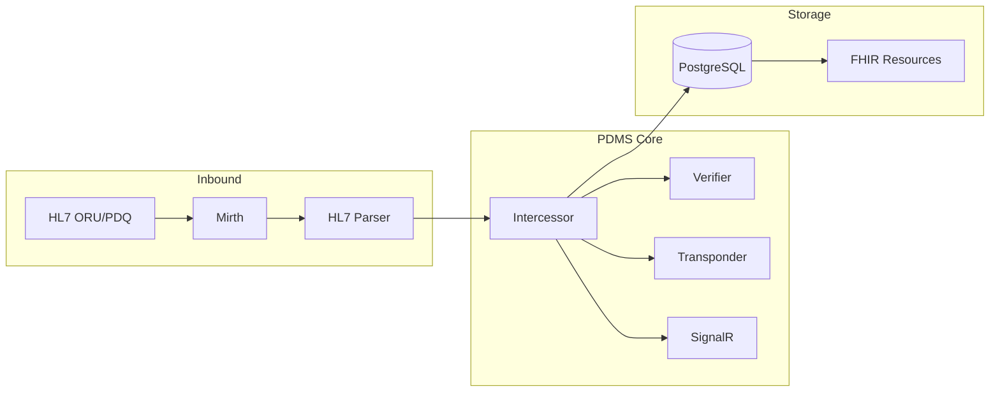

---

## 12. Treatment FHIR Endpoint

`GET /api/treatment-sessions/{sessionId}/fhir` returns a FHIR R4 Bundle containing a `Procedure` (hemodialysis session), `Observation` resources (device observations), and `Provenance` resources (one per observation with OBX-17). Uses `ProcedureMapper`, `ObservationMapper`, and `ProvenanceMapper` from Dialysis.Hl7ToFhir.

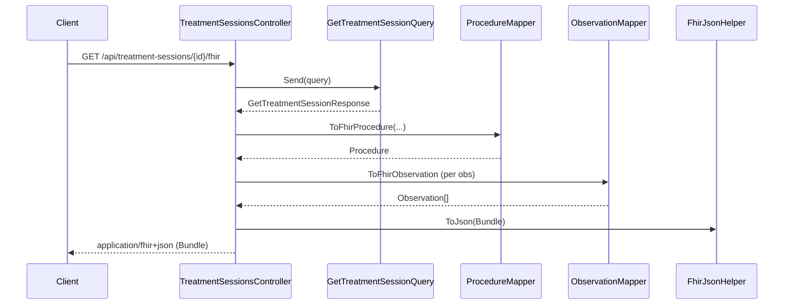

**Response:** `Bundle` (type `collection`) with `Procedure` + `Observation`s. Requires `TreatmentRead` scope. Audited via `IAuditRecorder`.

---

## 14. SignalR Real-Time Observations (Transponder)

The Treatment API uses **Transponder SignalR transport** for real-time device observation broadcast. When an ORU^R01 message is ingested, `ObservationRecordedEvent` is raised; `ObservationRecordedTransponderHandler` sends `ObservationRecordedMessage` via Transponder to `signalr://group/session:{sessionId}`.

**Flow:**
1. Client connects to Transponder hub at `/transponder/transport` with JWT (`access_token` query param).
2. Client calls `JoinGroup("session:THERAPY001")` to subscribe to a treatment session.
3. As HL7 ORU messages are ingested, observations are sent to the group via Transponder (method `Send`).
4. Client receives `SignalRTransportEnvelope` with serialized `ObservationRecordedMessage` in `Body`.

**Endpoint:** `GET /transponder/transport` (Transponder SignalR hub). Requires `TreatmentRead` or `AlarmRead` policy depending on service.

---

## 14a. Alarm API & SignalR (Transponder)

The Alarm API uses **Transponder SignalR transport** for real-time alarm broadcast. When an ORU^R40 message is ingested, `AlarmRaisedEvent` is raised; `AlarmRaisedTransponderHandler` sends `AlarmRecordedMessage` to `signalr://group/session:{sessionId}` (or `device:{deviceId}` when no session). `AlarmRaisedIntegrationEventHandler` publishes `AlarmRaisedIntegrationEvent` via `IPublishEndpoint` for downstream consumers.

**Alarm REST API:**
- `GET /api/alarms?deviceId=&sessionId=&from=&to=` – List alarms with optional filters (AlarmRead)
- `GET /api/alarms/fhir` – FHIR R4 Bundle of DetectedIssue resources (AlarmRead)
- `POST /api/hl7/alarm` – Ingest ORU^R40 (AlarmWrite), returns ORA^R41

**OBX-8 interpretation:** Priority (PH/PM/PL), type (SP/ST/SA), abnormality (L/H) are parsed and persisted.

---

## 14b. HL7-to-FHIR Adapter (Phase 5 Complete)

**Dialysis.Hl7ToFhir** provides static mappers consumed by API projects. All IMPLEMENTATION_PLAN Phase 5 tasks are implemented.

| FHIR Resource | Mapper | API Endpoint |
|---------------|--------|--------------|
| Procedure | ProcedureMapper | GET /api/treatment-sessions/{id}/fhir |
| Observation | ObservationMapper | GET /api/treatment-sessions/{id}/fhir |
| DetectedIssue | AlarmMapper | GET /api/alarms/fhir |
| ServiceRequest | PrescriptionMapper | GET /api/prescriptions/order/{id}/fhir |
| Patient | PatientMapper | GET /api/patients/mrn/{mrn}/fhir |
| Device | DeviceMapper | (used by mappers, not exposed as standalone) |
| Provenance | ProvenanceMapper | Included in treatment-session FHIR Bundle (OBX-17 → Provenance per Observation) |
| AuditEvent | AuditEventMapper | GET /api/audit-events |

**Code systems:** MDC (urn:iso:std:iso:11073:10101), UCUM (http://unitsofmeasure.org), LOINC, SNOMED CT.

---

## 14c. FHIR, CDS, and Reports Services

**FHIR Service (Dialysis.Fhir.Api, port 5055):** Aggregates FHIR resources from downstream APIs.

- `GET /api/fhir/$export` – Bulk export (Patient, Device, ServiceRequest, Procedure, Observation, DetectedIssue, AuditEvent)
- `POST|GET|DELETE /api/fhir/Subscription` – FHIR Subscription CRUD (rest-hook channel)
- `POST /api/fhir/subscription-notify` – Internal endpoint for Treatment/Alarm to trigger subscription dispatch

**Subscription dispatcher:** When Treatment records a Procedure/Observation or Alarm records a DetectedIssue, domain event handlers call the FHIR API’s notify endpoint. The dispatcher evaluates active rest-hook subscriptions, fetches the resource from the gateway, and POSTs a FHIR Bundle to each subscriber’s endpoint. Config: `FhirSubscription:NotifyUrl`, `FhirSubscription:NotifyApiKey` (optional).

**CDS Service (Dialysis.Cds.Api, port 5056):** Clinical decision support.

- `GET /api/cds/prescription-compliance?sessionId=X` – Compares treatment session vs prescription (blood flow, UF rate, UF target ±10%); returns FHIR DetectedIssue if deviation

**Reports Service (Dialysis.Reports.Api, port 5057):** Aggregate reports.

- `GET /api/reports/sessions-summary` – Session count, avg duration
- `GET /api/reports/alarms-by-severity` – Alarms grouped by severity
- `GET /api/reports/prescription-compliance` – % sessions within prescription tolerance

### FHIR, CDS, Reports – Data Consumption

| Service | Data source | Pattern |
|---------|-------------|---------|
| **FHIR** | HTTP calls to Patient, Treatment, Prescription, Alarm, Device APIs via gateway | Aggregates; no own persistence; no ReadModels |
| **CDS** | HTTP to Treatment + Prescription APIs | Fetches session + prescription; compares; returns DetectedIssue |
| **Reports** | HTTP to Treatment, Alarm, Prescription APIs | Aggregates counts; no own persistence |

These services are **stateless aggregators**. They consume data via REST from downstream APIs (which use ReadStores internally). No CQRS ReadModels in FHIR/CDS/Reports.

---

## 15. Migrations (EF Core)

All Dialysis services (Patient, Prescription, Treatment, Alarm, Device) use EF Core migrations. Apply on startup in Development via `MigrateAsync()`.

**Add a new migration:** From the solution root, run:

```bash
dotnet ef migrations add <MigrationName> --project <InfrastructureProject> --startup-project <ApiProject> --output-dir Persistence/Migrations
```

| Service      | Infrastructure Project | Api Project |
|--------------|------------------------|-------------|
| Patient      | `Services/Dialysis.Patient/Dialysis.Patient.Infrastructure/Dialysis.Patient.Infrastructure.csproj` | `Services/Dialysis.Patient/Dialysis.Patient.Api/Dialysis.Patient.Api.csproj` |
| Prescription | `Services/Dialysis.Prescription/Dialysis.Prescription.Infrastructure/Dialysis.Prescription.Infrastructure.csproj` | `Services/Dialysis.Prescription/Dialysis.Prescription.Api/Dialysis.Prescription.Api.csproj` |
| Treatment    | `Services/Dialysis.Treatment/Dialysis.Treatment.Infrastructure/Dialysis.Treatment.Infrastructure.csproj` | `Services/Dialysis.Treatment/Dialysis.Treatment.Api/Dialysis.Treatment.Api.csproj` |
| Alarm        | `Services/Dialysis.Alarm/Dialysis.Alarm.Infrastructure/Dialysis.Alarm.Infrastructure.csproj` | `Services/Dialysis.Alarm/Dialysis.Alarm.Api/Dialysis.Alarm.Api.csproj` |
| Device       | `Services/Dialysis.Device/Dialysis.Device.Infrastructure/Dialysis.Device.Infrastructure.csproj` | `Services/Dialysis.Device/Dialysis.Device.Api/Dialysis.Device.Api.csproj` |

**When to run migrations:**

| Environment | Strategy | Notes |
|-------------|----------|-------|
| **Development** | `MigrateAsync()` on app startup (when `IsDevelopment`) | Automatic; DB created/updated when API starts |
| **Production** | Choose one: (a) Startup, (b) CI/CD job, (c) Separate migration runner | Startup: simplest; CI/CD: run before deploy; Runner: explicit, no app dependency |
| **Docker Compose** | Startup (ASPNETCORE_ENVIRONMENT=Development) | Per-service DBs; migrations apply when each API starts |

For production, prefer running migrations as a distinct CI/CD step or hosted job before the API starts, to avoid multiple instances applying concurrently. If using startup, ensure only one replica migrates (e.g. leader election or init container).

**Read DbContexts:** `XxxReadDbContext` projects map to the same tables as write DbContexts. They do **not** need migrations. Register both DbContexts with the same connection string: `AddDbContext<XxxDbContext>(...)` and `AddDbContext<XxxReadDbContext>(...)`.

---

## 15a. Testing Infrastructure

**Testcontainers PostgreSQL:** Integration tests use `BuildingBlocks.Testcontainers` (PostgreSqlFixture, PostgreSqlCollectionDefinition) for real database behavior. Docker required locally and in CI. The fixture implements `IAsyncLifetime` and disposes the container when the collection finishes.

**Bogus:** Dialysis service tests use [Bogus](https://github.com/bchavez/Bogus) for deterministic fake data (`PatientTestData`, `PrescriptionTestData`, `TreatmentTestData`, `AlarmTestData`, `DeviceTestData`). Tests share a seeded Faker via `Randomizer.Seed` for reproducibility.

**Test isolation:** Tests in the same collection share one PostgreSQL instance. Each test that expects empty or specific data clears tables with `ExecuteDeleteAsync()` at the start (e.g. `await db.Alarms.ExecuteDeleteAsync()`).

**CQRS in tests:** Query verification uses `IXxxReadStore` (e.g. `IAlarmReadStore`, `ITreatmentReadStore`, `IDeviceReadStore`). Command flows use write repositories. See `docs/CQRS-READ-WRITE-SPLIT.md` for details.

---

## 16. Docker Compose (Full Stack Run)

The solution runs via `docker compose` for local development and integration testing.

| Service         | Host Port | Purpose                              |
|-----------------|-----------|--------------------------------------|
| postgres        | 5432      | Shared PostgreSQL; per-service DBs   |
| patient-api     | 5051      | Patient demographics                 |
| prescription-api| 5052      | Prescriptions, audit                 |
| treatment-api   | 5050      | Treatment sessions, ORU ingest       |
| alarm-api       | 5053      | Alarms                               |
| device-api      | 5054      | Devices                              |
| fhir-api        | 5055      | FHIR bulk export, Subscriptions      |
| cds-api         | 5056      | Clinical decision support            |
| reports-api     | 5057      | Sessions, alarms, compliance reports |
| gateway         | 5001      | YARP reverse proxy (unified API)     |

**Commands:**

```bash
docker compose up -d              # Start all services
curl http://localhost:5001/health  # Aggregate health
docker compose down               # Stop all
```

PostgreSQL init creates `dialysis_patient`, `dialysis_prescription`, `dialysis_treatment`, `dialysis_alarm`, `dialysis_device`. Each API runs EF migrations on startup (ASPNETCORE_ENVIRONMENT=Development). FHIR, CDS, and Reports APIs are stateless; they aggregate data from other services via the gateway.

---

## Document Maintenance

- **On every architecture change**: Update this document and commit.
- **On new microservice**: Add to diagrams and `ARCHITECTURE-CONSTRAINTS.md`.
- **On new vertical slice**: Document in feature WIKI.
- **CQRS reference**: See `docs/CQRS-READ-WRITE-SPLIT.md` for ReadStore/Repository responsibilities and audit checklist.
