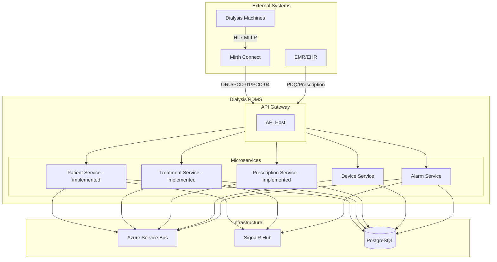
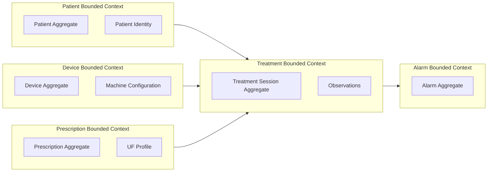
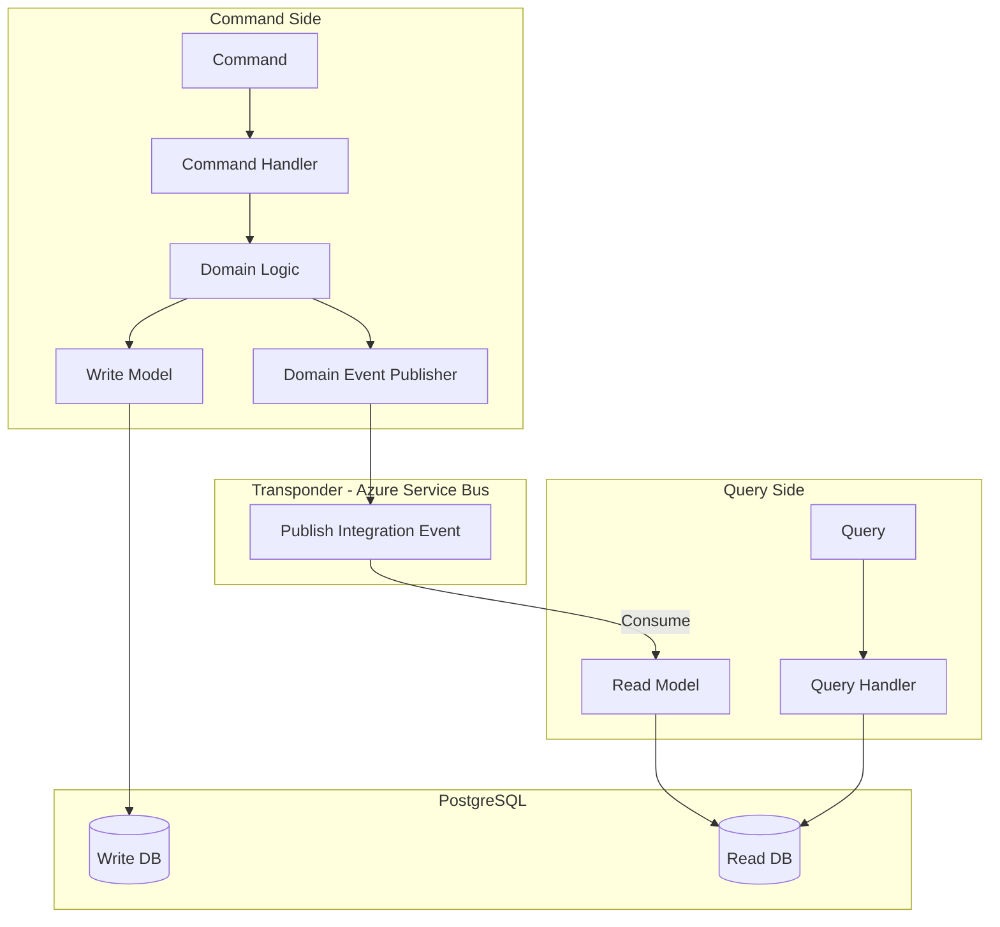
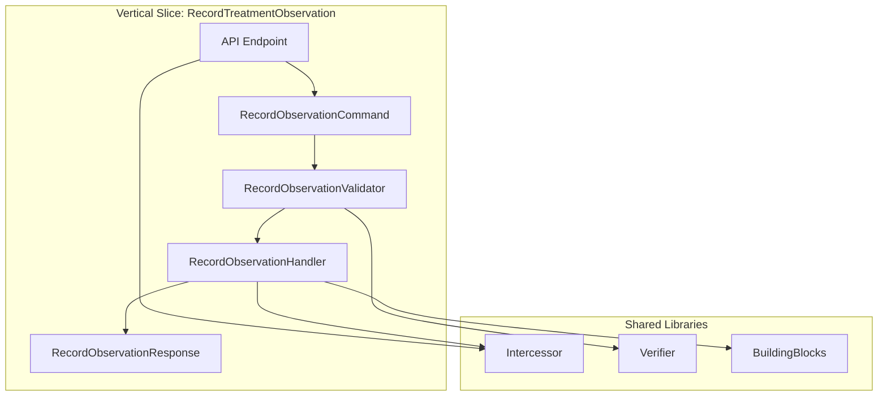
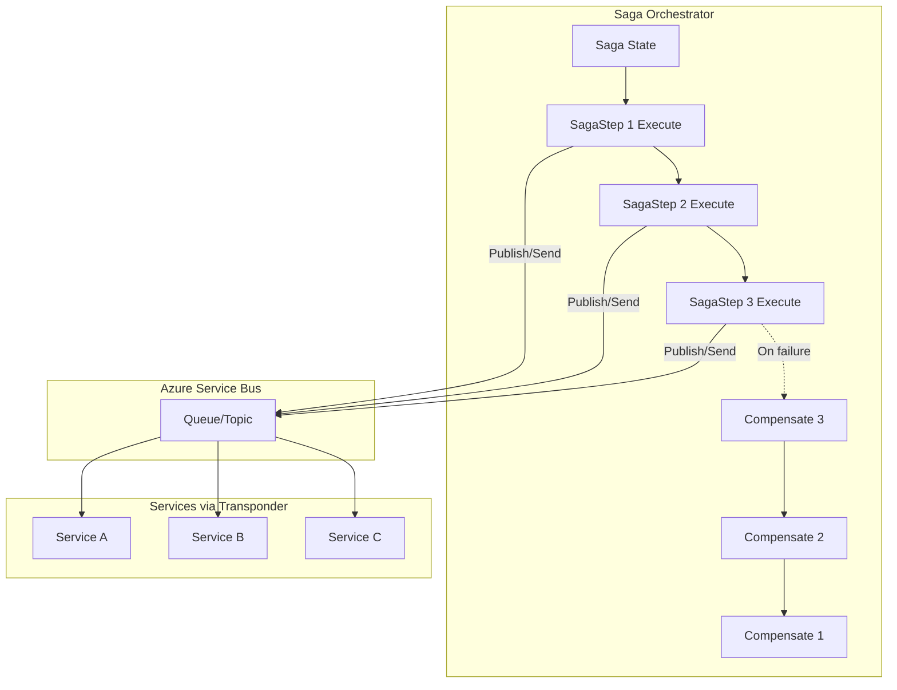
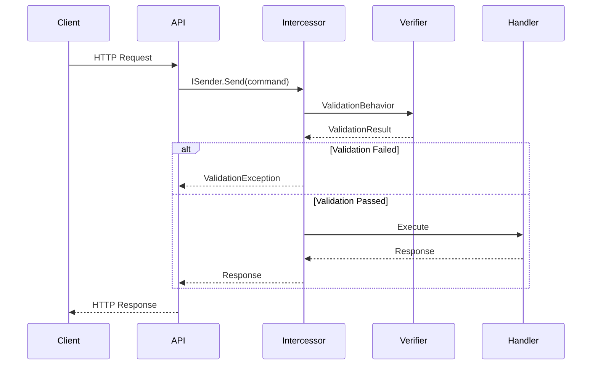
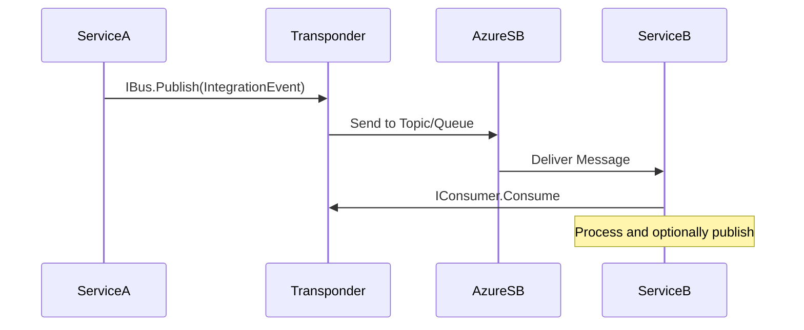
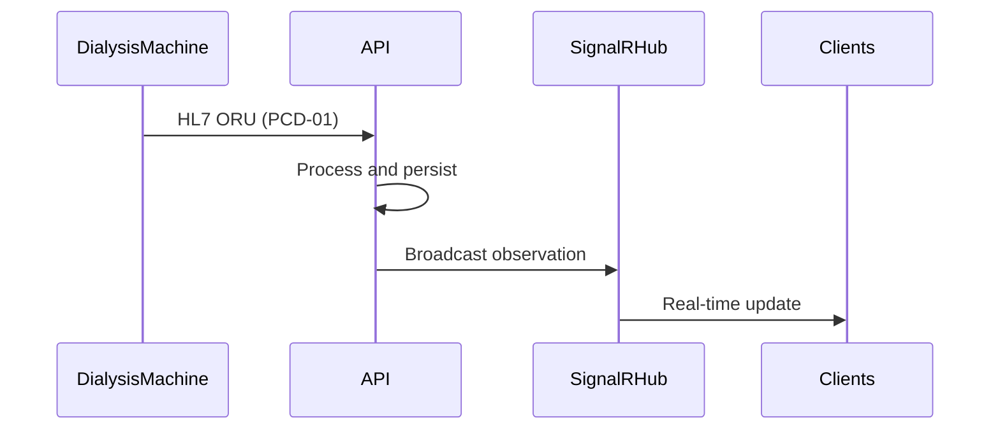
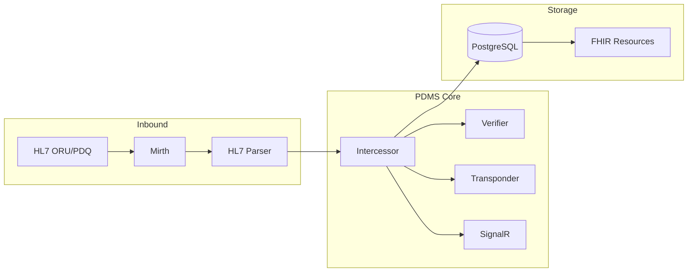

# Dialysis PDMS System Architecture

## Overview

The Dialysis PDMS follows **Microservice Architecture**, **Domain Driven Design (DDD)**, **CQRS**, and **Vertical Slice Architecture**. All changes must update this document.

## Technology Stack

| Concern | Technology |
|---------|------------|
| Mediator | Intercessor |
| Validation | Verifier |
| Messaging | Transponder (Azure Service Bus) |
| Long-running transactions | Transponder Saga Orchestration |
| Real-time | SignalR |
| Database | PostgreSQL |

---

## 1. Microservice Architecture



---

## 2. Domain Driven Design – Bounded Contexts



---

## 3. CQRS Pattern



---

## 4. Vertical Slice Structure

Each feature is a vertical slice: request, handler, validator, response, and persistence.



**Folder structure per vertical slice:**

```
Features/
└── Treatment/
    └── RecordObservation/
        ├── RecordObservationCommand.cs
        ├── RecordObservationCommandHandler.cs
        ├── RecordObservationValidator.cs
        └── RecordObservationResponse.cs
```

---

## 5. Saga Orchestration (Transponder)

Long-running, multi-step workflows use Transponder Saga Orchestration. The orchestrator owns saga state, executes steps in order, and runs compensations on failure.



**Usage**: `UseSagaOrchestration(b => b.AddSaga<TSaga, TState>(...))`; implement `ISagaMessageHandler<TState, TMessage>` and `ISagaStepProvider<TState, TMessage>`.

---

## 7. Request Pipeline (Intercessor + Verifier)



---

## 8. Messaging Flow (Transponder + Azure Service Bus)



---

## 9. Real-time Flow (SignalR)



---

## 10. Data Flow Summary



---

## Document Maintenance

- **On every architecture change**: Update this document and commit.
- **On new microservice**: Add to diagrams and `ARCHITECTURE-CONSTRAINTS.md`.
- **On new vertical slice**: Document in feature WIKI.
