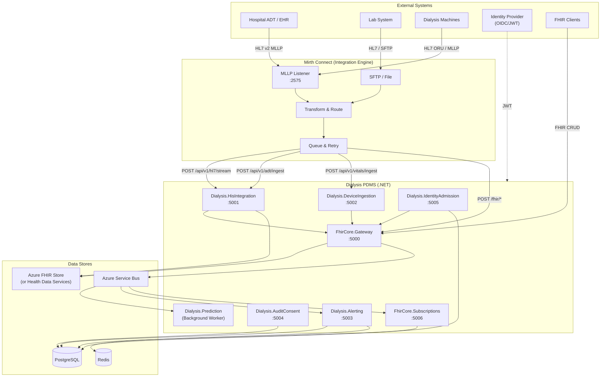
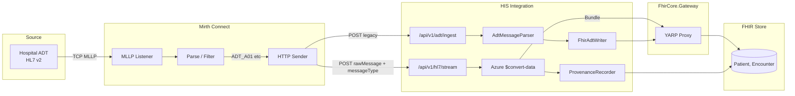
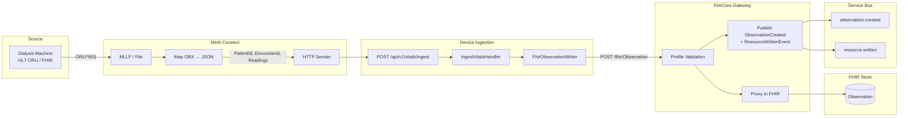
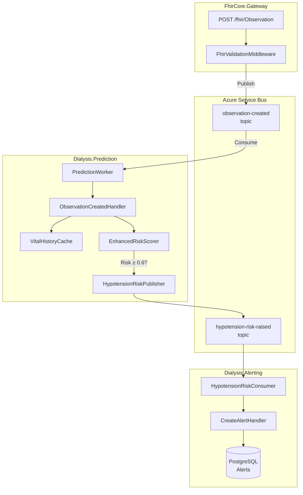
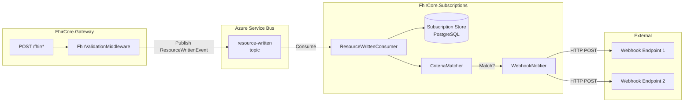
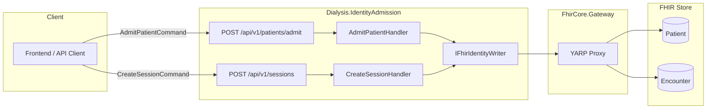
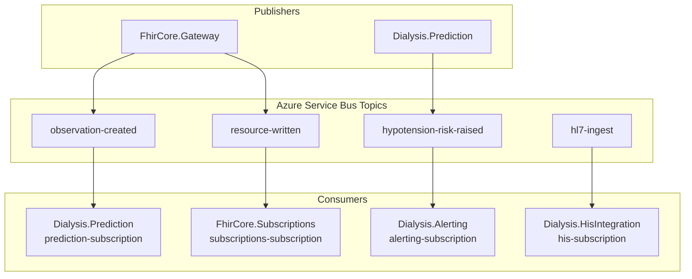

# Dialysis PDMS – System Architecture

This document describes the system architecture, components, and data flows of the Dialysis Patient Data Management System (PDMS) including the Mirth Connect integration engine.

---

## 1. High-Level Architecture

---

## 2. Component Inventory

| Component                            | Type                       | Responsibility                                                                                                       |
| ------------------------------------ | -------------------------- | -------------------------------------------------------------------------------------------------------------------- |
| **Mirth Connect**              | Integration Engine         | MLLP, SFTP, file connectivity; HL7 parsing; transform & route; queue, retry, dead-letter                             |
| **FhirCore.Gateway**           | Reverse Proxy + Validation | FHIR validation (IG profiles), YARP proxy to FHIR store, publishes `ResourceWrittenEvent` + `ObservationCreated` |
| **Dialysis.HisIntegration**    | Web API                    | ADT ingest (custom parser), HL7 streaming (Azure $convert-data), provenance, multi-tenant FHIR                       |
| **Dialysis.DeviceIngestion**   | Web API                    | Vitals ingest → FHIR Observations via Gateway                                                                       |
| **Dialysis.IdentityAdmission** | Web API                    | Patient admission, session scheduling → Patient/Encounter to FHIR                                                   |
| **Dialysis.Alerting**          | Web API + Consumer         | Create/acknowledge alerts; consumes `HypotensionRiskRaised` from Service Bus                                       |
| **Dialysis.AuditConsent**      | Web API                    | Audit event recording (ResourceType, Action, AgentId)                                                                |
| **Dialysis.Prediction**        | Background Worker          | Consumes `ObservationCreated`; risk scoring; publishes `HypotensionRiskRaised`                                   |
| **FhirCore.Subscriptions**     | Web API + Consumer         | CRUD for FHIR subscriptions; consumes `ResourceWrittenEvent`; criteria match → webhook                            |

---

## 3. ADT / HIS Integration Flow

Hospital ADT, lab, or upstream systems send HL7 v2 messages. Mirth receives them, transforms (optional), and forwards to HIS Integration.

---

## 4. Vitals / Device Ingestion Flow

Dialysis machines send vitals (HL7 ORU or proprietary). Mirth maps to `IngestVitalsCommand` or forwards FHIR directly to the Gateway.

---

## 5. Prediction & Alerting Flow

Observations written through the Gateway trigger hypotension risk prediction. High-risk scores produce alerts.

---

## 6. FHIR Subscription & Webhook Flow

FHIR resource writes are broadcast. Subscriptions service matches criteria and notifies registered webhooks.

---

## 7. HL7 Streaming via Service Bus

HL7 messages can be sent directly to Service Bus (bypassing Mirth) for async processing.

```mermaid
flowchart LR
    subgraph Producer["Producer"]
        Ext["External System / Mirth"]
    end

    subgraph ServiceBus["Azure Service Bus"]
        HL7Topic["hl7-ingest<br/>topic"]
        Sub["his-subscription"]
    end

    subgraph HIS["HIS Integration"]
        Hl7Consumer["Hl7StreamConsumer"]
        Handler2["Hl7StreamIngestHandler"]
        Writer2["AzureHl7StreamingWriter"]
    end

    subgraph Azure["Azure Healthcare API"]
        Convert["$convert-data"]
    end

    subgraph FHIRStore["FHIR Store"]
        Resources[(Patient, Encounter, etc.)]
    end

    Ext -->|JSON: rawMessage, messageType, tenantId| HL7Topic
    HL7Topic --> Sub
    Sub --> Hl7Consumer
    Hl7Consumer --> Handler2
    Handler2 --> Writer2
    Writer2 --> Convert
    Convert --> Resources
```

---

## 8. Identity & Admission Flow

Client applications admit patients and schedule sessions. Identity Admission creates Patient and Encounter resources in FHIR.

---

## 9. Service Bus Topics Overview

---

## 10. Data Stores by Service

| Service                    | Database                                    | Purpose                    |
| -------------------------- | ------------------------------------------- | -------------------------- |
| Dialysis.Alerting          | PostgreSQL (`dialysis_alerting_{tenant}`) | Alerts                     |
| Dialysis.AuditConsent      | PostgreSQL (`dialysis_audit_{tenant}`)    | Audit events               |
| Dialysis.IdentityAdmission | —                                          | Uses FHIR only             |
| FhirCore.Subscriptions     | PostgreSQL (`fhir_subscriptions`)         | Subscription CRUD          |
| Mirth Connect              | PostgreSQL (`mirthdb`)                    | Channels, messages, config |

---

## Related Documentation

- [DEPLOYMENT.md](DEPLOYMENT.md) – Configuration, Docker Compose, security
- [MIRTH-INTEGRATION.md](MIRTH-INTEGRATION.md) – Mirth channel setup, PDMS endpoints
