# Dialysis PDMS System Architecture

## Overview

The Dialysis PDMS follows **Microservice Architecture**, **Domain Driven Design (DDD)**, **CQRS**, and **Vertical Slice Architecture**. All changes must update this document.

## Technology Stack

| Concern | Technology |
|---------|------------|
| Mediator | Intercessor |
| Validation | Verifier |
| Messaging | Transponder (Azure Service Bus) |
| Long-running transactions | Transponder Saga Orchestration |
| Real-time | SignalR |
| Database | PostgreSQL |

---

## 1. Microservice Architecture


---

## 2. Domain Driven Design – Bounded Contexts


---

## 3. CQRS Pattern

```mermaid
flowchart TB
    subgraph WriteSide [Command Side]
        Command[Command]
        CommandHandler[Command Handler]
        DomainLogic[Domain Logic]
        WriteModel[Write Model]
        EventPublisher[Domain Event Publisher]
    end

    subgraph Transponder [Transponder - Azure Service Bus]
        Publish[Publish Integration Event]
    end

    subgraph ReadSide [Query Side]
        Query[Query]
        QueryHandler[Query Handler]
        ReadModel[Read Model]
    end

    subgraph DB [PostgreSQL]
        WriteDB[(Write DB)]
        ReadDB[(Read DB)]
    end

    Command --> CommandHandler
    CommandHandler --> DomainLogic
    DomainLogic --> WriteModel
    DomainLogic --> EventPublisher
    WriteModel --> WriteDB
    EventPublisher --> Publish

    Publish -->|Consume| ReadModel
    ReadModel --> ReadDB

    Query --> QueryHandler
    QueryHandler --> ReadDB
```



---

## 4. Vertical Slice Structure

Each feature is a vertical slice: request, handler, validator, response, and persistence.


**Folder structure per vertical slice:**

```
Features/
└── Treatment/
    └── RecordObservation/
        ├── RecordObservationCommand.cs
        ├── RecordObservationCommandHandler.cs
        ├── RecordObservationValidator.cs
        └── RecordObservationResponse.cs
```

---

## 5. Saga Orchestration (Transponder)

Long-running, multi-step workflows use Transponder Saga Orchestration. The orchestrator owns saga state, executes steps in order, and runs compensations on failure.


**Usage**: `UseSagaOrchestration(b => b.AddSaga<TSaga, TState>(...))`; implement `ISagaMessageHandler<TState, TMessage>` and `ISagaStepProvider<TState, TMessage>`.

---

## 6. Authentication & Authorization (C5)

All business endpoints require JWT. Scope policies enforce Read/Write/Admin per bounded context.


**Scope policies per service:**

| Service | Read | Write |
|---------|------|-------|
| Prescription | `Prescription:Read`, `Prescription:Admin` | `Prescription:Write`, `Prescription:Admin` |
| Patient | `Patient:Read`, `Patient:Admin` | `Patient:Write`, `Patient:Admin` |
| Treatment | `Treatment:Read`, `Treatment:Admin` | `Treatment:Write`, `Treatment:Admin` |
| Alarm | `Alarm:Read`, `Alarm:Admin` | `Alarm:Write`, `Alarm:Admin` |

**Development**: `Authentication:JwtBearer:DevelopmentBypass: true` in Development allows requests without a valid JWT for local testing.

**Multi-tenancy**: `X-Tenant-Id` header; default `default` when omitted. `TenantResolutionMiddleware` runs early; `ITenantContext` provides tenant for the request. Prescription persistence is tenant-scoped: prescriptions are stored and queried by `TenantId`.

**Audit**: `IAuditRecorder` logs security-relevant actions (prescription read/ingest, QBP^D01 query) via structured logging. C5 compliant.

---

## 7. Prescription HL7 Flow (QBP^D01 / RSP^K22)


---

## 8. Request Pipeline (Intercessor + Verifier)


---

## 9. Messaging Flow (Transponder + Azure Service Bus)


---

## 10. Real-time Flow (SignalR)


---

## 11. Data Flow Summary


---

## 12. Migrations (EF Core)

Prescription service uses EF Core migrations. Apply on startup in Development via `MigrateAsync()`. To add a new migration:

```bash
dotnet ef migrations add <Name> \
  --project Services/Dialysis.Prescription/Dialysis.Prescription.Infrastructure/Dialysis.Prescription.Infrastructure.csproj \
  --startup-project Services/Dialysis.Prescription/Dialysis.Prescription.Api/Dialysis.Prescription.Api.csproj \
  --output-dir Persistence/Migrations
```

---

## Document Maintenance

- **On every architecture change**: Update this document and commit.
- **On new microservice**: Add to diagrams and `ARCHITECTURE-CONSTRAINTS.md`.
- **On new vertical slice**: Document in feature WIKI.
