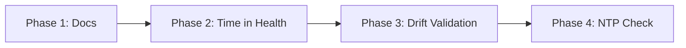

# Time Synchronization – Implementation Plan

**Context**: Dialysis Machine HL7 Implementation Guide Rev 4.0 §2 requires time synchronization per IHE Consistent Time (CT) Protocol and NTP (RFC 1305/RFC 5905). The alignment report identified this as the only non-aligned item.

**Goal**: Address the time synchronization requirement so the PDMS and its deployment environment align with the Guide.

---

## 1. Responsibility Boundaries

| Actor | Responsibility | Implements |
|-------|----------------|------------|
| **Dialysis machines** | Obtain time via NTP; send correct MSH-7, OBX-14 timestamps | Device manufacturer / facility IT |
| **Facility NTP infrastructure** | Provide NTP server(s) for machines and servers | Facility IT |
| **PDMS** | Use synchronized system clock; optionally validate incoming timestamps | This plan |

The Guide states: *"dialysis machines compliant with this standard will use the IHE Consistent Time (CT) Protocol"* — so machines are the primary target. The PDMS (EMR/DOC) must also have correct time so data is reconcilable.

---

## 2. IHE Consistent Time (CT) Profile – Summary

- **Target**: Sync error &lt; 1 second across systems
- **Protocol**: NTP (RFC 1305 v3 or RFC 5905 v4); SNTP for simpler clients
- **Actors**: Time Server, Time Client (ITI-1 Maintain Time)

---

## 3. Plan Phases

### Phase 1: Deployment & Operational Documentation (P0)

**Effort**: Small  
**Ownership**: Docs + deployment config

| Task | Description |
|------|-------------|
| 1.1 | Create `docs/DEPLOYMENT-REQUIREMENTS.md` (or extend existing) with a **Time Synchronization** section |
| 1.2 | Document that PDMS servers must use NTP (e.g. `timedatectl`, Windows NTP, or container/host NTP) |
| 1.3 | Document that dialysis machines must use IHE CT Protocol (NTP) per the Guide |
| 1.4 | Add NTP configuration guidance for Docker Compose (e.g. use host network for NTP, or `--cap-add=SYS_TIME` if running NTP in container — typically avoid; use host sync) |
| 1.5 | Update `HL7-IMPLEMENTATION-GUIDE-ALIGNMENT-REPORT.md` to mark Time Sync as *Partially aligned* once docs are in place |

**Deliverables**:
- `docs/DEPLOYMENT-REQUIREMENTS.md` (or `docs/OPERATIONAL-REQUIREMENTS.md`) with Time Synchronization section
- Reference from `README.md` or `docs/README.md`

---

### Phase 2: Time Verification Endpoint (P1)

**Effort**: Small  
**Ownership**: BuildingBlocks or Gateway

| Task | Description |
|------|-------------|
| 2.1 | Add `GET /health/time` or extend `/health` with server UTC time (e.g. `serverTimeUtc`, `timezone`) |
| 2.2 | Use for facility verification that PDMS clock is correct and NTP-synced |
| 2.3 | Optional: Return NTP sync status if obtainable (e.g. `ntp_synchronized: true` on Linux) — may require platform-specific code or OS query |

**Design options**:
- **A**: Add `serverTimeUtc` to existing `/health` JSON (non-breaking)
- **B**: New `GET /api/diagnostics/time` (requires auth; for ops only)
- **C**: New `GET /health/time` (minimal; no auth if health is public)

**Recommendation**: Option A — extend health response with `serverTimeUtc` (ISO 8601). Simple, no new routes.

---

### Phase 3: Timestamp Drift Validation (P2)

**Effort**: Medium  
**Ownership**: Treatment, Alarm, Prescription services

| Task | Description |
|------|-------------|
| 3.1 | When ingesting HL7 (ORU^R01, ORU^R40, RSP^K22), parse MSH-7 (message time) |
| 3.2 | Compare MSH-7 to server UTC; if drift &gt; configurable threshold (e.g. 60 seconds), log warning |
| 3.3 | Persist drift metadata (e.g. `MessageTimeDriftSeconds`) on observation/alarm for audit (✅ implemented) |
| 3.4 | Configuration: `TimeSync:MaxAllowedDriftSeconds` (default 300); set to 0 to disable |

**Scope**:
- Treatment: `IngestOruMessageCommandHandler` — MSH-7 from message
- Alarm: `IngestOruR40MessageCommandHandler` — MSH-7 from message
- Prescription: `IngestRspK22MessageCommandHandler` — optional; lower priority

**Note**: Drift detection does not block ingestion; it enables operational visibility and audit.

**Phase 3 Status**: ✅ Implemented. Treatment, Alarm, and Prescription ingest handlers log drift when MSH-7 exceeds `MaxAllowedDriftSeconds`. Drift is persisted on observations and alarms for audit.

---

### Phase 4: NTP Health Check (P3 – Optional)

**Effort**: Medium (platform-dependent)  
**Ownership**: BuildingBlocks or each API

| Task | Description |
|------|-------------|
| 4.1 | Add custom health check that verifies system clock is NTP-synchronized |
| 4.2 | On Linux: read `/var/lib/ntp/ntp.drift` or `timedatectl show` (if available) |
| 4.3 | On Windows: W32tm or registry |
| 4.4 | If not sync’d, report Degraded; do not fail health (to avoid false negatives in containers) |

**Note**: Containers often inherit host time; host NTP status may not be available inside container. This phase is lower priority and may be deferred.

**Phase 4 Status**: ✅ Implemented. Gateway `/health` includes `ntp-sync` check. Linux: `timedatectl show --property=NTPSynchronized`; Windows: `w32tm /query /status`. Returns Degraded (not Unhealthy) when unsynced or platform unsupported (e.g. macOS).

---

## 4. Execution Order



| Phase | Dependency | Suggested Timeline |
|-------|------------|--------------------|
| 1 | None | Immediate |
| 2 | None | After Phase 1 |
| 3 | 1 | After Phase 2 (or parallel) |
| 4 | 1 | Optional; when ops maturity allows |

---

## 5. Configuration Schema (Phase 3)

```json
{
  "TimeSync": {
    "MaxAllowedDriftSeconds": 300,
    "LogDriftWarnings": true
  }
}
```

- `MaxAllowedDriftSeconds`: 0 = disabled; &gt;0 = log when |message time − server time| &gt; threshold
- `LogDriftWarnings`: If true, log at Warning level; else Debug

---

## 6. Acceptance Criteria

| Phase | Done When |
|-------|-----------|
| 1 | Deployment docs include Time Sync requirements; alignment report updated |
| 2 | `/health` (or equivalent) returns `serverTimeUtc` |
| 3 | HL7 ingest logs drift when MSH-7 exceeds threshold; configurable |
| 4 | Health check reports NTP sync status (if feasible) |

---

## 7. References

- Dialysis Machine HL7 Implementation Guide Rev 4.0, §2 Time Synchronization
- IHE Consistent Time (CT) Integration Profile
- RFC 1305 (NTP v3), RFC 5905 (NTP v4)
- `docs/HL7-IMPLEMENTATION-GUIDE-ALIGNMENT-REPORT.md`
