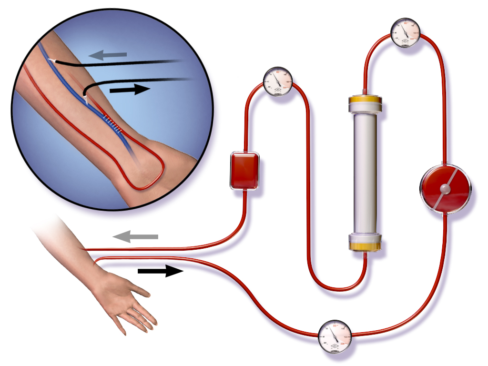
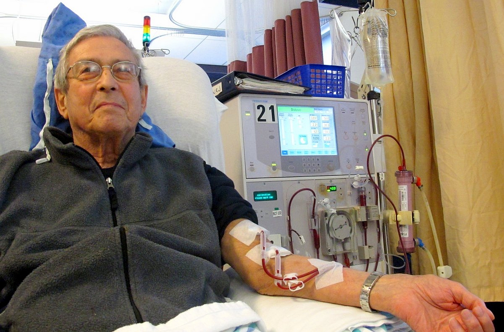
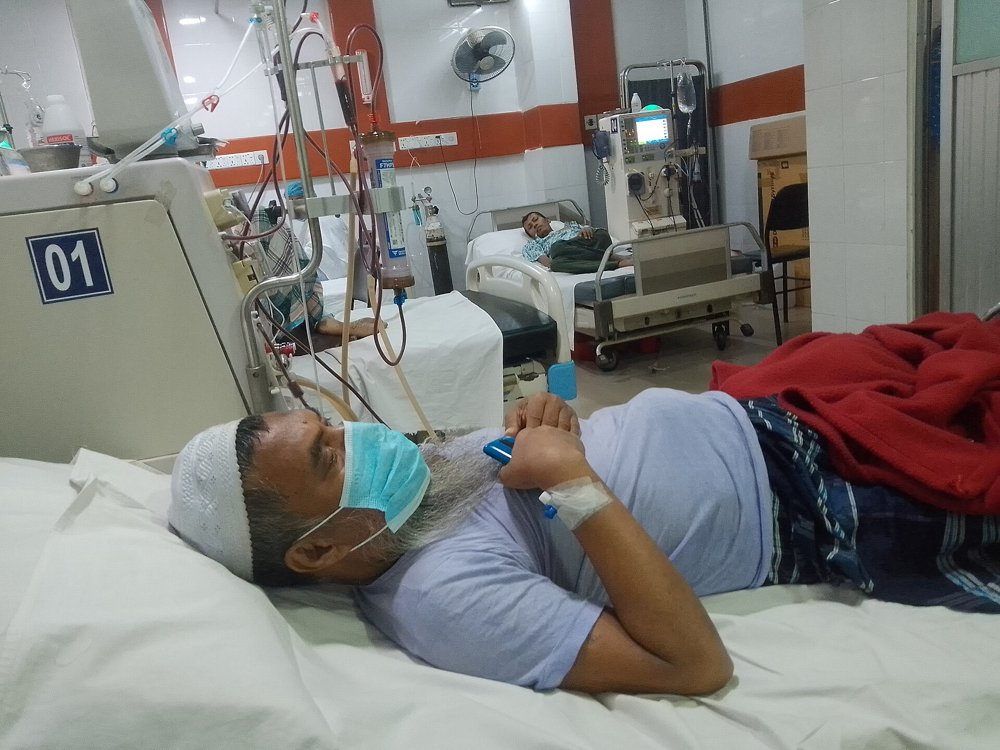
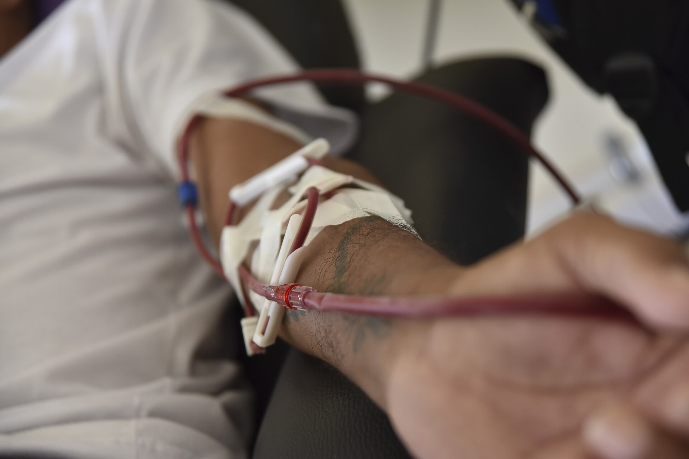
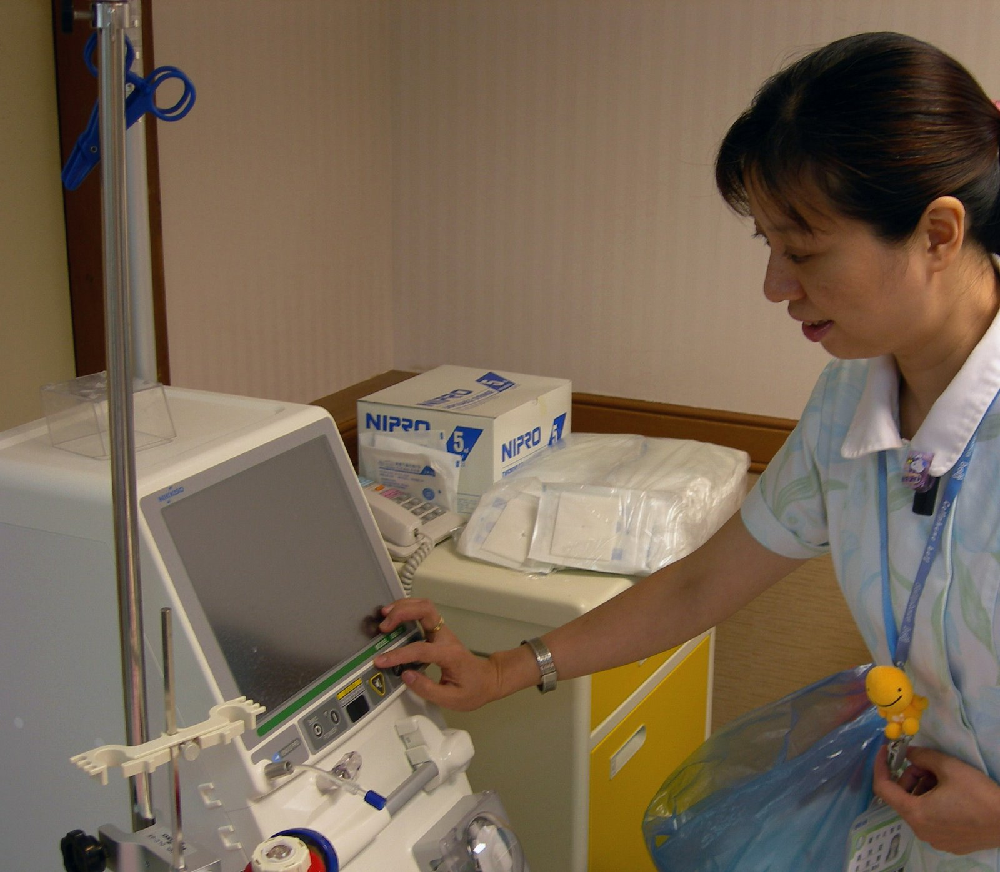

# How a Dialysis Clinic Makes Money — and Where We Fit

*A business-development walkthrough of the clinic's operating and revenue process, illustrated
with real haemodialysis photography (openly licensed — see
[`images/CREDITS.md`](images/CREDITS.md)). Companion pieces: the pitch deck
([`dialysis-platform-overview.html`](dialysis-platform-overview.html)) with its
[presenter script](dialysis-platform-overview-script.md), and the market entry plan in
[`pakistan-market-strategy.md`](pakistan-market-strategy.md). The treatment-chair vocabulary
used throughout is defined in the [README, Part 1](../../README.md#what-a-chair-means).*

---

## 1. The thing we monetize: a haemodialysis session

Strip the business to its physical core and it is this circuit: blood leaves the patient's
arm, passes through an artificial kidney (the dialyzer), and returns cleaned. One pass of
that circuit, sustained for **roughly four hours**, is a *session* — and the session is the
clinic's product, the thing that gets scheduled, staffed, documented, and billed.

What makes this a remarkable business: a patient with end-stage renal disease needs this
**two to three times a week, indefinitely**. No other outpatient service has demand this
recurring or this predictable. Every process gain — and every process leak — repeats with
that same frequency.

## 2. The treatment chair: the station everything is measured in

This is what "a chair" means when clinic owners talk. The reclining chair, the machine beside
it, the plumbing behind it — together one *treatment station*. Look at the machine's screen in
the photo: blood-flow rate, pressures, ultrafiltration volume — the live telemetry our PDMS
module watches across every occupied chair at once.

The chair is the clinic's

- **capacity unit** — one chair, ~4 hours a session, 2–3 patients a day; throughput is
  *chairs × shifts*;
- **revenue unit** — sessions are billed, and sessions happen in chairs; the number an owner
  watches is **chair utilization** (sessions delivered ÷ sessions the chairs could deliver);
- **cost unit** — the machine, a share of the water-treatment plant, per-session consumables
  (dialyzer, blood lines, dialysate), and nursing time.

Our ideology follows directly: **we price the way the customer earns** — per chair, per
month. Our revenue line and theirs move together, and the buying decision becomes arithmetic,
not faith.

## 3. The centre: chairs at scale, and the paper that runs them today

Multiply the station and you get the centre — numbered stations on a shared floor, each one a
revenue-producing asset. This photograph (a kidney hospital's dialysis unit in South Asia) is
exactly the operating reality the [Pakistan strategy](pakistan-market-strategy.md) targets:
high patient volume, stretched staffing ratios, one nephrologist supervising many stations —
and, almost everywhere, the schedule, the vitals, and the billing still living in paper
registers and Excel. Every hand-off between that paper and the front desk, the floor, and the
billing office is a leak: a session that never becomes an invoice, a re-typing error, a
nurse-hour lost to paperwork (the
[deck's problem slide](dialysis-platform-overview-script.md#slide-2--the-problem) draws this
leak map).

## 4. The session loop: where the money is made — and lost

This close-up is the moment of delivery: the arteriovenous access, two needles, blood out and
back. Around this clinical moment runs the *business* loop — **book and check in → treat in
the chair → record the care → bill the visit → share the record** (the deck's
[patient-journey slide](dialysis-platform-overview-script.md#slide-4--the-patient-journey-interactive)
animates it). Because each patient runs the loop 100+ times a year, fixing the loop once
fixes it thousands of times per centre per year. That compounding is the entire ROI argument:
the platform carries the patient's data through every step so nothing is re-typed, nothing is
missed, and a completed session becomes a submitted claim in one click — the cash-conversion
step that attacks **days sales outstanding**, which for a thin-margin clinic is survival.

## 5. The people cost: nursing time at the machine

The largest controllable cost per chair is the scarcest resource in the room: skilled
nursing time. Every minute a nurse spends transcribing machine readings onto paper, chasing a
chart, or assembling a billing batch is a minute not spent at a patient's side. The platform's
clinical pitch and its cost pitch are the same pitch: machine telemetry records itself, alarms
find the right person immediately, and documentation is a by-product of care rather than a
second shift. **Less** admin per session, **safer** chairs, and an **audit-ready** record —
three of the four headline outcomes — come from this one photograph's workflow.

## 6. Where it lands on the P&L

| Outcome | P&L line it moves |
|---|---|
| **Less** | Admin hours per session down → labour cost per session down |
| **Faster** | Claims out sooner, fewer errors → working capital freed, DSO down |
| **Safer** | Live monitoring at every chair → clinical promise *and* liability shield |
| **Audit-ready** | Compliance as a by-product of operating → for charity networks, donor-grade reporting nobody local offers |

And the growth story writes itself in the same unit: the customer grows in chairs, then in
sites; each new clinic is a self-contained installation, each new chair a subscription
increment. **Their expansion is our expansion** — no re-sale, just a contract amendment.

---

## The one-sentence ideology

> **We don't sell software to clinics — we sell yield on chairs, priced per chair.**

Everything above — the circuit, the chair, the floor, the loop, the nurse — is that sentence,
photographed.
