# Dialysis Care Platform — Presenter's Script

A slide-by-slide transcript for delivering `dialysis-platform-overview.html` (13 slides).
Narration is written to be spoken aloud, in the deck's plain-language register — no technical
knowledge assumed in the room. *Speaker notes* in italics cover timing, clicks, and likely
questions. Total running time: roughly 12–15 minutes plus questions.

> Open the deck in any browser. Navigate with `←`/`→`, press `F` for full screen. Slides 4
> and 6 are interactive — click the highlighted items as the script indicates.

---

## Slide 1 — Title

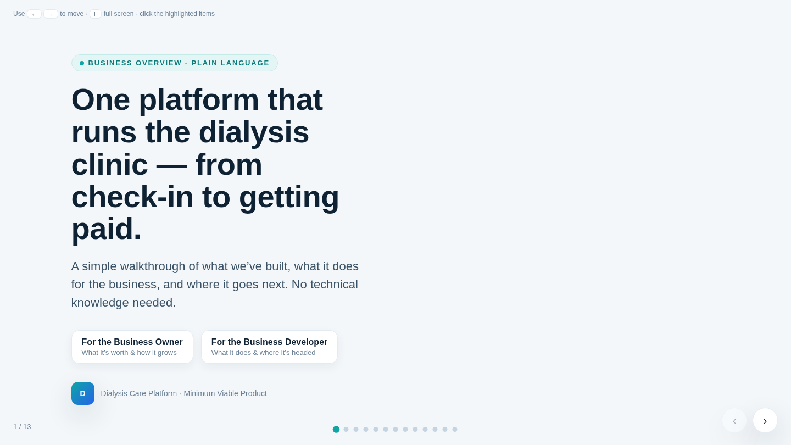

**Narration:**

"Good morning, and thank you for the time. Over the next fifteen minutes I want to show you
one thing: a single platform that runs a dialysis clinic — from the moment a patient checks
in, to the moment the clinic gets paid. No jargon today, no architecture diagrams. Just what
we've built, what it's worth to the business, and where it goes next. If you remember one
sentence from this session, let it be the one on this slide."

*Speaker notes: pause two beats on the headline before advancing. The two pills under the
title tell each audience what's in it for them — gesture at them if both roles are in the
room.*

---

## Slide 2 — The problem

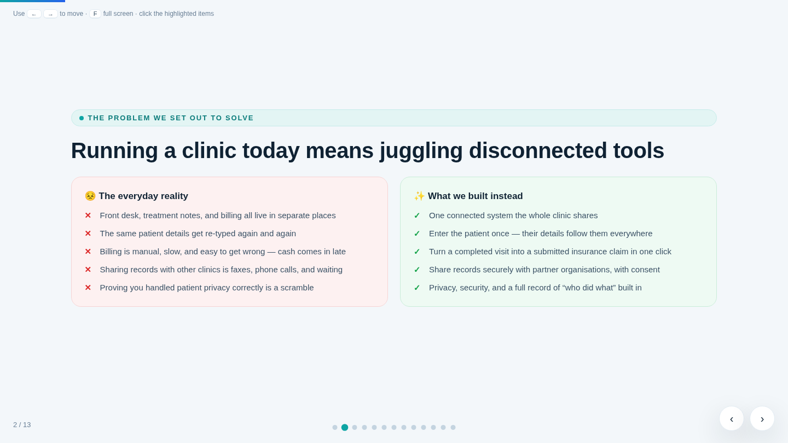

**Narration:**

"Let's start with the everyday reality of running a clinic. The front desk has one system.
Treatment notes live somewhere else. Billing is a third place. The same patient's details get
re-typed three, four times a day — and every re-type is a chance for an error. Billing is
manual and slow, so cash arrives late. Sharing records with another clinic still means faxes
and phone calls. And when an auditor asks how you handled patient privacy — that's a scramble
through filing cabinets.

On the right is what we built instead: one connected system the whole clinic shares. Enter
the patient once, and their details follow them everywhere. A completed visit becomes a
submitted insurance claim in one click. Records move securely, with consent. And the proof —
who did what, when — writes itself."

*Speaker notes: this is the emotional anchor of the talk. Spend time on the left column;
the rest of the deck is the right column unpacked.*

---

## Slide 3 — The solution in one sentence

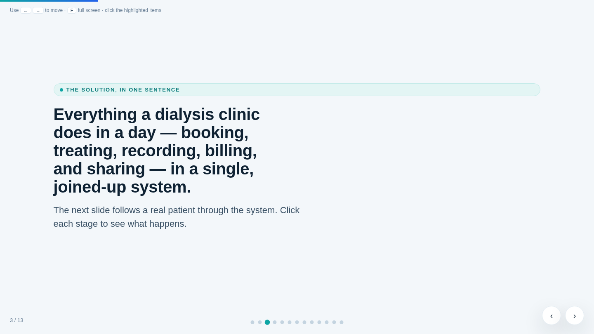

**Narration:**

"Here's the whole product in one sentence: everything a dialysis clinic does in a day —
booking, treating, recording, billing, and sharing — in a single, joined-up system. The best
way to believe that sentence is to follow one patient through it. That's the next slide."

*Speaker notes: deliberately short — it's a breather slide. Advance within twenty seconds.*

---

## Slide 4 — The patient journey (interactive)

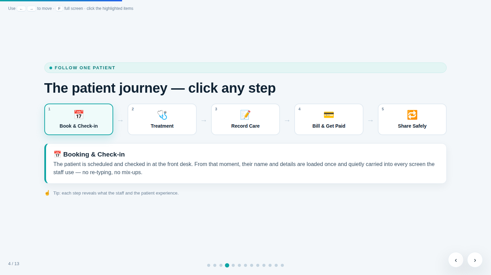

**Narration:**

"Meet our patient. **Click step one** — they're booked and checked in at the front desk. From
that moment their name and details are loaded once and quietly carried into every screen the
staff use. **Step two** — they're in the chair. The dialysis machine's readings appear on
screen live, and if anything needs attention, the right person is alerted immediately.
**Step three** — the care gets recorded: notes, medications, results, all in the chart, all
in one place. **Step four** — the completed visit turns into an insurance claim and goes out
the door. And **step five** — when another clinic or hospital needs the record, it's shared
securely, with the patient's consent, leaving a signed trail.

One patient, five steps, zero re-typing."

*Speaker notes: actually click each step — the detail panel under the journey updates. Let
the panel text support you; don't read it verbatim.*

---

## Slide 5 — What's working today (the MVP)

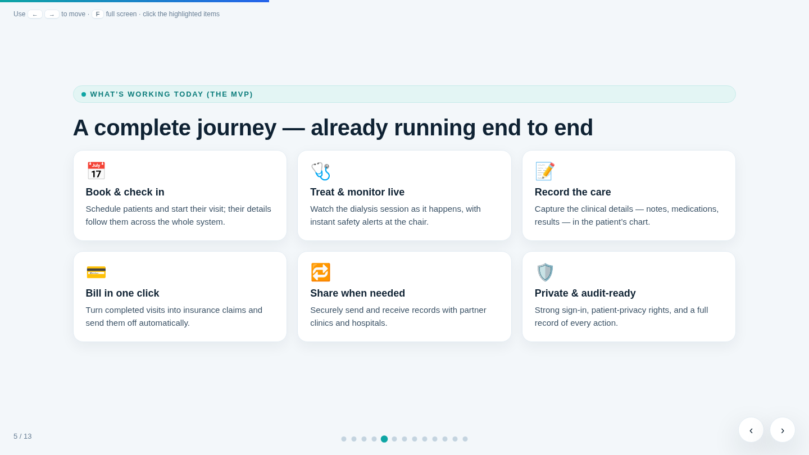

**Narration:**

"And here's the important part: that journey isn't a mock-up. It runs end to end today.
Booking and check-in. Live treatment monitoring with safety alerts at the chair. Clinical
recording — notes, medications, lab results. One-click billing. Secure record sharing with
partner organisations. And privacy and auditability underneath all of it. Six capabilities,
already working together as one system."

*Speaker notes: if asked "how do you know it works end to end?" — we run an automated
nightly drill that pushes a simulated patient through the entire journey and verifies every
department saw consistent data.*

---

## Slide 6 — Six building blocks (interactive)

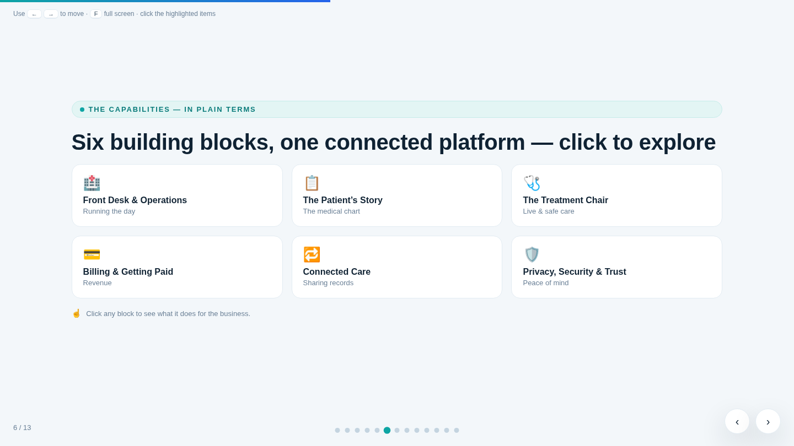

**Narration:**

"Under the hood — still in plain terms — the platform is six building blocks. **Front Desk &
Operations** keeps the clinic day moving: scheduling, check-in, staff, supplies. **The
Patient's Story** is the medical chart — the one trustworthy place clinicians rely on. **The
Treatment Chair** is live monitoring during dialysis. **Billing & Getting Paid** turns care
into revenue. **Connected Care** exchanges records with other organisations. And **Privacy,
Security & Trust** wraps around everything. Click any block and it tells you what it does for
the business — not how it's coded."

*Speaker notes: click two or three blocks, not all six. Good picks for a business audience:
Billing, Connected Care, Privacy.*

---

## Slide 7 — Feature spotlight: one-click billing

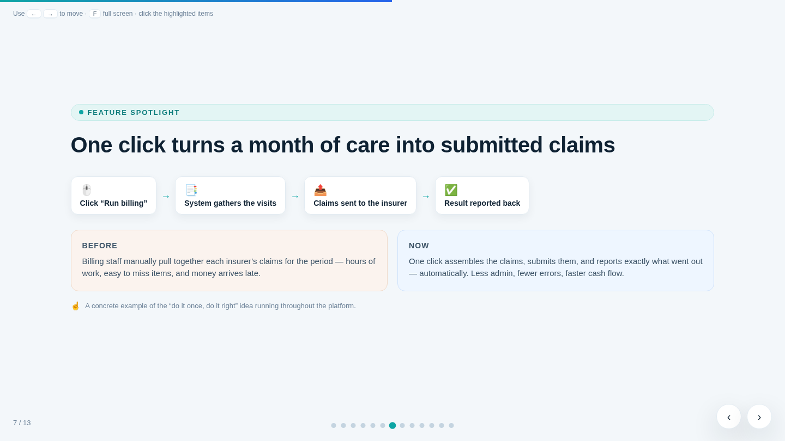

**Narration:**

"Let me make this concrete with one feature. At the end of a billing period, someone in the
office clicks 'Run billing'. The system gathers every visit for that insurer, assembles the
claims, sends them, and reports back exactly what went out. Before: hours of manual
assembly, items easy to miss, money arriving late. Now: one click, fewer errors, faster cash
flow. This is the 'do it once, do it right' idea that runs through the whole platform — and
it now covers both clinic and hospital claim types."

*Speaker notes: if pressed on claim types — professional and institutional formats are both
supported, which is what larger payers and hospital-affiliated programs require.*

---

## Slide 8 — Real-time where it matters, dependable everywhere

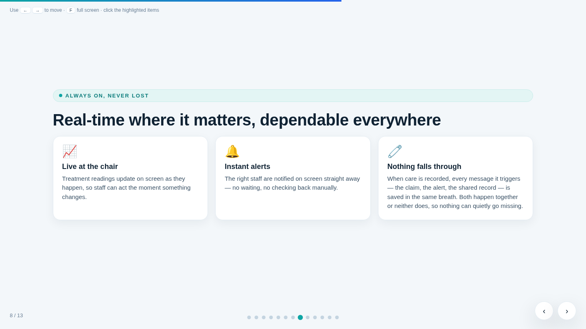

**Narration:**

"Two promises a clinical system has to keep. First: be live where seconds matter — treatment
readings update on screen as they happen, and alerts reach the right staff immediately.
Second — and this is the one I want to stress: nothing falls through. When care is recorded,
every message that recording triggers — the claim, the alert, the shared record — is saved in
the same breath. Both happen together, or neither does. There is no gap where the chart says
one thing and billing quietly missed it. That guarantee is engineered into the platform's
foundations, uniformly, everywhere."

*Speaker notes: this card was strengthened in June 2026 after we unified the event pipeline —
the claim is now literally enforced by an automated architecture test. If a technical
listener asks: transactional outbox, one publishing path, gate-enforced.*

---

## Slide 9 — Privacy and compliance built in

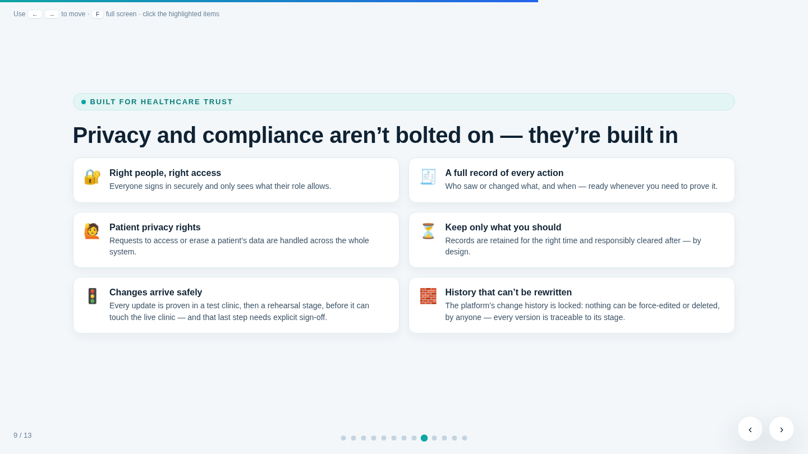

**Narration:**

"Trust, in six tiles. The right people see the right things — role-based, always. Every
action leaves a record — who saw or changed what, and when. Patient privacy rights — access
and erasure requests — are handled across the whole system, not department by department.
Records are kept exactly as long as they should be, and responsibly cleared after.

And two newer ones. Changes arrive safely: every update is proven in a test clinic, then a
rehearsal stage, before it can touch the live clinic — and that final step requires an
explicit sign-off. And the platform's history can't be rewritten: nothing can be force-edited
or deleted, by anyone, and every running version is traceable to its stage. In an audit,
that's not a scramble — it's a printout."

*Speaker notes: the last two tiles reflect the staged release pipeline and locked change
history introduced June 2026. The 'explicit sign-off' is a real approval gate held by the
clinic's platform owner.*

---

## Slide 10 — Built to grow

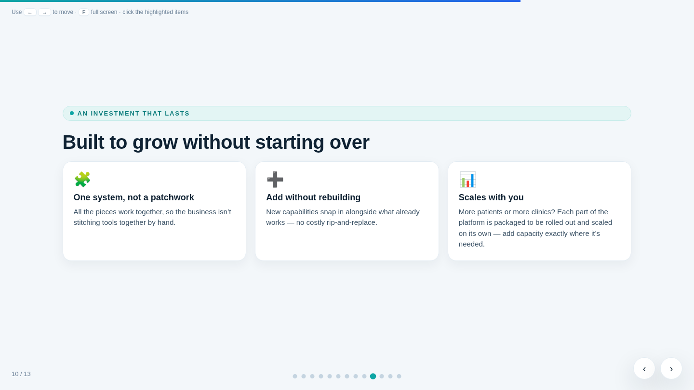

**Narration:**

"This is an investment that lasts. It's one system, not a patchwork — nobody is stitching
tools together by hand. New capabilities snap in alongside what already works; there's no
rip-and-replace in this product's future. And it scales: each part of the platform is
packaged to be rolled out and scaled on its own. More patients? Add capacity at the treatment
chair. A second clinic? Roll the pieces out site by site. You grow where the growth is."

*Speaker notes: the per-part packaging is real and tested — nine independently installable
units. That's why 'roll out clinic by clinic' moved up the roadmap.*

---

## Slide 11 — The outcomes that matter

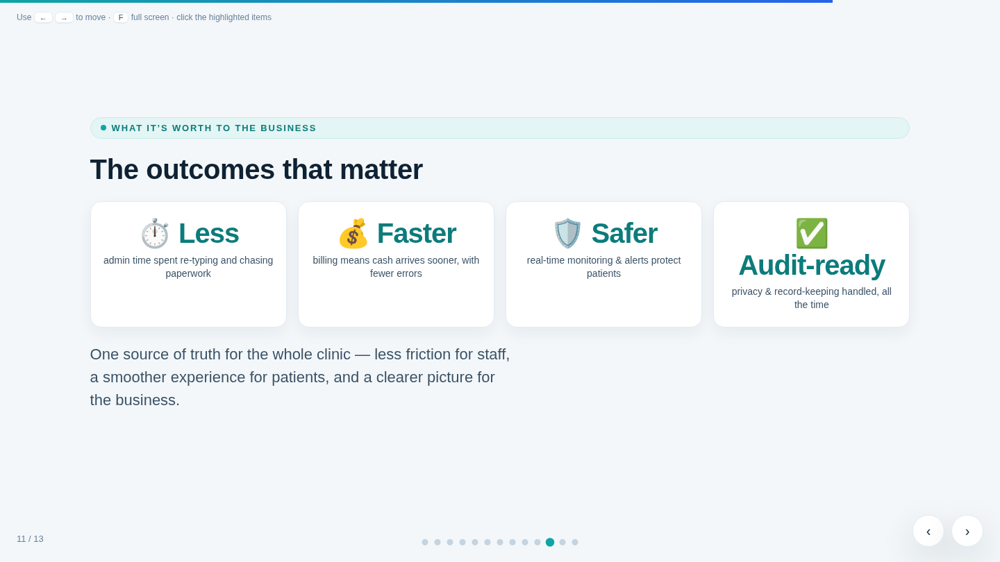

**Narration:**

"So what is all of this worth? Four outcomes. Less — less admin time re-typing and chasing
paperwork. Faster — billing that submits itself means cash arrives sooner, with fewer errors.
Safer — real-time monitoring and instant alerts protect patients at the chair. And
audit-ready — privacy and record-keeping are handled all the time, not assembled the week
before an inspection. One source of truth for the whole clinic: less friction for staff, a
smoother experience for patients, a clearer picture for the business."

*Speaker notes: slow down here. This slide is the takeaway for the business owner.*

---

## Slide 12 — A clear path forward

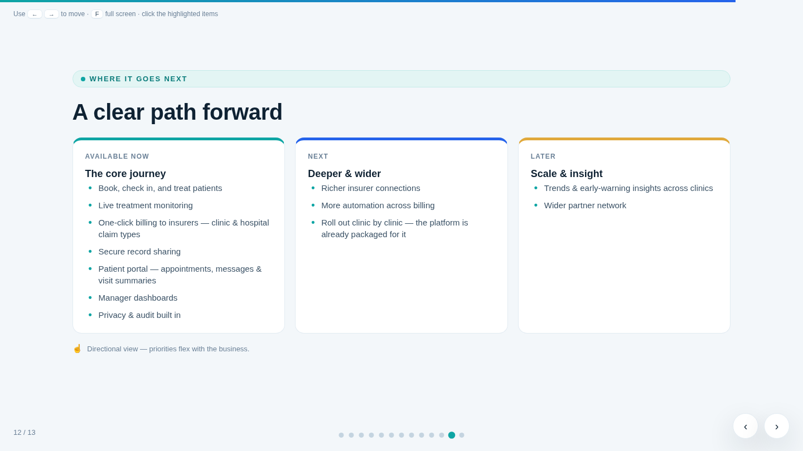

**Narration:**

"Where it goes next. Available now — the full core journey: booking through treatment through
one-click billing with both clinic and hospital claim types, secure sharing, the patient
portal with appointments, messages and visit summaries, dashboards for managers, and privacy
built in. Next — deeper and wider: richer insurer connections, more billing automation, and
rolling out clinic by clinic — the platform is already packaged for exactly that. Later —
scale and insight: trends and early-warning signals across clinics, and a wider partner
network. This is a directional view; priorities flex with the business."

*Speaker notes: the portal and manager dashboards moved from 'Next' to 'Available now' in the
June 2026 refresh — they shipped. If asked what 'packaged for it' means: each clinic
installation is a self-contained set of units; adding a site doesn't disturb the others.*

---

## Slide 13 — Closing

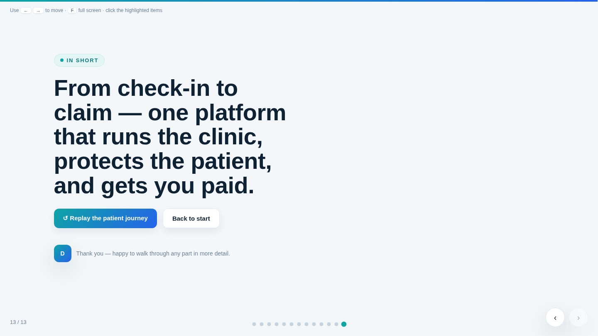

**Narration:**

"From check-in to claim: one platform that runs the clinic, protects the patient, and gets
you paid. That's the product. I'm happy to replay the patient journey, dive into any building
block, or talk numbers — wherever you'd like to go deeper. Thank you."

*Speaker notes: the two buttons on this slide jump straight back to the journey (slide 4) or
the start — use them for the Q&A rather than scrolling.*

---

*Script and screenshots generated from the June 2026 deck refresh; regenerate the images by
rendering `dialysis-platform-overview.html` at 1440×810 and stepping through `goTo(0)`–`goTo(12)`.*
