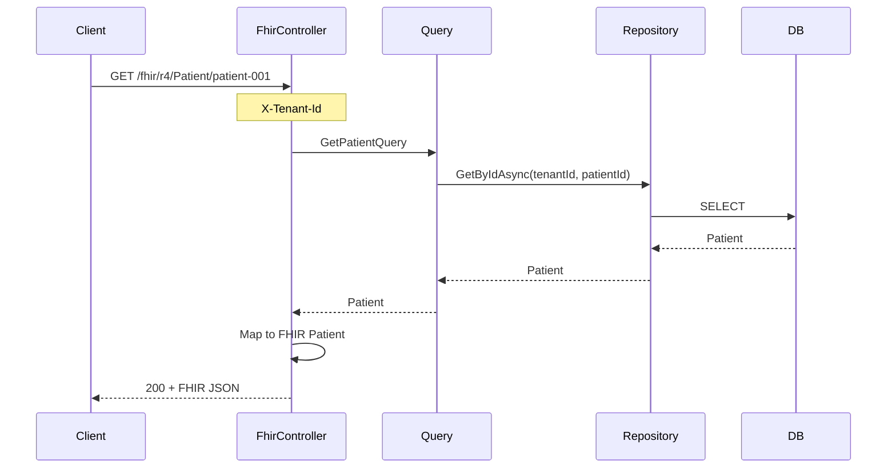
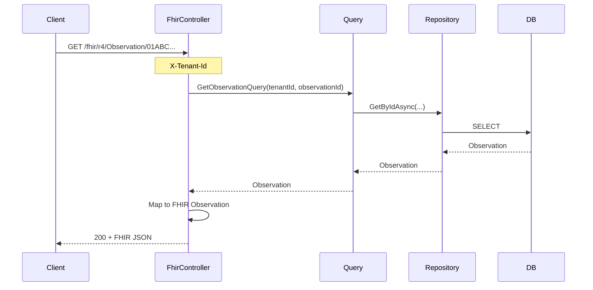
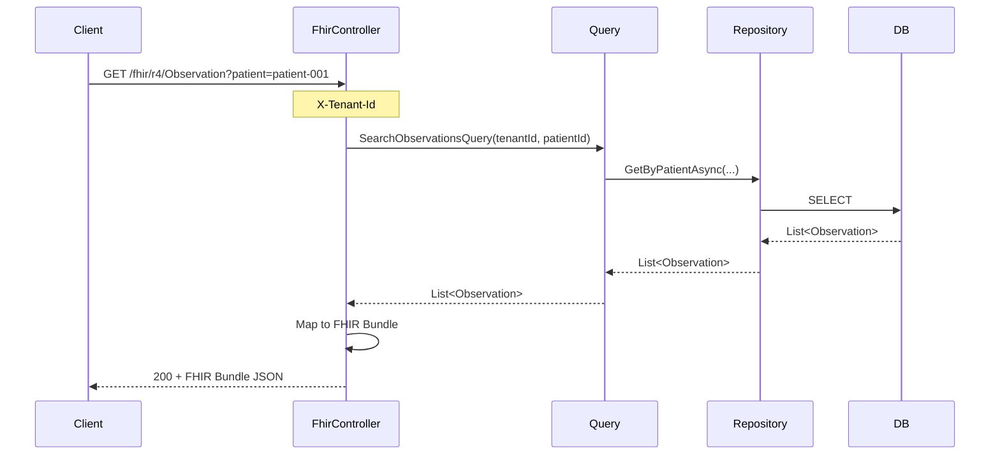
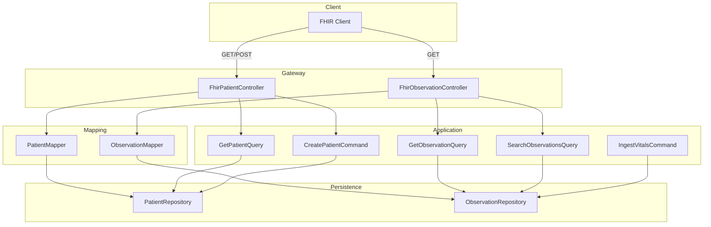

# FHIR Layer – Planning & Workflow

**Feature**: Expose FHIR R4 REST API for Patient and Observation  
**Status**: Completed  
**Follows**: [Learn-by-Doing Workflow](../../.cursor/rules/learn-by-doing-workflow.mdc)

---

## Relationship with Patient Management

The FHIR Patient endpoints (`GET /fhir/r4/Patient/{id}`, `POST /fhir/r4/Patient`) are also part of **Patient Management** — they enable FHIR clients to create and read patients.

- **FHIR Layer** — interoperability: which FHIR resources we expose and how (this doc).
- **Patient Management** — domain feature: how patients are managed, including via REST and FHIR (see [PATIENT-MANAGEMENT.md](PATIENT-MANAGEMENT.md)).

Same `FhirPatientController`, two feature perspectives. For full patient CRUD (update, delete, list), use the REST API in [PATIENT-MANAGEMENT.md](PATIENT-MANAGEMENT.md).

---

## Phase 1: Plan

### 1.1 Overview

Expose FHIR R4 resources so the PDMS can interoperate with EHRs and FHIR clients. Use Firely SDK (`Hl7.Fhir.R4`) to serialize/deserialize FHIR resources. Map between domain entities and FHIR models.

### 1.2 FHIR Endpoints

| Method | Path | Description | Status |
|--------|------|-------------|--------|
| GET | `/fhir/r4/metadata` | CapabilityStatement (server capabilities) | ✅ Implemented |
| GET | `/fhir/r4/Patient/{id}` | Read Patient by logical ID | ✅ Implemented |
| POST | `/fhir/r4/Patient` | Create Patient from FHIR resource | ✅ Implemented |
| GET | `/fhir/r4/Observation?patient={id}` | Search Observations by patient | ✅ Implemented |
| GET | `/fhir/r4/Observation/{id}` | Read Observation by ID | ✅ Implemented |
| GET | `/fhir/r4/Procedure?patient={id}` | Search Procedures (sessions) by patient | ✅ Implemented |
| GET | `/fhir/r4/Procedure/{id}` | Read Procedure by ID | ✅ Implemented |
| GET | `/fhir/r4/Encounter?patient={id}` | Search Encounters (dialysis visits) by patient | ✅ Implemented |
| GET | `/fhir/r4/Encounter/{id}` | Read Encounter by ID (Session id) | ✅ Implemented |
| GET | `/fhir/r4/Condition?patient={id}` | Search Conditions (diagnoses) by patient | ✅ Implemented |
| GET | `/fhir/r4/Condition/{id}` | Read Condition by ID | ✅ Implemented |
| POST | `/fhir/r4/Condition` | Create Condition from FHIR | ✅ Implemented |
| GET | `/fhir/r4/EpisodeOfCare?patient={id}` | Search EpisodesOfCare by patient | ✅ Implemented |
| GET | `/fhir/r4/EpisodeOfCare/{id}` | Read EpisodeOfCare by ID | ✅ Implemented |
| POST | `/fhir/r4/EpisodeOfCare` | Create EpisodeOfCare from FHIR | ✅ Implemented |
| GET | `/fhir/r4/Patient/{id}/$everything` | Patient bulk export (all resources) | ✅ Implemented |

**Tenant context**: `X-Tenant-Id` header scopes all reads/writes.

### 1.3 Data Flow – Read Patient



### 1.4 Data Flow – Read Observation



### 1.5 Data Flow – Search Observations



### 1.6 Component Diagram



### 1.7 Mapping (Domain ↔ FHIR)

| Domain | FHIR Resource | Key mappings |
|--------|---------------|--------------|
| Patient (LogicalId, FamilyName, GivenNames, BirthDate) | Patient | identifier, name, birthDate |
| Observation (LoincCode, NumericValue, Unit, Effective) | Observation | code, valueQuantity, effective |

### 1.8 Vertical Slice Additions

- **Persistence**: `IObservationRepository.GetByPatientAsync(tenantId, patientId, filters?)`
- **DeviceIngestion** (or new FhirStore): `SearchObservationsQuery` / `SearchObservationsQueryHandler`
- **Gateway**: `FhirPatientController`, `FhirObservationController`, mappers

---

## Phase 2: Implement

### What Was Built

- **IObservationRepository** – `GetByIdAsync`, `GetByPatientAsync`
- **GetObservationQuery** / **GetObservationQueryHandler** – Read observation by ID
- **SearchObservationsQuery** / **SearchObservationsQueryHandler** – Search observations by patient
- **FhirMappers** – Domain ↔ FHIR R4 (Patient, Observation, Bundle) using Firely SDK
- **FhirPatientController** – `GET /fhir/r4/Patient/{id}`, `POST /fhir/r4/Patient` (201 + Location, 409 if duplicate)
- **FhirObservationController** – `GET /fhir/r4/Observation/{id}`, `GET /fhir/r4/Observation?patient={id}` (FHIR Bundle)

### API Usage

**Read Patient (FHIR)**
```bash
curl -X GET "http://localhost:5000/fhir/r4/Patient/patient-001" \
  -H "X-Tenant-Id: default" \
  -H "Accept: application/fhir+json"
```

**Create Patient (FHIR)**
```bash
curl -X POST "http://localhost:5000/fhir/r4/Patient" \
  -H "Content-Type: application/fhir+json" \
  -H "X-Tenant-Id: default" \
  -d '{"resourceType":"Patient","id":"patient-002","name":[{"family":"Doe","given":["Jane"]}],"birthDate":"1990-01-15"}'
```

**Read Observation (FHIR)**
```bash
curl -X GET "http://localhost:5000/fhir/r4/Observation/01ARZ3NDEKTSV4RRFFQ69G5FAV" \
  -H "X-Tenant-Id: default" \
  -H "Accept: application/fhir+json"
```

**Search Observations (FHIR)**
```bash
curl -X GET "http://localhost:5000/fhir/r4/Observation?patient=patient-001" \
  -H "X-Tenant-Id: default" \
  -H "Accept: application/fhir+json"
```

### Key Files

| Layer | Path |
|-------|------|
| Controllers | `Dialysis.Gateway/Features/Fhir/FhirPatientController.cs`, `FhirObservationController.cs` |
| Mappers | `Dialysis.Gateway/Features/Fhir/FhirMappers.cs` |
| Queries | `Dialysis.DeviceIngestion/Features/Observations/Get/GetObservationQuery.cs`, `Search/SearchObservationsQuery.cs` |

---

## Phase 3: Explanation

### System Architecture Updates

- **healthcare_systems_&_dialysis_architecture.md** – Added "Implemented: FHIR Layer" subsection with data-flow diagram.
- **README.md** – Added FHIR endpoints to the endpoints table.
