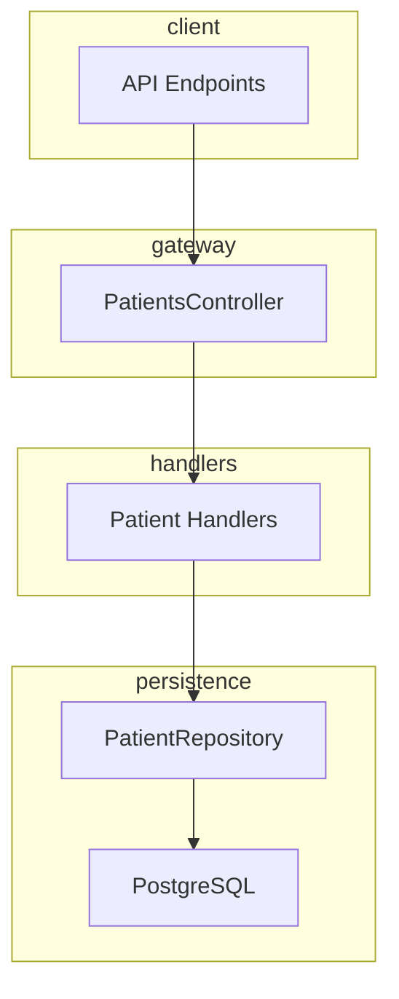
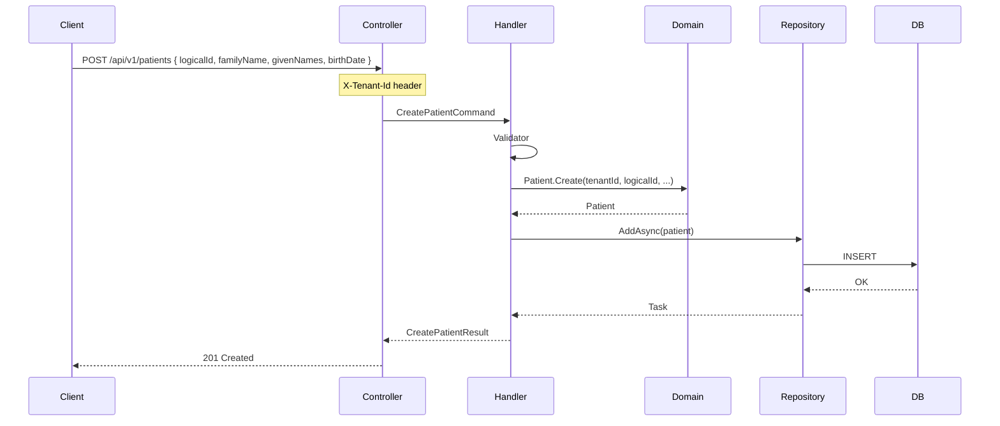
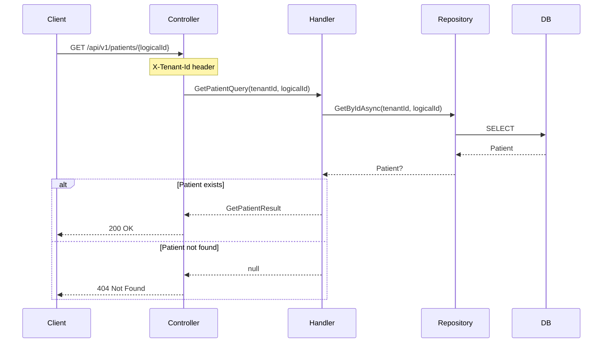
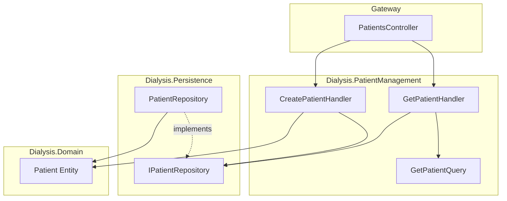

# Patient Management – Planning & Workflow

**Feature**: Patient Create, Get, Update, Delete, List + FHIR POST  
**Status**: Completed  
**Follows**: [Learn-by-Doing Workflow](../../.cursor/rules/learn-by-doing-workflow.mdc)

---

## Relationship with FHIR Layer

Patient management exposes data via **two APIs**:

- **REST API** (`/api/v1/patients`) — custom PDMS contract; full CRUD, list, search.
- **FHIR API** (`/fhir/r4/Patient`) — standard interoperability; create and read only.

The FHIR Patient endpoints (`GET /fhir/r4/Patient/{id}`, `POST /fhir/r4/Patient`) are implemented by `FhirPatientController` and serve both:

1. **This feature** — patient management for FHIR clients (e.g. sync from EHR).
2. **FHIR Layer** — FHIR R4 interoperability (see [FHIR-LAYER.md](FHIR-LAYER.md)).

Single implementation, two viewpoints. Full FHIR endpoint details and examples are in [FHIR-LAYER.md](FHIR-LAYER.md).

---

## Phase 1: Plan

### 1.1 Overview

Add REST APIs to create and retrieve patients. Patients are required for vitals ingest (each observation references a `PatientId`). This feature enables registering patients in the PDMS or syncing from external systems.

### 1.2 Data Flow



### 1.3 Create Patient – Sequence



### 1.4 Get Patient – Sequence



### 1.5 Component Diagram



### 1.6 API Contract

| Method | Endpoint | Request | Response |
|--------|----------|---------|----------|
| POST | `/api/v1/patients` | `{ logicalId, familyName?, givenNames?, birthDate? }` | `201` + patient or `409` if duplicate |
| GET | `/api/v1/patients/{logicalId}` | — | `200` + patient or `404` |
| PUT | `/api/v1/patients/{logicalId}` | `{ familyName?, givenNames?, birthDate? }` | `200` + patient or `404` |
| DELETE | `/api/v1/patients/{logicalId}` | — | `204` or `404` |
| GET | `/api/v1/patients` | `?family=, ?given=, ?_count=, ?_offset=` | `200` + list |
| POST | `/fhir/r4/Patient` | FHIR Patient JSON | `201` + FHIR Patient or `409` if duplicate |

**Headers**: `X-Tenant-Id` (required). **Duplicate check**: Create returns `409 Conflict` when logicalId already exists.

> **Note:** FHIR Patient endpoints are documented in detail in [FHIR-LAYER.md](FHIR-LAYER.md).

### 1.7 Vertical Slice Structure

```
Dialysis.DeviceIngestion (or new module)
└── Features/
    └── Patients/
        ├── Create/
        │   ├── CreatePatientCommand.cs
        │   ├── CreatePatientHandler.cs
        │   ├── CreatePatientValidator.cs
        │   └── CreatePatientRequest.cs
        └── Get/
            ├── GetPatientQuery.cs
            ├── GetPatientQueryHandler.cs
            └── GetPatientResponse.cs

Dialysis.Persistence
└── Abstractions/
    └── IPatientRepository.cs  (AddAsync, GetByIdAsync)
└── PatientRepository.cs

Dialysis.Gateway
└── Features/
    └── Patients/
        └── PatientsController.cs
```

---

## Phase 2: Implement

### What Was Built

- **IPatientRepository** / **PatientRepository** – Add, get, update, delete, list/search patients by (TenantId, LogicalId)
- **CreatePatientCommand** / **CreatePatientHandler** / **CreatePatientValidator** – Create patient flow with duplicate check (409 Conflict)
- **UpdatePatientCommand** / **UpdatePatientHandler** / **UpdatePatientValidator** – Update patient by logicalId
- **DeletePatientCommand** / **DeletePatientHandler** / **DeletePatientValidator** – Delete patient by logicalId
- **ListPatientsQuery** / **ListPatientsQueryHandler** – List patients with optional family/given search, pagination
- **GetPatientQuery** / **GetPatientQueryHandler** – Get patient by ID
- **PatientsController** – REST endpoints (Create, Get, Put, Delete, List)
- **FhirPatientController** – `POST /fhir/r4/Patient` (FHIR create), `GET /fhir/r4/Patient/{id}`
- **PatientAlreadyExistsException** / **PatientConflictExceptionHandler** – Explicit duplicate handling on create

### API Usage

**Create patient**
```bash
curl -X POST http://localhost:5000/api/v1/patients \
  -H "Content-Type: application/json" \
  -H "X-Tenant-Id: default" \
  -d '{"logicalId": "patient-001", "familyName": "Smith", "givenNames": "John"}'
```

**Get patient**
```bash
curl -X GET http://localhost:5000/api/v1/patients/patient-001 \
  -H "X-Tenant-Id: default"
```

**Update patient**
```bash
curl -X PUT http://localhost:5000/api/v1/patients/patient-001 \
  -H "Content-Type: application/json" \
  -H "X-Tenant-Id: default" \
  -d '{"familyName": "Jones", "givenNames": "John A.", "birthDate": "1985-03-15"}'
```

**Delete patient**
```bash
curl -X DELETE http://localhost:5000/api/v1/patients/patient-001 \
  -H "X-Tenant-Id: default"
```

**List/search patients**
```bash
curl -X GET "http://localhost:5000/api/v1/patients?family=smith&_count=20&_offset=0" \
  -H "X-Tenant-Id: default"
```

**FHIR create patient**
```bash
curl -X POST http://localhost:5000/fhir/r4/Patient \
  -H "Content-Type: application/fhir+json" \
  -H "X-Tenant-Id: default" \
  -d '{"resourceType":"Patient","id":"patient-002","name":[{"family":"Doe","given":["Jane"]}],"birthDate":"1990-01-15"}'
```

### Key Files

| Layer | Path |
|-------|------|
| Controllers | `Dialysis.Gateway/Features/Patients/PatientsController.cs`, `Dialysis.Gateway/Features/Fhir/FhirPatientController.cs` |
| Commands | `Create/CreatePatientCommand.cs`, `Update/UpdatePatientCommand.cs`, `Delete/DeletePatientCommand.cs` |
| Queries | `Get/GetPatientQuery.cs`, `List/ListPatientsQuery.cs` |
| FHIR | `Dialysis.Gateway/Features/Fhir/FhirMappers.cs` |
| Repository | `Dialysis.Persistence/Abstractions/IPatientRepository.cs`, `Dialysis.Persistence/PatientRepository.cs` |
| Exceptions | `Dialysis.SharedKernel/Exceptions/PatientAlreadyExistsException.cs` |

---

## Phase 3: Explanation

### System Architecture Updates

- **healthcare_systems_&_dialysis_architecture.md** – Added Patient Management to Phase 1 deliverables and new "Implemented: Patient Management" subsection with data-flow diagram.
- **Deliverables** – `POST /api/v1/patients` and `GET /api/v1/patients/{logicalId}` listed as implemented.
