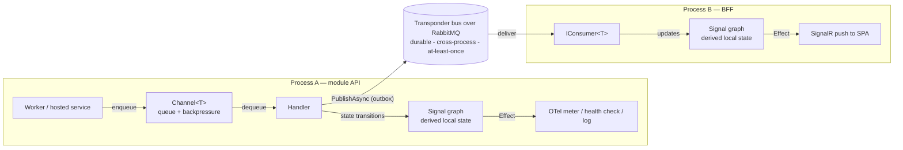
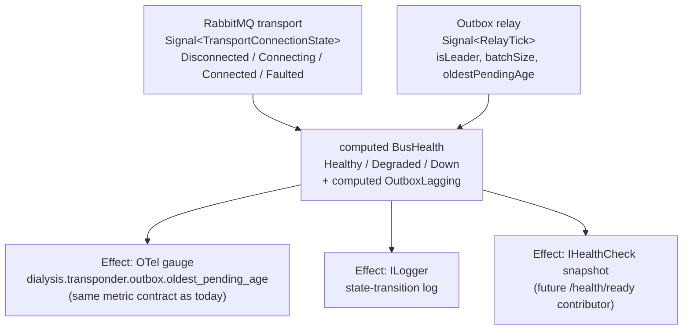

# Architecture audit — Signals (SignalsDotnet) × Channels in Transponder

**Question under audit:** the team wants to combine C# `System.Threading.Channels` with
JS-style *signals* (reactive state management, via
[SignalsDotnet](https://github.com/fedeAlterio/SignalsDotnet)) and pilot the combination in
the Transponder distributed-messaging building block. How do signals help in a distributed
messaging system, where exactly do they fit in Transponder, and what are the risks?

Every code claim below was verified against the tree on 2026-06-11; library claims are from
SignalsDotnet v2.1.0 (2026-03-22).

## 1. TL;DR / recommendation

**Adopt signals for Transponder's *state plane* — lifecycle and observability state — not
its *data plane*.** Signals are a node-local, derived-state primitive: they make "what is
the current condition of this host" declarative, glitch-free, and reactive. They are not a
messaging primitive: they carry no payloads across processes, give no durability, no
backpressure, no ordering. Channels keep doing what they do today (move data inside a
process with backpressure); the bus keeps doing what it does (durable cross-process
messaging); signals get the job nobody currently owns well in Transponder — **deriving and
reacting to state *about* the message flow**, which today is hand-rolled with nullable
fields, `SemaphoreSlim`s, polled `ConcurrentDictionary` gauges, and implicit
advisory-lock leadership.

Concretely: pilot a `Transponder.Diagnostics.Signals` project (design in §5) that models
transport connection state and outbox-relay status as signals, with computed `BusHealth` /
`OutboxLagging` and effects bridging to the existing OTel meters. Keep signals **out** of the
message hot path, the chunk-reassembly sessions, and the saga locks until the library passes
the concurrency spike tests in §5.3 — its server-side thread-safety is undocumented.

## 2. Three primitives, three jobs

A distributed system needs all three; none substitutes for another.

| Primitive | Job | Scope | Gives you | Does **not** give you |
|---|---|---|---|---|
| `Channel<T>` | Move data between producers/consumers | One process | Queueing, backpressure (`Bounded`), async hand-off | Durability, derived state, cross-process reach |
| Signal / computed / effect | Derive state from other state; react to changes | One process | Glitch-free dependency tracking, automatic recomputation, declarative reactions | Payload transport, persistence, backpressure, ordering |
| Transponder bus (RabbitMQ + outbox) | Deliver messages across processes | Cluster | Durability (outbox), at-least-once delivery, schema-versioned contracts | Locally derived state, synchronous reads |

**"Distributed reactivity" is the composition, not a new transport.** Reactivity across
nodes = integration events on the bus feeding each node's *local* signal graph. The codebase
already runs this pattern at the edge without naming it: `AddModuleBffEvents` consumes
integration events off RabbitMQ and pushes `BffNotification`s to the SPA over SignalR — bus
in, local reaction out. Signals would give the same shape a first-class in-process form:
consumer updates a signal, computed signals derive view-state, effects push/log/measure.

## 3. Library audit — SignalsDotnet v2.1.0

**What it provides:** `Signal<T>` (writable, `INotifyPropertyChanged`-based),
`IReadOnlySignal<T>` (computed), `Signal.AsyncComputed(...)` with
`ConcurrentChangeStrategy.CancelCurrent | ScheduleNext`, `Effect` (+
`Effect.AtomicOperation()` for batched updates), `CollectionSignal` / `DictionarySignal`,
weak subscriptions. Change propagation is pull-based with automatic, re-tracked dependency
capture — glitch-free by construction. Signals expose `.Values` as an R3 `Observable<T>`,
so the full R3 operator set is reachable when needed.

**Risks, ranked:**

1. **Server-side thread-safety is undocumented (highest).** The library targets UI
   frameworks (MAUI/WPF/Avalonia/Blazor/Unity/Godot) where a dispatcher serializes
   mutations. Transponder is the opposite environment: transport callbacks, hosted-service
   loops, and consumer scopes mutate state from arbitrary thread-pool threads concurrently.
   Until the §5.3 spike proves otherwise, assume writes need external serialization (a
   single-writer discipline per signal — which the pilot design enforces structurally).
2. **Bus factor.** v2.1.0, 7 releases, ~76 commits, 33 stars, effectively one maintainer —
   acceptable for a diagnostics surface, a real consideration before it touches the message
   path of a clinical platform. Mitigation: MIT license (forkable), confine usage to one
   project so removal is cheap.
3. **Dependency surface.** SignalsDotnet pulls in **R3**. If it were referenced from
   `Transponder.Abstractions` or `Transponder.Core`, R3 would flow transitively into all six
   module APIs, eight BFFs, and the gateway. The pilot therefore lives in its own leaf
   project that hosts opt into — never in Abstractions/Core.
4. **`INotifyPropertyChanged` baggage** is dead weight server-side (harmless, but a hint the
   library's centre of gravity is MVVM).

**Alternative considered:** using **R3 directly** (or `IObservable`) gives streams without
the signal ergonomics — you'd hand-roll `CombineLatest` graphs and lose glitch-freedom and
auto-tracking, which are precisely the features being evaluated. Verdict: if the experiment
is "do signals pay for themselves", test the signals library, not its substrate; R3-direct
remains the fallback if the wrapper disappoints but the reactive shape proves out.

## 4. Where signals genuinely help in Transponder — candidate-by-candidate

Transponder today has **zero** reactive abstractions: no Rx, no events beyond the RabbitMQ
client's `ReceivedAsync`, metrics that are OTel pull-only, and current-state questions
answered by nullable fields and polls. The inventory below is every hand-rolled state site,
with a verdict.

| # | Site | Today | Verdict |
|---|---|---|---|
| 1 | Transport connection state — `RabbitMqTransponderTransport.cs`, `SignalRTransponderTransport.cs`, `NatsTransponderTransport.cs`, `AzureServiceBusTransponderTransport.cs` | Nullable `_connection`/`_publishChannel`/`_consumeChannel` behind `SemaphoreSlim _lifecycle`; "connected?" is implicit (`_connection?.IsOpen`), invisible to health checks | ✅ **Adopt.** `Signal<TransportConnectionState>` (Disconnected/Connecting/Connected/Faulted) written only from inside the existing lifecycle semaphore (single-writer by construction); everything downstream is computed |
| 2 | Outbox relay status — `TransponderOutboxRelayHostedService.cs` + `TransponderOutboxMetrics.cs` | 2 s polling loop; leadership = whether `pg_try_advisory_lock` succeeded (recorded nowhere); oldest-pending-age pushed by hand into a `ConcurrentDictionary` the OTel gauge reads | ✅ **Adopt.** One `Signal<RelayTick>` (isLeader, batchSize, oldestPendingAge, lastError) written once per tick by the loop (already single-threaded); computed `OutboxLagging`; the gauge effect keeps the **exact metric names** (`dialysis.transponder.outbox.*`) so the Grafana dashboard and alert rules are untouched |
| 3 | Ingress subscriber registries — `TransponderGrpcIngressHub.cs`, `TransponderSseIngressRelay.cs` | `ConcurrentDictionary<Guid, ChannelWriter<…>>` + snapshot-and-iterate broadcast | ⚠️ **Leave.** This is data-plane fan-out; Channels are the right tool and the code is small. A `SubscriberCount` signal feeding the diagnostics surface is a cheap bonus, not a refactor |
| 4 | Chunk-reassembly sessions — `TransponderChunkReassemblyConsumer.cs` | `ConcurrentDictionary<Guid, Session>` + `lock (session.Sync)` over compound state + manual stale scan | ❌ **Keep locks.** Correctness-critical mutual exclusion under concurrent chunk arrivals — exactly where an unproven-under-concurrency library must not sit. Revisit only after §5.3 passes *and* there's a felt maintenance burden |
| 5 | Saga instance locks — `TransponderSagaInstanceLock.cs`, `InMemoryTransponderSagaStore.cs` | Static `ConcurrentDictionary<string, SemaphoreSlim>`; store wraps a `ConcurrentDictionary` in a manual `lock` | ❌ **Keep locks.** Signals model *state*, not *mutual exclusion*; replacing a semaphore with a signal would change semantics, not improve them. (The store's redundant lock-over-ConcurrentDictionary is a separate, signal-free cleanup) |

The pattern in the verdicts: signals win where the code *derives and reports* state
(candidates 1–2), and lose where the code *guards* state (4–5). That distinction — state
plane vs. data plane — is the whole adoption rule.

## 5. Recommended pilot (architect's choice)

> **Status update (2026-06-11):** following the decision to counter the library risks by
> building first-party, this section is implemented as
> `src/backend/BuildingBlocks/Transponder/Reactive/Transponder.Reactive.Signals` (zero
> external dependencies, observer seam in `Transponder.Abstractions/Diagnostics/`), with the
> §5.3 concurrency spike suite green — see that project's README.

### 5.1 Shape

One new leaf project: `src/backend/BuildingBlocks/Transponder/Diagnostics/Transponder.Diagnostics.Signals`
— the **only** project referencing SignalsDotnet (and thus R3). Opt-in via
`AddTransponderStateSignals()`; hosts that skip it lose nothing (transports/relay write
through a no-op `ITransponderStateSink` abstraction registered by default in Core — one tiny
interface, no SignalsDotnet types in Core).

### 5.2 Rules that make it safe

- **Single-writer per signal, structurally.** Connection signals are written only inside the
  transport's existing `_lifecycle` semaphore; the relay signal only from the relay loop
  (already one thread, and one *leader* cluster-wide thanks to the advisory lock). No new
  concurrency is introduced to be safe against.
- **Effects are sinks, never actors.** Effects write gauges, log transitions, snapshot
  health. They never reconnect, retry, or publish — control flow stays in the existing
  transports/loops, so a misbehaving effect can't corrupt messaging.
- **Metric contract frozen.** The OTel names `dialysis.transponder.outbox.published/failed/
  oldest_pending_age` and the Grafana module-overview dashboard/alerts stay byte-identical;
  the signal graph only replaces the plumbing that feeds them.

### 5.3 Concurrency spike — gate before any promotion beyond diagnostics

A small test suite in the pilot project, required green before signals may move toward
warmer paths: (a) N threads hammering distinct writable signals while a computed aggregates
them — no torn reads, no missed final state; (b) same test on **one** signal to document
what concurrent writes actually do; (c) effect-ordering under `Effect.AtomicOperation()`
batches; (d) verify no UI scheduler / `SynchronizationContext` is required on a bare
`Host`; (e) memory: weak vs strong subscriptions over 10⁶ create/dispose cycles. Outcomes
documented in the project README; failures demote the experiment to "R3-direct or remove".

### 5.4 Exit criteria for the experiment

Success = the diagnostics surface answers "is the bus healthy, is the relay the leader, is
the outbox lagging" with less code than today's plumbing, survives the spike suite, and
costs nothing measurable on the hot path. Failure = any spike red, or the signal graph
needing locks of its own — then keep the `ITransponderStateSink` abstraction (it is
independently useful) and back it with plain fields + OTel as today.

## 6. What signals will NOT do for a distributed system

To pre-empt scope creep, explicitly out of bounds:

- **Not a bus.** A signal cannot cross a process boundary; "reactive across nodes" is always
  *bus event in → local signal graph*. Anything else reinvents the outbox without its
  guarantees.
- **Not a queue.** No backpressure, no buffering semantics — `AsyncComputed`'s
  `ScheduleNext` keeps at most *one* pending recompute (latest-wins). Channels keep the
  queueing job.
- **Not durability.** Signal state dies with the process; the outbox/inbox remain the only
  durability story (CLAUDE.md's "no event sourcing" rule is unaffected — signals are
  recomputed from current state, never replayed from a log).
- **Not ordering or exactly-once.** Latest-state semantics by design; consumers needing
  every transition still consume messages, not signals.

## Verdict in one line

Signals + Channels + bus is a sound trio **as a layering**, not a merger: Channels move it,
the bus distributes it, signals *understand* it — pilot accordingly in
`Transponder.Diagnostics.Signals`, gate on the §5.3 concurrency spike, and keep the
data plane lock-guarded and boring.
