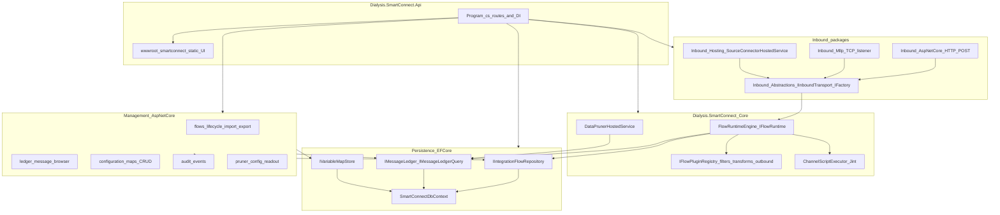
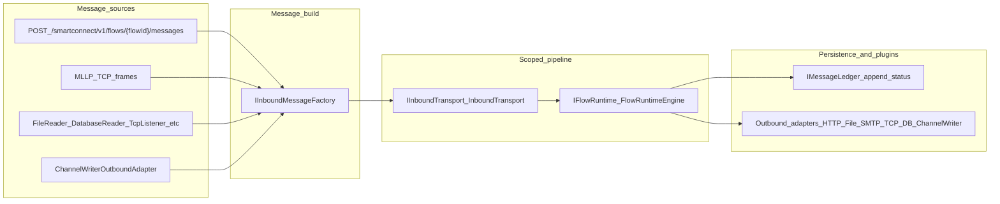
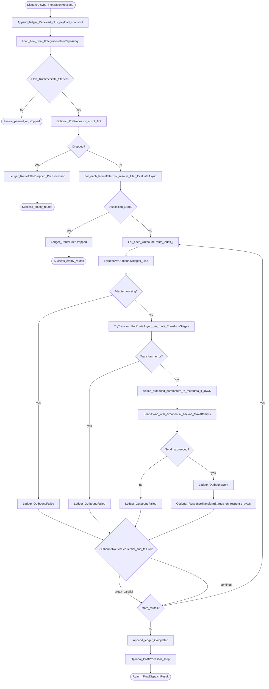
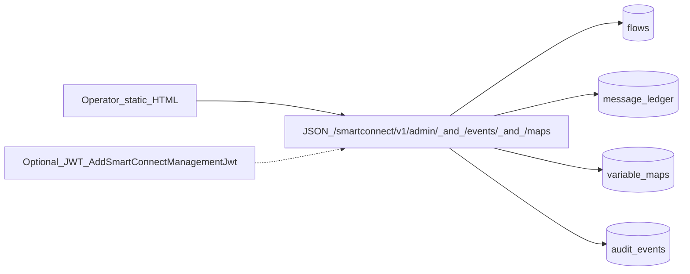
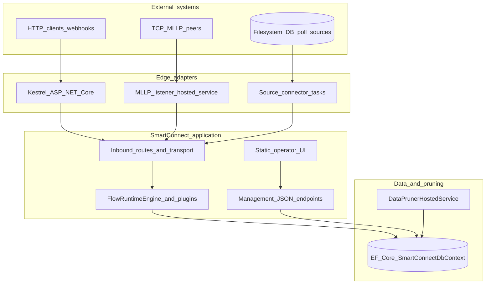
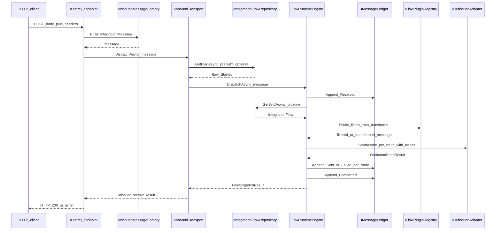
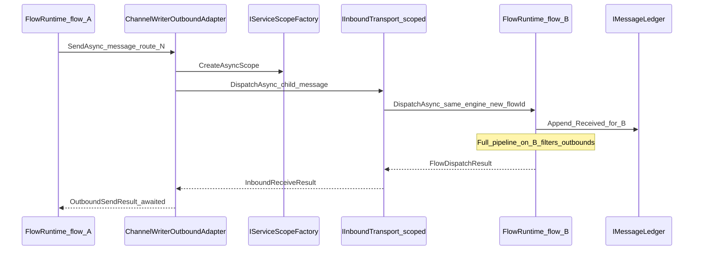
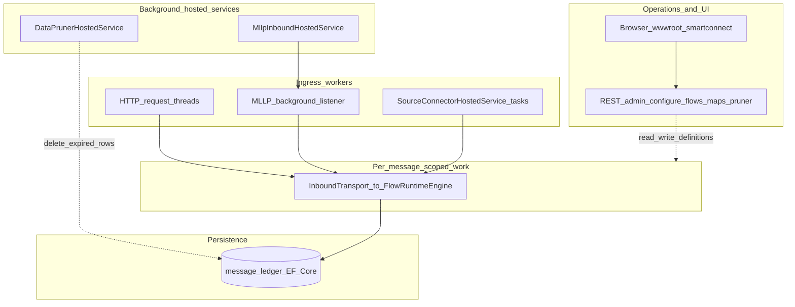

# SmartConnect architecture flowcharts

This document explains how **SmartConnect** under `src/backend/SmartConnect` fits together: host wiring, message ingress, `FlowRuntimeEngine`, persistence, and management APIs.

Primary code references:

- [`Program.cs`](../../src/backend/SmartConnect/Api/Dialysis.SmartConnect.Api/Program.cs) — DI, routes, optional JWT
- [`FlowRuntimeEngine.cs`](../../src/backend/SmartConnect/Dialysis.SmartConnect.Core/FlowRuntimeEngine.cs) — pipeline execution
- [`InboundTransport.cs`](../../src/backend/SmartConnect/Inbound/Dialysis.SmartConnect.Inbound.Abstractions/InboundTransport.cs) — preflight + dispatch to runtime
- [`SmartConnectInboundEndpointExtensions.cs`](../../src/backend/SmartConnect/Inbound/Dialysis.SmartConnect.Inbound.AspNetCore/SmartConnectInboundEndpointExtensions.cs) — HTTP ingress
- [`SourceConnectorHostedService.cs`](../../src/backend/SmartConnect/Inbound/Dialysis.SmartConnect.Inbound.Hosting/SourceConnectorHostedService.cs) — background source connectors

---

## 1. Solution shape (projects and responsibilities)

**Notes**

- **`IInboundTransport`** (`InboundTransport.cs`): optional flow preflight, then **`IFlowRuntime.DispatchAsync`**.
- **Ingress**: HTTP (`SmartConnectInboundEndpointExtensions`), MLLP TCP (`MllpInboundHostedService`), and **source connectors** (`SourceConnectorHostedService`) all use **`IInboundTransport`** (scoped), same path as **Channel Writer** (in-process chaining).

---

## 2. End-to-end path: from ingress to ledger and outbounds

**Ordering**

1. Build **`IntegrationMessage`** (payload, format, correlation id, metadata).
2. **`InboundTransport.DispatchAsync`**: if `IIntegrationFlowRepository` is registered, check flow exists and **`RuntimeState == Started`** (HTTP can map 404/409).
3. **`FlowRuntimeEngine.DispatchAsync`**: ledger + pipeline (section 3).
4. Outbound adapters may call **`IInboundTransport`** again (e.g. channel writer), opening a **new scoped** dispatch for the target flow.

---

## 3. Detailed pipeline: `FlowRuntimeEngine.DispatchAsync`

Aligned with `FlowRuntimeEngine.cs`.

**Behavior summary**

| Stage | Role |
|--------|------|
| **Ledger `Received`** | Auditable intake with payload snapshot. |
| **Flow state** | Only **Started** flows run; **Paused** / not started short-circuit. |
| **PreProcessor** | Optional Jint; can drop or replace payload. |
| **Route filters** | Ordered slots; **Drop** stops pipeline and logs filter drop. |
| **Outbound routes** | Each route: **transform chain** → **SendAsync** (retries) → ledger **Sent** / **Failed**. |
| **Sequential vs parallel** | If **`OutboundRoutesSequential`**, first hard failure stops further routes; otherwise other routes still run. |
| **Response transforms** | If adapter returns **response bytes** and route defines **`ResponseTransformStages`**, run transform chain and keep response payload for **`FlowDispatchResult`**. |
| **PostProcessor** | Optional Jint after all routes; sees overall success flag. |

---

## 4. Management and operator surface (orthogonal to dispatch)

`Program.cs` maps inbound routes, management routes, ledger, configuration maps, events, pruner; optional **`UseAuthentication`** when JWT authority is configured (`ManagementSecurityExtensions`).

---

## 5. Layered view (who talks to whom)

Logical layers for **runtime workflows** vs **operations**.

---

## 6. Sequence: HTTP inbound message through one flow

Typical path: **`POST /smartconnect/v1/flows/{flowId}/messages`** → scoped **`InboundTransport`** → **`FlowRuntimeEngine`**.

---

## 7. Sequence: Channel Writer (flow A → flow B)

`ChannelWriterOutboundAdapter` opens a **new DI scope**, resolves **`IInboundTransport`**, and dispatches into **another flow** (depth guard in metadata).

This is **in-process chaining**: not a separate network hop to self unless an outbound adapter explicitly does so.

---

## 8. Swimlanes: parallel workflows on the host

**Interpretation**

- **lane_ops**: operators change configuration; does not execute channel filters/transforms for live payloads (except via **reprocess** APIs that inject work into **lane_core**).
- **lane_ingress**: multiple concurrent entry points; each message eventually hits **Dispatch** (scoped).
- **lane_bg**: pruner and TCP listener run independently of a single HTTP request.

---

## See also

- [Scope vs Mirth Connect](scope-vs-mirth.md)
- [User guide traceability matrix](guide-traceability.md)
