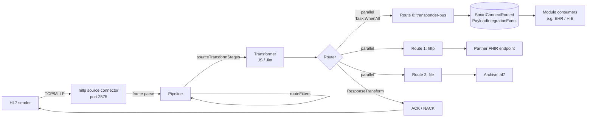

# SmartConnect — TCP Listener HL7 v2.x production tutorial

End-to-end walkthrough for healthcare integration engineers, interface analysts, and interoperability teams. Configure a SmartConnect channel that receives MLLP-framed HL7 v2.x messages over TCP, validates and parses them, transforms patient / encounter / order / observation data, routes the result to downstream systems, and returns an ACK to the sender — using only what the platform ships today (no fictitious UI, no fictitious transformer language).

> **Scope**: SmartConnect as it lives in this repo. The platform is API-first with an operator shell; the new `+ New channel` button (this PR) is the dialog every "create a channel" step refers to. The transformer language is **JavaScript via Jint** — C# samples in this tutorial are explicitly test clients / standalone reference / downstream consumers, never platform transformer code.

---

## 1 · Introduction

### What HL7 v2.x is

HL7 v2.x is the most widely deployed clinical messaging format on earth. A message is plain text, segment-per-line, with delimiter characters declared in the first segment (`MSH`). One line in, you have a complete patient registration, lab order, observation, or scheduling event.

Message anatomy:

```
MSH|^~\&|HIS|HOSPITAL|EMR|CLINIC|20260526120000||ADT^A01|MSG-0001|P|2.5
PID|1||MRN-12345^^^HOSPITAL^MR||DOE^JOHN^Q||19800101|M|||123 Main St^^Anytown^MA^02115||(555)123-4567
PV1|1|I|ICU^101^A||||PRV-001^SMITH^JANE
```

| Concept       | Marker          | Example                                               |
|---------------|-----------------|-------------------------------------------------------|
| Segment       | 3-letter code   | `MSH`, `PID`, `PV1`                                   |
| Field         | `\|`            | `PID-3` = `MRN-12345^^^HOSPITAL^MR`                    |
| Component     | `^`             | `PID-5.1` = `DOE`, `PID-5.2` = `JOHN`                  |
| Subcomponent  | `&`             | `MSH-3.1`                                              |
| Repetition    | `~`             | `PID-3~PID-3`                                          |
| Escape        | `\`             | `\F\` literal pipe                                    |

### Supported HL7 v2.x versions

SmartConnect parses HL7 v2.1 through v2.8+. The `MSH-12` version string is propagated to the message ledger; downstream consumers can branch on it. Newer versions add segments and fields — SmartConnect's `Hl7V2Message` parser is forward-compatible: unknown segments and fields parse and are accessible by path even when the platform doesn't ship a typed mapper for them.

Backward-compatibility notes:

- v2.3.1 introduced extended PV1 fields (visit number, financial class) — older mappers ignore them.
- v2.4 introduced repeating fields uniformly across segments — `GetValue("PID.3[2].1")` works against all versions.
- v2.5+ formalises `MSH-9.3` as the message-structure code (`ADT_A01`); older messages omit it and the platform falls back to the trigger code in `MSH-9.2`.
- v2.6 adds withholding-mode segments and the `ARV` access-restriction segment — unknown segments parse and are addressable by path; typed FHIR mappers ignore them where they don't have a US Core equivalent.

### Supported HL7 v2.x message types

SmartConnect parses every HL7 v2.x message — the parser is generic. The platform additionally ships **typed FHIR R4 mappers** for the triggers below; messages outside this list still parse and route, they just don't auto-convert to FHIR.

| Trigger      | FHIR resource          | Notes                                                  |
|--------------|------------------------|--------------------------------------------------------|
| `ADT^A01`    | `Patient`, `Encounter` | Admit / visit notification                             |
| `ADT^A03`    | (no typed mapper)      | Discharge — routed through generic transformers       |
| `ADT^A04`    | `Patient`              | Register patient                                       |
| `ADT^A08`    | `Patient`              | Update patient info (tagged `patient-update`)         |
| `ADT^A11`    | (no typed mapper)      | Cancel admit — routed through generic transformers    |
| `ADT^A40`    | `Patient`              | Merge — carries the prior identifier as a `Patient.link` |
| `ORM^O01`    | `ServiceRequest`       | New order                                              |
| `ORU^R01`    | `Observation`          | Lab result                                             |
| `ORU^R30`    | `Observation`          | Unsolicited point-of-care result (tagged `POC`)        |
| `ORU^R40`    | `Observation`          | Solicited POC result                                   |
| `SIU^S12`    | `Appointment`          | New appointment booking                                |
| `DFT^P03`    | `ChargeItem`           | Billing detail — FT1 → ChargeItem with CPT coding     |
| `VXU^V04`    | `Immunization`         | Vaccination record update                              |
| `MDM^T02`    | `DocumentReference`    | Document notification                                  |
| `ZZZ^*` (Z)  | (no typed mapper)      | Facility-specific — generic parse + your transformer  |

### Why SmartConnect?

SmartConnect is the modular-monolith integration engine inside the Dialysis platform. It owns:

- The **TCP / MLLP listener** that receives raw HL7 over the wire.
- The **flow runtime** (route filters → source transforms → outbound dispatch) with bi-directional routing (`Task.WhenAll` outbound by default — see [`bi-directional-routing`](../../src/backend/SmartConnect/README.md#bi-directional-routing)).
- The **HL7 v2 parser** (`Hl7V2Message`) with path-syntax access.
- The **JavaScript transformer** (Jint engine) with Mirth-style variable maps.
- **12 typed HL7v2 → FHIR mappers** (table above) — generic content also routes through a `transponder-bus` adapter as raw bytes.
- The **operator shell** UI with the new `+ New channel` dialog (this PR), live message ledger, and outbound concurrency timeline.

The architecture diagram lives in [`docs/smartconnect/architecture-flowcharts.md`](architecture-flowcharts.md). Mirth-coverage traceability lives in [`docs/smartconnect/alignment-status.md`](alignment-status.md).

---

## 2 · Access the platform

### Local dev (Aspire)

```bash
dotnet run --project src/aspire/Dialysis.AppHost
```

Aspire starts every per-module Postgres + RabbitMQ + Valkey + Keycloak, then runs all five module APIs + the Identity BFF + the edge Gateway + the SPA. The Aspire dashboard (logs, metrics, traces) opens automatically.

| Endpoint                        | Address                                                |
|---------------------------------|--------------------------------------------------------|
| Operator shell (SPA)            | `http://localhost:9090/`                                |
| SmartConnect admin API          | `http://localhost:9090/api/smartconnect/smartconnect/v1/admin/...` |
| Aspire dashboard                | URL opens automatically                                 |
| MLLP listener (default)         | `tcp://localhost:2575`                                  |

Sign in through Keycloak via the gateway. In development you start as `admin` with the seeded realm.

### Containerised (production-like)

```bash
docker compose -f docker-compose.modules.yml up -d
```

Hosts and ports:

| Component   | Port  |
|-------------|-------|
| Gateway     | 5000  |
| SmartConnect API | 5291 |
| MLLP listener | configured via env (see Section 4) |

---

## 3 · Create the HL7 v2.x channel

### Option A — Use the new operator-shell dialog (recommended)

1. Open the SPA, navigate to **SmartConnect → Flows**.
2. Click **`+ New channel`** (top-right).
3. **Basics**
   - Name: `HL7 v2.x TCP Listener`
   - Description: `Receives HL7 v2 over MLLP and publishes the payload onto the Transponder bus.`
4. **Template**: choose **HL7 v2 over MLLP**. The dialog fills the pipeline with an `allow-all` route filter and a single `transponder-bus` outbound route (routing hint `ORU^R01`).
5. **Outbound routes**: edit the routing hint to match the trigger you'll be sending (or leave it for a generic pass-through). Each route's parameters render as a structured form per adapter kind (URL / method / headers for `http`, host / port / framing for `tcp`, etc.) — pick a different kind from the dropdown and the form fields swap. Unknown kinds fall back to a free-form JSON textarea. Toggle `Run routes sequentially` only if your downstream needs ordered fan-out.
6. **Confirm and create**: expand `Preview generated flow JSON` to verify the pipeline shape, choose `Start the channel immediately after creation`, click **Create channel**.

The new flow appears in the list with state `Started`. The dialog uses the same `POST /smartconnect/v1/admin/flows` endpoint as the API path below — the JSON it sends is exactly what gets persisted.

### Option B — API directly

```bash
curl -X POST http://localhost:9090/api/smartconnect/smartconnect/v1/admin/flows \
  -H 'Content-Type: application/json' \
  -H "Authorization: Bearer $TOKEN" \
  --data @- <<'JSON'
{
  "id": "b1d10001-0001-4000-8000-000000000001",
  "name": "HL7 v2.x TCP Listener",
  "runtimeState": 1,
  "description": "Receives HL7 v2 over MLLP and publishes the payload onto the Transponder bus.",
  "tags": ["hl7", "production", "north-hospital"],
  "dataTypes": ["HL7v2"],
  "dependencies": [],
  "attachments": [
    {
      "name": "vendor-spec.pdf",
      "mimeType": "application/pdf",
      "base64Bytes": "JVBERi0xLjQ..."
    }
  ],
  "pipeline": {
    "routeFilters": [{"kind": "allow-all"}],
    "sourceTransformStages": [],
    "outboundRoutesSequential": false,
    "outboundRoutes": [
      {
        "ordinal": 0,
        "outboundAdapterKind": "transponder-bus",
        "outboundParametersJson": "{\"routingHint\":\"ORU^R01\"}"
      }
    ],
    "linkedLibraryIds": []
  }
}
JSON
```

### Channel metadata fields (new in 1.0)

The dialog's **Metadata** step (and the API body above) carry four operator-facing fields beyond the core pipeline:

| Field          | Type            | Purpose                                                                                            |
|----------------|-----------------|----------------------------------------------------------------------------------------------------|
| `tags`         | `string[]`      | Free-text labels for filtering in the Flows list.                                                  |
| `dataTypes`    | `string[]`      | Declared accepted formats. One of `HL7v2`, `FHIR`, `NCPDP`, `JSON`, `XML`, `Binary`, `Other`.       |
| `dependencies` | `Guid[]`        | Other flow ids this channel needs Started before it can Start. Enforced server-side (see Section 16). |
| `attachments`  | `Attachment[]`  | Inline reference docs (vendor specs, sample IGs). 1 MiB cap inline; bigger files use a `storageRef`. |

**Inline attachments** ride on the flow row as base64 (decoded ≤ 1 MiB). For larger files (vendor PDFs, profile bundles) POST the bytes to `POST /admin/flows/{flowId}/attachments/blob` first, then add the returned ref to the channel:

```json
"attachments": [
  {
    "name": "us-core-bundle.zip",
    "mimeType": "application/zip",
    "base64Bytes": "",
    "description": "US Core 6.1 IG bundle for reference",
    "storageRef": { "kind": "blob", "id": "0a23...", "sizeBytes": 4521823 }
  }
]
```

The blob lives in the configured attachment backend (file-system content-addressable / Azure Blob / S3) and is served back via `GET /admin/flows/{flowId}/attachments/blob/{blobId}`. The server refuses GETs for blob ids not referenced by the channel — no enumeration.

---

## 4 · Configure the TCP Listener source

SmartConnect ships **two** source-connector kinds that can take HL7 over TCP:

| Kind            | Best for                  | Built-in MLLP framing | Clock-skew correction | ACK responsibility |
|-----------------|---------------------------|-----------------------|-----------------------|--------------------|
| **`mllp`**      | HL7 v2 over MLLP (recommended) | Yes (`0x0B … 0x1C 0x0D`) | Yes (`ReportOnly` / `Normalize`) | Your transformer |
| `tcp-listener`  | Anything: text frames, length-prefixed binary, raw bytes | Configurable via `Framing` | No | Your transformer |

Use **`mllp`** unless you have a non-HL7 reason to pick `tcp-listener`.

### Declare the source instance

Source-connector instances are declared via configuration. The Aspire dev loop wires one MLLP instance at startup; production hosts use environment variables, appsettings.json, or the configuration map.

```env
SmartConnect__SourceConnectors__0__Name=Hl7Mllp
SmartConnect__SourceConnectors__0__Kind=mllp
SmartConnect__SourceConnectors__0__DefaultFlowId=b1d10001-0001-4000-8000-000000000001
SmartConnect__SourceConnectors__0__Parameters__Port=2575
SmartConnect__SourceConnectors__0__Parameters__ListenAddress=0.0.0.0
SmartConnect__SourceConnectors__0__Parameters__MaxMessageBytes=8388608
```

| Parameter         | Default       | Why                                                                    |
|-------------------|---------------|------------------------------------------------------------------------|
| `Port`            | `2575`        | HL7 v2 standard MLLP port. Set to `6661` if your environment requires it. |
| `ListenAddress`   | `0.0.0.0`     | Bind on all interfaces. Lock down via firewall, not via `127.0.0.1`.   |
| `MaxMessageBytes` | `8388608`     | 8 MiB cap. Bigger messages get rejected before they reach the parser.  |
| `MaxConnections`  | `100`         | Concurrent senders.                                                    |
| `KeepAlive`       | `true`        | Long-lived TCP connections matter for HL7 senders that batch.          |

Use `tcp-listener` instead by switching `Kind` to `tcp-listener` and adding `Parameters__Framing=Mllp` (other valid values: `None`, `LineFeed`, `LengthPrefixed`).

### Why MLLP at all?

Minimal Lower Layer Protocol wraps each HL7 message in three control characters:

```
0x0B   message bytes   0x1C 0x0D
```

It's not encryption — it's framing. Without it, a TCP stream is ambiguous (where does one message end and the next begin?). Every HL7 v2 sender in healthcare speaks MLLP; SmartConnect handles the framing automatically when `Kind=mllp`.

---

## 5 · Configure HL7 validation

SmartConnect ships three validation gates you can layer:

1. **MLLP-frame validation** — automatic. Malformed frames are dropped at the socket and the source connector emits a debug log; no flow runs.
2. **MSH parse** — automatic on first `Hl7V2Message.Parse(...)` call. If `MSH` is missing or the encoding characters can't be read, the parse throws and the flow records `OutboundFailed` with the parser exception.
3. **Operator-defined route filters** — declarative. Add to `routeFilters[]` in your pipeline.

### Built-in route filters

| Kind                | Drops the message when…                                                                          |
|---------------------|---------------------------------------------------------------------------------------------------|
| `allow-all`         | Never. Useful as a default first filter.                                                          |
| `javascript`        | Your JS expression returns `false`.                                                               |
| `external-script`   | An external `.js` file's expression returns `false`.                                              |
| `rule-builder`      | The configured field/operator/value condition is not met. JSON-driven; no code.                   |
| `iterator`          | Inner filter passes on zero of the iterated values (e.g. "drop if no `OBX` segment matches").    |

Example: require HL7 v2.5+ via `rule-builder`:

```json
{
  "kind": "rule-builder",
  "propertiesJson": "{\"field\":\"MSH.12\",\"operator\":\"version-at-least\",\"value\":\"2.5\"}"
}
```

Example: require ORU^R01 specifically via `javascript`:

```js
// Returning true keeps the message; false drops it (RouteFilterDropped ledger row).
var msh9 = msg.GetValue("MSH.9.1");
return msh9 === "ORU";
```

### Generate the ACK / NACK

MLLP does **not** auto-emit ACKs. SmartConnect ships a `makeAck(controlId, code, message)` code template (registered by `BuiltInCodeTemplatesSeeder`) that produces a minimal HL7 ACK. Wire it into a **`ResponseTransformStage`** on your outbound route so the ACK gets returned to the MLLP sender:

```js
// Response transform stage — runs on the outbound route's response payload.
var controlId = msg.GetValue("MSH.10");
var code = $("dispatchFailed") ? "AE" : "AA"; // AE = application error, AA = application accept
return makeAck(controlId, code, null);
```

See [`docs/smartconnect/response-transforms.md`](response-transforms.md) for the three canonical patterns (raw response, structured ACK, error propagation).

---

## 5a · Verify HL7 / Verify FHIR

Two verification plugin pairs ship alongside the rule-builder filter — pick the one that matches your downstream payload shape. **Filter** variants drop the message (silent); **strict** variants throw (fail-loud, recorded as `OutboundFailed`).

| Plugin                  | Variant     | Behaviour                                                                                                |
|-------------------------|-------------|----------------------------------------------------------------------------------------------------------|
| `verify-hl7`            | route filter | Parses with `Hl7V2Message.Parse`. Drops on parse failure / missing required segments / version too low. |
| `verify-hl7-strict`     | transform   | Same checks, throws on failure.                                                                          |
| `verify-fhir`           | route filter | Validates as FHIR R4 via `IFhirProfileValidator`. Drops on any validation error.                         |
| `verify-fhir-strict`    | transform   | Same checks, throws on failure.                                                                          |

### `verify-hl7` parameters

```json
{
  "kind": "verify-hl7",
  "propertiesJson": "{\"requiredSegments\":[\"MSH\",\"PID\",\"PV1\"],\"minVersion\":\"2.5\"}"
}
```

Both `requiredSegments` and `minVersion` are optional. Bare `verify-hl7` (no params) drops only on parse failure.

### `verify-fhir` parameters

```json
{
  "kind": "verify-fhir",
  "propertiesJson": "{\"profileUri\":\"http://hl7.org/fhir/us/core/StructureDefinition/us-core-patient\"}"
}
```

`profileUri` pins validation to a specific Implementation Guide profile. Blank uses the host's default validator profile (US Core out of the box).

### Worked example — verify HL7 → map to FHIR → verify FHIR

```jsonc
{
  "routeFilters": [
    {
      "kind": "verify-hl7",
      "propertiesJson": "{\"requiredSegments\":[\"MSH\",\"PID\",\"OBR\",\"OBX\"],\"minVersion\":\"2.5\"}"
    }
  ],
  "sourceTransformStages": [
    { "kind": "hl7-to-fhir-pipeline" }
  ],
  "outboundRoutesSequential": false,
  "outboundRoutes": [
    {
      "ordinal": 0,
      "outboundAdapterKind": "transponder-bus",
      "outboundParametersJson": "{\"routingHint\":\"observation-imported\"}",
      "transformStages": [
        {
          "kind": "verify-fhir-strict",
          "propertiesJson": "{\"profileUri\":\"http://hl7.org/fhir/us/core/StructureDefinition/us-core-observation-lab\"}"
        }
      ]
    }
  ]
}
```

Upstream HL7 v2 messages that aren't well-formed are silently dropped by `verify-hl7`. Anything that survives gets mapped to a FHIR Bundle by `hl7-to-fhir-pipeline`. The strict FHIR check on the outbound side raises `OutboundFailed` if the produced Bundle doesn't validate against US Core Observation Lab — so the operator sees the bad bundle in the ledger instead of it leaking to the partner.

The full pipeline is covered end-to-end by `MllpToFhirEndToEndTests` (in-memory) and `MllpRealSocketEndToEndTests` (real loopback socket).

---

## 6 · Configure the transformer (JavaScript via Jint)

SmartConnect's transformer is a Jint-hosted JavaScript runtime. Script context exposes the message payload and Mirth-style variable maps.

### Globals

| Name                | Type                        | Notes                                                           |
|---------------------|-----------------------------|-----------------------------------------------------------------|
| `payloadText`       | `string`                    | UTF-8 decoded message (or Base64 if the payload is binary).     |
| `correlationId`     | `string`                    | Inbound correlation id.                                          |
| `flowId`            | `string` (GUID)             | Flow currently dispatching.                                      |
| `sourceMap`         | `Map<string, any>` (read-only) | Source-connector-supplied bag.                                 |
| `channelMap`        | `Map<string, any>`          | Per-dispatch shared state.                                      |
| `connectorMap`      | `Map<string, any>`          | Per-route bag.                                                  |
| `responseMap`       | `Map<string, any>`          | Engine-populated `{routeName: {status, payload\|error}}`.       |
| `globalChannelMap`  | `Map<string, any>`          | Persistent per-channel.                                         |
| `globalMap`         | `Map<string, any>`          | Persistent across channels.                                     |
| `configurationMap`  | `Map<string, any>` (read-only) | Operator-configured constants.                               |
| `$(key)`           | `function`                  | Lookup that walks response → connector → channel → source → globalChannel → global → configuration. |
| `addAttachment(name, mimeType, bytes)` | `function`       | Persist a payload to the attachment store; receive `${ATTACH:<id>}` back. |
| `msg`               | `Hl7V2Message`              | Parsed HL7 v2 message — exposed when the source is `mllp` / `tcp-listener` with `Framing=Mllp`. |
| `makeAck(controlId, code, message)` | `function`       | Built-in code template returning a minimal HL7 ACK string.      |

### Parser API (`Hl7V2Message`)

Path syntax: `SEGMENT.field[repeat].component.subcomponent`. `MSH-1` is the field separator, `MSH-2` is the encoding characters, so PID-3 reads `PID.3` (no offset). For `MSH` fields the offset is +2 (i.e. `MSH.9.1` reads what looks like the third pipe-delimited field).

```js
var messageType  = msg.GetValue("MSH.9.1");          // "ORU"
var triggerEvent = msg.GetValue("MSH.9.2");          // "R01"
var hl7Version   = msg.GetValue("MSH.12");           // "2.5"
var messageId    = msg.GetValue("MSH.10");           // "MSG-0001"
var patientId    = msg.GetValue("PID.3.1");          // "MRN-12345"
var familyName   = msg.GetValue("PID.5.1");          // "DOE"
var givenName    = msg.GetValue("PID.5.2");          // "JOHN"
var dob          = msg.GetValue("PID.7.1");          // "19800101"
var gender       = msg.GetValue("PID.8.1");          // "M"
var visitNumber  = msg.GetValue("PV1.19.1");
var providerId   = msg.GetValue("PV1.7.1");
var facilityId   = msg.GetValue("MSH.4.1");

channelMap.put("messageType", messageType);
channelMap.put("triggerEvent", triggerEvent);
channelMap.put("patientId", patientId);
channelMap.put("firstName", givenName);
channelMap.put("lastName", familyName);
channelMap.put("dob", dob);
channelMap.put("gender", gender);
channelMap.put("visitNumber", visitNumber);
```

Repeating fields:

```js
// PID-3 typically carries multiple identifiers (MRN, SSN, etc.). Iterate explicitly.
var idCount = msg.GetRepeatCount("PID.3");
for (var i = 0; i < idCount; i++) {
  var id = msg.GetValue("PID.3[" + i + "].1");
  var system = msg.GetValue("PID.3[" + i + "].4");
  channelMap.put("identifier_" + system, id);
}
```

Order line items (one OBR + one or more OBX):

```js
var orderId = msg.GetValue("ORC.2.1");
channelMap.put("orderId", orderId);

var observationCount = msg.GetRepeatCount("OBX");
for (var i = 0; i < observationCount; i++) {
  var loinc = msg.GetValue("OBX[" + i + "].3.1");
  var value = msg.GetValue("OBX[" + i + "].5");
  var units = msg.GetValue("OBX[" + i + "].6.1");
  connectorMap.put("obs_" + loinc, { value: value, units: units });
}
```

Insurance (IN1 segment):

```js
var insurer = msg.GetValue("IN1.4.1");
var policyId = msg.GetValue("IN1.36");
channelMap.put("insurer", insurer);
channelMap.put("policyId", policyId);
```

---

## 7 · Real HL7 v2.x message examples

Every example below is a complete, parseable HL7 v2 message. Carriage returns (`\r`) separate segments; the line breaks here are for legibility — the wire format uses `\r` only.

### ADT^A01 — admit / visit notification

```
MSH|^~\&|HIS|HOSPITAL|EMR|CLINIC|20260526120000||ADT^A01^ADT_A01|MSG-A01-001|P|2.5
EVN|A01|20260526120000|||PRV-001
PID|1||MRN-12345^^^HOSPITAL^MR||DOE^JOHN^Q||19800101|M|||123 Main St^^Anytown^MA^02115||(555)123-4567
PV1|1|I|ICU^101^A||||PRV-001^SMITH^JANE
AL1|1|DA|PEN^Penicillin
```

### ORU^R01 — lab result

```
MSH|^~\&|LAB|HOSPITAL|EMR|CLINIC|20260526121500||ORU^R01|MSG-R01-002|P|2.5
PID|1||MRN-12345^^^HOSPITAL^MR||DOE^JOHN
OBR|1|ORD-001||29463-7^Body weight^LN|||20260526120000
OBX|1|NM|29463-7^Body weight^LN||72.4|kg|||||F|||20260526121500
OBX|2|NM|8480-6^Systolic BP^LN||135|mmHg|||||F|||20260526121500
```

### ORM^O01 — new order

```
MSH|^~\&|EHR|CLINIC|LAB|HOSPITAL|20260526090000||ORM^O01|MSG-O01-003|P|2.5
PID|1||MRN-67890
ORC|NW|ORD-002|||||||20260526090000|||PRV-007
OBR|1||ORD-002|24323-8^Comprehensive metabolic panel^LN
```

### SIU^S12 — new appointment

```
MSH|^~\&|SCHED|CLINIC|EHR|HOSPITAL|20260526100000||SIU^S12|MSG-S12-004|P|2.5
SCH|APPT-001||||||||30|min|^^30^20260602100000^20260602103000||||||||||||B
PID|1||MRN-12345
RGS|1
AIL|1|||OR.1^Operating Room 1
AIP|1||PRV-001^SMITH^JANE
AIS|1||DR.1^Daily Round
```

### MDM^T02 — document notification

```
MSH|^~\&|EHR|HOSPITAL|HIE|CLINIC|20260526110000||MDM^T02|MSG-T02-005|P|2.5
EVN|T02|20260526110000
PID|1||MRN-12345
TXA|1|11506-3^Progress note^LN|||20260526110000|||||||DOC-001
OBX|1|TX|11506-3^Progress note^LN||Patient stable. Continue current regimen.|||||||F
```

### VXU^V04 — vaccination record

```
MSH|^~\&|VAX|CLINIC|REGISTRY|STATE|20260526113000||VXU^V04|MSG-V04-006|P|2.5
PID|1||MRN-12345
RXA|0|1|20260101120000||207^COVID-19 mRNA vaccine^CVX|0.3|||||||||LOT-A1
RXR|IM^Intramuscular^HL70162|LA^Left arm^HL70163
```

### ADT^A40 — patient identifier merge

```
MSH|^~\&|REG|HOSPITAL|EMR|CLINIC|20260526115000||ADT^A40|MSG-A40-007|P|2.5
EVN|A40|20260526115000
PID|1||MRN-SURVIVING||DOE^JANE
MRG|MRN-OLD-9999
```

The `AdtA40ToPatientMapper` emits a FHIR `Patient` with a `link.type = Replaces` reference to the old identifier — downstream consumers reconcile.

### DFT^P03 — billing detail (→ FHIR ChargeItem)

```
MSH|^~\&|BILL|HOSPITAL|FIN|CLINIC|20260526123000||DFT^P03|MSG-P03-008|P|2.5
EVN|P03|20260526123000
PID|1||MRN-12345
PV1|1|O|CLN^101
FT1|1||TXN-001|20260526|20260526|CG|99213^Office visit^CPT||1|150.00
```

The `DftP03ToChargeItemMapper` extracts FT1-3 (transaction id) → identifier, FT1-7 (CPT code) → `code.coding`, FT1-10 → `quantity.value`, FT1-22 → `priceOverride`, plus PID-3 → `subject` reference.

---

## 8 · Parse a user-provided HL7 message

> For an interactive walkthrough of the same parse-then-validate-then-send flow against an operator-pasted message, see [Section 11a — HL7 Workbench](#11a--hl7-workbench-your-own-message-end-to-end). This section is the manual checklist; the Workbench automates it.

When operators paste a real production message, walk it through this checklist:

1. **MLLP frame** — does the first byte = `0x0B` and the last three = `0x1C 0x0D`? Strip them before parsing.
2. **Encoding chars** — `MSH-2` must equal `^~\&` for the platform's default delimiter set. Custom delimiters parse but downstream JSON conversion may need explicit unescape steps.
3. **`MSH-9`** — identify trigger event (`ADT^A01`, `ORU^R01`, etc). Look up the mapper table in Section 1.
4. **`MSH-12`** — version. Set a `RuleBuilderRouteFilter` if you need a minimum.
5. **Required segments by trigger**:
   - `ADT^A0x`: MSH, EVN, PID, PV1
   - `ORU^R01`: MSH, PID, OBR, OBX
   - `ORM^O01`: MSH, PID, ORC, OBR
   - `SIU^S12`: MSH, SCH, PID, RGS, AIL/AIP/AIS
   - `MDM^T02`: MSH, EVN, PID, TXA, OBX
   - `VXU^V04`: MSH, PID, RXA (RXR optional)
6. **Segment-by-segment** — walk every segment, extract every field. If a field is missing, `GetValue` returns `null` (script-side) or empty string (C# host).
7. **Z-segments** — facility-specific. The parser preserves them verbatim; your transformer interprets the structure.

Diagnosable errors:

| Symptom                                           | Likely cause                                  | Fix                                                                  |
|---------------------------------------------------|-----------------------------------------------|----------------------------------------------------------------------|
| Parser throws on `Parse(...)`                     | Missing MSH or unreadable encoding chars      | Restore MSH; verify encoding chars                                  |
| Empty fields where data was expected              | Wrong segment index, off-by-one in path       | Use a path like `PID.3[0].1` not `PID.3.1` when repeats matter      |
| `RouteFilterDropped` in ledger                    | A route filter returned false                 | Inspect `details` column on the ledger row                          |
| `OutboundFailed` with "kind not registered"       | Adapter kind typo in route's `kind` field     | List adapters via the plugin registry                               |
| ACK shows `AE` even though message processed      | Response transform missing or returned `null` | Wire `makeAck()` in a `ResponseTransformStage` on the outbound route |
| Long fields truncated                             | Database column too narrow                    | Widen the column or store the raw payload in the attachment store   |

---

## 9 · Message processing flow



Every box maps to a real type:

- Pipeline = `IntegrationFlowPipelineDefinition`
- Router = `FlowRuntimeEngine` (parallel since [PR #99](../../src/backend/SmartConnect/README.md#bi-directional-routing))
- Transponder bus envelope = `SmartConnectRoutedPayloadIntegrationEvent` (SchemaVersion 1)

---

## 10 · Destination connectors

Every adapter shipping today (registered in `MutableFlowPluginRegistry`):

| Kind              | Parameters JSON shape                                                                                      | Use |
|-------------------|------------------------------------------------------------------------------------------------------------|-----|
| `pass-through`    | `{}`                                                                                                       | No-op; useful when only the side effect (ledger write) matters. |
| `http`            | `{"url":"…","method":"POST","headers":{…},"authentication":{"kind":"bearer","token":"…"}}`                 | REST partners, FHIR endpoints.                                  |
| `tcp`             | `{"host":"…","port":1234,"framing":"mllp"}`                                                                | Outbound MLLP to another HL7 system.                            |
| `file`            | `{"directory":"/var/spool/hl7-out","fileNameTemplate":"{flowId}-{messageId}.hl7"}`                          | Archives or sftp-mounted drops.                                 |
| `smtp`            | `{"host":"smtp.example.com","port":587,"to":"…","subject":"…"}`                                            | Email summaries.                                                |
| `database`        | `{"connectionStringName":"OracleHL7","statement":"INSERT INTO hl7_inbox …","parameters":[…]}`              | Side-channel persistence.                                       |
| `channel-writer`  | `{"targetFlowId":"…","metadataPropagation":"All"}`                                                         | Mirth-style in-process redirect.                                |
| `transponder-bus` | `{"routingHint":"ORU^R01","headers":{…},"deduplicationId":"…"}`                                            | Cross-module fan-out via `SmartConnectRoutedPayloadIntegrationEvent`. |

### HL7 → FHIR via the typed mappers

The mappers don't run as adapters — they run as a side effect of any flow that includes the `hl7-to-fhir-pipeline` source-transform stage. Register the stage in your `sourceTransformStages[]`:

```json
{ "kind": "hl7-to-fhir-pipeline" }
```

The stage walks all 12 registered `IFhirV2MessageMapper<>` implementations, picks the one whose trigger matches `MSH-9`, and stamps the converted FHIR resource as JSON onto the message payload. Downstream adapters then send FHIR, not HL7.

---

## 11 · Deploy and test

### C# MLLP test client (.NET 10)

```csharp
using System.Net.Sockets;
using System.Text;

const byte StartBlock = 0x0B;
const byte EndBlock = 0x1C;
const byte CarriageReturn = 0x0D;

string hl7 = string.Join("\r",
    "MSH|^~\\&|HIS|HOSPITAL|EMR|CLINIC|20260526120000||ADT^A01|MSG-0001|P|2.5",
    "EVN|A01|20260526120000|||PRV-001",
    "PID|1||MRN-12345^^^HOSPITAL^MR||DOE^JOHN^Q||19800101|M",
    "PV1|1|I|ICU^101^A||||PRV-001^SMITH^JANE");

using var client = new TcpClient("localhost", 2575);
client.NoDelay = true;
using var stream = client.GetStream();

byte[] payload = Encoding.UTF8.GetBytes(hl7);
stream.WriteByte(StartBlock);
stream.Write(payload);
stream.WriteByte(EndBlock);
stream.WriteByte(CarriageReturn);
await stream.FlushAsync();

var buffer = new byte[4096];
int read = await stream.ReadAsync(buffer);
string ack = Encoding.UTF8.GetString(buffer, 0, read).Trim('', '', '\r');
Console.WriteLine($"ACK ({read} bytes):\n{ack}");
```

### Python equivalent

```python
import socket

hl7 = (
  "MSH|^~\\&|HIS|HOSPITAL|EMR|CLINIC|20260526120000||ADT^A01|MSG-0001|P|2.5\r"
  "EVN|A01|20260526120000|||PRV-001\r"
  "PID|1||MRN-12345^^^HOSPITAL^MR||DOE^JOHN^Q||19800101|M\r"
  "PV1|1|I|ICU^101^A||||PRV-001^SMITH^JANE\r"
).encode("utf-8")

framed = b"\x0b" + hl7 + b"\x1c\r"

with socket.create_connection(("localhost", 2575), timeout=10) as s:
    s.sendall(framed)
    ack = s.recv(4096)
print(ack.decode("utf-8", errors="replace"))
```

### Standalone C# HL7 parser (reference / educational)

Not a SmartConnect transformer — this is what `Hl7V2Message` does under the hood, simplified, so engineers reading the tutorial can build intuition:

```csharp
public sealed class StandaloneHl7Parser
{
    public static Dictionary<string, string[]> Parse(string raw)
    {
        var segments = raw.Replace('\n', '\r').Split('\r', StringSplitOptions.RemoveEmptyEntries);
        var byCode = new Dictionary<string, string[]>(StringComparer.Ordinal);
        foreach (var seg in segments)
        {
            var fields = seg.Split('|');
            byCode[fields[0]] = fields;
        }
        return byCode;
    }

    public static (string trigger, string version, string patientId, string family, string given)
        Snapshot(Dictionary<string, string[]> parsed)
    {
        var msh = parsed["MSH"];
        var pid = parsed["PID"];
        return (
            trigger: msh[8].Split('^')[0] + "^" + msh[8].Split('^')[1],
            version: msh[11],
            patientId: pid[3].Split('^')[0],
            family: pid[5].Split('^')[0],
            given: pid[5].Split('^')[1]);
    }
}
```

Real production code uses `Hl7V2Message.Parse(...)` instead — it handles repeats, escapes, MSH offset, and component nesting that the snippet above doesn't.

### Downstream consumer

Any module can subscribe to the cross-module envelope and react to HL7 traffic. Example for an EHR consumer:

```csharp
public sealed class Hl7TrafficObserver : IConsumer<SmartConnectRoutedPayloadIntegrationEvent>
{
    private readonly ILogger<Hl7TrafficObserver> _logger;

    public Hl7TrafficObserver(ILogger<Hl7TrafficObserver> logger) => _logger = logger;

    public Task ConsumeAsync(SmartConnectRoutedPayloadIntegrationEvent message, CancellationToken ct)
    {
        var payload = Encoding.UTF8.GetString(message.Payload);
        _logger.LogInformation(
            "Routed HL7 received: flow={FlowId} hint={Hint} bytes={Bytes}",
            message.FlowId, message.RoutingHint, message.Payload.Length);
        // Pass to your own EHR processing pipeline here…
        return Task.CompletedTask;
    }
}
```

Register the consumer through Transponder host wiring (see `src/backend/BuildingBlocks/Transponder/README.md`).

### Netcat / telnet quick poke

```bash
printf '\x0bMSH|^~\\&|TEST|TEST|TEST|TEST|20260526120000||ADT^A01|TEST-1|P|2.5\rPID|1||MRN-TEST\r\x1c\r' | nc localhost 2575
```

---

## 11a · HL7 Workbench (your own message, end-to-end)

The Workbench is a paste-your-own HL7 v2 message tool — no canned samples ship with the product. Use it to walk a real production message through the same pipeline a deployed channel sees: parse → validate → optionally dispatch through a Started channel and watch the ledger trail.

Open it from **SmartConnect → HL7 Workbench**. Four steps:

1. **Paste** the raw message into the textarea. The version is auto-detected from MSH-12 and shown as soon as the first line is recognisable.
2. **Parse** invokes `POST /admin/workbench/parse-hl7`. The response shows the header (sender / receiver / trigger / control id / version) plus the structured segment tree (`MSH`, `PID`, `OBX`, …).
3. **Validate** invokes `POST /admin/workbench/validate-hl7` with the same `requiredSegments` + `minVersion` rules the `verify-hl7` route filter uses. Pass / fail + reason are reported inline.
4. **Send** invokes `POST /admin/workbench/dispatch` against the channel you pick from the dropdown (only channels with `dataTypes` containing `HL7v2` are listed). The response shows the dispatch outcome, the response payload (for synchronous request-reply routes), and the ledger snapshot for the new message — Received → OutboundSent (or RouteFilterDropped / OutboundFailed if it broke).

**Multi-version support.** The parser is encoding-driven: it reads MSH-2 to derive the field / component / repeat / escape / sub-component separators, then walks the message uniformly. As a result the Workbench (and every other consumer of `Hl7V2Message.Parse`) accepts HL7 v2.1 through v2.8+ without per-version branches. The matrix is locked in by `Hl7VersionMatrixTests` (parsing + MSH.12 round-trip across 2.1 / 2.3 / 2.3.1 / 2.5 / 2.5.1 / 2.6 / 2.7 / 2.8).

---

## 12 · Monitoring and validation

### Operator shell

- **SmartConnect → Flows**: lifecycle controls (Start / Pause / Stop), per-flow 24h activity counts, the new `+ New channel` dialog.
- **SmartConnect → Messages**: ledger search by `correlationId`, `flowId`, status, time window. Each row opens a drawer with the raw payload snapshot, detail, and — for an inbound message with multiple outbound rows — an **Outbound Concurrency Timeline** (Gantt-style; proves the `Task.WhenAll` guarantee live).
- **SmartConnect → Dependencies**: SVG channel-graph laid out column-by-column by dependency depth. Edges point from each channel to the channels it depends on; node outline colour mirrors the runtime state. Useful for spotting unintended cycles before they bite at Start.
- **SmartConnect → HL7 Workbench**: paste-your-own message walkthrough (see Section 11a).
- **SmartConnect → Alerts**: rule + event browser for failures.
- **Admin → HIPAA**: federated safeguard catalog across every module. SmartConnect's row reports encryption, audit-emitter, and key-ring status.

### Ledger statuses

| Status              | Code | Meaning                                                       |
|---------------------|------|---------------------------------------------------------------|
| `Received`          | 0    | Inbound dispatched into the pipeline.                         |
| `RouteFilterDropped`| 1    | A `routeFilters[]` entry returned false; flow stopped.        |
| `OutboundSent`      | 2    | One outbound route succeeded. One row per route.              |
| `OutboundFailed`    | 3    | One outbound route failed. Inspect `detail` for the cause.    |
| `Completed`         | 4    | End-of-dispatch envelope row.                                 |

### Logs

Aspire dashboard → SmartConnect API → Logs. Search for `SourceConnectorHostedService` to see source-connector lifecycle, `FlowRuntimeEngine` for per-dispatch trace.

---

## 13 · Troubleshooting

| Issue                                       | Diagnosis                                                                 | Fix                                                                                           |
|---------------------------------------------|---------------------------------------------------------------------------|-----------------------------------------------------------------------------------------------|
| **Port already in use** when AppHost starts | Another process bound to 2575 (or your override port).                    | `ss -ltnp \| grep 2575` then kill, or change `Parameters__Port`.                              |
| **Message not received**                    | Source connector didn't start. Look for an error in dashboard logs.       | Check `SmartConnect:SourceConnectors:[]` config — kind / port / flow-id all required.         |
| **Invalid MLLP framing**                    | Source dropped the connection silently; no ledger row appears.            | Verify your client sends `0x0B … 0x1C 0x0D` exactly (no extra `\n`, no missing CR).            |
| **HL7 parsing failures**                    | Ledger has `RouteFilterDropped` or `OutboundFailed` with parser stack.    | Inspect raw payload via the Messages drawer. Common: BOM bytes, wrong encoding chars.         |
| **Transformer errors**                      | `OutboundFailed` with a Jint exception in `detail`.                       | Test the script in the Aspire console (`evaluate-script` debug endpoint) before re-deploying. |
| **Deployment issues**                       | Channel created with `runtimeState=0` (Stopped).                          | Click `Start` in the operator shell, or pass `runtimeState=1` at create-time.                 |
| **Encoding problems**                       | Non-ASCII characters arrive as `?`.                                       | Ensure the sender posts UTF-8; SmartConnect default is UTF-8.                                 |
| **Network/firewall**                        | Outside-the-container test client can't reach 2575.                       | Confirm the AppHost binds `0.0.0.0` (default), not `127.0.0.1`. Open the firewall port.       |
| **Invalid HL7 structures**                  | Missing required segments.                                                | Add a `rule-builder` filter that asserts presence, then ACK `AR` (application reject).         |
| **Unsupported HL7 versions**                | Sender uses v2.0 or some custom variant.                                  | The parser accepts most variants but if encoding chars are non-standard, set them explicitly. |

---

## 14 · Advanced production

### Auto-ACK with NAK propagation

```js
// Inside a ResponseTransformStage on the primary outbound route.
var controlId = msg.GetValue("MSH.10");

// $() walks the response map; the primary route's status lives at responseMap.<routeName>.status
var status = $("status");
var code = (status === "success") ? "AA" : "AR";   // accept vs reject
var detail = (status === "success") ? null : $("error");
return makeAck(controlId, code, detail);
```

### HL7 → JSON / XML / FHIR

JSON: dump the parsed segments — `msg.ToJson()` returns a structured object with one key per segment code.

XML: HL7 v2 XML is supported via the `xml-transform` stage:

```json
{ "kind": "xml-transform", "propertiesJson": "{\"mode\":\"hl7v2-to-xml\"}" }
```

FHIR: use the `hl7-to-fhir-pipeline` source transform (Section 10) — it converts to FHIR resources via the 12 typed mappers.

### Multi-facility routing

Use the [content-based router](../../src/backend/SmartConnect/README.md#content-based-message-router) shipped in PR #99. Declare per-flow `InboundSubscriptions[]`:

```json
{
  "sourceKind": "mllp",
  "messageTypePattern": "ADT^A*",
  "senderId": "HOSPITAL_NORTH"
}
```

Then post inbound messages to `POST /smartconnect/v1/messages` (not the flow-specific endpoint). The router fans the message to every flow whose subscription matches.

### HIPAA-compliant logging

SmartConnect's hosting wires `AddHipaaCompliance("smartconnect")` (see [PR #100](../../src/backend/HIS/README.md#hipaa-compliance-scaffolding)). Mark any `IRequest<T>` that touches PHI with `[PhiAccess(PhiAccessAction.Read, "Patient")]` — the audit pipeline emits a FHIR `AuditEvent` per invocation, persisted via the EF-backed audit store. The federated `/admin/hipaa/safeguards` dashboard surfaces SmartConnect's row alongside every other module's.

### Batch and queue

- File-reader source connector accepts `Pattern=*.hl7` with `Split=Hl7v2` to chunk a batch file into per-message dispatches.
- Outbox-relay (`SmartConnect:Transponder:EnableOutboxRelay=true` — already on in production hosting) guarantees at-least-once delivery to the bus.

---

## 15 · Production best practices

| Topic                       | Recommendation                                                                                  |
|-----------------------------|------------------------------------------------------------------------------------------------|
| **Naming**                  | `<facility>-<protocol>-<trigger>` (e.g. `north-hospital-mllp-adt`).                              |
| **Port management**         | One MLLP listener per facility on a distinct port; reverse-proxy via the gateway.               |
| **Secure TCP**              | Terminate TLS at the gateway / load balancer; MLLP itself is plaintext.                         |
| **Logging**                 | Structured logs via OpenTelemetry (already wired). Search via Aspire dashboard.                 |
| **Reusable transformers**   | Extract shared JS into `CodeTemplateLibrary` entries; link via `linkedLibraryIds`.              |
| **Performance**             | Bi-directional routing defaults to parallel — keep `outboundRoutesSequential = false`.          |
| **High availability**       | Stateless module hosts → `--scale smartconnect-api=3`. Valkey backs Data Protection + cache.    |
| **Monitoring**              | Use the operator shell + `/admin/hipaa/safeguards` + alert rules.                               |
| **Audit logging**           | EF-backed `IAuditEventStore` (mirrors HIS). PHI accesses logged automatically via `[PhiAccess]`. |
| **Environment separation**  | DEV / UAT / PROD each have their own AppHost config and DB schemas.                              |
| **PHI protection**          | Encrypt PHI columns via `EncryptedStringValueConverter` (see HIS README for reference).         |
| **HL7 version governance**  | Pin a minimum version via a `rule-builder` filter; document the bump policy.                    |

---

## 16 · Deployment checklist

- [ ] Gateway routes `/api/smartconnect/*` to the SmartConnect API container.
- [ ] MLLP port (2575 by default, 6661 if overridden) is open through the firewall.
- [ ] `SmartConnect:SourceConnectors:[]` declares the right kind / port / `DefaultFlowId`.
- [ ] Channel exists (verify via `GET /smartconnect/v1/admin/flows`).
- [ ] Channel state is `Started`. If the channel declares `dependencies`, every dep must be Started first — or pass `?force=true` (operator override) or `?cascade=true` (walks the dep graph DFS and Starts each in order; refuses with `409` + the cycle path if it detects a cycle).
- [ ] At least one outbound route is defined.
- [ ] ACK generation is wired in a `ResponseTransformStage` (Section 5).
- [ ] EF audit store is registered (`AddFhirAuditEntityFrameworkStore<SmartConnectDbContext>()`).
- [ ] HIPAA compliance wired (`AddHipaaCompliance("smartconnect")`).
- [ ] `/admin/hipaa/safeguards` reports all four checks `Active` for the SmartConnect host.
- [ ] Sample message sent end-to-end; ACK received; ledger row visible in operator shell.

---

## 17 · HL7 segment reference

| Segment | Purpose                                            | Path examples                                              |
|---------|----------------------------------------------------|------------------------------------------------------------|
| `MSH`   | Message header (always first)                       | `MSH.9.1` (type), `MSH.9.2` (trigger), `MSH.10` (control), `MSH.12` (version) |
| `EVN`   | Event type                                          | `EVN.1` (code), `EVN.2` (recorded), `EVN.5` (operator)    |
| `PID`   | Patient identification                              | `PID.3.1` (MRN), `PID.5.1/.2` (name), `PID.7` (DOB), `PID.8` (gender) |
| `PD1`   | Patient additional demographic                      | `PD1.4.1` (primary care provider)                          |
| `NK1`   | Next of kin                                         | `NK1.2.1/.2` (name), `NK1.5` (phone)                        |
| `PV1`   | Patient visit                                       | `PV1.2` (class), `PV1.3` (location), `PV1.7` (attending), `PV1.19` (visit number) |
| `PV2`   | Patient visit additional                            | `PV2.3` (admit reason)                                     |
| `GT1`   | Guarantor                                           | `GT1.3.1/.2` (name)                                         |
| `IN1`   | Insurance                                           | `IN1.4.1` (insurer), `IN1.36` (policy id)                  |
| `ORC`   | Common order                                        | `ORC.1` (control), `ORC.2.1` (placer id), `ORC.9` (authored) |
| `OBR`   | Observation request                                 | `OBR.4.1` (LOINC), `OBR.7` (observation datetime)          |
| `OBX`   | Observation/result                                  | `OBX.3.1` (LOINC), `OBX.5` (value), `OBX.6.1` (units), `OBX.14` (observed) |
| `DG1`   | Diagnosis                                           | `DG1.3.1` (code), `DG1.3.2` (description)                  |
| `RXA`   | Pharmacy administration                             | `RXA.3` (admin time), `RXA.5` (vaccine code), `RXA.15` (lot) |
| `RXR`   | Pharmacy route                                      | `RXR.1.1` (route), `RXR.2.1` (site)                         |
| `AL1`   | Allergy                                             | `AL1.2` (type), `AL1.3.1` (substance)                       |
| `NTE`   | Notes / comment                                     | `NTE.3` (text)                                              |
| `SCH`   | Schedule activity information                       | `SCH.1.1` (placer), `SCH.11.4` (start)                      |
| `RGS`   | Resource group                                      | `RGS.1` (group seq)                                         |
| `AIL`   | Location resource                                   | `AIL.3.1` (location code)                                   |
| `AIP`   | Personnel resource                                  | `AIP.3.1` (personnel id)                                    |
| `AIS`   | Service resource                                    | `AIS.3.1` (procedure code)                                  |
| `Zxx`   | Facility-specific Z-segment                         | `Zxx.<field>` — parses but is not interpreted by mappers   |

### Path syntax cheat-sheet

```
SEGMENT.field[repeat].component.subcomponent
```

- Indexes are 1-based for segments, 0-based for repeats (`PID.3[0].1`).
- For `MSH`, fields are 1-based but `MSH-1` is the field separator and `MSH-2` is the encoding characters — so what looks like the third pipe-delimited field is `MSH.3`, not `MSH.1`.
- A bare path like `MSH.9` returns the whole composite; `MSH.9.1` drills to the first component.
- Components missing in the message return empty string from C# / `null` from JS.

### Channel metadata

`IntegrationFlow.DataTypes` is a closed enum validated server-side at create / update time. Case-insensitive match; unknown values return `400` from `PipelineValidation.ValidateChannelMetadataOrThrow`.

| Value     | Use for                                                            |
|-----------|--------------------------------------------------------------------|
| `HL7v2`   | HL7 versions 2.1 – 2.8+ (one parser, encoding-driven).             |
| `FHIR`    | FHIR R4 resources / Bundles.                                       |
| `NCPDP`   | National Council for Prescription Drug Programs script messages.   |
| `JSON`    | Generic JSON payloads (operator-defined schemas).                  |
| `XML`     | Generic XML payloads.                                              |
| `Binary`  | Opaque bytes — DICOM, PDFs, vendor blobs.                          |
| `Other`   | Anything else; documentation-only.                                 |

---

## NuGet packages

SmartConnect distributes as eight focused NuGet packages. Reference only the ones your host actually composes — the surface stays small and the dependency cone is explicit.

| Package                                                                  | Activator                                                  | Notes                                                |
|--------------------------------------------------------------------------|------------------------------------------------------------|------------------------------------------------------|
| `Dialysis.SmartConnect.Core.Abstraction`                                 | (n/a — pure contracts)                                    | Required transitively.                               |
| `Dialysis.SmartConnect.Core`                                             | `services.AddSmartConnectCore()`                          | Flow engine + plugins (verify-hl7, verify-fhir, …). |
| `Dialysis.SmartConnect.Persistence.EntityFrameworkCore.Abstractions`     | `services.AddSmartConnectPersistence(...)`                | Provider-neutral EF base.                            |
| `Dialysis.SmartConnect.Persistence.EntityFrameworkCore.InMemory`         | `services.AddSmartConnectPersistenceInMemory(...)`        | Tests / demos only.                                  |
| `Dialysis.SmartConnect.Persistence.EntityFrameworkCore.Postgresql`       | `services.AddSmartConnectPersistenceForPostgresql(...)`   | Recommended production DB.                           |
| `Dialysis.SmartConnect.Persistence.ObjectStorage.ContentAddressable`     | `services.AddSmartConnectContentAddressableAttachmentStore(...)` | Local file-system content-addressable store.   |
| `Dialysis.SmartConnect.Persistence.ObjectStorage.AzureBlob`              | `services.AddSmartConnectAzureBlobAttachmentStore(...)`   | Azure Blob attachment backend.                       |
| `Dialysis.SmartConnect.Persistence.ObjectStorage.S3`                     | `services.AddSmartConnectS3AttachmentStore(...)`          | AWS S3 / MinIO / Wasabi.                             |

### Minimal production wire-up

```csharp
services
    .AddSmartConnectCore()
    .AddSmartConnectPersistenceForPostgresql(o =>
    {
        o.ConnectionString = builder.Configuration.GetConnectionString("SmartConnect")!;
    })
    .AddSmartConnectS3AttachmentStore(o =>
    {
        o.BucketName    = builder.Configuration["SmartConnect:S3:BucketName"]!;
        o.Region        = builder.Configuration["SmartConnect:S3:Region"]!;
        o.AccessKeyId   = builder.Configuration["SmartConnect:S3:AccessKeyId"]!;
        o.SecretAccessKey = builder.Configuration["SmartConnect:S3:SecretAccessKey"]!;
    });
```

### Production-readiness guarantees

- **No sample / demo / test data** ships in any NuGet package. The existing `SmartConnectDemoSeeder` and `Hl7V2SimulatorService` live in the `Dialysis.SmartConnect.Api` host project (which is **not** NuGet-published) and are gated on `SmartConnect:Demo:Enabled=true` / `SmartConnect:Demo:Hl7Simulator=true`.
- The **HL7 Workbench** (Section 11a) accepts operator-supplied payloads exclusively. No canned messages are hosted server-side; the empty-state UI explicitly tells the operator to bring their own message.
- `CHANNEL_TEMPLATES` in the SPA's `channelTemplates.ts` are pipeline-shape scaffolding (HL7-MLLP / HL7-File / Custom), not sample data — they generate empty pipelines the operator fills in.

---

## Related documents

- [`docs/smartconnect/response-transforms.md`](response-transforms.md) — three canonical response-transform patterns + common pitfalls.
- [`docs/smartconnect/alignment-status.md`](alignment-status.md) — SmartConnect's coverage of the Mirth Connect User Guide.
- [`docs/smartconnect/architecture-flowcharts.md`](architecture-flowcharts.md) — end-to-end architecture diagrams.
- [`src/backend/SmartConnect/README.md`](../../src/backend/SmartConnect/README.md) — module overview + bi-directional routing + HIPAA scaffolding.
- [`docs/MVP-DEMO-GUIDE.md`](../MVP-DEMO-GUIDE.md) — end-to-end demo scripts.
