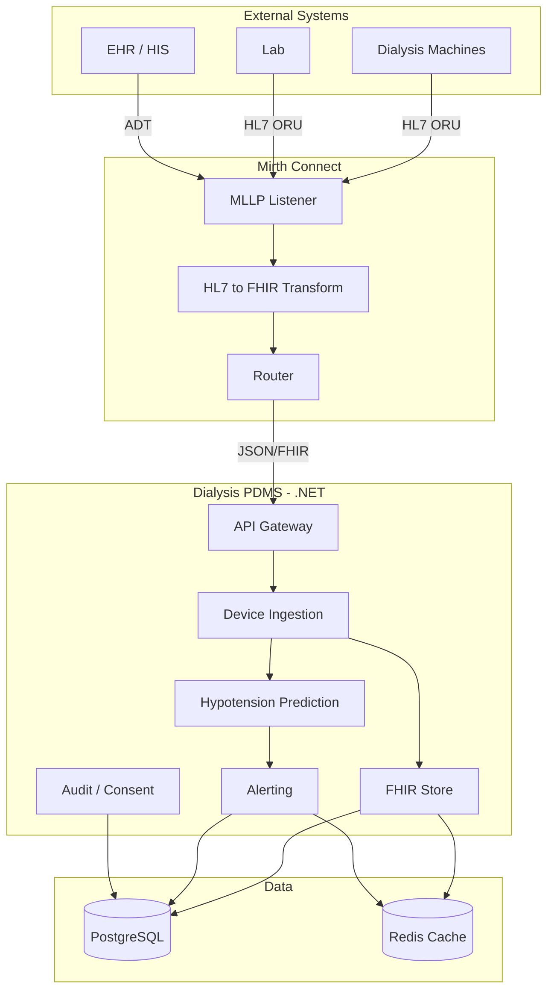
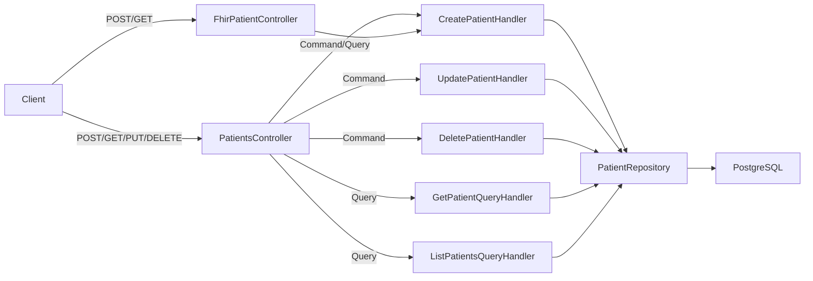

# Healthcare Systems, Dialysis & FHIR: Learning Path & Architecture Plan

> **New here?** See [docs/GETTING-STARTED.md](../../docs/GETTING-STARTED.md) for a structured onboarding path (theory → plan → implement).

---

## Part A: Theory & Learning Path

### 1. Healthcare System Fundamentals

Most healthcare software isn’t one system—it’s an **ecosystem**. Your job as a software engineer in this domain is:

1. **Build a good internal domain model and workflows** (e.g. dialysis session, vitals, alerts).
2. **Build reliable interfaces to everything else** (EHR, devices, lab, billing, etc.).

#### Core system types (what you’re integrating with)

| System Type            | Role                                                                        | Example                     |
| ---------------------- | --------------------------------------------------------------------------- | --------------------------- |
| **EHR/EMR**            | Clinical record, orders, meds, notes                                        | Epic, Cerner                |
| **Scheduling / ADT**   | Admissions, discharges, transfers; appointments                             | Built into EHR or standalone |
| **LIS**                | Lab Information System – orders, results                                   | Orchard, Sunquest           |
| **RIS/PACS**           | Imaging (less central in dialysis but relevant)                            | Various                     |
| **Billing / Claims**   | Coding, invoices, payer workflows                                           | Revenue cycle systems       |
| **Patient portal**     | Patient-facing; communication, results                                     | MyChart, custom             |
| **Device / machine**   | Machine connectivity – very relevant in dialysis (vitals, UF)                | Fresenius, Baxter machines  |
| **Data warehouse**     | Analytics, quality reporting                                               | Enterprise DW, registries  |
| **PDMS**               | Patient Data Management System – domain-specific (e.g. dialysis)            | Our Dialysis PDMS           |
| **Integration engine** | Connects systems, transforms formats, routes messages                       | Mirth, Rhapsody             |

#### Integration “plumbing”

| Type                    | Use case                          |
| ------------------------ | --------------------------------- |
| **HL7 v2**               | ADT, orders, results (very common) |
| **X12**                  | Claims, eligibility (primarily US) |
| **FHIR APIs**            | Modern clinical data exchange     |
| **Integration engines** | Mirth/NextGen Connect, Rhapsody   |
| **Master Patient Index** | Identity matching across systems  |
| **Terminology services** | SNOMED, LOINC, RxNorm, ICD-10     |

#### Typical data flow (dialysis)

**Device/Equipment** → **Integration Engine** → **Domain System (PDMS)** → **EHR**.

#### Ecosystem preparation plan

For a phased plan to build this ecosystem (domain model, inbound/outbound interfaces, clinical workflows, integration plumbing), see [docs/ECOSYSTEM-PLAN.md](../../docs/ECOSYSTEM-PLAN.md).

---

### 2. Dialysis Domain

**What is dialysis?** Treatment for kidney failure: blood is filtered externally (hemodialysis, HD) or via peritoneal dialysis (PD).

**Dialysis workflows:**

- **Session management**: Start/stop, duration, access site (fistula, graft, catheter)
- **Vitals during session**: BP (pre/intradialytic/post), weight, heart rate, SpO2
- **Ultrafiltration (UF)**: Fluid removed per session (kg)
- **Complications**: Hypotension (common during HD), cramps, nausea

**Why a PDMS?** Dialysis units need:

- Real-time vitals from machines (often via HL7 ORU)
- Hypotension risk prediction
- Alerts and clinical decision support
- FHIR storage for interoperability with EHRs and registries

---

### 3. HL7 & FHIR

#### HL7 v2 (legacy, still dominant)

- Message-based (ADT, ORU for lab/vitals)
- Pipe-delimited format
- Used for device connectivity (MLLP, HL7 over TCP)
- Mirth parses HL7 v2 and converts to JSON/FHIR

#### FHIR (modern interoperability)

- **RESTful** API model: `GET/POST/PUT/DELETE` on resources
- **Resources**: Patient, Observation, Condition, Procedure, etc.
- **JSON/XML** – easy for .NET (`System.Text.Json`, Firely SDK)
- **Profiles**: Constrain resources for specific use cases (e.g. dialysis vital signs)

**Key FHIR resources for dialysis:**


| Resource      | Use                                         |
| ------------- | ------------------------------------------- |
| `Patient`     | Demographics, identifiers                   |
| `Observation` | Vitals (BP, weight, heart rate), lab values |
| `Procedure`   | Dialysis session                            |
| `Condition`   | Diagnoses, vascular access                  |
| `Device`      | Dialysis machine                            |


---

### 4. FHIR in .NET with Firely SDK

Your project already references:

- [Directory.Packages.props](Directory.Packages.props): `Hl7.Fhir.R4` (6.0.2), `Firely.Fhir.Validation.R4` (3.1.0)

**Core NuGet packages:**

- `Hl7.Fhir.R4` – resource models, serialization, basic operations
- `Hl7.Fhir.Specification.R4` – structure definitions, validation
- `Firely.Fhir.Validation.R4` – profile validation

**Typical usage:**

```csharp
// Create an Observation (e.g. blood pressure)
var obs = new Observation
{
    Status = ObservationStatus.Final,
    Code = new CodeableConcept("http://loinc.org", "85354-9", "Blood pressure"),
    Subject = new ResourceReference("Patient/123"),
    Effective = new FhirDateTime(DateTimeOffset.UtcNow),
    Value = new Quantity(120, "mmHg", "http://unitsofmeasure.org")
};

// Serialize to JSON
var json = obs.ToJson();

// Read from FHIR server
var client = new FhirClient("https://fhir-server.example.com");
var patient = await client.ReadAsync<Patient>("Patient/123");
```

**Docs:** [Firely .NET SDK](https://docs.fire.ly/projects/Firely-NET-SDK/)

---

### 5. Recommended Learning Order


| Phase | Topic                                             | Resources                                                                      |
| ----- | ------------------------------------------------- | ------------------------------------------------------------------------------ |
| 1     | FHIR basics (resources, REST, identifiers)        | [hl7.org/fhir](https://hl7.org/fhir/), [fhir.epic.com](https://fhir.epic.com/) |
| 2     | FHIR R4 Observation, Patient, CodeableConcept     | FHIR spec, LOINC/SNOMED CT codes                                               |
| 3     | Firely .NET SDK – create, read, validate          | [Firely docs](https://docs.fire.ly/projects/Firely-NET-SDK/)                   |
| 4     | HL7 v2 (ADT, ORU) – structure only                | HL7 v2 spec, Mirth docs                                                        |
| 5     | Integration engines (Mirth) – routing, transforms | Mirth Connect documentation                                                    |
| 6     | Dialysis workflows – session, vitals, hypotension | Clinical literature, NHSN, DaVita/ Fresenius workflows                         |


---

## Part B: Dialysis PDMS Architecture Plan

Based on your architecture rules and existing solution, here is a concrete plan.

### Target Architecture (from [rules/architecture](rules/architecture))




---

### Phase 1: Core Services (Foundation)


| Component                    | Purpose                                                         | Tech Stack                              |
| ---------------------------- | --------------------------------------------------------------- | --------------------------------------- |
| **Dialysis.Gateway**         | Public API, versioning (`api/v1/...`), JWT auth                 | ASP.NET Core, YARP                      |
| **Dialysis.DeviceIngestion** | Accept vitals/HL7 payloads from Mirth, create FHIR Observations | CQRS (Intercessor), `Hl7.Fhir.R4`       |
| **Dialysis.FhirStore**       | Store/retrieve FHIR resources (Patient, Observation)            | EF Core + PostgreSQL, Firely validation |


**Deliverables:**

- `POST /api/v1/vitals/ingest` – accept vitals JSON, create Observations
- `POST /api/v1/hl7/stream` – accept raw HL7 (for Mirth), parse and persist
- `POST /api/v1/patients` – create patient (implemented)
- `GET /api/v1/patients/{logicalId}` – get patient (implemented)
- `PUT /api/v1/patients/{logicalId}` – update patient (implemented)
- `DELETE /api/v1/patients/{logicalId}` – delete patient (implemented)
- `GET /api/v1/patients` – list/search patients (implemented)
- `POST /fhir/r4/Patient` – FHIR create patient (implemented)
- Patient/Observation CRUD via FHIR REST
- `X-Tenant-Id` support (multi-tenancy)

### Implemented: Patient Management (Learn-by-Doing)

Patient Create, Get, Update, Delete, and List APIs follow the vertical slice pattern. Duplicate check on create returns 409 Conflict. Data flow:



**Components:** `PatientsController`, `FhirPatientController`, `CreatePatientCommand`/`Handler`, `UpdatePatientCommand`/`Handler`, `DeletePatientCommand`/`Handler`, `GetPatientQuery`/`Handler`, `ListPatientsQuery`/`Handler`, `IPatientRepository`/`PatientRepository`, `PatientAlreadyExistsException`. See [docs/features/PATIENT-MANAGEMENT.md](docs/features/PATIENT-MANAGEMENT.md).

### Implemented: FHIR Layer (Learn-by-Doing)

FHIR R4 REST API for Patient and Observation. Uses Firely SDK for serialization.

```mermaid
flowchart LR
    Client -->|GET/POST /fhir/r4/Patient| FhirPatientController
    Client -->|GET /fhir/r4/Observation| FhirObservationController
    FhirPatientController --> GetPatientQuery
    FhirPatientController --> CreatePatientCommand
    FhirPatientController --> FhirMappers
    FhirObservationController --> GetObservationQuery
    FhirObservationController --> SearchObservationsQuery
    FhirObservationController --> FhirMappers
    FhirMappers -->|Firely| FHIR JSON
```

**Endpoints:** `GET /fhir/r4/Patient/{id}`, `POST /fhir/r4/Patient`, `GET /fhir/r4/Observation/{id}`, `GET /fhir/r4/Observation?patient={id}`. See [docs/features/FHIR-LAYER.md](docs/features/FHIR-LAYER.md).

---

### Phase 2: Clinical Workflows


| Component                 | Purpose                                    | Tech Stack                 |
| ------------------------- | ------------------------------------------ | -------------------------- |
| **Dialysis.Prediction**   | Hypotension risk from intradialytic vitals | ML model or rule engine    |
| **Dialysis.Alerting**     | Alerts, acknowledgments, notifications     | CQRS, events (Transponder) |
| **Dialysis.AuditConsent** | Audit log, consent checks                  | EF Core, per-tenant DB     |


**Data flow:** `ObservationCreated` (event) → `HypotensionRiskRaised` → `CreateAlert`

---

### Phase 3: Integrations & Analytics


| Component                      | Purpose                   | Tech Stack                      |
| ------------------------------ | ------------------------- | ------------------------------- |
| **Dialysis.Analytics**         | Cohorts, reports, exports | CQRS, FHIR search               |
| **EHR integration**            | Push/pull FHIR with EHR   | FHIR client, OAuth              |
| **Public health / registries** | NHSN, vascular access     | De-identification, FHIR bundles |


---

### Implementation Checklist

1. **Gateway + Device Ingestion** – minimal API for vitals and HL7; persist as FHIR Observation
2. **FHIR Store** – EF Core entities for Patient, Observation; map to/from Firely models
3. **Multi-tenancy** – `TenantResolutionMiddleware`, per-tenant connection strings
4. **CQRS** – Commands: `IngestVitalsCommand`, `CreateObservationCommand`; Queries: `GetPatientQuery`, `GetObservationQuery`, `SearchObservationsQuery`
5. **Validation** – FluentValidation (Verifier) on all commands
6. **Events** – `ObservationCreated` → Transponder (Azure Service Bus or in-memory)
7. **Prediction + Alerting** – consume events, run risk logic, create alerts
8. **Mirth** – configure destinations to call PDMS REST endpoints with `X-Tenant-Id`

---

### Reusable Building Blocks (Already in Solution)

- **Intercessor** – CQRS (commands, queries, handlers)
- **Verifier** – FluentValidation integration
- **Transponder** – messaging (Azure Service Bus, Kafka, etc.)
- **NutrientPDF** – document handling for reports

---

### Suggested First Implementation Steps

1. Create `Dialysis.Gateway` – ASP.NET Core Web API with `api/v1` versioning, JWT, health checks
2. Add `Dialysis.DeviceIngestion` – single endpoint `POST /api/v1/vitals/ingest` accepting `{ patientId, systolic, diastolic, timestamp }`, create Observation via Firely, persist to PostgreSQL
3. Add `TenantResolutionMiddleware` and `X-Tenant-Id` header handling
4. Wire events: after creating Observation, publish `ObservationCreated` via Transponder
5. Add `Dialysis.Alerting` (or a minimal stub) that subscribes to events and creates alerts

This gives you an end-to-end path from vitals ingestion to FHIR storage and event-driven alerts, aligned with your existing rules and packages.