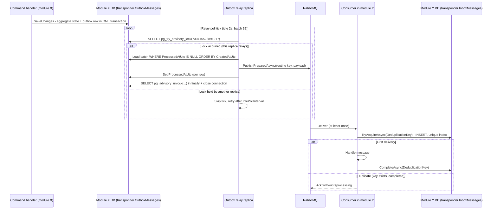

# Transponder — distributed messaging building block

Transponder is the messaging backbone of the modular monolith: modules communicate **only** via
integration events published through `ITransponderBus`, persisted via an EF-backed outbox in the
module's own database and consumed behind an EF-backed inbox deduplication gate. In dev and tests
the bus dispatches in-process; the deployment stack runs RabbitMQ.

## Project map

| Area | Projects |
|---|---|
| Contracts | `Transponder.Abstractions` (`ITransponderBus`, `IConsumer<T>`, `ITransponderOutbox`, `ITransponderInboxGate`, `ITransponderMessageScheduler`, chunking + saga + routing-slip contracts) |
| Core | `Transponder.Core` (in-process bus, consume routing/dispatch, large-message chunk reassembly, saga runtime) |
| Transports (`Transport/`) | `Transponder.Transport.RabbitMq`, `.Nats`, `.AzureServiceBus`, `.AwsSqsSns`, `.Grpc`, `.SignalR`, `.ServerSentEvents` |
| Persistence (`Persistence/`) | `Transponder.Persistence.EntityFrameworkCore.Shared` (provider-agnostic model + relay + writer/gate), `Transponder.Persistence.EntityFrameworkCore.Postgresql` (concrete `DbContext` + migrations + `AddTransponderPostgreSqlPersistence(...)`) |
| Scheduling (`Scheduling/`) | `Transponder.Scheduling.Hangfire`, `.Quartz`, `.TickerQ` |
| Tests | `Tests/Dialysis.BuildingBlocks.Transponder.Tests` |

## `ITransponderBus` API surface

Defined in `Transponder.Abstractions/ITransponderBus.cs`:

- `PublishAsync<TMessage>(message, ct)` — dispatch to all registered `IConsumer<TMessage>` instances.
- `PublishAsync<TMessage>(message, TransponderPublishOptions, ct)` — publish with explicit
  correlation (transports may stamp a new correlation id when `CorrelationId` is null).
- `PublishPreparedAsync(routingKey, message, options, ct)` — publish an already-deserialized
  message; the routing key must match the registered route for the contract (transports use
  `Type.FullName`). This is the entry point the outbox relay uses.
- `PublishLargeAsync<TMessage>(message, TransponderLargeMessageOptions?, ct)` — serializes once,
  splits into `TransponderMessageChunk` segments sharing a SHA-256 digest, and publishes each chunk
  (`TransponderLargeMessagePublisher`). Payloads at or under `MaxSegmentBytes` go out as a single
  ordinary publish. Reassembly (`TransponderChunkReassemblyConsumer`) runs on hosts that registered
  `AddTransponder`; broker transports must subscribe to `TransponderMessageChunk` (the RabbitMQ/NATS
  extensions add this automatically). Guard rails: `MaxSegmentBytes ≥ 1024`,
  `MaxTotalPayloadBytes`, `MaxChunkCount`.

## EF outbox / inbox / saga persistence

One `DbContext` per module — never shared across modules, never a second outbox. Each module's
`*.Persistence` `DbContext` extends `TransponderPersistenceDbContextBase`, which adds three
`DbSet`s configured by `TransponderPersistenceModelConfiguration` under the schema supplied by
`TransponderPersistenceOptions.Schema` (every module uses `transponder`):

- `OutboxMessages` — payload JSON + assembly-qualified event type + `W3CTraceParent`/`CorrelationId`,
  indexed on `ProcessedAtUtc`.
- `InboxMessages` — **unique index on `DeduplicationKey`**, indexed on `CompletedAtUtc`.
- `SagaInstances` — unique `(SagaKind, InstanceKey)`, optimistic-concurrency `Version` token.

`AddTransponderEfOutboxAndInbox<TContext>()` registers `TransponderOutboxWriter<TContext>`
(`ITransponderOutbox`) and `TransponderEfInboxGate<TContext>` (`ITransponderInboxGate`) against the
module's context. The writer only *adds* the outbox row — the host saves it in the **same
`SaveChanges` transaction** as the aggregate state change, which is the whole point: state change
and event become atomically durable together.

## Outbox relay

`TransponderOutboxRelayHostedService<TContext>` polls unprocessed rows and publishes them through
the bus. Registration is `AddTransponderOutboxRelay<TContext>()`; module hosts gate it behind the
config flag `<Module>:Transponder:EnableOutboxRelay` (the `enableOutboxRelay` opt-in — default
`false` in code, set `true` in the module APIs' `appsettings.json`; the WAF test factory forces it
off).

The loop (per tick, defaults from `TransponderOutboxRelayOptions`: `BatchSize = 32`,
`IdlePollInterval = 2 s`):

1. Load up to `BatchSize` rows `WHERE ProcessedAtUtc IS NULL ORDER BY CreatedAtUtc`.
2. Publish each via `TransponderOutboxRelayPublish.PublishRowAsync` (→ `PublishPreparedAsync`),
   then set `ProcessedAtUtc` and save. A failing row records a failure metric, logs, and breaks the
   batch — it stays pending and is retried next poll.
3. If anything was processed, poll again immediately; otherwise sleep `IdlePollInterval`.

### Multi-replica safety (PostgreSQL session advisory lock)

Module hosts are stateless and scale horizontally, so the relay must not double-publish. On
PostgreSQL each tick first takes a **per-database session advisory lock**:

- Key constant: `TransponderOutboxRelayHostedService.AdvisoryLockKey = 730_415_523_891_217`
  (arbitrary but stable). The lock is per *database*, so different modules never contend — each
  module relays only its own outbox.
- Acquired with `pg_try_advisory_lock` on a connection held open for the whole tick. A replica that
  doesn't get the lock skips the tick and retries after `IdlePollInterval`.
- **Explicitly released with `pg_advisory_unlock` in a `finally` block.** This is load-bearing:
  Npgsql's pooled-connection reset does **not** release session advisory locks, so relying on
  connection close would leak the lock back into the pool and starve every replica.
- Crash safety: if a replica dies mid-tick, the server releases the lock when its connection drops,
  and another replica picks up on its next tick.
- **Non-PostgreSQL providers skip the lock entirely** — there, delivery is at-least-once across
  replicas and the consumers' inbox deduplication is the safety net.

### Inbox deduplication

`TransponderEfInboxGate.TryAcquireAsync(deduplicationKey, routingKey)` inserts an `InboxMessages`
row; the **unique index on `DeduplicationKey`** makes a duplicate delivery fail the insert. On
conflict the gate re-reads the row: already `Completed` → `false` (skip), still in flight →
`true` (the prior attempt died; reprocess). `CompleteAsync` stamps `CompletedAtUtc`;
`AbandonAsync` deletes the claim so the broker redelivery can retry.

## Observability — the `Dialysis.Transponder.Outbox` meter

`TransponderOutboxMetrics` (registered on the OTLP provider centrally by
`ModuleTelemetryExtensions`; the owning `DbContext` name rides on every measurement as the
`context` tag):

- `dialysis.transponder.outbox.published` (counter) — rows published and marked processed.
- `dialysis.transponder.outbox.failed` (counter) — publish attempts that threw; row stays pending.
- `dialysis.transponder.outbox.oldest_pending_age` (observable gauge, seconds) — age of the oldest
  unprocessed row as of the last poll, computed from the already-fetched batch head (zero extra
  queries; `0` = drained). Sustained growth = relay lag (broker down, poison row, relay not
  running).

Instrument names are stable contracts: the Grafana dashboard lives at
`deploy/k8s/observability/dashboards/module-overview.json` and the alert rules at
`deploy/k8s/observability/alerts/module-overview.yaml`.

## Schedulers

`ITransponderMessageScheduler` (in `Transponder.Abstractions/Scheduling/`) has three integrations —
**Hangfire, Quartz, TickerQ — and a host registers exactly one of them.** The module-hosting
scaffolding (`Dialysis.Module.Hosting`, `AddModuleHost`) wires **PostgreSQL-backed Hangfire by
default** via `AddTransponderHangfire(...)` whenever a `Hangfire` connection string is present
(the AppHost injects `ConnectionStrings:Hangfire` pointing at the host's module database; it is
absent in tests, where Hangfire is skipped).
