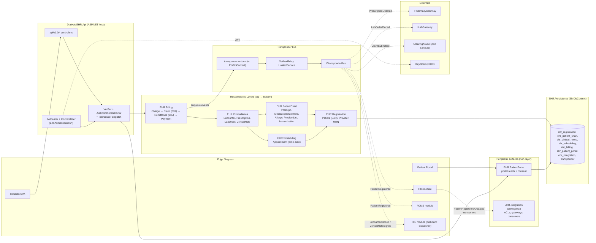
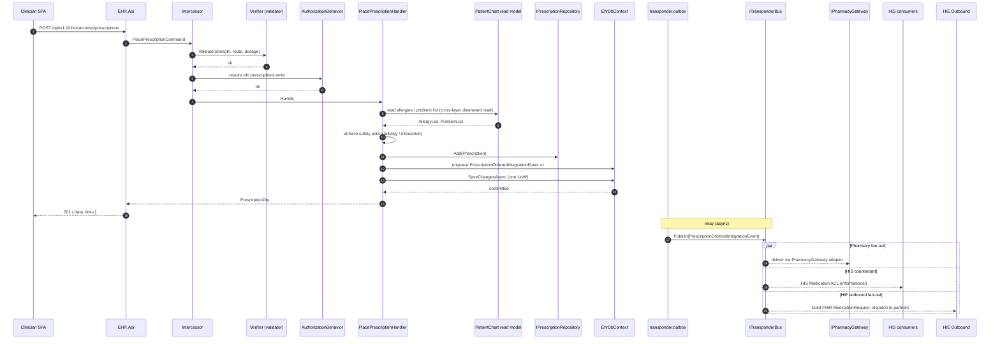
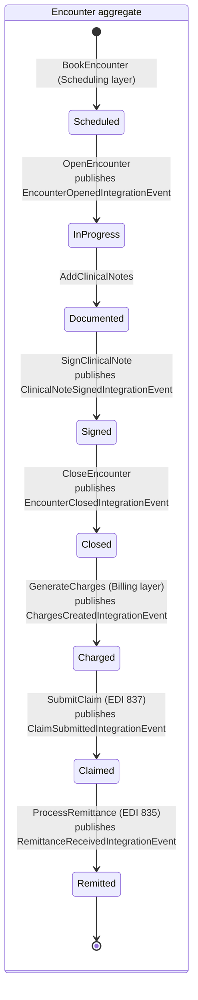
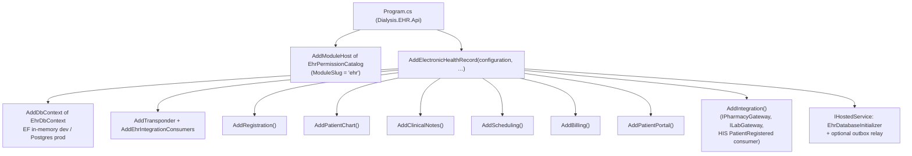
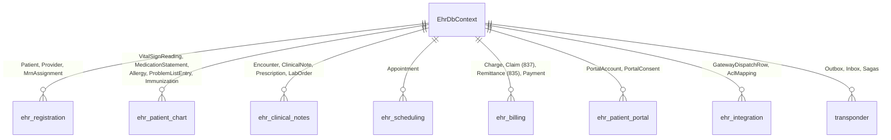

# EHR — Architecture (low-level)

Companion to [README.md](README.md) and [ehr_subdomain_structure.md](ehr_subdomain_structure.md). EHR is the **Core** subdomain that owns the longitudinal patient record and is the **system-of-record for patient identity**. Its Large-Scale Structure is **Responsibility Layers** (Evans 2003, p. 319): Registration → Patient Chart → Clinical Action → Billing, with Integration as an orthogonal slice.

> Mermaid renders inline on GitHub/GitLab/JetBrains/VS Code; paste into <https://mermaid.live> if your viewer does not.

---

## 1. System architecture (component view)

**Invariants**

- A layer may reference only itself and the layer **below** — never upward (enforced by [ModuleBoundaryTests](../../tests/Dialysis.ArchitectureTests/ModuleBoundaryTests.cs) + a layered architecture gate).
- Cross-context callers (HIS, PDMS, HIE) only ever reference `Dialysis.EHR.Contracts`.
- HIS is a **Customer** of EHR for `PatientRegistered`/`PatientDemographicsUpdated`/`PatientsMerged`; HIS never holds an EHR-owned `Patient` aggregate (ACL pattern).
- Billing aggregates (`Claim`, `Charge`, `Remittance`) live **here**, not in HIS — HIS only queues a `BillingExportJob`.

---

## 2. Workflow — Encounter → Prescription → Outbound dispatch

The canonical clinical-action workflow: an encounter closes, the clinician signs a prescription, EHR validates against patient chart context, persists, and publishes to downstream pharmacy + HIE consumers.

**Cross-layer reads vs writes**

- Reads downward (e.g. ClinicalNotes reading from PatientChart) are allowed — the layer dependency direction is preserved.
- Writes never cross layers in-process. A higher layer that needs to mutate a lower-layer aggregate emits an integration event consumed by the lower-layer slice.

---

## 3. Activity — Patient lifecycle (Registration layer)

```mermaid
stateDiagram-v2
    [*] --> Draft: CreatePatientDraft
    Draft --> Registered: RegisterPatient (MRN assigned)<br/>publishes PatientRegisteredIntegrationEvent
    Registered --> DemographicsUpdated: UpdateDemographics<br/>publishes PatientDemographicsUpdatedIntegrationEvent
    DemographicsUpdated --> Registered
    Registered --> Merged: MergeDuplicatePatients(survivor, victim)<br/>publishes PatientsMergedIntegrationEvent
    Merged --> [*]: victim retired; survivor stays Registered

    Registered --> PortalEnrolled: EnrollInPortal (consent captured)
    PortalEnrolled --> Registered
    Registered --> Deceased: MarkDeceased<br/>publishes PatientDeceasedIntegrationEvent
    Deceased --> [*]
```

**Why two parallel state machines?** Patient identity and Encounter lifetimes are independent — a patient persists across encounters, and an encounter persists across charges/claims. Splitting them keeps each aggregate root's invariants local.

---

## 4. Composition root

---

## 5. Data layout

Migrations history: `ehr_migrations` table. Outbox/inbox live on the same `DbContext` under the `transponder` schema (no duplicate EHR-side outbox tables).

---

## 6. Cross-context contracts (DDD context map)

| Counterparty | Role | Vehicle |
|---|---|---|
| HIS | **Customer/Supplier**: EHR publishes `PatientRegistered/Updated/Merged`; HIS consumes via ACL. EHR consumes `BillingExportJobQueued` to drive 837 generation. | Integration events through `Dialysis.EHR.Contracts` ↔ `Dialysis.HIS.Contracts` |
| PDMS | **Supplier**: EHR publishes `PatientRegistered`; PDMS consumes via ACL to bind treatment sessions. | `Dialysis.EHR.Contracts` |
| HIE | **Supplier**: EHR publishes `EncounterOpened/Closed`, `ClinicalNoteSigned`, `PrescriptionOrdered`, `LabOrderPlaced`. HIE's outbound mappers translate to FHIR Bundles. | `Dialysis.EHR.Contracts` consumed in `Dialysis.HIE.Outbound` |
| Identity | **Conformist**: EHR accepts OIDC claims (`sub`, `email`, `roles`). | JWT bearer; `Ehr:Authentication:RolePermissionMap` |

---

## 7. Where to look next

- Layer assemblies → `Dialysis.EHR.<Layer>/`.
- Aggregates → `Dialysis.EHR.<Layer>/Domain/**` (no public setters).
- Integration event contracts → `Dialysis.EHR.Contracts/Integration/<Layer>IntegrationEvents.cs`.
- ACL translators (HIS → EHR Patient, SmartConnect → Clinical) → `Dialysis.EHR.Integration/Translators/`.
- Long-form architecture plan → `ehr_subdomain_structure.md`.
