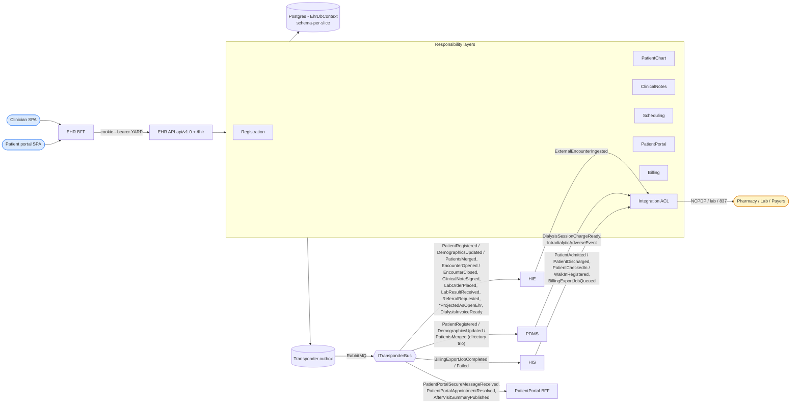
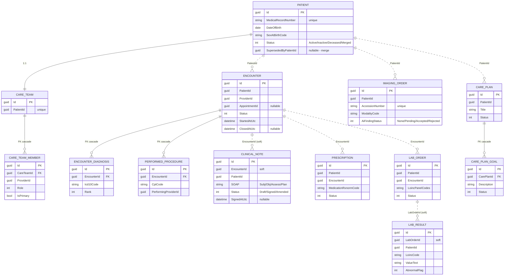
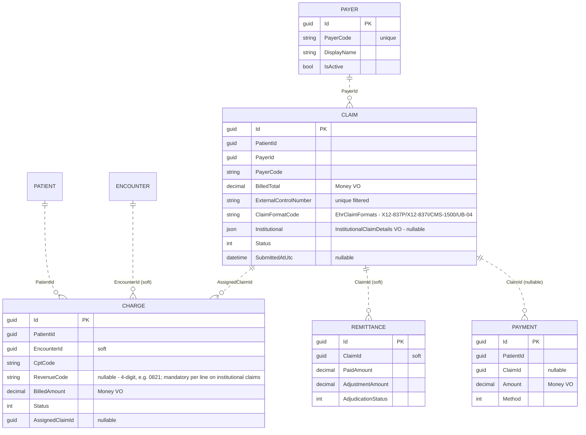
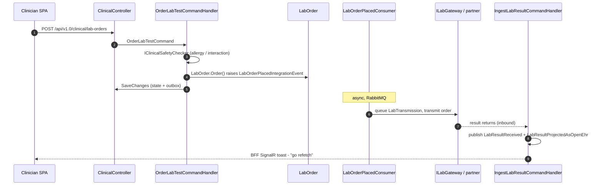
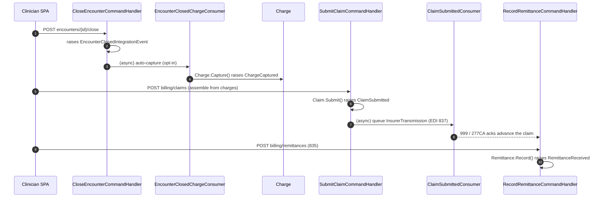

# EHR — Electronic Health Record

> **Bounded context:** the **Core** subdomain and **system-of-record for patient identity**. EHR owns the longitudinal patient story: demographics & MRN, providers and care teams, the clinical chart (allergies, problems, vitals, immunizations, medication statements, care plans), encounters with diagnoses/procedures, clinical notes, prescriptions, lab/imaging orders & results, referrals, the patient portal, and the full billing chain (charge capture → claim → remittance → payment).
>
> Large-scale structure follows Evans' **Responsibility Layers**: Registration → Patient Chart → Clinical Action → Billing, with Integration as an orthogonal anticorruption slice. Cross-context coordination is exclusively via integration events.

Generated from current code. See the root [README](../../../README.md) for the system picture.

---

## 1. Context

---

## 2. Project layout

| Project | Role |
|---|---|
| `Dialysis.EHR.Contracts` | Integration events, `EhrPermissions`, code systems, public DTOs. **Only assembly other modules reference.** |
| `Dialysis.EHR.Core[.Abstraction]` | `IEhrClock`, `IEhrUnitOfWork`, module constants, `AddEhrCore`. |
| `Dialysis.EHR.Registration` | Patient (SoR), Provider, CareTeam, MRN. Has `Fhir/` feeder. |
| `Dialysis.EHR.PatientChart` | Allergy, ProblemList, VitalSign, Immunization, MedicationStatement, CarePlan + OpenEHR projector. |
| `Dialysis.EHR.ClinicalNotes` | Encounter (+Diagnosis/Procedure), ClinicalNote, Prescription, LabOrder/Result, ImagingOrder, Referral, OrderSet, CDS, quality, safety. |
| `Dialysis.EHR.Scheduling` | Clinic-side Appointment, ProviderAvailabilityWindow. |
| `Dialysis.EHR.PatientPortal` | SecureMessage, PortalAppointmentRequest, AfterVisitSummary. |
| `Dialysis.EHR.Billing` | Charge, Claim, Remittance, Payment, Payer, fee schedule, EDI 837/277CA/999, E/M coder. |
| `Dialysis.EHR.Integration` | ACL consumers, outbound transmissions (Pharmacy/Lab/Insurer), hospital-/adverse-event read models, lab-result ingest. |
| `Dialysis.EHR.Persistence` | Single `EhrDbContext`, EF configs, `Stores/` repositories, migrations, `EhrPatientEraser`. |
| `Dialysis.EHR.Core.Persistence.{Abstractions,InMemory,Postgresql}` | Generic repository abstraction layer (the documented provider split). |
| `Dialysis.EHR.Composition` | `AddElectronicHealthRecord(...)`. |
| `Dialysis.EHR.Api` | ASP.NET host: controllers under `api/v1.0/...`, FHIR endpoints, durable-command bus, HIPAA/GDPR surfaces. |
| `Dialysis.EHR.Bff` | Per-context BFF with event-driven push. |
| `Dialysis.EHR.Tests` | xUnit + `WebApplicationFactory` (Testcontainers Postgres). |

Provider selection for the live module is by **connection-string presence**: when `ConnectionStrings:Ehr` is set the host calls `UseNpgsql`; otherwise EF runs in-memory. Per-slice schemas: `ehr_registration`, `ehr_chart`, `ehr_scheduling`, `ehr_clinical`, `ehr_portal`, `ehr_billing`, `ehr_integration`, plus `ehr_durablecommands` and `transponder`.

### 2.1 Slice → aggregate → schema map

```mermaid
flowchart TB
    subgraph REG [Registration]
        P[Patient SoR + Provider + CareTeam]
    end
    subgraph CHART [PatientChart]
        CH[Allergy, ProblemListItem, VitalSignReading,<br/>Immunization, MedicationStatement, CarePlan]
    end
    subgraph CLIN [ClinicalNotes]
        EN[Encounter, ClinicalNote, Prescription,<br/>LabOrder/Result, ImagingOrder, Referral, OrderSet]
    end
    subgraph SCHED [Scheduling]
        AP[Appointment, ProviderAvailabilityWindow]
    end
    subgraph PORTAL [PatientPortal]
        PM[SecureMessage, PortalAppointmentRequest,<br/>AfterVisitSummary]
    end
    subgraph BILL [Billing]
        BC[Charge, Claim, Remittance, Payment,<br/>Payer, CptFeeScheduleEntry]
    end
    subgraph INTG [Integration]
        TX[Pharmacy/Lab/Insurer transmissions,<br/>HospitalEvent, AdverseEventRecord]
    end

    P --> S1[(ehr_registration)]
    CH --> S2[(ehr_chart)]
    EN --> S3[(ehr_clinical)]
    AP --> S4[(ehr_scheduling)]
    PM --> S5[(ehr_portal)]
    BC --> S6[(ehr_billing)]
    TX --> S7[(ehr_integration)]
    DC[Durable-command ledger] --> S8[(ehr_durablecommands)]
    OB[Transponder outbox / inbox / saga] --> S9[(transponder)]
```

---

## 3. Domain model (ERD)

Every aggregate root derives `AggregateRoot<Guid>` with an audit shadow (`IsDeleted/DeletedAt/DeletedBy`). Within an aggregate, child entities use **real EF foreign keys** (cascade). **Across** slices/aggregates, links are **soft references** (a `Guid` column, no DB FK) — e.g. `ClinicalNote.EncounterId`, `Charge.EncounterId`, `LabResult.LabOrderId`. The `Patient` root is the identity anchor every slice points at.

### 3.1 Identity & clinical core

The **PatientChart** slice (schema `ehr_chart`) adds `Allergy`, `ProblemListItem`, `VitalSignReading`, `Immunization`, `MedicationStatement` — each a small aggregate carrying a `Coding` value object and a soft `PatientId`.

### 3.2 Billing chain

Billing also holds `CptFeeScheduleEntry` (per CPT + payer), `ChargeIdempotencyMarker` (composite PK `(SessionId, CptCode)`), and the `BillableEncounter` read model.

### 3.3 Institutional claims (837I / UB-04)

The claim pipeline is format-routed via `Claim.ClaimFormatCode` against the `EhrClaimFormats` catalog — `X12-837P`, `X12-837I`, `CMS-1500`, `UB-04` — with `Claim.IsInstitutionalFormat(...)` deciding the institutional path:

- **`InstitutionalClaimDetails`** (value object on `Claim.Institutional`, required for institutional formats and rejected on professional ones): `TypeOfBill` (e.g. `"0721"`), `StatementFrom`/`StatementTo`, `AdmissionDateUtc` + admission `TypeCode`, and `PrincipalProcedureCode` + `OtherProcedureCodes` (ICD-10-PCS).
- **`Charge.RevenueCode`** — a 4-digit revenue code (e.g. `"0821"`), mandatory on every line of an institutional claim.
- **`Edi837IClaimWriter`** emits X12 5010 **X223A2**: the TOB composite, `DTP*434` statement period, `DTP*435` + `CL1` admission, `HI` ABK/ABF diagnosis and BBR/BBQ procedure segments, and `SV2` revenue-coded service lines. It shares `Edi837SegmentWriter` with `Edi837PClaimWriter`, so 837P byte output is unchanged.
- `SubmitClaimCommand` carries an optional `Institutional` payload; `ClaimSubmittedIntegrationEvent` carries the `ClaimFormatCode`. Covered by `SubmitInstitutionalClaimTests` and `Edi837IClaimWriterTests`. The **PatientPortal** slice (schema `ehr_portal`) owns `SecureMessage` (threaded), `PortalAppointmentRequest`, and `AfterVisitSummary` (with FK-cascade child instructions/follow-ups/resource-links). The **Integration** slice owns outbound transmission aggregates (`PharmacyTransmission`, `LabTransmission`, `InsurerTransmission`) and the `HospitalEvent` / `AdverseEventRecord` surveillance read models.

---

## 4. Integration events

**Published** — 35 event types in `Dialysis.EHR.Contracts/Integration/` (selected below). `PrescriptionOrdered` and `LabOrderPlaced` are at schema **v2** (they added `OverrideReason`/`OverriddenBy`); `ClaimSubmitted` carries the `ClaimFormatCode`.

| Area | Events |
|---|---|
| Registration | `PatientRegistered`, `PatientDemographicsUpdated`, `PatientsMerged` |
| Scheduling | `AppointmentBooked`, `AppointmentRescheduled`, `AppointmentCancelled`, `AppointmentCheckedIn` |
| Clinical | `EncounterOpened`, `EncounterClosed`, `ClinicalNoteSigned`, `PrescriptionOrdered` (v2), `LabOrderPlaced` (v2), `LabResultReceived`, `ImagingOrderPlaced`, `ReferralRequested` |
| Billing | `ChargeCaptured`, `ClaimSubmitted`, `RemittanceReceived`, `PaymentPosted`, `EdiAcknowledgementReceived`, `BillingExportJobCompleted`/`Failed` (→ HIS Operations), `DialysisInvoiceReady` |
| Portal | `PatientPortalSecureMessageSent/Received`, `PatientPortalAppointmentRequested/Resolved`, `AfterVisitSummaryPublished` |
| OpenEHR | `ChartVitalSignProjectedAsOpenEhr`, `LabResultProjectedAsOpenEhr` |

**Consumed** (anticorruption — each `IConsumer<>` maps an external event onto EHR state):

| Source event | Consumer → effect |
|---|---|
| `PrescriptionOrdered` (self) | queue NCPDP SCRIPT `PharmacyTransmission`, invoke `IPharmacyGateway` |
| `LabOrderPlaced` (self) | queue outbound `LabTransmission` |
| `ClaimSubmitted` (self) | queue `InsurerTransmission` (837) |
| `EncounterClosed` (self) | auto-capture charges (opt-in) + lost-charge worklist projector |
| `DialysisSessionChargeReady` (PDMS) | capture dialysis charge, emit invoice-ready |
| `IntradialyticAdverseEvent` (PDMS) | adverse-event surveillance read model |
| `PatientAdmitted` / `PatientDischarged` (HIS) | hospital-event follow-up worklist |
| `PatientCheckedIn` / `WalkInRegistered` (HIS) | mirror HIS-originated patients into EHR |
| `BillingExportJobQueued` (HIS) | `BillingExportJobQueuedConsumer` files the claims for the export period, then publishes `BillingExportJobCompleted`/`Failed` back to HIS |
| `ExternalEncounterIngested` (HIE) | unmatched external-encounter worklist |

---

## 5. Key workflows

### 5.1 Lab order → outbound → result ingest

### 5.2 Encounter close → charge → claim → remittance

---

## 6. API surface

**15 controllers** under `api/v1.0/...`: `clinical` (patients, encounters, notes, lab/imaging/prescription orders, referrals, quality-gaps, recommendations), `patients`, `patient-chart`, `care-plans`/`care-team`/`care-coordination`, `order-sets`, `population`, `billing` (+ `fee-schedule`, worklists), `safety/surveillance`, and the **portal** surface (`portal/messages`, `portal/appointment-requests`, `after-visit-summaries`, `portal/reminders`). Billing **writes** (capture charge, submit claim, record remittance, post payment) are CQRS commands; `BillingController` is the read side. FHIR endpoints under `/fhir/...` (SMART config, bulk-data export, subscriptions) are opt-in by flag. The host also maps EU data-protection routes, durable-command status, and HIPAA safeguards.

`RecordVitalSign` and `RecordAllergy` are **durable-command-bus** opt-ins (flags `Ehr:DurableCommands:RecordVitalSign:Enabled` / `Ehr:DurableCommands:RecordAllergy:Enabled`, same id-from-CommandId pattern as PDMS/HIS). Portal self-access is gated by the caller's patient claim (`his_patient_id` / `sub`).

---

## 7. Compliance

`EhrPatientEraser : IPatientEraser` (GDPR Art. 17) **soft-deletes** 16 patient-linked aggregate sets via `ExecuteUpdateAsync` (Allergy, ProblemListItem, VitalSignReading, Immunization, MedicationStatement, Appointment, PortalAppointmentRequest, SecureMessage, Encounter, ClinicalNote, Prescription, LabOrder, LabResult, Charge, Claim, Payment), then the **Patient root last** — 17 categories total, returning per-category counts; idempotent.

`EhrModuleDataExtractor : IModuleDataExtractor` (Art. 15/20 export) mirrors that scope across **17 resource types including the Patient root**, emitting the shared camelCase JSON bundle; both are registered Scoped in `AddEhrPersistence`. RoPA/HIPAA surfaces are wired via `AddEuDataProtection("ehr", …)` and `AddHipaaCompliance`. The approve-and-execute Art. 17 orchestration lives in [HIE](../HIE/ARCHITECTURE.md).
