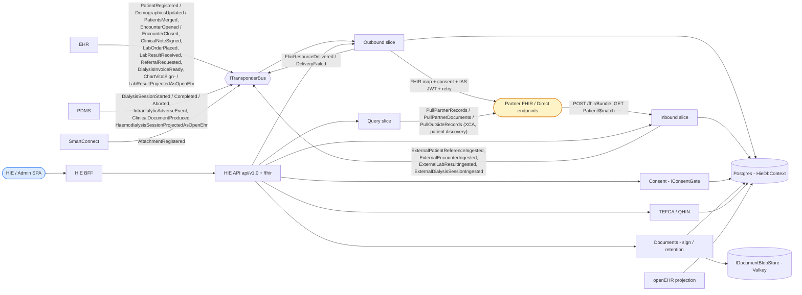
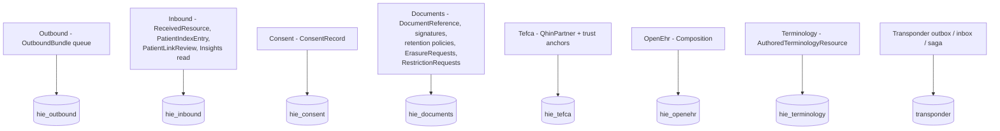
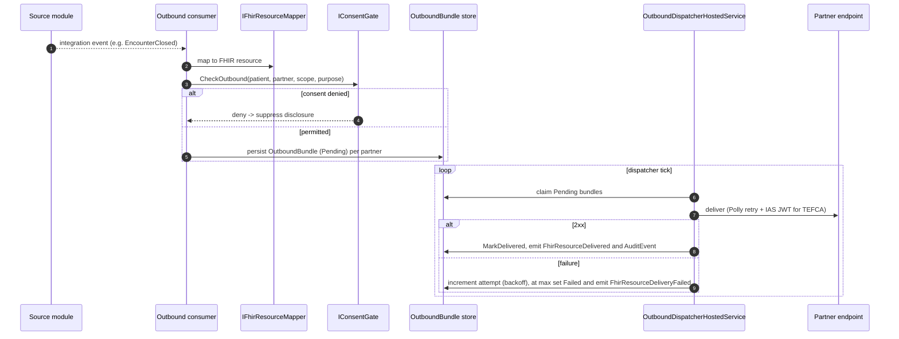
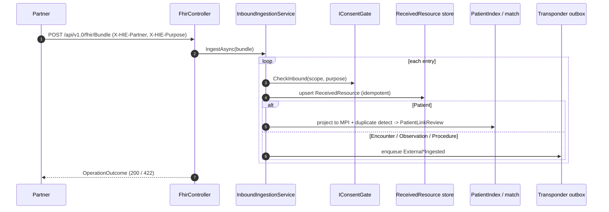
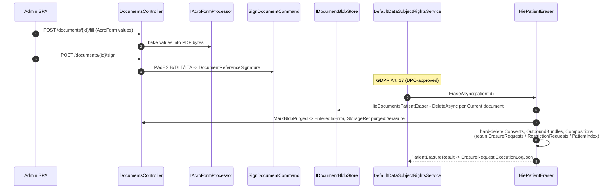

# HIE — Health Information Exchange

> **Bounded context:** the **outside world**. HIE is the FHIR R4 / IHE cross-organization gateway. It maps internal integration events to FHIR resources and dispatches them to partner endpoints (with consent gating, TEFCA IAS-JWT auth, retry and a FHIR `AuditEvent` trail); it receives FHIR bundles from partners (validating trust, profile and consent before handing them to the owning module); it owns cross-org **consent**, the **document** index (with PAdES signing and GDPR retention), **TEFCA / QHIN** onboarding, the **openEHR** projection, an **MPI**, **terminology** authoring, and the **IHE XDS** FHIR bridge.
>
> HIE also hosts the platform-wide **GDPR Art. 17 approve-and-execute** pipeline and the only EF-backed `IErasureRequestStore`.

Generated from current code. See the root [README](../../../README.md) for the system picture.

> **Note on prior docs:** earlier documentation described inbound as `POST /fhir/{Type}` emitting `Hl7FhirResourceReceivedIntegrationEvent`, a 5-state outbound machine, an `IsResourceAccessPermittedQuery`, and an `hie_xds_registry` table. The current build differs on all four — see the relevant sections below.

---

## 1. Context

### Slice → schema map

---

## 2. Slices & project layout

| Slice / project | Role |
|---|---|
| `Dialysis.HIE.Contracts` | `External*Ingested` + `FhirResourceDelivered/Failed` events, `HiePermissions`. |
| `Dialysis.HIE.Outbound` | Consume upstream events → FHIR mappers → consent gate → `OutboundBundle` queue → `OutboundDispatcher` (Polly retry, HTTP/Direct partners, CCD assembly, public-health reporting). |
| `Dialysis.HIE.Inbound` | `POST /fhir/Bundle`, `Patient/$match`; validate + consent-gate → persist `ReceivedResource` → MPI projection → emit typed `External*Ingested`. Also owns **Insights** (`PatientInsightsSummary` community health record assembled from received resources) and **MPI duplicate review** (`ListPendingPatientLinkReviewsQuery` / `ResolvePatientLinkReviewCommand`). |
| `Dialysis.HIE.Consent` | `ConsentRecord` aggregate + `IConsentGate` (the cross-cutting outbound/inbound release-of-info query). |
| `Dialysis.HIE.Documents` | `DocumentReference` index, preview/fill/sign (PAdES B/T/LT/LTA), JS-execution gate, retention pipeline, Art. 17 eraser. |
| `Dialysis.HIE.Tefca` | `QhinPartner` + `QhinTrustAnchor`, IAS-JWT minting, PEM trust-anchor parsing. |
| `Dialysis.HIE.Xds` | IHE XDS metadata model + FHIR↔XDS bridge (ports + mappers; no SOAP endpoints wired). |
| `Dialysis.HIE.OpenEhr` | Versioned `Composition` + declarative archetype projection. |
| `Dialysis.HIE.Query` | Partner pull/query (XCA, patient discovery) with Polly. |
| `Dialysis.HIE.Persistence` | `HieDbContext`, migrations, 12 EF repositories, erasure/restriction stores, the module-wide `HiePatientEraser` + `HieModuleDataExtractor`. |
| `Dialysis.HIE.Composition` / `.Api` / `.Bff` / `.Tests` | Registration, ASP.NET host, per-context BFF, tests. |

Schemas: `hie_outbound`, `hie_inbound`, `hie_consent`, `hie_openehr`, `hie_documents`, `hie_terminology`, `hie_tefca`, plus `transponder`. Migrations history `hie.__ef_migrations`.

---

## 3. Domain model (ERD)

```mermaid
erDiagram
    OUTBOUND_BUNDLE {
        guid Id PK
        guid PatientId "indexed"
        string ResourceType
        string PartnerId
        string FhirJson
        string Purpose "TEFCA permitted purpose"
        int Status "Pending/Delivered/Failed"
        int Attempts
        datetime NextAttemptAtUtc
    }
    RECEIVED_RESOURCE {
        guid Id PK
        string PartnerId
        string ResourceType
        string LogicalId
        string FhirJson
        string ValidationOutcome
    }
    PATIENT_INDEX_ENTRY {
        guid Id PK
        string PartnerId
        string ExternalLogicalId
        string MedicalRecordNumber
        string FamilyName
        date DateOfBirth
    }
    PATIENT_LINK_REVIEW {
        guid Id PK
        guid SourceEntryId
        guid CandidateEntryId
        double Score
        string Grade
        int Status "Pending/Linked/Rejected"
    }
    CONSENT_RECORD {
        guid Id PK
        guid PatientId
        string PartnerId
        string Scope
        int Direction "Outbound/Inbound/Bidirectional"
        string Purpose "nullable - any"
        datetime EffectiveFromUtc
        datetime RevokedAtUtc "nullable"
    }
    DOCUMENT_REFERENCE {
        guid Id PK
        guid PatientId
        string Kind "retention policy key"
        string Title
        string MimeType
        string StorageRef "blob; purged:// tombstone"
        string ContentHash
        int Source "PdmsReporting/HieInbound/AdminUpload/Billing"
        int Status "Current/Superseded/EnteredInError"
        bool AllowJavaScriptExecution
    }
    DOCUMENT_SIGNATURE {
        guid Id PK "ValueGeneratedNever"
        guid DocumentReferenceId FK
        int SignerKind "Platform/User/RemoteQes"
        string CertThumbprint
        int PadesLevel "B/T/Lt/Lta"
        int SignatureFormat "Aes/Qes"
    }
    DOCUMENT_RETENTION_POLICY {
        guid Id PK
        string Kind "unique"
        int RetentionDays
        string UpdatedBy
    }
    ERASURE_REQUEST {
        guid Id PK
        guid PatientId
        int Status
        string RequestedBy
        string ExecutionLogJson "per-module results"
    }
    QHIN_PARTNER {
        guid Id PK
        string Name
        string FhirBaseUrl
        string IasEndpoint
        int Status "Onboarding/Active/Suspended"
        string MtlsCertThumbprint "nullable"
        string AllowedPurposes
    }
    QHIN_TRUST_ANCHOR {
        guid Id PK
        guid QhinPartnerId FK
        string Subject
        string Thumbprint
        string CertificatePem
        int Status "Active/Revoked"
    }

    PATIENT_INDEX_ENTRY ||..o{ PATIENT_LINK_REVIEW : "source / candidate"
    DOCUMENT_REFERENCE ||--o{ DOCUMENT_SIGNATURE : "FK cascade"
    QHIN_PARTNER ||--o{ QHIN_TRUST_ANCHOR : "FK cascade"
```

`OutboundBundle` has **three states** — `Pending → Delivered` (2xx) or `Pending → Failed` (after the retry budget), plus an operator **`MarkForRetry`** transition (`Failed → Pending`, via `RetryOutboundBundleCommand`) that requeues a dead bundle; `Attempts` is a counter on the row, not a child table. A QHIN partner can only activate with **≥1 trust anchor and mTLS material**. `DocumentReference.Signatures` use `ValueGeneratedNever` ids so signing a document inserts (not updates) the signature row. Other persisted entities include `Composition` (openEHR, `hie_openehr`), `AuthoredTerminologyResource` (`hie_terminology`) and `RestrictionRequest` (Art. 18). The IHE XDS `DocumentEntry`/`SubmissionSet` are **transient records (ports only)** — not in `HieDbContext`.

---

## 4. Integration events

**Consumed** (upstream → mapped to FHIR / projected):

| Source event | FHIR target |
|---|---|
| `PatientRegistered` / `PatientDemographicsUpdated` / `PatientsMerged` | `Patient` |
| `EncounterOpened` / `EncounterClosed` | `Encounter` |
| `LabOrderPlaced` | `ServiceRequest` |
| `LabResultReceived` | `Observation` (+ public-health reportability) |
| `DialysisSessionStarted/Completed/Aborted` | `Procedure` |
| `IntradialyticAdverseEvent` (PDMS) | `AdverseEvent` (`IntradialyticAdverseEventConsumer`) |
| `ClinicalNoteSigned` | `DocumentReference` |
| `ReferralRequested` | Care-Summary CCD bundle |
| `ClinicalDocumentProduced` / `DialysisInvoiceReady` | index a `DocumentReference` |
| `*ProjectedAsOpenEhr` (EHR/PDMS) | `Composition` |
| `AttachmentRegistered` (SmartConnect) | XDS registry |

**Published:** `FhirResourceDelivered` / `FhirResourceDeliveryFailed` (outbound dispatch outcome), and the inbound-acceptance events `ExternalPatientReferenceIngested`, `ExternalEncounterIngested`, `ExternalLabResultIngested`, `ExternalDialysisSessionIngested` — each consumed by the owning internal module.

---

## 5. Key workflows

### 5.1 Outbound — event → FHIR → partner dispatch with retry

### 5.2 Inbound — partner POST → validate → typed event

### 5.3 Document fill → sign → retention / Art. 17 erasure

The scheduled-purge pipeline is now a persistent **daily Hangfire job** (`HieRetentionPurgeJob : IRetentionPurgeJob`, 03:00 UTC, registered only when `Documents:Retention:AutoPurge` is `true`) that walks every operator-defined per-`Kind` `DocumentRetentionPolicy` and tombstones expired documents — distinct from Art. 17 erasure.

---

## 6. API & compliance

FHIR endpoints return native `application/fhir+json`; admin endpoints use the `ResourceEnvelope<T>`. Surfaces: inbound `fhir/Bundle` + `fhir/Patient/$match`; `documents` (list/preview/binary/upload/sign/fill/delete/javascript-execution) under `[PhiAccess]`; `documents/retention`; `terminology`; `tefca/partners` (trust-anchors, mTLS, IAS-JWT mint — `HmacIasJwtIssuer` claims include `tefca_role=qhin`); consent admin; **MPI steward** (`GET hie/admin/mpi/reviews` → `ListPendingPatientLinkReviewsQuery`, `POST .../reviews/{id}/resolve` → `ResolvePatientLinkReviewCommand`); and **ops insights** (`GET api/v1.0/hie/ops/insights/patient/{patientReference}` → `PatientInsightsSummary`, the community health record assembled from partner-received resources; also exposed patient-claim-filtered on the patient-access surface). `IConsentGate` is the cross-module release-of-info query; EU data-subject-rights routes are mounted via `MapEuDataProtectionRoutes()`.

**Erasure is module-wide, not Documents-only:** the single registered `HiePatientEraser` (Persistence/Erasure) composes `HieDocumentsPatientEraser` (tombstone + blob purge) and then **hard-deletes** `hie_consent.Consents`, `hie_outbound.OutboundBundles` (the `FhirJson` carries PHI), and `hie_openehr.Compositions`, while **retaining** `ErasureRequests`/`RestrictionRequests` (the audit trail) and `PatientIndex`/`ReceivedResources` (external identifiers) — producing one `"hie"` entry in the erasure breakdown. `HieModuleDataExtractor : IModuleDataExtractor` (Art. 15/20) exports `DocumentReference` metadata (excluding `EnteredInError`), `Consent`, `OutboundBundle` (`FhirJson` verbatim), and `OpenEhrComposition`. The `DefaultDataSubjectRightsService` walks all registered erasers across modules and persists the per-module breakdown to `EfErasureRequestStore` (`hie_documents.ErasureRequests`) — the only EF-backed erasure store in the system. Permissions: the `HiePermissions` catalog plus finer `[PhiAccess]` strings on document actions.
